# 🗺️ KEA Land Surveyor 2026 — Master Study Kit (SSLR)

> [!IMPORTANT] Official Syllabus-Locked Study Kit
> Welcome to your comprehensive, Obsidian-native study kit for the **KEA (Karnataka Examinations Authority) Land Surveyor (Bhoomapaka) 2026** competitive recruitment examination (Department of Survey Settlement and Land Records - SSLR).
> 
> With the examination on **2 October 2026** (2 study days remaining from 30 September 2026), this kit is rigorously calibrated to **maximize syllabus coverage and mark yield per study hour**. Every note is verified against the official KEA notification with stable syllabus line IDs (`P1-GK-1.1` to `P2-GEOG-6.5`), formula sheets, Mermaid diagrams, authentic verbatim PYQs, and interactive timed mock tests.

---

## 🧭 Vault Architecture & Quick Navigation Directory

```mermaid
flowchart TD
    ROOT["LandSurveyor/AGY/ (Master Study Kit)"] --> PLAN["[[01_Study_Plan]]<br/>Day-by-Day Hour-Block Plan & 48-Hour Sprint"]
    ROOT --> SYLL["[[02_Syllabus_and_Pattern/Syllabus_and_Pattern|02_Syllabus_and_Pattern/]]<br/>Official KEA Raw Syllabus & Traceability Matrix"]
    ROOT --> NOTES["[[03_Notes/01_Mathematics_Arithmetic_and_Number_Systems|03_Notes/]]<br/>8 Official Paper-II Syllabus Modules (100 Marks)"]
    ROOT --> GK["[[04_Current_Affairs_GK/01_Karnataka_History_and_Dynasties|04_Current_Affairs_GK/]]<br/>9 Dedicated Paper-I GK & Current Affairs Notes"]
    ROOT --> RES["[[05_Resources/01_PYQ_and_Reference_Links|05_Resources/]]<br/>Verbatim PYQ Archive, Question Bank & YouTube"]
    ROOT --> RAW["[[05_Resources/Raw_Source_Papers/README|Raw Official PDF Papers]]<br/>Original 2016 KPSC/SSLR Scanned Question Booklets"]
    ROOT --> MOCK["[[06_Mock_Tests/README|06_Mock_Tests/]]<br/>2 Full-Length (100 Qs) + 10 Subject-Wise HTML Mocks"]
    ROOT --> LOG["[[07_Agent_Log/sync_ledger|07_Agent_Log/]]<br/>Sync Ledger, Fact-Check Ledger & Decisions"]
```

---

## 📚 1. Paper-II: Specific Paper Notes (`03_Notes/` — 100 Marks / 100 Questions)

Mapped 1-to-1 to the official KEA Paper-II syllabus notification. Each note includes an **Exam Focus Callout**, mathematical formulas, **Mermaid diagrams with explanatory prose**, mnemonics, **verbatim PYQs**, and a **Quick Revision Box**.

| No. | Syllabus Module | Direct Syllabus Topics & Stable Line IDs | Weightage | Direct Note Link |
| :---: | :--- | :--- | :---: | :--- |
| **01** | **Mathematics: Arithmetic & Numbers** | Number systems, Squares/Cubes, Sets ($2^n$), AP/GP, Matrices ($ad-bc$), Permutations ($^nP_r, ^nC_r$), Statistics (Mode $= 3\\text{Med} - 2\\text{Mean}$), HCF/LCM (`P2-MATH-1.1` to `1.8`). | **20–24 Marks** | [[03_Notes/01_Mathematics_Arithmetic_and_Number_Systems]] |
| **02** | **Mathematics: Algebra & Geometry** | Algebraic identities, linear systems, quadratic equations ($x = \\frac{-b \\pm \\sqrt{b^2-4ac}}{2a}$), distance, midpoint, section formula, triangle area, slopes & perpendicular lines (`P2-MATH-2.1` to `2.4`). | **16–20 Marks** | [[03_Notes/02_Mathematics_Algebra_and_Coordinate_Geometry]] |
| **03** | **Modern Survey: Photogrammetry & RS** | Scale ($S = \\frac{f}{H - h}$), overlaps (60% forward, 20–30% side), relief displacement ($d = \\frac{rh}{H}$), active (LiDAR/Radar) vs passive RS, NDVI formula, 4 sensor resolutions (`P2-SURV-3.1`, `3.2`). | **10–12 Marks** | [[03_Notes/03_Modern_Surveying_Photogrammetry_and_Remote_Sensing]] |
| **04** | **Modern Survey: GPS, CORS & GIS** | Space/Control/User segments, 4 satellites for 3D fix, GDOP/PDOP, NavIC (7 sats), RTK (1-2 cm), CORS network, SVAMITVA 1:500 drone mapping, Vector vs Raster, UTM Zones 43N & 44N (`P2-SURV-3.3` to `3.5`). | **10–12 Marks** | [[03_Notes/04_Modern_Surveying_GPS_GIS_and_Advanced_Positioning]] |
| **05** | **Computer Applications & Land IT** | Memory hierarchy, MS Word/Excel/PowerPoint shortcuts, Bhoomi (FIFO mutation under Sec 129 KLR Act), Mojini v3 (11E sketch & Tatkal Podi), Dishank app, IPv4 vs IPv6, SMTP/POP3 (`P2-COMP-4.1` to `4.4`). | **20 Marks** | [[03_Notes/05_Computer_Applications_and_Land_Records_IT]] |
| **06** | **Applied Physics: Gravitation** | Newton's gravitation ($F = G \\frac{m_1 m_2}{r^2}$), constant $G$, acceleration $g \\approx 9.81\\text{ m/s}^2$, altitude ($1 - 2h/R$) & depth ($g=0$ at center) variations, poles vs equator, mass vs weight, weightlessness (`P2-PHYS-5.1` to `5.4`). | **10 Marks** | [[03_Notes/06_Applied_Physics_Gravitation_and_Mechanics]] |
| **07** | **Physical Geography: Earth & Lithosphere** | Geoid shape, axial tilt $23.5^\\circ$, solstices/equinoxes, time zones ($15^\\circ = 1\\text{h}$, IST $82.5^\\circ\\text{E} = \\text{GMT}+5:30$), Crust/Mantle/Core (Moho & Gutenberg), rock classification, P/S/L seismic waves (`P2-GEOG-6.1` to `6.3`). | **5–6 Marks** | [[03_Notes/07_Physical_Geography_The_Earth_and_Lithosphere]] |
| **08** | **Cartography & Physical Features of India** | Large scale (Cadastral 1:1,000) vs Small scale (Atlas), linear scale, SOI colors, boundaries (Bangladesh 4096 km), Great Plains (Bhabar/Tarai/Bhangar/Khadar), Western Ghats (Anamudi, Mullayanagiri), Rivers (`P2-GEOG-6.4`, `6.5`). | **5–6 Marks** | [[03_Notes/08_Cartography_Maps_and_Physical_Features_of_India]] |

> [!NOTE] Non-Destructive Archival of Traditional Surveying
> Older notes on traditional civil engineering surveying (Chain, Compass, Levelling, Theodolite, Plane Table, Curves) are safely preserved for reference in:
> `03_Notes/_Out_of_Syllabus/Civil_Surveying_Reference/`

---

## 🏛️ 2. Paper-I: General Knowledge & Current Affairs (`04_Current_Affairs_GK/` — 100 Marks)

| No. | Subject Module | Core Focus Areas & Syllabus Line IDs | Weightage | Direct Note Link |
| :---: | :--- | :--- | :---: | :--- |
| **01** | **Karnataka History & Dynasties** | Halmidi inscription (450 AD), Badami Chalukyas (Aihole), Rashtrakutas, Vijayanagara, Kittur Rani Chennamma, Sangolli Rayanna, Vidurashwatha, Mysore Wodeyars (`P1-GK-1.3`). | **15–18 Marks** | [[04_Current_Affairs_GK/01_Karnataka_History_and_Dynasties]] |
| **02** | **Karnataka & India Geography** | 3 Physiographic regions, Mullayanagiri (1,930 m), Kaveri origin (Talakaveri), Krishna basin, Jog Falls (253 m), 5 National Parks, soils of Karnataka (`P1-GK-1.4`). | **15–18 Marks** | [[04_Current_Affairs_GK/02_Karnataka_and_India_Geography]] |
| **03** | **Indian Constitution & Polity** | Preamble pillars, Articles 12–35, 5 Writs, DPSP (Part IV), Article 371J (Kalyana Karnataka), 73rd Amendment (11th Schedule 29 subjects, 50% women reservation) (`P1-GK-1.5`). | **14–16 Marks** | [[04_Current_Affairs_GK/03_Indian_Constitution_and_Polity]] |
| **04** | **General Science & Mental Ability** | Everyday science laws, human physiology, vitamins, optics, and numerical reasoning series, train problems, ratios, percentages (`P1-GK-1.1`, `P1-GK-1.7`). | **20–24 Marks** | [[04_Current_Affairs_GK/04_General_Science_and_Mental_Ability]] |
| **05** | **Current Affairs & Schemes 2026** | Five Guarantees (Gruha Lakshmi ₹2k/mo, Shakti, Yuva Nidhi ₹3k/₹1.5k, Anna Bhagya 10kg/₹34/kg DBT, Gruha Jyothi 200 units), Budget 2026–27 (₹4,48,004 Cr outlay), D.K. Shivakumar CM tenure (`P1-GK-1.2`, `1.6`). | **20–25 Marks** | [[04_Current_Affairs_GK/05_Karnataka_Current_Affairs_and_State_Schemes_2026]] |
| **06** | **Indian Economy Essentials** | GDP growth metrics, monetary policy repo rates, GST tax brackets, planning history, banking systems (`P1-GK-1.6`). | **8–10 Marks** | [[04_Current_Affairs_GK/06_Indian_Economy_Essentials]] |
| **07** | **Karnataka Economy & Budget** | Karnataka Economic Survey 2025–26, GSDP growth, Bengaluru IT corridor contribution, fiscal deficit within 3% FRBM limit (`P1-GK-1.6`). | **10–12 Marks** | [[04_Current_Affairs_GK/07_Karnataka_Economy_Survey_and_Budget]] |
| **08** | **Rural Development & RDPR** | Karnataka Gram Swaraj & Panchayat Raj Act 1993, 3-tier structure, e-Swathu, Bapuji Seva Kendra, Grama One (`P1-GK-1.6`). | **10–12 Marks** | [[04_Current_Affairs_GK/08_Rural_Development_Panchayat_Raj_Cooperatives]] |
| **09** | **Environment & Development** | Wildlife Protection Act 1972, Forest Conservation Act 1980, Western Ghats ecology (Kasturirangan report), inter-state river disputes (`P1-GK-1.1`, `1.6`). | **6–8 Marks** | [[04_Current_Affairs_GK/09_Environment_and_Development_Issues]] |

---

## 🎯 3. Interactive Offline HTML Mock Tests (`06_Mock_Tests/`)

All tests feature offline execution, countdown timer, question palette, real negative marking (-0.25), scorecards, and instant step-by-step explanations:

### A. Full-Length Official Paper Simulations (100 Questions / 120 Minutes)
1. **[[06_Mock_Tests/Full_Length/Mock_Test_Paper_1_General_Knowledge.html|Full-Length Mock Test 01: Paper-I General Knowledge]]** (100 Qs / 120 Mins)
2. **[[06_Mock_Tests/Full_Length/Mock_Test_Paper_2_Specific_Paper.html|Full-Length Mock Test 02: Paper-II Specific Paper]]** (100 Qs / 120 Mins: Math 40, Survey 20, Computers 20, Physics 10, Geog 10)

### B. Subject-Wise Focused Simulations (>= 2 Versions per Subject)
- **Mathematics (40 Qs / 48 Mins):** `Subject_Wise/Math_Mock_Test_V1.html` & `Subject_Wise/Math_Mock_Test_V2.html`
- **Modern Surveying (20 Qs / 24 Mins):** `Subject_Wise/Modern_Surveying_Mock_Test_V1.html` & `Subject_Wise/Modern_Surveying_Mock_Test_V2.html`
- **Computer Applications & Land IT (20 Qs / 24 Mins):** `Subject_Wise/Computer_Applications_Mock_Test_V1.html` & `Subject_Wise/Computer_Applications_Mock_Test_V2.html`
- **Applied Physics (10 Qs / 12 Mins):** `Subject_Wise/Physics_Mock_Test_V1.html` & `Subject_Wise/Physics_Mock_Test_V2.html`
- **Physical Geography & Cartography (10 Qs / 12 Mins):** `Subject_Wise/Geography_Mock_Test_V1.html` & `Subject_Wise/Geography_Mock_Test_V2.html`

👉 Full instructions: [[06_Mock_Tests/README|Mock Tests User Guide & Pacing Strategy]]

---

## 📁 4. Primary Resources & Master Question Bank (`05_Resources/`)

- **Master Question Bank:** [[05_Resources/Question_Bank|Question Bank (Markdown)]] & `Question_Bank.json` (200+ curated questions with line IDs).
- **Verbatim PYQ Archives (Bilingual with Derivations):**
  - [[05_Resources/PYQ_Archive/KEA_Land_Surveyor_Paper1_GK_Verbatim_PYQs|Paper-I GK Verbatim PYQs]]
  - [[05_Resources/PYQ_Archive/KEA_Land_Surveyor_Paper2_Specific_Verbatim_PYQs|Paper-II Specific Verbatim PYQs]]
- **Official Raw Source Question Papers (`05_Resources/Raw_Source_Papers/`):**
  - [[05_Resources/Raw_Source_Papers/README|Raw Source Papers Catalog & Verification Log]]
  - `[[05_Resources/Raw_Source_Papers/Karnataka_Land_Surveyor_Paper_1_Official_2016.pdf|Official 2016 Paper-I General Studies (PDF)]]` *(~1.04 MB — Original scanned 100-Q test booklet)*
  - `[[05_Resources/Raw_Source_Papers/Karnataka_Land_Surveyor_Paper_2_Official_2016.pdf|Official 2016 Paper-II Specific Paper (PDF)]]` *(~1.02 MB — Original scanned 100-Q test booklet: Math, Physics, Geography, Cartography)*
  - *Purpose:* Serves as the primary evidence repository backing all verbatim PYQs. You can open and read these unedited PDFs directly whenever you want to cross-examine questions or check original Kannada/English phrasings.
- **Official Source Registry:** [[05_Resources/Source_Registry|Master Source Registry & Statutory Acts]]
- **YouTube Coursework Directory:** [[LandSurveyor/AGY/05_Resources/YouTube_Links|18 Verified Coursework Lessons & Transcripts]]

---

## 📋 5. Agent Verification & System Governance (`07_Agent_Log/`)

- **Execution & Resume Ledger:** [[07_Agent_Log/sync_ledger|Sync Ledger]]
- **Fact-Check Ledger:** [[07_Agent_Log/fact_check_ledger|Comprehensive Fact-Check Ledger (Zero Defects)]]
- **Unverified Parking Lot:** [[07_Agent_Log/_Unverified_Parking_Lot|Quarantine Ledger]]
- **Design Decisions Log:** [[07_Agent_Log/decisions|Batched Decisions Log]]

---

## 🚀 How to Begin Right Now (2-Minute Decision)
1. **If you have 2 Full Study Days (Sept 30 – Oct 1):** Open [[01_Study_Plan]] and follow the **Day 1 Schedule** immediately.
2. **If you have only 24 Hours Remaining:** Jump straight to the [[01_Study_Plan#2-emergency-2-day-compressed-track-48-hour-high-yield-sprint|Emergency Compressed Track]] and drill the **Quick Revision Boxes** at the end of each note.
