# 🗺️ KEA Land Surveyor 2026 — Master Study Kit

> [!IMPORTANT] Candidate Orientation & Rapid Execution Guide
> Welcome to your complete, Obsidian-native study kit for the **KEA (Karnataka Examinations Authority) Land Surveyor 2026** competitive examination (Department of Survey Settlement and Land Records - SSLR).
> 
> With the examination scheduled for **2 October 2026**, time is precious. This kit is engineered to deliver **maximum syllabus coverage per study hour**, combining exam-focused notes, visual diagrams, mathematical formulas, verified video coursework, and interactive offline mock tests.

---

## 🧭 Vault Architecture & Navigation Directory

```mermaid
flowchart TD
    ROOT["LandSurveyor/AGY/ (Master Study Kit)"] --> PLAN["[[01_Study_Plan]]<br/>Day-by-Day Hour-Block Plan & 48-Hour Sprint"]
    ROOT --> SYLL["[[02_Syllabus_and_Pattern]]<br/>Official KEA Pattern, Marks & Weightage Table"]
    ROOT --> NOTES["[[03_Notes/01_Chain_Surveying_and_Linear_Measurements|03_Notes/]]<br/>10 High-Yield Technical Surveying Modules"]
    ROOT --> GK["[[04_Current_Affairs_GK/01_Karnataka_History_and_Dynasties|04_Current_Affairs_GK/]]<br/>5 Dedicated GK & Current Affairs Notes"]
    ROOT --> RES["[[05_Resources/01_PYQ_and_Reference_Links|05_Resources/]]<br/>PYQs, Official Books & 18 YouTube Transcripts"]
    ROOT --> MOCK["06_Mock_Tests/<br/>3 Timed Offline HTML Mock Simulations"]
    ROOT --> LOG["[[07_Agent_Log/plan_and_roster|07_Agent_Log/]]<br/>Sub-Agent Roster, Verified Videos & QA Report"]
```

---

## 📚 1. Core Technical Notes (`03_Notes/` — Paper-II Specific Paper)

Every technical note includes an **Exam Focus Callout**, explanatory theory, mathematical formulas, **Mermaid diagrams explained in prose**, mnemonics, **PYQ analysis**, and a **Quick Revision Box**.

| No. | Subject Module | Key Topics Covered | Weightage Tier | Direct Link |
| :---: | :--- | :--- | :---: | :--- |
| **01** | **Chain Surveying & Linear Measurements** | Metric, Gunter's, Revenue chains; tape corrections (sag, pull, temp); optical square; ranging. | **Tier 1** (12–15 Qs) | [[03_Notes/01_Chain_Surveying_and_Linear_Measurements]] |
| **02** | **Compass Surveying & Traversing** | Prismatic vs Surveyor compass; WCB to RB; $BB = FB \pm 180^\circ$; magnetic declination; dip; local attraction. | **Tier 1** (10–12 Qs) | [[03_Notes/02_Compass_Surveying_and_Traversing]] |
| **03** | **Levelling & Contouring** | BS, FS, IS, CP, RL; HI vs Rise & Fall; curvature/refraction ($C = -0.0673 d^2$); reciprocal levelling; 10 contour rules. | **Tier 1** (14–16 Qs) | [[03_Notes/03_Levelling_and_Contouring]] |
| **04** | **Plane Table Surveying** | Principle of parallelism; alidade; plumbing fork; radiation, intersection, traversing, resection; 3-point problem & Lehmann's rules. | **Tier 2** (8–10 Qs) | [[03_Notes/04_Plane_Table_Surveying]] |
| **05** | **Theodolite & Tacheometry** | Axes geometry; repetition vs reiteration; latitude & departure; Bowditch rule; stadia $D = 100s$; anallatic lens ($c=0$). | **Tier 1** (10–12 Qs) | [[03_Notes/05_Theodolite_and_Tacheometry]] |
| **06** | **Curves & Advanced Surveying** | Circular curve elements ($T, L, C, E, M$); degree of curve ($R = 1718.9/D$); Rankine's deflection method; transition curves & shift ($S = L_s^2 / 24R$). | **Tier 2** (6–8 Qs) | [[03_Notes/06_Curves_and_Advanced_Surveying]] |
| **07** | **Total Station & EDM** | Tellurometer (microwaves), Geodimeter (light), Distomat (IR); corner-cube retroreflector; dual-axis compensator; REM, MLM, Stake-out. | **Tier 1** (10–12 Qs) | [[03_Notes/07_Total_Station_and_EDM]] |
| **08** | **GPS, GIS & Remote Sensing** | Space/Control/User segments; 4 satellites for 3D fix; NavIC (7 satellites); DGPS vs RTK; active/passive RS; raster vs vector; UTM zones. | **Tier 1** (12–14 Qs) | [[03_Notes/08_GPS_GIS_and_Remote_Sensing]] |
| **09** | **Survey Mathematics & Physics** | Trapezoidal vs Simpson's rule (odd ordinates); planimeter zero circle ($M \cdot C$); prismoidal volume; gravitation & $g$ variation. | **Tier 2** (8–10 Qs) | [[03_Notes/09_Survey_Mathematics_and_Applied_Physics]] |
| **10** | **Karnataka Land Records & IT** | SSLR hierarchy; Tippan, Akarband, RTC Form 16; Kharab A vs Kharab B; Bhoomi, Mojini v3 (11E sketch), Dishank App, SVAMITVA. | **Tier 1** (8–10 Qs) | [[03_Notes/10_Karnataka_Land_Records_Bhoomi_Mojini_Dishank]] |

---

## 🏛️ 2. General Knowledge & Current Affairs (`04_Current_Affairs_GK/` — Paper-I)

| No. | Subject Module | Core Focus Areas | Weightage Tier | Direct Link |
| :---: | :--- | :--- | :---: | :--- |
| **01** | **Karnataka History & Dynasties** | Halmidi Inscription (450 AD), Badami Chalukyas (Aihole), Rashtrakutas (Kavirajamarga), Hoysalas, Vijayanagara, Wodeyars & Sir MV, Ekikarana. | **Tier 1** (15–18 Qs) | [[04_Current_Affairs_GK/01_Karnataka_History_and_Dynasties]] |
| **02** | **Karnataka & India Geography** | 3 Physiographic regions; Mullayanagiri (1,930 m); Krishna & Cauvery river basins; Jog Falls (253 m); soils & 5 National Parks. | **Tier 1** (16–20 Qs) | [[04_Current_Affairs_GK/02_Karnataka_and_India_Geography]] |
| **03** | **Indian Constitution & Polity** | Preamble pillars; Articles 14–32; 5 Writs; DPSP (Articles 40, 44, 50); 73rd Amendment (50% women reservation in KA); Bicameral legislature. | **Tier 1** (14–16 Qs) | [[04_Current_Affairs_GK/03_Indian_Constitution_and_Polity]] |
| **04** | **General Science & Mental Ability** | Total internal reflection, myopia/hypermetropia lenses, everyday chemistry (POP, baking soda), vitamins, time & work, train problems. | **Tier 2** (20–24 Qs) | [[04_Current_Affairs_GK/04_General_Science_and_Mental_Ability]] |
| **05** | **Karnataka Current Affairs & Schemes 2026** | 5 Guarantees (Gruha Lakshmi, Shakti, Yuva Nidhi, Anna Bhagya, Gruha Jyothi); Budget 2026–27 (₹4,48,004 Cr); Saura Krishi Yojane; ISRO milestones. | **Tier 1** (20–25 Qs) | [[04_Current_Affairs_GK/05_Karnataka_Current_Affairs_and_State_Schemes_2026]] |

---

## 🎯 3. Interactive Offline Mock Tests (`06_Mock_Tests/`)

Each test is a single offline HTML application with **interactive timer, auto-submit, question palette, negative marking (-0.25), and detailed answer explanations**:

1. **`Mock_Test_1_Paper_1_General_Knowledge.html`** — Comprehensive Paper-I GK Simulation.
2. **`Mock_Test_2_Paper_2_Specific_Surveying.html`** — Technical Specific Surveying Paper Simulation.
3. **`Mock_Test_3_Full_Technical_Marathon.html`** — High-Yield Marathon Drill across both papers.
👉 Read: [[06_Mock_Tests/README|Mock Tests Architecture & Instructions]]

---

## 📁 4. Resources, Verified Coursework & Transcripts (`05_Resources/`)

- **Official PYQ & Textbook Links:** [[05_Resources/01_PYQ_and_Reference_Links|PYQ & Resource Guide]]
- **18 Verified YouTube Coursework Videos:** [[LandSurveyor/AGY/05_Resources/YouTube_Links|Coursework Video Directory (Zero fluff/notification links)]]
- **Transcripts & Study Digests:** Stored in `LandSurveyor/AGY/05_Resources/YouTube_Transcripts/`

---

## 📋 5. Agent Verification & System Logs (`07_Agent_Log/`)

- **Sub-Agent Roster & Execution Plan:** [[07_Agent_Log/plan_and_roster]]
- **YouTube Links Master Record:** [[LandSurveyor/AGY/05_Resources/YouTube_Links]]
- **Quality Assurance & Verification Report:** [[07_Agent_Log/qa_report]]

---

## 🚀 How to Begin Right Now (30 Seconds Decision)
1. **If you have 3 days (Sept 30 – Oct 2):** Open [[01_Study_Plan]] and follow the **Day 1 Schedule** immediately.
2. **If you have only 24–48 hours:** Jump straight to the [[01_Study_Plan#2-emergency-2-day-compressed-track-48-hour-high-yield-sprint|Emergency 2-Day Compressed Track]] and focus on the **Quick Revision Boxes** at the end of each note.
