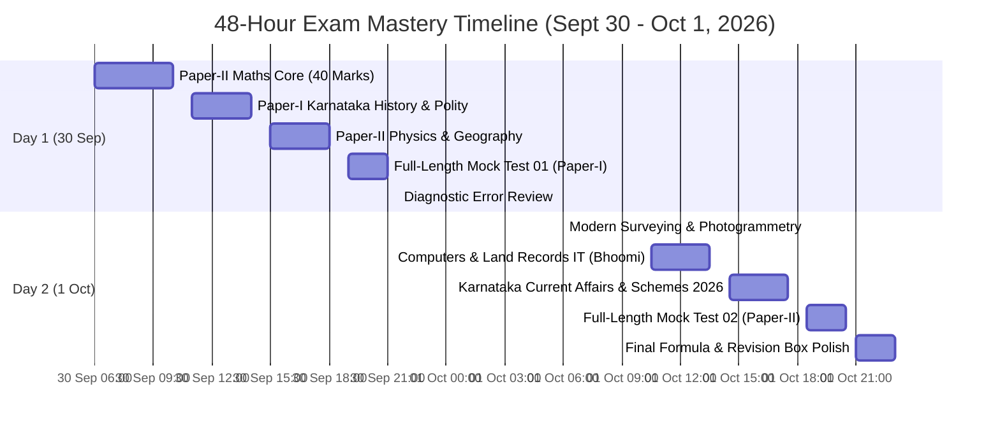

# KEA Land Surveyor 2026 — Master 2-Day & Emergency Sprint Study Plan

> [!IMPORTANT] Time-to-Exam Countdown & High-Yield Strategy
> - **Current System Date:** **30 September 2026**.
> - **Target Exam Date:** **2 October 2026** — Exactly **2 Study Days Remaining**.
> - **Strategy:** With only 48 hours remaining, maximize **Marks Per Study Hour** by prioritizing highest-weightage syllabus blocks:
>   1. **Paper-II Mathematics Core (40 Marks):** Arithmetic + Algebra + Coordinate Geometry.
>   2. **Paper-II Modern Surveying & Land IT (40 Marks):** Photogrammetry/RS/GPS/GIS (20 Marks) + Bhoomi/Mojini/Dishank/MS Office (20 Marks).
>   3. **Paper-I Karnataka Current Affairs & Five Guarantees (25 Marks):** Gruha Lakshmi, Shakti, Yuva Nidhi, Budget 2026–27.
>   4. **Paper-I High-Yield Core (45 Marks):** Karnataka History, Geography, and Constitution.
> - **Rule of Execution:** Do not waste hours reading dense textbooks. Read the prepared syllabus notes, memorize the **Quick Revision Boxes**, and execute timed mock drills!

---

## 1. High-Yield 2-Day Hour-by-Hour Master Schedule



---

### Day 1 (30 September 2026): Mathematics Core, History, Polity & Mock 1
*Goal: Lock 90+ Marks across Mathematics (40 Marks), History (18 Marks), Polity (16 Marks), and Physics (10 Marks).*

- [ ] **06:00 – 08:30 (Block 1: Paper-II Mathematics Arithmetic Core — 20–24 Marks)**
  - Read: [[03_Notes/01_Mathematics_Arithmetic_and_Number_Systems|01. Mathematics: Arithmetic & Number Systems]]
  - Master formulas: Set power set ($2^n$), AP $S_n = \\frac{n}{2}[2a + (n-1)d]$, GP $a_n = a r^{n-1}$, Matrix $\\det = ad - bc$, Permutations/Combinations ($^nP_r, ^nC_r$), Statistics $\\text{Mode} = 3\\text{ Median} - 2\\text{ Mean}$, and HCF $\\times$ LCM $= a \\times b$.
  - Solve: 15 quick numerical problems from note examples.
- [ ] **08:30 – 09:15** | *Breakfast & Mind-Mapping Break*
- [ ] **09:15 – 11:30 (Block 2: Paper-II Mathematics Algebra & Geometry — 16–20 Marks)**
  - Read: [[03_Notes/02_Mathematics_Algebra_and_Coordinate_Geometry|02. Mathematics: Algebra & Coordinate Geometry]]
  - Master formulas: Identities ($a^3+b^3+c^3=3abc$ when $a+b+c=0$), Quadratic formula ($x = \\frac{-b \\pm \\sqrt{b^2-4ac}}{2a}$), Discriminant $\\Delta$, Distance formula, Section formula, Area of Triangle, and Slopes ($m_1 m_2 = -1$).
- [ ] **11:30 – 13:00 (Block 3: Paper-I Karnataka History & Heritage — 15–18 Marks)**
  - Read: [[04_Current_Affairs_GK/01_Karnataka_History_and_Dynasties|01. Karnataka History & Dynasties]]
  - Focus: Halmidi Inscription (450 AD), Badami Chalukyas (Aihole inscription by Ravikirti), Rashtrakutas, Vijayanagara, Kittur Chennamma & Sangolli Rayanna (1831), Vidurashwatha firing (1938), and Mysore State renaming (1 Nov 1973).
- [ ] **13:00 – 14:00** | *Lunch & Relaxation*
- [ ] **14:00 – 16:00 (Block 4: Paper-I Indian Constitution & Polity — 14–16 Marks)**
  - Read: [[04_Current_Affairs_GK/03_Indian_Constitution_and_Polity|03. Indian Constitution & Polity]]
  - Focus: Preamble 42nd Amendment, Articles 14–32, 5 Writs, DPSP, Article 371J (Kalyana Karnataka), 73rd Amendment (11th Schedule 29 subjects, 50% women reservation in Karnataka).
- [ ] **16:00 – 16:30** | *Tea Break & Refreshment*
- [ ] **16:30 – 18:30 (Block 5: Paper-II Applied Physics & Physical Geography — 20 Marks)**
  - Read: [[03_Notes/06_Applied_Physics_Gravitation_and_Mechanics|06. Applied Physics: Gravitation & Mechanics]]
  - Read: [[03_Notes/07_Physical_Geography_The_Earth_and_Lithosphere|07. Physical Geography: Earth & Lithosphere]]
  - Master: $F = G \\frac{m_1 m_2}{r^2}$, $g = 0$ at center of Earth, poles vs equator gravity, weightlessness ($N=0$), time zones ($15^\\circ = 1\\text{h}$, IST $82.5^\\circ\\text{E} = \\text{GMT}+5:30$), Moho discontinuity, and P/S/L seismic waves.
- [ ] **18:30 – 19:00** | *Walk & Pre-Exam Focus*
- [ ] **19:00 – 21:00 (Block 6: Full-Length Timed Mock 1 — Paper-I)**
  - Launch: [[06_Mock_Tests/Full_Length/Mock_Test_Paper_1_General_Knowledge.html|Mock Test Paper-I (100 Questions / 120 Minutes)]]
  - Complete all 100 questions under real exam conditions with -0.25 negative marking.
- [ ] **21:00 – 22:30 (Block 7: Diagnostic Review & Error Correction)**
  - Review all wrong and unattempted questions using the built-in scorecard explanation box.
  - Review: [[03_Notes/01_Mathematics_Arithmetic_and_Number_Systems#6-quick-revision-box-ಕಡ್ಡಾಯವಾಗಿ-ನೆನಪಿಡಬೇಕಾದ-ಸೂತ್ರಗಳು|Math Revision Box]] & [[04_Current_Affairs_GK/03_Indian_Constitution_and_Polity#6-quick-revision-box|Polity Revision Box]].

---

### Day 2 (1 October 2026): Modern Surveying, Land IT, Current Affairs & Mock 2
*Goal: Lock remaining 110 Marks across Modern Surveying (20 Marks), Bhoomi/Mojini IT (20 Marks), Cartography (10 Marks), and Current Affairs (25 Marks).*

- [ ] **06:00 – 08:30 (Block 1: Paper-II Modern Surveying & Photogrammetry — 20 Marks)**
  - Read: [[03_Notes/03_Modern_Surveying_Photogrammetry_and_Remote_Sensing|03. Photogrammetry & Remote Sensing]]
  - Read: [[03_Notes/04_Modern_Surveying_GPS_GIS_and_Advanced_Positioning|04. GPS, GIS & Advanced Positioning]]
  - Master: Scale ($S = \\frac{f}{H - h}$), overlaps (60% forward, 20–30% side), relief displacement ($d = \\frac{rh}{H}$), active (LiDAR) vs passive RS, NDVI, 4 satellites minimum for 3D fix, PDOP $< 3$, NavIC (7 satellites), RTK (1-2 cm), CORS, SVAMITVA 1:500 drone mapping, Vector vs Raster, UTM Zones 43N & 44N.
- [ ] **08:30 – 09:15** | *Breakfast & Quick Formula Recall*
- [ ] **09:15 – 11:30 (Block 2: Paper-II Computer Applications & Land Records IT — 20 Marks)**
  - Read: [[03_Notes/05_Computer_Applications_and_Land_Records_IT|05. Computer Applications & Land Records IT]]
  - Master: Memory hierarchy (Registers > Cache > RAM > SSD), MS Excel absolute referencing (`$A$1`), `=COUNTA()` vs `=COUNT()`, PowerPoint F5 vs Shift+F5, Bhoomi (RTC Form 16, FIFO mutation under Sec 129 KLR Act), Mojini v3 (11E sketch & Tatkal Podi), Dishank GPS app, IPv4 (32-bit) vs IPv6 (128-bit), SMTP/POP3.
- [ ] **11:30 – 13:00 (Block 3: Paper-II Cartography & Physical Features of India — 10 Marks)**
  - Read: [[03_Notes/08_Cartography_Maps_and_Physical_Features_of_India|08. Cartography & Physical Features of India]]
  - Master: Large scale (Cadastral 1:1,000) vs Small scale (Atlas 1:1,000,000), graphical scale stability, SOI map colors, India boundaries (Bangladesh 4096 km, Afghanistan 106 km), Great Plains (Bhabar $\\to$ Tarai $\\to$ Bhangar $\\to$ Khadar), Western Ghats (Anamudi 2695 m, Mullayanagiri 1930 m in KA), Peninsular rivers (Godavari, Kaveri, Narmada rift valley).
- [ ] **13:00 – 14:00** | *Lunch & Power Rest*
- [ ] **14:00 – 16:30 (Block 4: Paper-I Karnataka Current Affairs, Budget & Schemes 2026 — 25 Marks)**
  - Read: [[04_Current_Affairs_GK/05_Karnataka_Current_Affairs_and_State_Schemes_2026|05. Karnataka Current Affairs & State Schemes 2026]]
  - Read: [[04_Current_Affairs_GK/07_Karnataka_Economy_Survey_and_Budget|07. Karnataka Economy Survey & Budget]]
  - Master: Gruha Lakshmi (₹2,000/mo DBT), Shakti (free KSRTC/BMTC bus travel), Yuva Nidhi (₹3,000/₹1,500 aid), Anna Bhagya (10 kg / ₹34/kg DBT), Gruha Jyothi (free up to 200 units), Budget 2026–27 outlay (₹4,48,004 crore, presented 6 March 2026), D.K. Shivakumar CM tenure (from 3 June 2026), Saura Krishi Yojane.
- [ ] **16:30 – 17:00** | *Tea Break*
- [ ] **17:00 – 18:00 (Block 5: Paper-I General Science & Mental Ability Sprint — 20 Marks)**
  - Read: [[04_Current_Affairs_GK/04_General_Science_and_Mental_Ability|04. General Science & Mental Ability]]
  - Practice: Series shortcuts, speed/distance formulas, blood groups (O- universal donor), vitamins, and everyday physics laws.
- [ ] **18:00 – 18:30** | *Pre-Mock Mental Reset*
- [ ] **18:30 – 20:30 (Block 6: Full-Length Timed Mock 2 — Paper-II Specific Paper)**
  - Launch: [[06_Mock_Tests/Full_Length/Mock_Test_Paper_2_Specific_Paper.html|Mock Test Paper-II (100 Questions / 120 Minutes)]]
  - Complete the exact 100-question technical paper simulation (40 Math, 20 Survey, 20 Computers, 10 Physics, 10 Geography).
- [ ] **20:30 – 22:00 (Block 7: Mock Diagnostic & High-Yield Weakness Remediation)**
  - Analyze any missed mathematical formulas or IT definitions.
- [ ] **22:00 – 23:00 (Block 8: Final Quick Revision Box Scan across all 8 Paper-II Notes)**
  - Scan only the **Quick Revision Boxes** at the bottom of Notes 01 to 08.
  - Sleep early (minimum 7 hours) for mental peak sharpness!

---

### Day 3 (2 October 2026): Exam Day Morning Warm-Up (60 Minutes)
*Goal: Cognitive activation and formula recall before entering exam hall.*

- [ ] **07:00 – 08:00 (Final 60-Minute Formula Walkthrough):**
  - Math empirical formula: $\\mathbf{\\text{Mode} = 3\\text{ Median} - 2\\text{ Mean}}$
  - Product rule: $\\mathbf{\\text{HCF} \\times \\text{LCM} = a \\times b}$
  - Distance formula: $\\mathbf{d = \\sqrt{(x_2-x_1)^2 + (y_2-y_1)^2}}$
  - Perpendicular lines: $\\mathbf{m_1 m_2 = -1}$
  - Scale of vertical photo: $\\mathbf{S = \\frac{f}{H - h}}$
  - Overlaps: **60% forward**, **20–30% side**
  - Relief displacement: $\\mathbf{d = \\frac{rh}{H}}$ (radial from principal point)
  - Minimum GPS satellites for 3D fix: **4 satellites**
  - UTM Zones for Karnataka: **Zone 43N & Zone 44N**
  - Bhoomi mutation rule: **FIFO under Section 129 of KLR Act**
  - Mojini sketch: **11E pre-registration sketch**
  - Acceleration at center of Earth: $\\mathbf{g = 0}$
  - Indian Standard Time: $\\mathbf{82.5^\\circ\\text{ E} = \\text{GMT} +5:30}$ (Mirzapur, UP)

---

## 2. Emergency 24-Hour Compressed Track (Ultra-High-Yield Sprint)

For candidates who have only **24 hours remaining** before the exam:

```markdown
┌─────────────────────────────────────────────────────────────────────────────┐
│                      EMERGENCY 24-HOUR HIGH-YIELD SPRINT                    │
├─────────────────────────────────────────────────────────────────────────────┤
│ 1. Scan Quick Revision Box of Note 01 (Maths Arithmetic: Sets, AP/GP, Stats)│
│ 2. Scan Quick Revision Box of Note 02 (Maths Algebra & Coordinate Geometry) │
│ 3. Scan Quick Revision Box of Note 03 (Photogrammetry, Scale, Overlaps, RS) │
│ 4. Scan Quick Revision Box of Note 04 (GPS 4 Sats, RTK, CORS, GIS, UTM)    │
│ 5. Scan Quick Revision Box of Note 05 (Bhoomi FIFO, Mojini 11E, Dishank)   │
│ 6. Scan Quick Revision Box of Note 06 (Physics: g variations, center g=0)  │
│ 7. Scan Quick Revision Box of Note 07 & 08 (Geography: IST, Rocks, Plains) │
│ 8. Read Note 05 of Current Affairs (Karnataka 5 Guarantees & Budget 2026)  │
│ 9. Attempt Full-Length Mock Test 02 (Paper-II Specific Paper - 100 Qs)      │
│ 10. Review explanations of all wrong answers in the mock scorecard!        │
└─────────────────────────────────────────────────────────────────────────────┘
```
