# KEA Land Surveyor 2026 — Master 3-Day & Compressed 2-Day Study Plan

> [!IMPORTANT] Time-to-Exam Alert & Strategy
> - **Current Date:** 29 September 2026.
> - **Target Exam Date:** **2 October 2026 (RPC Cadre)** — Exactly **3 Study Days Remaining**.
> - **Goal:** Maximum syllabus coverage and mark yield per study hour, balancing Paper-I (General Studies) and Paper-II (Specific Surveying Technical).
> - **Methodology:** High-weightage surveying core in the morning (fresh mind for numericals), GK & Schemes in the afternoon, and timed mock drills + error review in the evening.

---

## 1. High-Yield 3-Day Hour-by-Hour Master Schedule

### Day 1 (30 September 2026): The Surveying Core & Karnataka Foundations
*Target: Lock 75+ Marks across Chain, Compass, Levelling, and Karnataka GK.*

- [ ] **06:00 – 08:30 (Block 1: Core Linear Surveying)**
  - Read: [[03_Notes/01_Chain_Surveying_and_Linear_Measurements|01. Chain Surveying & Linear Measurements]]
  - Master: Metric vs Gunter's vs Revenue chain lengths; tape corrections (sag, pull, temperature formulas).
  - Solve: 15 numerical problems on incorrect chain length ($L'/L \times \text{measured}$).
- [ ] **08:30 – 09:15** | *Breakfast & Quick Flashcard Recall*
- [ ] **09:15 – 12:00 (Block 2: Angular Traversing & Bearing Math)**
  - Read: [[03_Notes/02_Compass_Surveying_and_Traversing|02. Compass Surveying & Traversing]]
  - Master: Prismatic vs Surveyor compass differences; WCB to Reduced Bearing conversions; $BB = FB \pm 180^\circ$.
  - Practice: Magnetic declination ($TB = MB \pm \delta$) and local attraction detection.
- [ ] **12:00 – 13:30** | *Lunch & Relaxation*
- [ ] **13:30 – 16:00 (Block 3: Vertical Measurements & Contouring)**
  - Read: [[03_Notes/03_Levelling_and_Contouring|03. Levelling & Contouring]]
  - Master: Height of Instrument vs Rise & Fall arithmetic checks; curvature and refraction correction ($C = -0.0673 d^2$).
  - Review: 10 Golden Rules of Contour Characteristics (Hills, Ponds, Valleys, Cliffs).
- [ ] **16:00 – 16:30** | *Tea Break & Refreshment*
- [ ] **16:30 – 18:30 (Block 4: Karnataka Dynasties & Geography)**
  - Read: [[04_Current_Affairs_GK/01_Karnataka_History_and_Dynasties|01. Karnataka History & Dynasties]]
  - Read: [[04_Current_Affairs_GK/02_Karnataka_and_India_Geography|02. Karnataka & India Geography]]
  - Focus: Kadambas (Halmidi), Chalukyas (Aihole), Mysore Wodeyars, Krishna/Cauvery river basins, and Mullayanagiri.
- [ ] **18:30 – 19:30** | *Evening Walk & Mental Mind-Mapping*
- [ ] **19:30 – 21:30 (Block 5: Timed Mock Drill 1)**
  - Launch: [[06_Mock_Tests/Mock_Test_1_Paper_1_General_Knowledge.html|Mock Test 01 — Paper I General Knowledge]]
  - Complete the timed test in one sitting.
- [ ] **21:30 – 22:30 (Block 6: Mock Diagnostic & Error Review)**
  - Analyze wrong answers using the built-in scorecard explanation box.
  - Review: [[03_Notes/01_Chain_Surveying_and_Linear_Measurements#8-quick-revision-box|Chain Revision Box]] & [[03_Notes/02_Compass_Surveying_and_Traversing#9-quick-revision-box|Compass Revision Box]].

---

### Day 2 (1 October 2026): Modern Surveying, Land Records & State Welfare
*Target: Conquer Modern Surveying (GPS/GIS/EDM), Bhoomi/Mojini, and Constitution.*

- [ ] **06:00 – 08:30 (Block 1: Modern Surveying — Total Station & EDM)**
  - Read: [[03_Notes/07_Total_Station_and_EDM|07. Total Station & EDM]]
  - Master: EDM carrier waves (Tellurometer, Geodimeter, Distomat); Corner-cube prism retroreflector; REM and MLM programs.
- [ ] **08:30 – 09:15** | *Breakfast & Quick Flashcards*
- [ ] **09:15 – 12:00 (Block 2: Satellite Geodesy & GIS)**
  - Read: [[03_Notes/08_GPS_GIS_and_Remote_Sensing|08. GPS, GIS & Remote Sensing]]
  - Master: 4 satellites for 3D fix; NavIC 7-satellite constellation; DGPS vs RTK centimeter accuracy; Vector vs Raster GIS; NDVI formula.
- [ ] **12:00 – 13:30** | *Lunch & Power Nap*
- [ ] **13:30 – 15:30 (Block 3: Karnataka Land Records & Digital Governance)**
  - Read: [[03_Notes/10_Karnataka_Land_Records_Bhoomi_Mojini_Dishank|10. Karnataka Land Records, Bhoomi, Mojini & Dishank]]
  - Master: SSLR hierarchy; Tippan, Akarband, RTC Form 16; Kharab A vs Kharab B; 11E sketch and Dishank GPS app.
- [ ] **15:30 – 16:00** | *Tea Break*
- [ ] **16:00 – 18:00 (Block 4: Indian Constitution & 5 Guarantee Schemes)**
  - Read: [[04_Current_Affairs_GK/03_Indian_Constitution_and_Polity|03. Indian Constitution & Polity]]
  - Read: [[04_Current_Affairs_GK/05_Karnataka_Current_Affairs_and_State_Schemes_2026|05. Karnataka Current Affairs & State Schemes 2026]]
  - Focus: Articles 14–32, 5 Writs, 73rd Amendment, Gruha Lakshmi, Shakti, Yuva Nidhi, Anna Bhagya, Gruha Jyothi.
- [ ] **18:00 – 19:00** | *Coursework Video Digest*
  - Watch: High-yield videos curated in [[LandSurveyor/AGY/05_Resources/YouTube_Links|Verified YouTube Directory]].
- [ ] **19:00 – 21:00 (Block 5: Timed Mock Drill 2)**
  - Launch: [[06_Mock_Tests/Mock_Test_2_Paper_2_Specific_Surveying.html|Mock Test 02 — Paper II Technical Surveying]]
  - Execute full 120-minute simulation with negative marking discipline.
- [ ] **21:00 – 22:30 (Block 6: Technical Error Correction)**
  - Review miscalculated surveying problems.

---

### Day 3 (2 October 2026): Precision Instruments, Final Marathon & Exam Readiness
*Target: Consolidate Theodolite, Curves, Science, and Final Speed Polish.*

- [ ] **06:00 – 08:00 (Block 1: Theodolite, Tacheometry & Curves)**
  - Read: [[03_Notes/05_Theodolite_and_Tacheometry|05. Theodolite Surveying & Tacheometry]]
  - Read: [[03_Notes/06_Curves_and_Advanced_Surveying|06. Curves & Advanced Surveying]]
  - Master: Bowditch vs Transit rule; Stadia $D = 100s$; Anallatic lens ($c=0$); Degree of curve ($R = 1718.9 / D$); Shift $S = L_s^2 / 24R$.
- [ ] **08:00 – 09:30 (Block 2: Plane Table & Applied Maths/Physics)**
  - Read: [[03_Notes/04_Plane_Table_Surveying|04. Plane Table Surveying]]
  - Read: [[03_Notes/09_Survey_Mathematics_and_Applied_Physics|09. Survey Mathematics & Applied Physics]]
  - Master: Three-point problem & Lehmann's rules; Simpson's 1/3rd rule (odd ordinates); Planimeter zero circle ($M \cdot C$); $g$ variation.
- [ ] **09:30 – 10:30** | *Breakfast & Formula Sheet Scan*
- [ ] **10:30 – 12:30 (Block 3: Full Length Marathon Mock Drill 3)**
  - Launch: [[06_Mock_Tests/Mock_Test_3_Full_Technical_Marathon.html|Mock Test 03 — Full Technical Marathon]]
  - Goal: Score 80%+ with $>90\%$ accuracy.
- [ ] **12:30 – 14:00** | *Lunch & Mental Rest*
- [ ] **14:00 – 16:30 (Block 4: General Science & Mental Ability Sprint)**
  - Read: [[04_Current_Affairs_GK/04_General_Science_and_Mental_Ability|04. General Science & Mental Ability]]
  - Practice: Train speed/distance problems, time & work formulas, lens corrections, and vitamin deficiencies.
- [ ] **16:30 – 19:30 (Block 5: All-Notes Quick Revision Boxes Scan)**
  - Rapidly reread all 10 Technical "Quick Revision Boxes" in `03_Notes/` and all 5 GK boxes in `04_Current_Affairs_GK/`.
- [ ] **19:30 – 21:00** | *Exam Hall Kit Preparation (Admit card, photo ID, black ballpoint pens, clipboard).*
- [ ] **21:00 onwards** | *Early rest and restorative sleep for peak exam alertness.*

---

## 2. Emergency 2-Day Compressed Track (48-Hour High-Yield Sprint)

*Use this track if you only have 48 hours remaining before stepping into the exam hall.*

```mermaid
flowchart TD
    subgraph Track48["48-Hour Sprint: Maximum Marks in Minimum Time"]
        S1["Session 1 (Morning Day 1): 30 Marks<br/>[[03_Notes/01_Chain_Surveying_and_Linear_Measurements]]<br/>[[03_Notes/02_Compass_Surveying_and_Traversing]]"]
        S2["Session 2 (Afternoon Day 1): 25 Marks<br/>[[03_Notes/03_Levelling_and_Contouring]]<br/>[[03_Notes/10_Karnataka_Land_Records_Bhoomi_Mojini_Dishank]]"]
        S3["Session 3 (Evening Day 1): 25 Marks<br/>[[04_Current_Affairs_GK/01_Karnataka_History_and_Dynasties]]<br/>[[04_Current_Affairs_GK/05_Karnataka_Current_Affairs_and_State_Schemes_2026]]"]
        S4["Session 4 (Morning Day 2): 25 Marks<br/>[[03_Notes/07_Total_Station_and_EDM]]<br/>[[03_Notes/08_GPS_GIS_and_Remote_Sensing]]"]
        S5["Session 5 (Afternoon Day 2): 20 Marks<br/>[[03_Notes/05_Theodolite_and_Tacheometry]]<br/>[[04_Current_Affairs_GK/03_Indian_Constitution_and_Polity]]"]
        S6["Session 6 (Evening Day 2): Diagnostic Drill<br/>Run [[06_Mock_Tests/Mock_Test_3_Full_Technical_Marathon.html]] + Cheat Sheets"]
    end
    S1 --> S2 --> S3 --> S4 --> S5 --> S6
```

### 48-Hour Priority Rules:
1. **Drop Low-Yield Re-reading:** Focus strictly on the **Quick Revision Cheat Sheets** and **Formulas Matrices** at the end of each note.
2. **Prioritize Paper-II Surveying Core:** Chain, Compass, Levelling, Total Station, and GPS account for nearly 65% of Paper-II marks.
3. **Master the 5 Guarantee Schemes & Land Records:** 15–20 sure-shot marks across Bhoomi, Mojini, Dishank, and Karnataka welfare policies.
