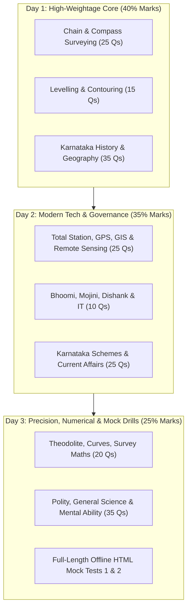

# KEA Land Surveyor 2026 — Official Syllabus, Pattern & Weightage

> [!IMPORTANT] Exam Architecture at a Glance
> - **Conducting Body:** Karnataka Examinations Authority (KEA) for the Department of Survey Settlement and Land Records (SSLR / ಭೂಮಾಪನ ಕಂದಾಯ ವ್ಯವಸ್ಥೆ ಮತ್ತು ಭೂದಾಖಲೆಗಳ ಇಲಾಖೆ).
> - **Total Competitive Marks:** 200 Marks (Paper 1: 100 Marks, Paper 2: 100 Marks).
> - **Question Format:** Multiple Choice Questions (MCQ) on OMR Sheet.
> - **Marking Scheme:** **+1.0 mark** for correct answer; **-0.25 mark (1/4th negative marking)** for every incorrect answer.
> - **Duration:** 2 Hours (120 minutes) per paper.
> - **Qualifying Paper:** Mandatory Kannada Language Examination (150 Marks, 50 marks qualifying threshold for non-Kannada medium candidates).
> - **Official Source:** [KEA Official Portal](https://cetonline.karnataka.gov.in/kea).

---

## 1. Exam Pattern Matrix

| Paper | Nomenclature | Subject Areas | No. of Questions | Maximum Marks | Duration | Negative Marking |
| :---: | :--- | :--- | :---: | :---: | :---: | :---: |
| **Paper-I** | General Knowledge (ಸಾಮಾನ್ಯ ಜ್ಞಾನ) | History, Geography, Polity, General Science, Current Affairs & Mental Ability | 100 | 100 | 2 Hours (120 min) | 0.25 mark deduction |
| **Paper-II** | Specific Paper (ನಿರ್ದಿಷ್ಟ ಪತ್ರಿಕೆ - ಭೂಮಾಪನ) | Core Surveying, Modern Surveying, Survey Mathematics, Physics & Computer Applications | 100 | 100 | 2 Hours (120 min) | 0.25 mark deduction |
| **Total** | | | **200** | **200** | **4 Hours** | |

---

## 2. Topic-Level Weightage Breakdown (Derived from Official Pattern & PYQs)

### Paper 1: General Knowledge (100 Marks / 100 Qs)

| Module / Subject | Dedicated Section | High-Yield Topics | Estimated Marks / Qs | Priority Tier |
| :--- | :--- | :--- | :---: | :---: |
| **History** | Karnataka & Indian History | Kadambas, Chalukyas, Hoysalas, Vijayanagara Empire, Mysore Wodeyars, Freedom Movement in Karnataka, Unification of Karnataka. | 15–18 Qs | **Tier 1** |
| **Geography** | Karnataka & Indian Geography | Physiographic divisions of Karnataka, Western Ghats, River basins (Krishna, Cauvery), Soil classification, Forest types, Mineral resources. | 16–20 Qs | **Tier 1** |
| **Polity & Governance** | Indian Constitution & Administration | Preamble, Fundamental Rights & Duties, DPSP, Governor, Chief Minister, State Legislature, Panchayati Raj, 73rd/74th Amendments. | 14–16 Qs | **Tier 1** |
| **Current Affairs & Schemes** | State, National & International | Karnataka Budget & Economic Survey, Government Guarantee Schemes, Land digitization schemes (Bhoomi, Mojini, Dishank), Awards & Sports. | 20–25 Qs | **Tier 1 (Crucial)** |
| **General Science** | Everyday Observation & Science | Laws of Motion, Light, Optics, Thermodynamics, Environmental Ecology, Renewable Energy. | 10–12 Qs | **Tier 2** |
| **Mental Ability & Reasoning** | Aptitude & Logical Reasoning | Number series, Coding-decoding, Blood relations, Time and work, Ratios, Data interpretation. | 10–14 Qs | **Tier 2** |

---

### Paper 2: Technical Specific Paper (Surveying & Land Records) (100 Marks / 100 Qs)

| Module / Subject | Dedicated Section | Key Technical Core | Estimated Marks / Qs | Priority Tier |
| :--- | :--- | :--- | :---: | :---: |
| **Chain & Tape Surveying** | Linear Measurements (ಸರಪಳಿ ಸಮೀಕ್ಷೆ) | Types of chains (Metric, Gunter's, Revenue, Engineer's), Ranging, Errors in chaining, Sag/temperature corrections, Offsets, Obstacles. | 12–15 Qs | **Tier 1** |
| **Compass Surveying** | Angular Measurements (ದಿಕ್ಸೂಚಿ ಸಮೀಕ್ಷೆ) | Prismatic vs Surveyor compass, Whole Circle Bearing (WCB) vs Reduced Bearing (RB), Fore/Back Bearings, Magnetic declination, Local attraction. | 10–12 Qs | **Tier 1** |
| **Levelling & Contouring** | Vertical Measurements (ಮಟ್ಟ ಅಳತೆ & ಬಾಹ್ಯರೇಖೆ) | Dumpy level, Tilting level, Auto level, Height of Instrument (HI) method, Rise and Fall method, Curvature & Refraction corrections, Contour characteristics. | 14–16 Qs | **Tier 1** |
| **Plane Table Surveying** | Field Graphical Plotting (ಪ್ಲೇನ್ ಟೇಬಲ್ ಸಮೀಕ್ಷೆ) | Accessories (Alidade, Plumbing fork, Trough compass), Radiation, Intersection, Traversing, Resection (Two-point & Three-point problems, Lehmann's rule). | 8–10 Qs | **Tier 2** |
| **Theodolite & Tacheometry** | Precision Angular & Stadia Work | Transit theodolite adjustments, Balancing traverse (Bowditch, Transit rules), Stadia constants ($k=100, c=0$), Anallatic lens, Heights & Distances. | 10–12 Qs | **Tier 1** |
| **Curves & Curve Setting** | Circular & Transition Curves | Simple curves, Degree of curve, Radius relation ($R = 1718.9/D$), Tangent length, Apex distance, Setting out by Rankine's method. | 6–8 Qs | **Tier 2** |
| **Total Station & EDM** | Electronic Surveying (ಟೋಟಲ್ ಸ್ಟೇಷನ್) | Principles of EDM, Infrared/Microwave/Laser distancers, Modulation, Total Station components, Coordinate measurement, Prism constants. | 10–12 Qs | **Tier 1** |
| **GPS, GIS & Remote Sensing** | Satellite Geodesy & Spatial Analysis | GPS segments (Space, Control, User), DGPS, NAVSTAR, GLONASS, NavIC/IRNSS, GIS raster vs vector, Map projections (UTM, Lambert), Remote sensing bands. | 12–14 Qs | **Tier 1** |
| **Survey Mathematics & Physics** | Applied Calculations | Trigonometric relations, Coordinate geometry, Triangulation, Area by Simpson's & Trapezoidal rule, Gravitation, Density, Atmospheric pressure. | 8–10 Qs | **Tier 2** |
| **Karnataka Land Records & IT** | Digital Land Governance (ಭೂ ದಾಖಲೆಗಳು) | Bhoomi Project (ಭೂಮಿ ಯೋಜನೆ), Mojini (ಮೋಜಣಿ v3), Dishank App (ದಿಶಾಂಕ್), RTC/Pahani (ಪಹಣಿ/ಆರ್.ಟಿ.ಸಿ), Akarband, Tippan, MS Office basics. | 8–10 Qs | **Tier 1** |

---

## 3. High-Yield Preparation Strategy for 2–3 Days

---

## 4. Key Rules for Candidates
1. **Manage Negative Marking:** Every incorrect guess costs 0.25 marks. On 50:50 eliminated choices, statistical expectation is positive (+0.375 per two guesses), but blind guessing must be avoided.
2. **OMR Precision:** Darken single circles cleanly with black/blue ballpoint pen. Dual marking is penalized as a wrong answer.
3. **Time Allocation:** 120 minutes for 100 questions = 72 seconds per question. In Paper 2, theoretical questions take 30–40 seconds, leaving 90–120 seconds for surveying numericals.
