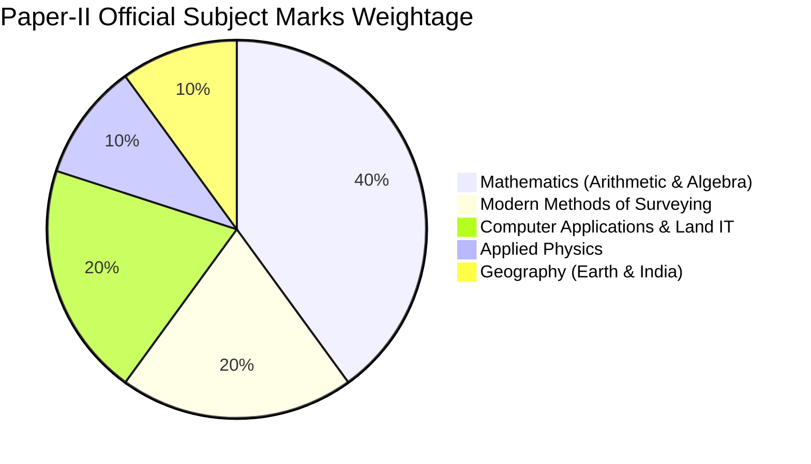

# KEA Land Surveyor (Bhoomapaka) 2026 — Syllabus & Exam Pattern

> [!IMPORTANT] Official Authority & Truth Sources
> - **Conducting Authority:** Karnataka Examinations Authority (KEA).
> - **Recruitment Notification:** July 11, 2026 (750 Posts, SSLR Department).
> - **Official Raw Verbatim Source:** [[02_Syllabus_and_Pattern/Raw_Syllabus/Official_KEA_Land_Surveyor_Syllabus_2026|Raw Verbatim Syllabus Document]]

---

## 1. Official Examination Structure

| Parameter | Paper-I: General Knowledge | Paper-II: Specific Paper (Surveyor) | Compulsory Qualifying Paper |
| :--- | :---: | :---: | :---: |
| **Exam Mode** | Offline (OMR Answer Sheet) | Offline (OMR Answer Sheet) | Descriptive / OMR |
| **Total Questions** | **100 MCQs** | **100 MCQs** | Comprehensive Kannada |
| **Total Marks** | **100 Marks** | **100 Marks** | **150 Marks** |
| **Duration** | **2 Hours (120 Minutes)** | **2 Hours (120 Minutes)** | 2 Hours |
| **Marking Rule** | **+1.0 Mark** per correct answer | **+1.0 Mark** per correct answer | Passing score: 50 Marks |
| **Negative Marking** | **-0.25 Mark (1/4th penalty)** | **-0.25 Mark (1/4th penalty)** | No negative deduction |
| **Language Medium** | Bilingual (English & Kannada) | Bilingual (English & Kannada) | Kannada |

---

## 2. Paper-II (Specific Paper) Official Weightage Breakdown

Unlike general civil engineering recruitment exams, the KEA Land Surveyor Paper-II has an exact mandated percentage distribution across 5 core subjects:

| Section | Official Subject Area | Line ID Range | No. of Questions | Marks | Primary Note Link |
| :---: | :--- | :---: | :---: | :---: | :--- |
| **1** | **Mathematics (Arithmetic & Algebra)** | `P2-MATH-1.1` to `2.4` | **40 Qs** | **40 Marks** | [[03_Notes/01_Mathematics_Arithmetic_and_Number_Systems]] & [[03_Notes/02_Mathematics_Algebra_and_Coordinate_Geometry]] |
| **2** | **Modern Methods of Surveying** | `P2-SURV-3.1` to `3.5` | **20 Qs** | **20 Marks** | [[03_Notes/03_Modern_Surveying_Photogrammetry_and_Remote_Sensing]] & [[03_Notes/04_Modern_Surveying_GPS_GIS_and_Advanced_Positioning]] |
| **3** | **Computer Applications & Land IT** | `P2-COMP-4.1` to `4.4` | **20 Qs** | **20 Marks** | [[03_Notes/05_Computer_Applications_and_Land_Records_IT]] |
| **4** | **Applied Physics** | `P2-PHYS-5.1` to `5.4` | **10 Qs** | **10 Marks** | [[03_Notes/06_Applied_Physics_Gravitation_and_Mechanics]] |
| **5** | **Geography (Earth, Maps & India)** | `P2-GEOG-6.1` to `6.5` | **10 Qs** | **10 Marks** | [[03_Notes/07_Physical_Geography_The_Earth_and_Lithosphere]] & [[03_Notes/08_Cartography_Maps_and_Physical_Features_of_India]] |
| **Total** | | | **100 Qs** | **100 Marks** | |

---

## 3. Paper-I (General Knowledge) Official Breakdown

| Section | Subject Scope | Line ID Range | Estimated Marks | Primary Note Link |
| :---: | :--- | :---: | :---: | :--- |
| **1** | Karnataka & Indian History | `P1-GK-1.3` | 18–20 Marks | [[04_Current_Affairs_GK/01_Karnataka_History_and_Dynasties]] |
| **2** | Karnataka & Indian Geography | `P1-GK-1.4` | 16–18 Marks | [[04_Current_Affairs_GK/02_Karnataka_and_India_Geography]] |
| **3** | Constitution of India & Polity | `P1-GK-1.5` | 16–18 Marks | [[04_Current_Affairs_GK/03_Indian_Constitution_and_Polity]] |
| **4** | General Science & Mental Ability | `P1-GK-1.1`, `1.7` | 20–22 Marks | [[04_Current_Affairs_GK/04_General_Science_and_Mental_Ability]] |
| **5** | Karnataka Current Affairs & State Schemes | `P1-GK-1.2`, `1.6` | 24–28 Marks | [[04_Current_Affairs_GK/05_Karnataka_Current_Affairs_and_State_Schemes_2026]] |
