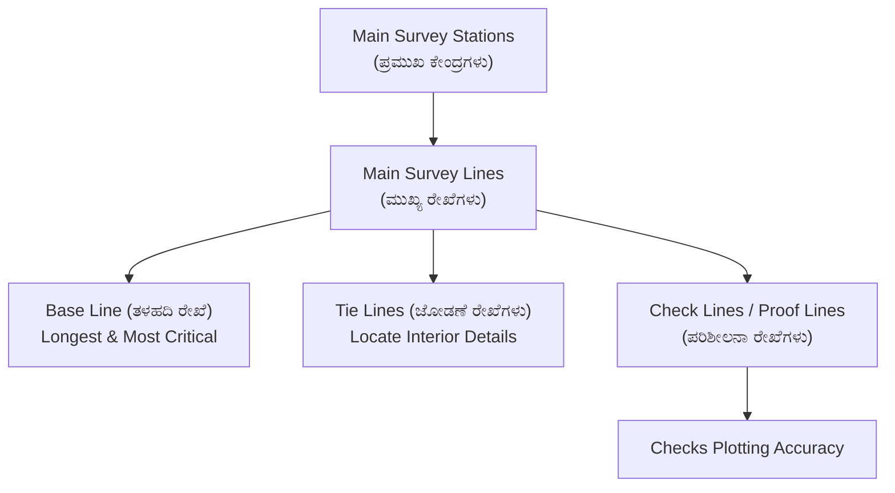
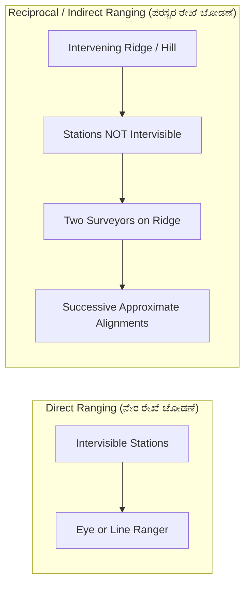
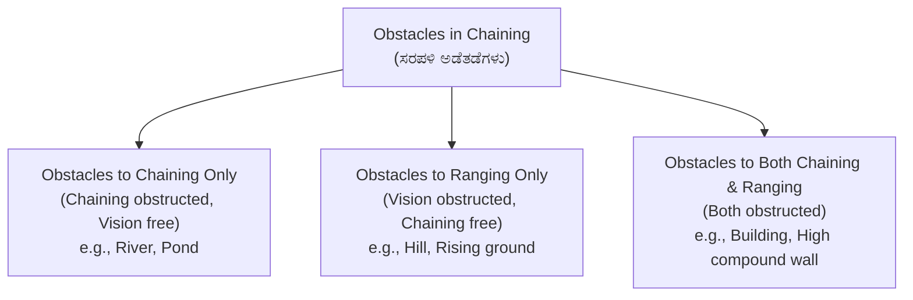

# 01. Chain Surveying & Linear Measurements (ಸರಪಳಿ ಸಮೀಕ್ಷೆ)

> [!IMPORTANT] Exam Focus & Mark Potential
> - **Expected Weightage:** 12–15 Questions in Paper-II.
> - **Core Concepts Tested:** Types of metric and non-metric chains, tally marks, ranging techniques (direct vs reciprocal), tape correction formulas (pull, sag, temperature, slope), obstacles in chaining (vision vs chaining), and field book entry conventions.
> - **Negative Marking Caution:** Keep signs of tape corrections straight: Temperature ($C_t$) and Pull ($C_p$) can be positive or negative; Sag ($C_s$) and Slope ($C_{sl}$) are **always negative (subtractive)**.

---

## 1. Principles of Chain Surveying

Chain surveying is the simplest branch of surveying where only linear measurements are taken directly in the field, and no angular measurements are made. It is ideal for small, relatively flat open areas.

### The Fundamental Principle: Triangulation (ತ್ರಿಭುಜೀಕರಣ)
The fundamental principle of chain surveying is **triangulation**. The whole area is divided into a network of well-conditioned triangles. 
- An **ideal triangle** is equilateral.
- A **well-conditioned triangle** (ಉತ್ತಮ ಸ್ಥಿತಿಯ ತ್ರಿಭುಜ) is one whose angles are neither less than $30^\circ$ nor greater than $120^\circ$. If an angle is $<30^\circ$ or $>120^\circ$, it is termed an **ill-conditioned triangle**, which introduces severe intersection plotting errors.



### Explanation of Survey Line Hierarchy
1. **Base Line (ತಳಹದಿ ರೇಖೆ):** The longest survey line passing through the centre of the area. The entire framework of survey triangles is constructed upon this line. It requires maximum measurement precision.
2. **Main Survey Lines (ಮುಖ್ಯ ರೇಖೆಗಳು):** Lines joining main survey stations that define the outer perimeter boundary.
3. **Check Lines / Proof Lines (ಪರಿಶೀಲನಾ ರೇಖೆಗಳು):** Lines run to check the accuracy of the framework. If the measured length of a check line in the field does not match the plotted length, errors exist in station plotting.
4. **Tie Lines (ಜೋಡಣೆ ರೇಖೆಗಳು):** Lines run between two tie stations on main lines to pick up secondary topographical and interior boundary details, preventing long offsets.

---

## 2. Survey Chains & Tapes Specification Matrix

| Chain Type | Length | No. of Links | Length of One Link | Construction / Distinguishing Details | Primary Usage |
| :--- | :---: | :---: | :---: | :--- | :--- |
| **Metric Chain** | **20 m** or **30 m** | **100** (20m) / **150** (30m) | **0.2 m (20 cm)** | Brass tallies at every 5 m; small brass rings at every 1 m. | Standard modern cadastral & engineering survey |
| **Gunter's Chain (Surveyor's Chain)** | **66 ft** | **100** | **0.66 ft (7.92 inches)** | 10 square chains = 1 Acre; 80 chains = 1 Statute Mile (5280 ft). | Traditional land revenue measurement & statute acreage |
| **Revenue Chain (ಕಂದಾಯ ಸರಪಳಿ)** | **33 ft** | **16** | **2.0625 ft (2 ft 1/16 in)** | Common in cadastral land settlement. 1 sq chain = 1/16th acre. | Village cadastral survey & land settlement |
| **Engineer's Chain** | **100 ft** | **100** | **1.0 ft** | Brass tags every 10 links indicating number of 10-ft units. | Older municipal & public works engineering |

### Types of Measuring Tapes
1. **Cloth / Linen Tape:** Light and flexible, but stretches easily when wet and shrinks when dry; unsuitable for accurate work.
2. **Metallic Tape:** Linen tape reinforced with interwoven brass or copper wires to resist stretching.
3. **Steel Tape:** Superior accuracy; made of steel ribbon with $1\text{ to }50\text{ m}$ length. Liable to rust and kinks.
4. **Invar Tape (ಇನ್ವಾರ್ ಟೇಪ್):** Made of an alloy of **Nickel (36%) and Steel (64%)**. It has an **extremely low coefficient of thermal expansion** ($\approx 1.2 \times 10^{-6} /^\circ\text{C}$). It is used for geodetic base-line measurements where extreme precision is imperative.

---

## 3. Ranging Techniques (ರೇಖಾ ಜೋಡಣೆ)

When the distance between two survey stations exceeds the length of one tape or chain, intermediate ranging rods are aligned on the straight line.



### Explanation of Ranging Methods
- **Direct Ranging:** Carried out when both terminal survey stations ($A$ and $B$) are intervisible. A surveyor standing at $A$ directs the rod-holder at $P$ to move left or right until rod $P$ aligns exactly between $A$ and $B$. A **Line Ranger** (instrument using two $90^\circ$ isosceles prisms) allows a single surveyor to position themselves precisely on line without assistance.
- **Reciprocal / Indirect Ranging:** Applied when terminal stations $A$ and $B$ are **not intervisible** due to high ground, a hillock, or excessive distance. Two surveyors stand with rods at points $C_1$ and $D_1$ on the ridge such that $C_1$ can see $D_1$ and $B$, while $D_1$ can see $C_1$ and $A$. By alternating line-alignments ($C$ aligns $D$ into line with $A$; $D$ aligns $C$ into line with $B$), they iteratively converge onto the true line $AB$.

---

## 4. Tape Corrections & Mathematical Formulas

Let $L$ = nominal length of tape/chain, $L'$ = actual length, $l$ = measured line length.

### True Distance vs Measured Distance
$$\text{True Distance} = \left(\frac{L'}{L}\right) \times \text{Measured Distance}$$
$$\text{True Area} = \left(\frac{L'}{L}\right)^2 \times \text{Measured Area}$$
$$\text{True Volume} = \left(\frac{L'}{L}\right)^3 \times \text{Measured Volume}$$

> [!TIP] Golden Rule of Incorrect Tape Length
> - If tape is **TOO LONG**: Measured distance is **TOO SHORT** $\implies$ Correction is **POSITIVE (+)**.
> - If tape is **TOO SHORT**: Measured distance is **TOO LONG** $\implies$ Correction is **NEGATIVE (-)**.

### Standard Field Corrections Matrix

| Correction Type | Formula | Sign | Remarks / Variables |
| :--- | :---: | :---: | :--- |
| **Temperature ($C_t$)** | $C_t = \alpha (T_m - T_0) L$ | $\pm$ | $\alpha$ = coeff. of thermal expansion; $T_m$ = field temp, $T_0$ = standard temp. |
| **Pull / Tension ($C_p$)** | $C_p = \frac{(P - P_0) L}{A \cdot E}$ | $\pm$ | $P$ = applied tension, $P_0$ = standard tension, $A$ = cross-section area, $E$ = Young's modulus. |
| **Sag Correction ($C_s$)** | $C_s = \frac{W^2 L}{24 P^2} = \frac{w^2 L^3}{24 P^2}$ | **Always Negative (-)** | $W$ = total weight of tape between supports, $w$ = weight per unit length, $P$ = pull. |
| **Slope Correction ($C_{sl}$)** | $C_{sl} = L (1 - \cos \theta) \approx \frac{h^2}{2L}$ | **Always Negative (-)** | $\theta$ = slope angle, $h$ = vertical height difference. |
| **Mean Sea Level ($C_{msl}$)** | $C_{msl} = \frac{L \cdot h}{R}$ | **Always Negative (-)** | $h$ = mean altitude above MSL, $R$ = Earth's mean radius ($\approx 6371\text{ km}$). |

---

## 5. Offsets & Obstacles in Chaining

### Types of Offsets
- **Perpendicular Offsets (ಲಂಬ ಒಳಸೆಳೆತ):** Taken at right angles to the chain line using:
  - **Optical Square (ಆಪ್ಟಿಕಲ್ ಸ್ಕ್ವೇರ್):** Uses two mirrors inclined at an angle of **$45^\circ$** based on the principle of double reflection ($2 \times 45^\circ = 90^\circ$).
  - **Prism Square:** Fixed pentagonal prism with reflection angle of $90^\circ$; requires no adjustment.
  - **Cross Staff:** Open cross staff ($90^\circ$), French cross staff ($45^\circ$ and $90^\circ$), Adjustable cross staff (any angle).
- **Oblique Offsets:** Taken at any angle other than $90^\circ$.

### Classification of Obstacles



### Explanation of Obstacle Solutions
1. **River / Pond (Chaining obstructed, Vision free):** Stations $A$ and $B$ can be seen across the river. A perpendicular line $AC$ is erected, and geometric properties of right-angled triangles or equal triangles are used to calculate $AB$.
2. **Hill / Dense Undergrowth (Vision obstructed, Chaining free):** Handled via reciprocal ranging or random line method.
3. **Building (Both obstructed):** Cannot see or chain through. Solved by constructing a parallel line offset at equal perpendicular distances, or constructing an equilateral triangle around the obstacle.

---

## 6. High-Yield Mnemonics

> [!NOTE] Memory Aids
> - **Tape Corrections Always Subtractive: "SSM"**
>   - **S**ag, **S**lope, and **M**SL corrections are **NEVER positive**; they are always subtractive from measured length.
> - **Optical Square Angle: "Half the Turn"**
>   - To turn a $90^\circ$ line, index and horizon glasses are set at **half of 90 = $45^\circ$**.
> - **Gunter's Chain Conversion: "80 Miles, 10 Acres"**
>   - $80 \text{ Gunter's chains} = 1 \text{ mile}$.
>   - $10 \text{ sq Gunter's chains} = 1 \text{ acre}$.

---

## 7. Likely Exam Questions & PYQ Patterns

1. **[KEA Land Surveyor PYQ]** *If a 20 m metric chain was found to be 10 cm too long after chaining a distance of 2000 m, what is the true distance?*
   - Nominal length $L = 20\text{ m}$. Actual length $L' = 20 + 0.10 = 20.10\text{ m}$.
   - $\text{True Distance} = (20.10 / 20.00) \times 2000 = 1.005 \times 2000 = \mathbf{2010\text{ m}}$.
2. **[Expected Question]** *In an optical square, the angle between the index glass and horizon glass is fixed at:*
   - **Answer:** $45^\circ$. (Reflected ray turns through twice the angle of mirrors, i.e., $2 \times 45^\circ = 90^\circ$).
3. **[KEA PYQ]** *A Gunter's chain consists of how many links and what is its total length?*
   - **Answer:** 100 links, 66 feet length (each link = 0.66 ft or 7.92 inches).
4. **[Expected Question]** *Which tape material has the minimum coefficient of thermal expansion?*
   - **Answer:** Invar tape (alloy of 36% nickel and 64% steel).
5. **[Expected Question]** *Sag correction in tape measurement is always:*
   - **Answer:** Negative (subtractive).

---

## 8. Quick Revision Box

```
┌────────────────────────────────────────────────────────────────────────┐
│ CHAIN SURVEYING REVISION CHEAT SHEET                                   │
├────────────────────────────────────────────────────────────────────────┤
│ • Fundamental Principle: Triangulation (Work from whole to part).      │
│ • Well-conditioned Triangle: Angles strictly between 30° and 120°.     │
│ • 20m Chain = 100 links (0.2m/link), Tallies every 5m.                 │
│ • 30m Chain = 150 links (0.2m/link), Tallies every 5m.                 │
│ • Gunter's Chain = 66 ft, 100 links (10 sq chains = 1 Acre).          │
│ • Revenue Chain = 33 ft, 16 links. Engineer's = 100 ft, 100 links.     │
│ • Invar Tape = 36% Ni + 64% Steel (Base line measurements).            │
│ • Optical Square angle between mirrors = 45°. French Cross Staff = 45°/90° │
│ • True Length = (L' / L) × Measured Length.                            │
│ • Sag & Slope Corrections: ALWAYS SUBTRACTIVE (-).                     │
└────────────────────────────────────────────────────────────────────────┘
```

---
*Related Notes:*
- [[02_Compass_Surveying_and_Traversing]]
- [[03_Levelling_and_Contouring]]
- [[07_Total_Station_and_EDM]]
