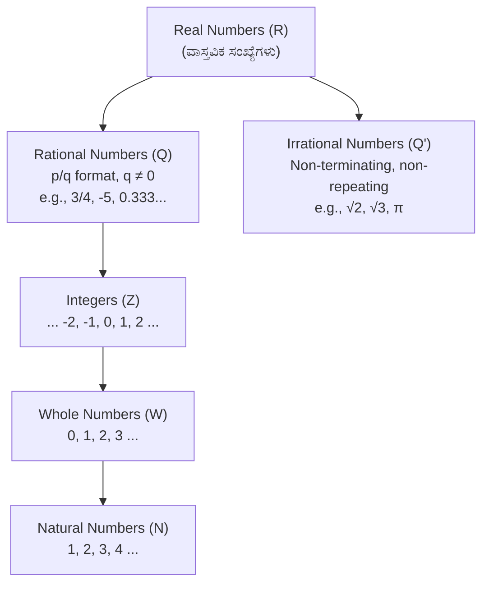
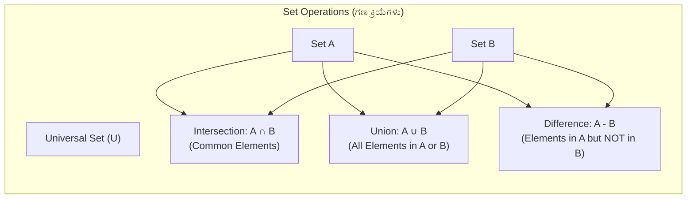
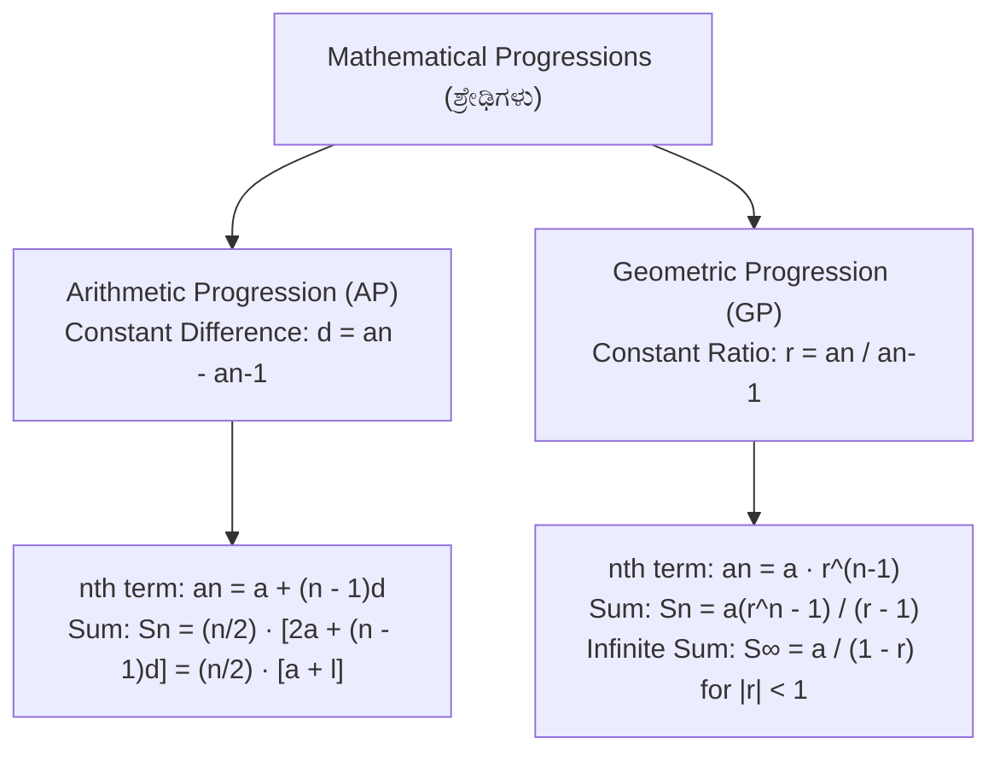
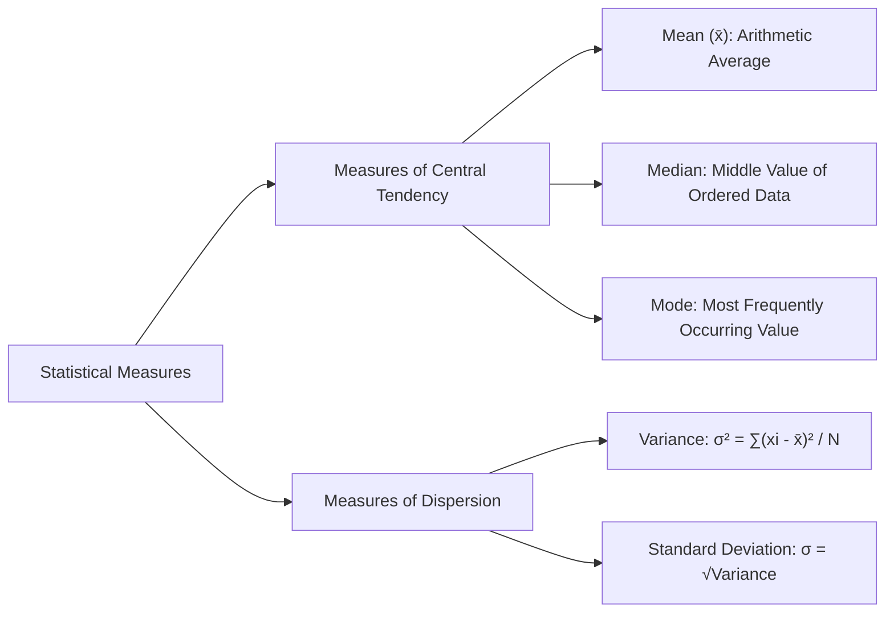

# 01. Mathematics: Arithmetic & Number Systems (ಗಣಿತ: ಅಂಕಗಣಿತ)

> [!IMPORTANT] Exam Focus & Mark Potential
> - **Expected Weightage:** **20–24 Questions** in Paper-II (Arithmetic sub-component of the 40-mark Mathematics section).
> - **Direct Syllabus Coverage:** `[P2-MATH-1.1]` to `[P2-MATH-1.8]` — Number Systems, Squares/Cubes, Set Theory, Progressions (AP/GP), Matrices & Determinants, Permutations & Combinations, Statistics, and HCF/LCM.
> - **High-Frequency Formulas:**
>   - Empirical relation: $\mathbf{\text{Mode} = 3\text{ Median} - 2\text{ Mean}}$.
>   - Product relation: $\mathbf{\text{HCF}} \times \text{LCM} = a \times b$.
>   - Determinant of $\begin{pmatrix} a & b \\ c & d \end{pmatrix} = ad - bc$.

---

## 1. Number Systems & Properties (`P2-MATH-1.1`, `P2-MATH-1.8`)



### Explanation of Number Classification
Real numbers encompass all quantities on the continuous number line. Rational numbers are terminating or recurring decimals expressible as $p/q$ ($q \neq 0$). Irrationals ($\sqrt{2}, \sqrt{3}, \pi, e$) cannot be expressed as fractions and have infinite non-repeating decimal expansions.

### Divisibility & HCF / LCM Rules
- **Divisibility by 3 & 9:** Sum of digits must be divisible by 3 or 9.
- **Divisibility by 4 & 8:** Last 2 digits (for 4) or last 3 digits (for 8) divisible by 4 or 8.
- **Divisibility by 11:** Difference between the sum of digits at odd places and sum of digits at even places must be 0 or a multiple of 11.
- **Fundamental Formula:**
  $$\mathbf{\text{Product of Two Numbers } (a \times b) = \text{HCF}(a, b) \times \text{LCM}(a, b)}$$
- **Fractions Rule:**
  $$\text{HCF of Fractions} = \frac{\text{HCF of Numerators}}{\text{LCM of Denominators}}, \quad \text{LCM of Fractions} = \frac{\text{LCM of Numerators}}{\text{HCF of Denominators}}$$

---

## 2. Squares, Cubes & Roots (`P2-MATH-1.2`)

| Base Number ($x$) | Square ($x^2$) | Cube ($x^3$) | Square Root / Cube Root Tip |
| :---: | :---: | :---: | :--- |
| **1** | 1 | 1 | Unit digit 1 occurs in squares of numbers ending in 1 or 9. |
| **2** | 4 | 8 | Unit digit 4 occurs in squares of numbers ending in 2 or 8. |
| **3** | 9 | 27 | Unit digit 9 occurs in squares of numbers ending in 3 or 7. |
| **4** | 16 | 64 | Unit digit 6 occurs in squares of numbers ending in 4 or 6. |
| **5** | 25 | 125 | Unit digit 5 always ends in 5. |
| **6** | 36 | 216 | Cubes preserve negative signs: $(-x)^3 = -x^3$. |
| **7** | 49 | 343 | Perfect squares **NEVER end in 2, 3, 7, or 8**! |
| **8** | 64 | 512 | Sum of first $n$ odd natural numbers $= \mathbf{n^2}$. |
| **9** | 81 | 729 | Sum of first $n$ cubes $= \left[\frac{n(n+1)}{2}\right]^2$. |
| **10** | 100 | 1000 | Number of digits in $\sqrt{N}$: If $N$ has $n$ digits, $\sqrt{N}$ has $n/2$ (even) or $(n+1)/2$ (odd) digits. |

---

## 3. Set Theory & Venn Diagrams (`P2-MATH-1.3`)



### Essential Set Cardinality Formulas
- If a set has $n$ elements, total number of subsets (Power Set $P(A)$) $= \mathbf{2^n}$.
- Total number of proper subsets $= \mathbf{2^n - 1}$.
- **Two Sets Union Formula:**
  $$\mathbf{n(A \cup B) = n(A) + n(B) - n(A \cap B)}$$
- **Disjoint Sets (ಅಸಂಯುಕ್ತ ಗಣಗಳು):** If $A \cap B = \emptyset \implies n(A \cup B) = n(A) + n(B)$.
- **De Morgan's Laws:**
  $$(A \cup B)' = A' \cap B', \quad (A \cap B)' = A' \cup B'$$

---

## 4. Arithmetic & Geometric Progressions (`P2-MATH-1.4`)



### Explanation of Progression Behavior
In an Arithmetic Progression, terms grow or decay linearly by adding common difference $d$. The arithmetic mean between two numbers $a$ and $b$ is $AM = \frac{a+b}{2}$. In a Geometric Progression, terms grow exponentially by multiplying common ratio $r$. The geometric mean is $GM = \sqrt{ab}$. For any positive numbers, $\mathbf{AM \ge GM}$.

---

## 5. Matrices & Determinants (`P2-MATH-1.5`)

### Operations on $2 \times 2$ Matrices
Let $A = \begin{pmatrix} a & b \\ c & d \end{pmatrix}$ and $B = \begin{pmatrix} e & f \\ g & h \end{pmatrix}$.
- **Matrix Multiplication:**
  $$A \times B = \begin{pmatrix} ae + bg & af + bh \\ ce + dg & cf + dh \end{pmatrix}$$
- **Determinant:**
  $$\mathbf{\det(A) = |A| = ad - bc}$$
- **Singular Matrix:** A matrix is singular if **$\det(A) = 0$**. A singular matrix **has no inverse**!
- **Inverse Matrix ($A^{-1}$):**
  $$\mathbf{A^{-1} = \frac{1}{\det(A)} \text{adj}(A) = \frac{1}{ad - bc} \begin{pmatrix} d & -b \\ -c & a \end{pmatrix}}$$
- **Transpose ($A^T$):** Rows become columns.
  - Symmetric Matrix: $A^T = A$.
  - Skew-Symmetric Matrix: $A^T = -A$ (diagonal elements are always 0).

---

## 6. Permutations & Combinations (`P2-MATH-1.6`)

- **Fundamental Counting Principle:** If event 1 can occur in $m$ ways and event 2 can occur in $n$ ways, both can occur in **$m \times n$** ways (AND rule), and either can occur in **$m + n$** ways (OR rule).
- **Permutation (ಕ್ರಮಯೋಜನೆ - Order Matters / Arrangements):**
  $$\mathbf{^nP_r = \frac{n!}{(n - r)!}}$$
  - Number of circular permutations of $n$ distinct objects $= \mathbf{(n - 1)!}$.
- **Combination (ವಿಕಲ್ಪ - Order Does NOT Matter / Selections):**
  $$\mathbf{^nC_r = \frac{n!}{r! (n - r)!}}$$
- **Symmetric Identity:** $^nC_r = ^nC_{n-r}$ (e.g., $^{10}C_8 = ^{10}C_2 = \frac{10 \times 9}{2} = 45$).
- **Relation:** $^nP_r = r! \times ^nC_r$.

---

## 7. Statistics & Central Tendency (`P2-MATH-1.7`)



### Key Statistical Properties
- **Empirical Relationship for Moderately Asymmetrical Distribution:**
  $$\mathbf{\text{Mode} = 3 \text{ Median} - 2 \text{ Mean}}$$
- **Median for Grouped Data:**
  $$\text{Median} = L + \left(\frac{\frac{N}{2} - CF}{f}\right) \times h$$
- **Effect of Change of Origin & Scale on SD:**
  - If a constant $k$ is **added or subtracted** from all observations, Standard Deviation **remains unchanged**.
  - If all observations are **multiplied or divided** by $k$, Standard Deviation is multiplied or divided by $|k|$.

---

## 8. High-Yield Mnemonics

> [!NOTE] Memory Aids
> - **Empirical Statistics Formula: "3 Medals minus 2 Meals equals a Model"**
>   - **3 Median** $- \mathbf{2 \text{ Mean}} = \mathbf{\text{Mode}}$.
> - **2x2 Matrix Inverse Shortcut: "Swap Diagonal, Negate Off-Diagonal"**
>   - In $\begin{pmatrix} a & b \\ c & d \end{pmatrix}$, swap $a \leftrightarrow d$, change signs of $b$ and $c$, divide by $(ad - bc)$.
> - **Subsets Count: "Two to the power of elements"**
>   - Set with $n$ elements has $2^n$ subsets.

---

## 9. Likely Exam Questions & PYQ Patterns

1. **[KEA Land Surveyor Expected]** *If the mean of a distribution is 25 and the median is 27, what is the empirical mode of the distribution?*
   - $\text{Mode} = 3 \times \text{Median} - 2 \times \text{Mean} = 3(27) - 2(25) = 81 - 50 = \mathbf{31}$.
2. **[KEA PYQ]** *The HCF of two numbers is 12 and their product is 2160. What is their LCM?*
   - $\text{LCM} = \frac{\text{Product}}{\text{HCF}} = \frac{2160}{12} = \mathbf{180}$.
3. **[Expected Question]** *If $A$ is a square matrix of order 2 with $\det(A) = 5$, what is $\det(3A)$?*
   - For an $n \times n$ matrix, $\det(kA) = k^n \det(A)$.
   - Here $n=2 \implies \det(3A) = 3^2 \times \det(A) = 9 \times 5 = \mathbf{45}$.
4. **[KEA Land Surveyor PYQ]** *Find the 10th term of the Arithmetic Progression: 2, 7, 12, 17, ...*
   - $a = 2$, $d = 7 - 2 = 5$.
   - $a_{10} = a + (10 - 1)d = 2 + 9(5) = 2 + 45 = \mathbf{47}$.
5. **[Expected Question]** *In how many ways can a committee of 3 members be chosen from a group of 7 people?*
   - $^7C_3 = \frac{7 \times 6 \times 5}{3 \times 2 \times 1} = \mathbf{35\text{ ways}}$.

---

## 10. Quick Revision Box

```
┌────────────────────────────────────────────────────────────────────────┐
│ ARITHMETIC & NUMBER SYSTEMS REVISION CHEAT SHEET                       │
├────────────────────────────────────────────────────────────────────────┤
│ • Product Rule: a × b = HCF(a, b) × LCM(a, b).                         │
│ • Fraction LCM = LCM(Num) / HCF(Den). HCF = HCF(Num) / LCM(Den).       │
│ • Power Set cardinality = 2^n. Proper subsets = 2^n - 1.               │
│ • Union: n(A ∪ B) = n(A) + n(B) - n(A ∩ B).                            │
│ • AP: an = a + (n-1)d | Sn = (n/2)[2a + (n-1)d] = (n/2)[a + l].        │
│ • GP: an = a·r^(n-1) | S∞ = a / (1 - r) for |r| < 1.                   │
│ • det([a b; c d]) = ad - bc. Singular if det = 0 (no inverse).         │
│ • ^nP_r = n! / (n-r)! | ^nC_r = n! / [r!(n-r)!]. ^nC_r = ^nC_{n-r}.   │
│ • Empirical Mode = 3 Median - 2 Mean.                                  │
│ • Variance = σ². Adding a constant to data DOES NOT change σ.          │
└────────────────────────────────────────────────────────────────────────┘
```

---
*Related Notes:*
- [[02_Mathematics_Algebra_and_Coordinate_Geometry]]
- [[03_Modern_Surveying_Photogrammetry_and_Remote_Sensing]]
- [[06_Applied_Physics_Gravitation_and_Mechanics]]
