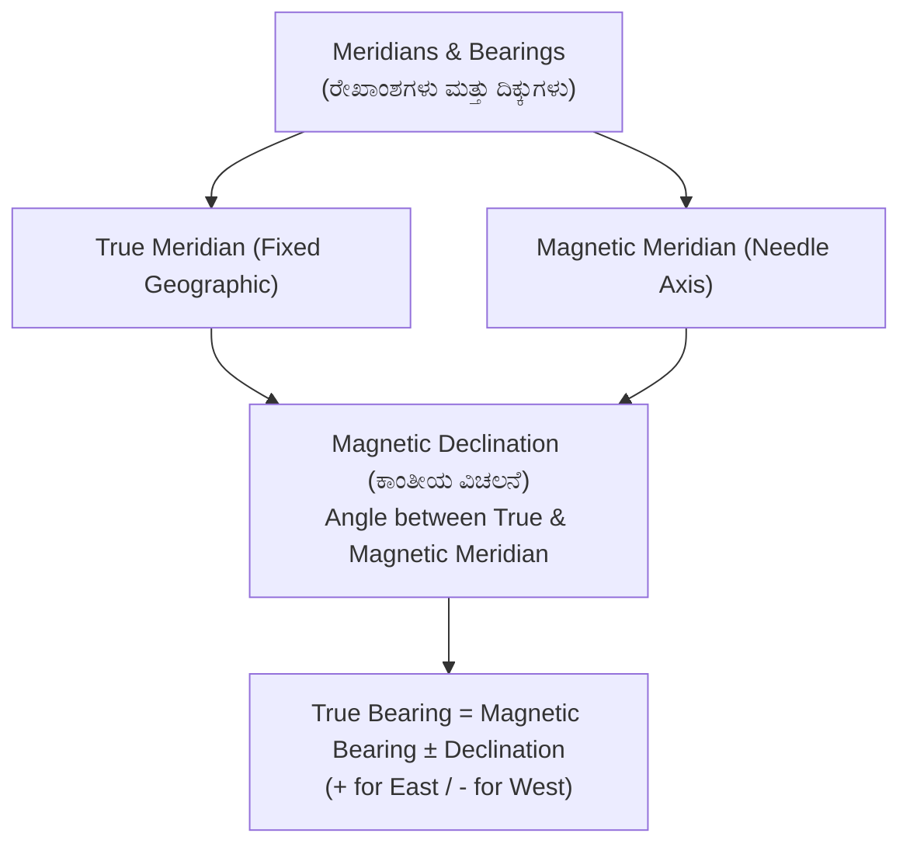
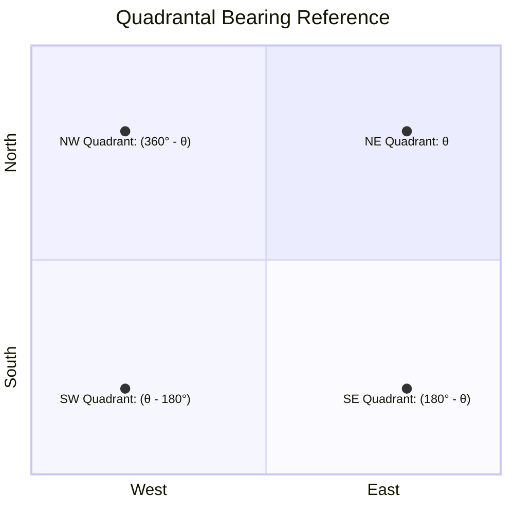

# 02. Compass Surveying & Traversing (ದಿಕ್ಸೂಚಿ ಸಮೀಕ್ಷೆ)

> [!IMPORTANT] Exam Focus & Mark Potential
> - **Expected Weightage:** 10–12 Questions in Paper-II.
> - **Core Concepts Tested:** Prismatic Compass vs Surveyor's Compass differences, WCB to Reduced Bearing conversions, $BB = FB \pm 180^\circ$ rule, Magnetic Declination calculations ($TB = MB \pm \delta$), Dip of the magnetic needle, and Local Attraction corrections.
> - **High-Frequency Trap:** In a Prismatic Compass, $0^\circ$ is at the **South** end and graduations run clockwise, whereas in a Surveyor's Compass, $0^\circ$ is at both **North and South**, with East and West swapped on the ring!

---

## 1. Principles of Compass Surveying

Compass surveying determines the direction (bearing) of survey lines with reference to a magnetic meridian using a magnetic needle, while lengths are chained or taped. It is indispensable for traversing large areas where triangulation is impractical due to vegetation or undulating ground.

### Meridians & Bearings
- **True Meridian (ನೈಜ ರೇಖಾಂಶ):** Line passing through the geographic North and South poles. Remains constant over time.
- **Magnetic Meridian (ಕಾಂತೀಯ ರೇಖಾಂಶ):** Direction pointed by a freely suspended, balanced magnetic needle influenced only by Earth's magnetic field. Varies over time and location.
- **Grid Meridian:** Direction of central meridian on a national grid projection.
- **Arbitrary Meridian:** Any convenient fixed reference line (e.g., church spire, lighthouse).



### Explanation of Meridian Relations
The angle between the True Meridian and the Magnetic Meridian at any place on Earth is called the **Magnetic Declination ($\delta$)**.
- If the magnetic north lies to the **East** of true north: Declination is **East (+) $\implies TB = MB + \delta_E$**.
- If the magnetic north lies to the **West** of true north: Declination is **West (-) $\implies TB = MB - \delta_W$**.

---

## 2. Prismatic Compass vs. Surveyor's Compass

This comparison table is the single most tested topic in KEA surveying exams.

| Feature / Attribute | Prismatic Compass (ಪ್ರಿಸ್ಮ್ಯಾಟಿಕ್ ದಿಕ್ಸೂಚಿ) | Surveyor's Compass (ಸರ್ವೇಯರ್ ದಿಕ್ಸೂಚಿ) |
| :--- | :--- | :--- |
| **Magnetic Needle** | Broad-form needle. The graduated ring is attached to the needle and rotates with it. | Edge-bar needle. Needle floats freely above the fixed graduated ring. |
| **Graduation System** | **Whole Circle Bearing (WCB)** from $0^\circ$ to $360^\circ$. | **Quadrantal Bearing (QB / RB)** from $0^\circ$ to $90^\circ$ in 4 quadrants. |
| **Graduation Markings** | **$0^\circ$ at South**, $90^\circ$ at West, $180^\circ$ at North, $270^\circ$ at East (inverted figures seen through prism). | **$0^\circ$ at North & South**; **$90^\circ$ at East & West**. East and West are reversed! |
| **Sighting & Reading** | Sighting and reading are done **simultaneously** through the prism without shifting the eye. | Sighting is done first, then reader moves to read the tip of the needle directly from above. |
| **Tripod Requirement** | Can be used handheld or mounted on a light tripod. | Cannot be used handheld; **tripod is essential**. |
| **Least Count** | Typically **$30'$ (30 minutes)**. | Typically **$15'$ (15 minutes)**. |

---

## 3. Whole Circle Bearing (WCB) vs Reduced Bearing (RB)

- **WCB (ಪೂರ್ಣ ವೃತ್ತ ಬೇರಿಂಗ್):** Angle measured clockwise from Magnetic North ($0^\circ$ to $360^\circ$).
- **RB / QB (ಪಾದ ಬೇರಿಂಗ್):** Angle measured clockwise or counter-clockwise from North or South (whichever is closer) towards East or West ($0^\circ$ to $90^\circ$).



### Conversion Formulas Matrix

| WCB Range | Quadrant | Reduced Bearing (RB) Formula | Rule of Thumb | Example |
| :---: | :---: | :---: | :---: | :--- |
| **$0^\circ \text{ to } 90^\circ$** | I (N-E) | $\text{RB} = \text{N } \theta \text{ E}$ | $\text{RB} = \text{WCB}$ | $\text{WCB} = 42^\circ \implies \mathbf{N\ 42^\circ\ E}$ |
| **$90^\circ \text{ to } 180^\circ$** | II (S-E) | $\text{RB} = \text{S } (180^\circ - \theta) \text{ E}$ | Subtract from $180^\circ$ | $\text{WCB} = 125^\circ \implies \mathbf{S\ 55^\circ\ E}$ |
| **$180^\circ \text{ to } 270^\circ$** | III (S-W) | $\text{RB} = \text{S } (\theta - 180^\circ) \text{ W}$ | Subtract $180^\circ$ from WCB | $\text{WCB} = 215^\circ \implies \mathbf{S\ 35^\circ\ W}$ |
| **$270^\circ \text{ to } 360^\circ$** | IV (N-W) | $\text{RB} = \text{N } (360^\circ - \theta) \text{ W}$ | Subtract from $360^\circ$ | $\text{WCB} = 310^\circ \implies \mathbf{N\ 50^\circ\ W}$ |

---

## 4. Fore Bearing (FB) & Back Bearing (BB)

- **Fore Bearing (ಮುನ್ನಡೆ ಬೇರಿಂಗ್):** Bearing of a line measured in the forward direction of the survey progress ($A \to B$).
- **Back Bearing (ಹಿನ್ನಡೆ ಬೇರಿಂಗ್):** Bearing of the line measured in the reverse direction ($B \to A$).

$$\mathbf{BB = FB \pm 180^\circ}$$
- Use **$+180^\circ$** if $FB < 180^\circ$.
- Use **$-180^\circ$** if $FB > 180^\circ$.
- *For Quadrantal Bearing (RB):* To find BB, simply reverse the cardinal letters!
  - Example: $FB = \text{N } 35^\circ \text{ E} \implies BB = \mathbf{S\ 35^\circ\ W}$.
  - Example: $FB = \text{S } 60^\circ \text{ W} \implies BB = \mathbf{N\ 60^\circ\ E}$.

---

## 5. Dip of the Magnetic Needle (ಕಾಂತೀಯ ನಮನ) & Terrestrial Lines

When a magnetic needle is supported on a pivot, it does not remain strictly horizontal due to the vertical component of Earth's magnetic force.
- **Dip at Equator:** **$0^\circ$** (Needle is perfectly horizontal).
- **Dip at Magnetic Poles:** **$90^\circ$** (Needle points vertically downward).
- To balance the needle against dip, a small sliding brass or gold rider weight is added on the southern arm in the Northern Hemisphere.

### Magnetic Mapping Lines (Isogonic vs Agonic)
1. **Isogonic Lines (ಸಮವಿಚಲನ ರೇಖೆಗಳು):** Lines joining points on the Earth's surface having **equal magnetic declination**.
2. **Agonic Lines (ಅವಿಚಲನ ರೇಖೆಗಳು):** Lines passing through points of **zero magnetic declination** (True North coincides with Magnetic North).
3. **Isoclinic Lines (ಸಮನಮನ ರೇಖೆಗಳು):** Lines connecting points having **equal magnetic dip**.
4. **Aclinic Line (Magnetic Equator):** Line joining points of **zero dip** (Dip = $0^\circ$).

---

## 6. Local Attraction (ಸ್ಥಳೀಯ ಆಕರ್ಷಣೆ) & Traverse Adjustment

Local attraction is the deviation of the magnetic needle from the true magnetic meridian caused by proximity to magnetic substances such as iron ore, steel structures, rails, underground pipes, electric cables, or steel-rimmed spectacles.

### Detection Principle
A survey line is **free from local attraction** if and only if:
$$|\text{Fore Bearing} - \text{Back Bearing}| = 180^\circ$$
- If the difference is **not equal to $180^\circ$**, local attraction exists at either or both of the stations.

### Correction Methods
1. **Method of Included Angles (Best Method):** Included angles calculated from bearings are completely independent of local attraction because both sights from a station are affected by the exact same angular error!
   - Sum of interior angles of an $n$-sided closed polygon = **$(2n - 4) \times 90^\circ$** or **$(n - 2) \times 180^\circ$**.
   - Sum of exterior angles = **$(2n + 4) \times 90^\circ$**.
2. **Successive Station Error Method:** Identify the station where $FB - BB = 180^\circ$. Those bearings are correct. Propagate corrections sequentially to adjoining stations.

---

## 7. High-Yield Mnemonics

> [!NOTE] Memory Aids
> - **Prismatic Compass Zero Position: "Prism at South"**
>   - **P**rismatic compass has **$0^\circ$** at **S**outh (**P-S**).
> - **Magnetic Declination Sign: "East is Least (+), West is Best (-)"**
>   - True Bearing = Magnetic Bearing **+ East** Declination.
>   - True Bearing = Magnetic Bearing **- West** Declination.
> - **Terrestrial Lines: "Gonic = Declination, Clinic = Dip"**
>   - Iso**gonic** $\to$ Declination; Iso**clinic** $\to$ Dip/Inclination.
>   - **A**clinic $\to$ Zero dip (Equator); **A**gonic $\to$ Zero declination.

---

## 8. Likely Exam Questions & PYQ Patterns

1. **[KEA Land Surveyor PYQ]** *The magnetic bearing of a line is $S\ 30^\circ\ E$ and the magnetic declination is $4^\circ\ W$. What is the true bearing of the line?*
   - Convert to WCB: $S\ 30^\circ\ E = 180^\circ - 30^\circ = 150^\circ$.
   - True Bearing = $MB - \delta_W = 150^\circ - 4^\circ = 146^\circ$.
   - Convert back to RB: $180^\circ - 146^\circ = \mathbf{S\ 34^\circ\ E}$.
2. **[KEA PYQ]** *If the fore bearing of a line $AB$ is $215^\circ 30'$, what is its back bearing?*
   - Since $FB > 180^\circ$, $BB = FB - 180^\circ = 215^\circ 30' - 180^\circ = \mathbf{35^\circ 30'}$.
3. **[Expected Question]** *In a Surveyor's compass, the graduated ring:*
   - **Answer:** Remains fixed to the box and does not rotate with the needle (needle floats freely).
4. **[Expected Question]** *A line passing through points of zero magnetic declination is known as:*
   - **Answer:** Agonic line.
5. **[Expected Question]** *The dip of a magnetic needle at the magnetic equator is:*
   - **Answer:** $0^\circ$. (At magnetic poles it is $90^\circ$).

---

## 9. Quick Revision Box

```
┌────────────────────────────────────────────────────────────────────────┐
│ COMPASS SURVEYING REVISION CHEAT SHEET                                 │
├────────────────────────────────────────────────────────────────────────┤
│ • Prismatic Compass: WCB (0°-360°), 0° at South, rotates with needle.  │
│ • Surveyor's Compass: QB (0°-90°), 0° at N & S, needle moves freely.   │
│ • Sighting & reading simultaneous in Prismatic; separate in Surveyor.  │
│ • BB = FB ± 180° (+ if FB < 180°, - if FB > 180°).                     │
│ • True Bearing = Magnetic Bearing + East Declination.                  │
│ • True Bearing = Magnetic Bearing - West Declination.                  │
│ • Dip = 0° at Equator, 90° at Poles. Controlled by counter-weight.     │
│ • Isogonic = Equal Declination | Agonic = Zero Declination.            │
│ • Isoclinic = Equal Dip | Aclinic = Zero Dip (Equator).                │
│ • Local Attraction Check: |FB - BB| = 180°.                            │
│ • Sum of Interior Angles of Polygon = (2n - 4) × 90°.                  │
└────────────────────────────────────────────────────────────────────────┘
```

---
*Related Notes:*
- [[01_Chain_Surveying_and_Linear_Measurements]]
- [[05_Theodolite_and_Tacheometry]]
- [[07_Total_Station_and_EDM]]
