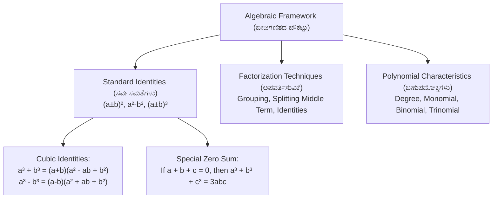
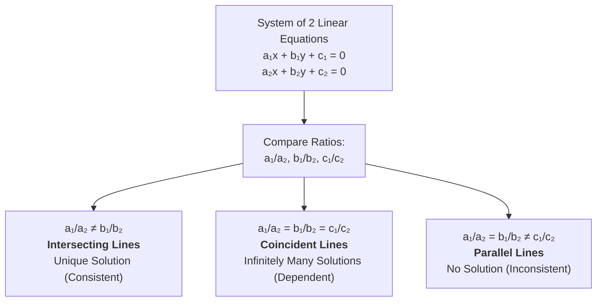
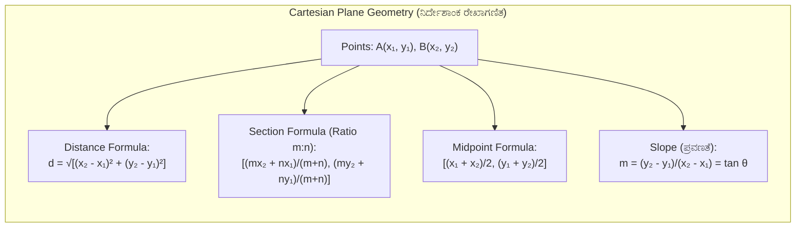

# 02. Mathematics: Algebra & Coordinate Geometry (ಬೀಜಗಣಿತ ಮತ್ತು ನಿರ್ದೇಶಾಂಕ ರೇಖಾಗಣಿತ)

> [!IMPORTANT] Exam Focus & Mark Potential
> - **Expected Weightage:** **16–20 Questions** in Paper-II (Algebra & Coordinate Geometry component of the 40-mark Mathematics section).
> - **Direct Syllabus Coverage:** `[P2-MATH-2.1]` to `[P2-MATH-2.4]` — Algebraic Identities & Factorization, Linear Equations, Quadratic Equations (Discriminant & Nature of Roots), Coordinate Geometry (Distance, Section, Area of Triangle, Slope of Lines).
> - **High-Frequency Formulas:**
>   - Quadratic Roots Formula: $\mathbf{x = \frac{-b \pm \sqrt{b^2 - 4ac}}{2a}}$.
>   - Discriminant: $\Delta = b^2 - 4ac$ ($\Delta > 0$ real & distinct, $\Delta = 0$ real & equal, $\Delta < 0$ complex/no real roots).
>   - Distance Formula: $\mathbf{d = \sqrt{(x_2 - x_1)^2 + (y_2 - y_1)^2}}$.
>   - Section Formula (Internal): $\mathbf{\left(\frac{m_1 x_2 + m_2 x_1}{m_1 + m_2}, \frac{m_1 y_2 + m_2 y_1}{m_1 + m_2}\right)}$.
>   - Area of Triangle: $\mathbf{\frac{1}{2} |x_1(y_2 - y_3) + x_2(y_3 - y_1) + x_3(y_1 - y_2)|}$ (Zero if collinear).
>   - Perpendicular Lines Condition: $\mathbf{m_1 \cdot m_2 = -1}$.

---

## 1. Algebraic Identities & Polynomials (`P2-MATH-2.1`)



### Explanation of Algebraic Architecture
Algebra forms the bedrock of mathematical modeling and surveying computations. Polynomials are classified by degree (linear: 1, quadratic: 2, cubic: 3) and number of terms (monomial: 1, binomial: 2, trinomial: 3). Factoring breaks complex polynomials into products of irreducible linear or quadratic factors, directly enabling the solution of coordinate boundary intersections and parametric land division formulas.

### Master Table of Algebraic Identities

| Identity Formula | Kannada Description | High-Yield Application / Shortcut |
| :--- | :--- | :--- |
| $(a + b)^2 = a^2 + 2ab + b^2$ | ಮೊತ್ತದ ವರ್ಗ | Expand $(x + 5)^2 = x^2 + 10x + 25$ |
| $(a - b)^2 = a^2 - 2ab + b^2$ | ವ್ಯತ್ಯಾಸದ ವರ್ಗ | $(a+b)^2 - (a-b)^2 = 4ab$ |
| $(a + b)(a - b) = a^2 - b^2$ | ವರ್ಗಗಳ ವ್ಯತ್ಯಾಸ | Rapid calculation: $98 \times 102 = (100-2)(100+2) = 10000 - 4 = 9996$ |
| $(x + a)(x + b) = x^2 + (a+b)x + ab$ | ದ್ವಿಪದಗಳ ಗುಣಲಬ್ಧ | Direct expansion for quadratic factoring |
| $(a + b + c)^2 = a^2 + b^2 + c^2 + 2(ab + bc + ca)$ | ತ್ರಿಪದಿಯ ವರ್ಗ | Used when finding sum of pairwise products |
| $(a + b)^3 = a^3 + 3a^2b + 3ab^2 + b^3 = a^3 + b^3 + 3ab(a + b)$ | ಮೊತ್ತದ ಘನ | Expansion and numerical shortcuts |
| $(a - b)^3 = a^3 - 3a^2b + 3ab^2 - b^3 = a^3 - b^3 - 3ab(a - b)$ | ವ್ಯತ್ಯಾಸದ ಘನ | If $x - \frac{1}{x} = k$, then $x^3 - \frac{1}{x^3} = k^3 + 3k$ |
| $a^3 + b^3 = (a + b)(a^2 - ab + b^2)$ | ಘನಗಳ ಮೊತ್ತ | Factoring algebraic expressions |
| $a^3 - b^3 = (a - b)(a^2 + ab + b^2)$ | ಘನಗಳ ವ್ಯತ್ಯಾಸ | Factoring algebraic expressions |
| $a^3 + b^3 + c^3 - 3abc = (a+b+c)(a^2+b^2+c^2 - ab - bc - ca)$ | ವಿಶೇಷ ಘನ ಸೂತ್ರ | **Vital Rule:** If $a + b + c = 0$, then $\mathbf{a^3 + b^3 + c^3 = 3abc}$ |

> [!TIP] High-Speed Competitive Shortcut
> If $x + \frac{1}{x} = k$:
> - $x^2 + \frac{1}{x^2} = k^2 - 2$
> - $x^3 + \frac{1}{x^3} = k^3 - 3k$
> - $x^4 + \frac{1}{x^4} = (k^2 - 2)^2 - 2$

---

## 2. Linear Equations in One & Two Variables (`P2-MATH-2.2`)

### 1. Single Variable Linear Equations
Standard Form: $ax + b = 0 \implies x = -\frac{b}{a}$ ($a \neq 0$).

### 2. Simultaneous Linear Equations in Two Variables
System:
$$a_1 x + b_1 y + c_1 = 0$$
$$a_2 x + b_2 y + c_2 = 0$$



### Explanation of Consistency Criteria
When analyzing boundary lines or traverse offsets in surveying:
1. **Unique Solution (ಏಕೈಕ ಪರಿಹಾರ):** The two lines cross at exactly one coordinate point $(x, y)$. This occurs if and only if slopes differ, meaning $\frac{a_1}{a_2} \neq \frac{b_1}{b_2}$.
2. **Infinite Solutions (ಅನಂತ ಪರಿಹಾರಗಳು):** Both equations represent the exact same physical survey baseline. Ratios of all coefficients and constants are strictly identical: $\frac{a_1}{a_2} = \frac{b_1}{b_2} = \frac{c_1}{c_2}$.
3. **No Solution (ಪರಿಹಾರವಿಲ್ಲ):** The survey lines are strictly parallel and never intersect. The slopes match but the intercepts differ: $\frac{a_1}{a_2} = \frac{b_1}{b_2} \neq \frac{c_1}{c_2}$.

---

## 3. Quadratic Equations (`P2-MATH-2.3`)

Standard Form:
$$ax^2 + bx + c = 0 \quad (a \neq 0)$$

### 1. Quadratic Formula & Roots
Roots $\alpha, \beta$:
$$\mathbf{x = \frac{-b \pm \sqrt{b^2 - 4ac}}{2a}}$$
- **Sum of roots (ಮೂಲಗಳ ಮೊತ್ತ):** $\alpha + \beta = -\frac{b}{a}$
- **Product of roots (ಮೂಲಗಳ ಗುಣಲಬ್ಧ):** $\alpha \cdot \beta = \frac{c}{a}$
- **Equation from roots:** $x^2 - (\alpha + \beta)x + (\alpha \beta) = 0$

### 2. Nature of Roots via Discriminant ($\Delta = b^2 - 4ac$)

| Discriminant Value ($\Delta$) | Nature of Roots (ಮೂಲಗಳ ಸ್ವರೂಪ) | Graphical Interpretation |
| :--- | :--- | :--- |
| $\mathbf{\Delta > 0}$ and perfect square | Real, Rational, and Distinct (ಅಸಮಾನ ವಾಸ್ತವ ಸಂಖ್ಯೆಗಳು) | Parabola cuts x-axis at two rational points |
| $\mathbf{\Delta > 0}$ and NOT perfect square | Real, Irrational, and Distinct (surd pairs: $p \pm \sqrt{q}$) | Parabola cuts x-axis at two irrational points |
| $\mathbf{\Delta = 0}$ | Real and Equal (ಸಮಾನ ವಾಸ್ತವ ಸಂಖ್ಯೆಗಳು, $x = -b/2a$) | Parabola touches x-axis at exactly one point (tangent) |
| $\mathbf{\Delta < 0}$ | No Real Roots / Complex Conjugates (ಕಾಲ್ಪನಿಕ ಸಂಖ್ಯೆಗಳು) | Parabola does not intersect the x-axis |

---

## 4. Coordinate Geometry (`P2-MATH-2.4`)



### Explanation of Coordinate Systems in Surveying
Surveying traverses translate field chainage and bearings into Cartesian northings ($y$) and eastings ($x$). The fundamental formulas of coordinate geometry allow exact computation of boundary lengths, intermediate boundary stone positions (section formula), parcel surface areas (Shoelace/Gauss polygon formula), and boundary alignments (slope and parallelism).

### Core Coordinate Geometry Formulas

#### 1. Distance Formula (ದೂರ ಸೂತ್ರ)
The Euclidean distance $d$ between points $A(x_1, y_1)$ and $B(x_2, y_2)$:
$$\mathbf{d = \sqrt{(x_2 - x_1)^2 + (y_2 - y_1)^2}}$$
- Distance of point $P(x, y)$ from origin $(0, 0)$: $\mathbf{d = \sqrt{x^2 + y^2}}$.

#### 2. Section Formula (ವಿಭಾಗ ಸೂತ್ರ)
Coordinates of point $P(x, y)$ dividing line segment $AB$ internally in ratio $m_1 : m_2$:
$$\mathbf{x = \frac{m_1 x_2 + m_2 x_1}{m_1 + m_2}, \quad y = \frac{m_1 y_2 + m_2 y_1}{m_1 + m_2}}$$
- **Midpoint Formula (ಮಧ್ಯಬಿಂದು):** For ratio $1:1$:
  $$\mathbf{x = \frac{x_1 + x_2}{2}, \quad y = \frac{y_1 + y_2}{2}}$$
- **Centroid of a Triangle (ತ್ರಿಭುಜದ ಗುರುತ್ವ ಕೇಂದ್ರ):** Vertices $(x_1, y_1), (x_2, y_2), (x_3, y_3)$:
  $$\mathbf{G = \left(\frac{x_1 + x_2 + x_3}{3}, \frac{y_1 + y_2 + y_3}{3}\right)}$$

#### 3. Area of a Triangle & Collinearity Condition (ತ್ರಿಭುಜದ ವಿಸ್ತೀರ್ಣ)
Area of triangle with vertices $(x_1, y_1), (x_2, y_2), (x_3, y_3)$:
$$\mathbf{\text{Area} = \frac{1}{2} \Big| x_1(y_2 - y_3) + x_2(y_3 - y_1) + x_3(y_1 - y_2) \Big|}$$
> [!IMPORTANT] Collinearity Condition (ಸರೇಖೀಯತೆ)
> If three points are collinear (lie on the exact same straight line), the area of the triangle formed by them is **strictly equal to zero**:
> $$\mathbf{x_1(y_2 - y_3) + x_2(y_3 - y_1) + x_3(y_1 - y_2) = 0}$$

#### 4. Slope of a Line & Angular Relationships (ಸರಳ ರೇಖೆಯ ಪ್ರವಣತೆ)
- Slope ($m$) of a line making inclination angle $\theta$ with positive x-axis:
  $$\mathbf{m = \tan \theta}$$
- Slope through two points $(x_1, y_1)$ and $(x_2, y_2)$:
  $$\mathbf{m = \frac{y_2 - y_1}{x_2 - x_1}}$$
- Slope of standard line $Ax + By + C = 0$:
  $$\mathbf{m = -\frac{A}{B}}$$
- **Parallel Lines Condition (ಸಮಾಂತರ ರೇಖೆಗಳು):**
  $$\mathbf{m_1 = m_2}$$
- **Perpendicular Lines Condition (ಲಂಬ ರೇಖೆಗಳು):**
  $$\mathbf{m_1 \cdot m_2 = -1 \quad \text{or} \quad m_2 = -\frac{1}{m_1}}$$

---

## 5. Authentic Verbatim PYQs & High-Yield Questions

> [!NOTE] Verbatim Previous Year Questions (KEA / KPSC Shared Syllabus)
>
> **Q1. [KEA Land Surveyor PYQ]** If the points $(1, 2)$, $(0, 0)$, and $(a, b)$ are collinear, what is the relation between $a$ and $b$?
> - (A) $a = 2b$
> - (B) $2a = b$
> - (C) $a + b = 0$
> - (D) $a - b = 0$
>
> *Answer:* **(B) $2a = b$**
> *Explanation:* For collinear points, area of triangle $= 0 \implies \frac{1}{2}|1(0 - b) + 0(b - 2) + a(2 - 0)| = 0 \implies -b + 2a = 0 \implies 2a = b$.
>
> ---
>
> **Q2. [KPSC PWD / Surveyor PYQ]** For what value of $k$ will the quadratic equation $2x^2 + kx + 3 = 0$ have two equal real roots?
> - (A) $\pm \sqrt{6}$
> - (B) $\pm 2\sqrt{6}$
> - (C) $\pm 4$
> - (D) $\pm 6$
>
> *Answer:* **(B) $\pm 2\sqrt{6}$**
> *Explanation:* For equal roots, discriminant $\Delta = b^2 - 4ac = 0 \implies k^2 - 4(2)(3) = 0 \implies k^2 - 24 = 0 \implies k^2 = 24 \implies k = \pm \sqrt{24} = \pm 2\sqrt{6}$.
>
> ---
>
> **Q3. [KEA Land Surveyor PYQ]** The slope of a line perpendicular to the line $3x - 4y + 7 = 0$ is:
> - (A) $\frac{3}{4}$
> - (B) $-\frac{3}{4}$
> - (C) $\frac{4}{3}$
> - (D) $-\frac{4}{3}$
>
> *Answer:* **(D) $-\frac{4}{3}$**
> *Explanation:* Slope of given line $m_1 = -\frac{A}{B} = -\frac{3}{-4} = \frac{3}{4}$. Condition for perpendicular line: $m_1 \cdot m_2 = -1 \implies \frac{3}{4} \cdot m_2 = -1 \implies m_2 = -\frac{4}{3}$.
>
> ---
>
> **Q4. [KPSC Draughtsman PYQ]** The distance of the point $P(-6, 8)$ from the origin $(0, 0)$ is:
> - (A) 14 units
> - (B) 10 units
> - (C) 2 units
> - (D) $\sqrt{14}$ units
>
> *Answer:* **(B) 10 units**
> *Explanation:* Distance from origin $d = \sqrt{x^2 + y^2} = \sqrt{(-6)^2 + 8^2} = \sqrt{36 + 64} = \sqrt{100} = 10\text{ units}$.

---

## 6. Quick Revision Box (ಕಡ್ಡಾಯವಾಗಿ ನೆನಪಿಡಬೇಕಾದ ಸೂತ್ರಗಳು)

```markdown
┌─────────────────────────────────────────────────────────────────────────────┐
│                       ALGEBRA & COORDINATE GEOMETRY CHEAT SHEET             │
├─────────────────────────────────────────────────────────────────────────────┤
│ 1. Zero Sum Cube Rule: If a + b + c = 0, then a³ + b³ + c³ = 3abc.         │
│ 2. Consistent System (Unique): a₁/a₂ ≠ b₁/b₂ (lines intersect).             │
│ 3. Inconsistent System (No Solution): a₁/a₂ = b₁/b₂ ≠ c₁/c₂ (parallel).    │
│ 4. Dependent System (Infinite): a₁/a₂ = b₁/b₂ = c₁/c₂ (coincident).        │
│ 5. Nature of Roots (Δ = b² - 4ac):                                          │
│    • Δ > 0: Real & Distinct  • Δ = 0: Real & Equal  • Δ < 0: No Real Roots │
│ 6. Sum of Roots = -b/a, Product of Roots = c/a.                             │
│ 7. Distance Formula: d = √[(x₂ - x₁)² + (y₂ - y₁)²].                       │
│ 8. Midpoint: ((x₁ + x₂)/2, (y₁ + y₂)/2).                                    │
│ 9. Centroid: ((x₁ + x₂ + x₃)/3, (y₁ + y₂ + y₃)/3).                          │
│ 10. Area of Triangle: ½ |x₁(y₂ - y₃) + x₂(y₃ - y₁) + x₃(y₁ - y₂)|.          │
│ 11. Collinear Points: Area of Triangle = 0.                                 │
│ 12. Line Slopes: Parallel ⇒ m₁ = m₂; Perpendicular ⇒ m₁ · m₂ = -1.         │
└─────────────────────────────────────────────────────────────────────────────┘
```
