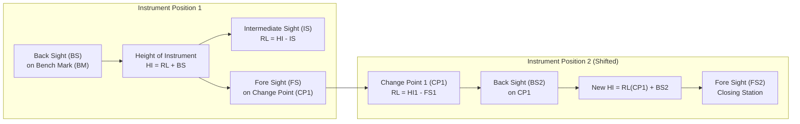
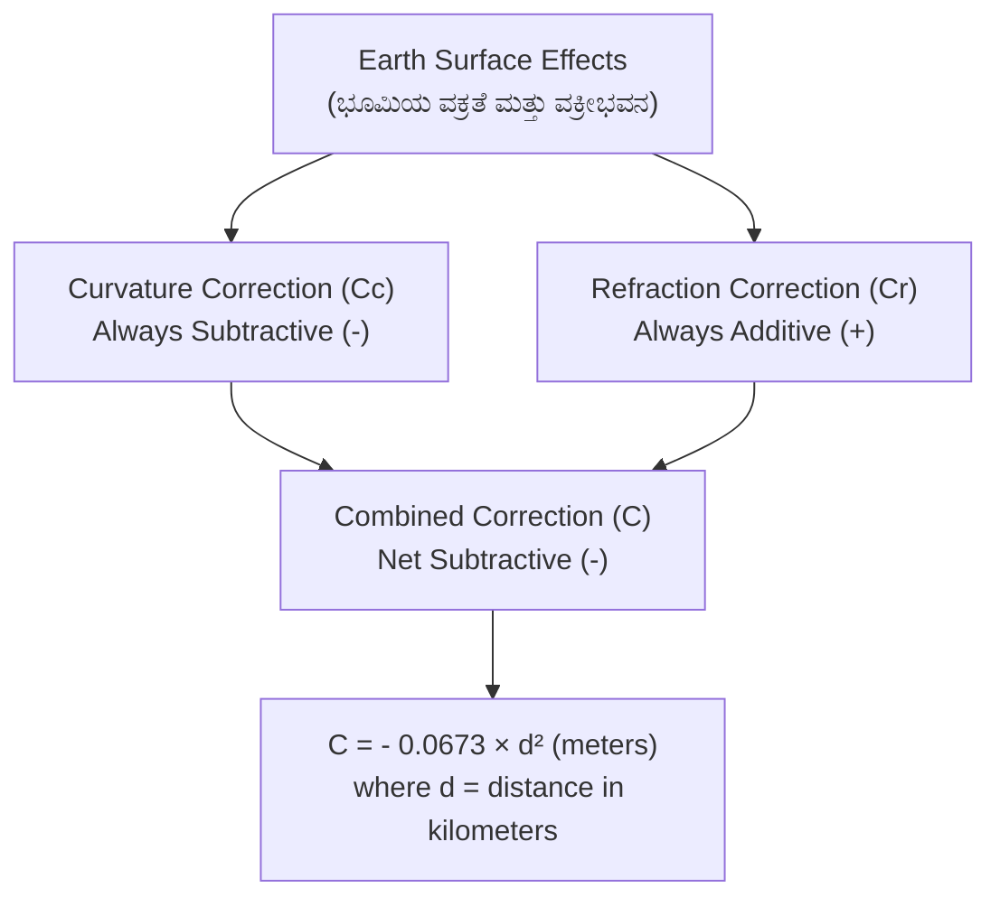
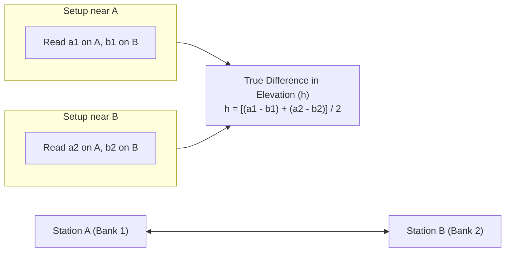

# 03. Levelling & Contouring (ಮಟ್ಟ ಅಳತೆ & ಬಾಹ್ಯರೇಖೆಗಳು)

> [!IMPORTANT] Exam Focus & Mark Potential
> - **Expected Weightage:** 14–16 Questions in Paper-II.
> - **Core Concepts Tested:** Essential definitions (BS, FS, IS, CP, RL), Height of Instrument vs Rise & Fall arithmetic checks, Curvature & Refraction numericals ($C = -0.0673 d^2$), Reciprocal Levelling errors eliminated, Inverted staff readings, and 10 Golden Rules of Contour Characteristics.
> - **High-Frequency Numerical:** Combined curvature & refraction correction on distance $d\text{ (in km)}$ produces correction in meters. Remember: **$C = -0.0673 d^2$**.

---

## 1. Fundamentals of Levelling

Levelling is the branch of surveying that determines the relative heights or elevations of points above or below a chosen reference datum (ಮಟ್ಟ ಅಳತೆ).

### Basic Definitions & Terminology
- **Datum (ದತ್ತಾಂಶ ರೇಖೆ):** An arbitrary or officially adopted level surface from which elevations are measured. In India, the standard datum is the **Mean Sea Level (MSL)** established at **Mumbai High**.
- **Bench Mark (BM - ಮಾನದಂಡ ಕೇಂದ್ರ):** A permanent reference point of known Reduced Level (RL).
  - *GTS Bench Mark (Great Trigonometrical Survey):* Established by the Survey of India with highest precision across the country.
  - *Permanent Bench Mark:* Fixed on permanent structures like bridges, railway plinths, or temple foundations by PWD/Railways.
  - *Arbitrary Bench Mark:* Adopted for small, local surveys assuming an arbitrary RL (e.g., $100.000\text{ m}$).
  - *Temporary Bench Mark (TBM):* Established at the close of a day's work to resume levelling the next morning.
- **Back Sight (BS - ಹಿನ್ನೋಟ):** The very first staff reading taken after the level is set up and levelled. Always taken on a point of known elevation (BM or CP).
- **Fore Sight (FS - ಮುನ್ನೋಟ):** The very last staff reading taken before shifting the instrument or closing the survey line.
- **Intermediate Sight (IS - ಮಧ್ಯದ ನೋಟ):** Any staff reading taken between the BS and FS on points whose elevations are required.
- **Change Point / Turning Point (CP / TP - ಬದಲಾವಣೆ ಬಿಂದು):** A stable ground point on which both a Fore Sight (to close the previous setup) and a Back Sight (to begin the new setup) are taken.



### Explanation of Levelling Station Workflow
At setup 1, the surveyor takes a Back Sight on the Bench Mark to find the height of the collimation line ($HI_1$). Readings taken on points along the ground are Intermediate Sights, with $RL = HI_1 - IS$. When the view is exhausted, a Fore Sight is read on the Change Point ($CP_1$). The instrument is shifted to position 2, levelled, and a Back Sight ($BS_2$) is taken on the exact same change point to calculate the new $HI_2$.

---

## 2. Reduction of Levels: HI Method vs Rise & Fall Method

| Feature | Height of Instrument (Collimation) Method | Rise & Fall Method (ಏರಿಳಿತ ವಿಧಾನ) |
| :--- | :--- | :--- |
| **Calculation Principle** | Calculates line of sight elevation ($HI = RL + BS$), then subtracts readings ($RL = HI - \text{reading}$). | Compares consecutive staff readings: <br>• Reading Decreases $\implies$ **Rise (+)**<br>• Reading Increases $\implies$ **Fall (-)** |
| **Computation Speed** | Faster, involves fewer calculations when many intermediate sights are present. | Slower, requires arithmetic on every individual point pair. |
| **Check on Intermediate Sights** | **No check** on Reduced Levels of intermediate sights. | **Full arithmetic check** on all points, including intermediate sights. |
| **Field Suitability** | Longitudinal profiling, cross-sections, contouring grids. | Precision fly-levelling, establishing bench marks. |

### Mathematical Arithmetical Checks

$$\text{HI Method Check:}\quad \sum BS - \sum FS = \text{Last RL} - \text{First RL}$$

$$\text{Rise \& Fall Method Check:}\quad \sum BS - \sum FS = \sum \text{Rise} - \sum \text{Fall} = \text{Last RL} - \text{First RL}$$

> [!CAUTION] Inverted Staff Reading (ವಿಲೋಮ ಸಿಬ್ಬಂದಿ ಓದುವಿಕೆ)
> When a level reading is taken on a ceiling, girder bottom, or arch soffit where the staff is held **upside down**:
> - The staff reading is treated as **negative (-)**.
> - Height of Instrument: $HI = \text{Ground RL} + BS$.
> - Reduced Level of soffit: $RL = HI - (- \text{Staff Reading}) = \mathbf{HI + \text{Staff Reading}}$.

---

## 3. Curvature & Refraction Corrections

Because the Earth is an oblate spheroid, a horizontal line of sight diverges from a true level surface. Furthermore, the atmosphere bends light rays downward due to refraction.



### Correction Formulas ($d$ in kilometres, $C$ in metres)

1. **Curvature Correction ($C_c$):** Due to Earth curvature, staff reading appears too high.
   $$C_c = - \frac{d^2}{2R} = \mathbf{- 0.0785\, d^2\text{ m}}$$
2. **Refraction Correction ($C_r$):** Atmospheric refraction bends line of sight downward, reducing staff reading by $\approx \frac{1}{7}$th of curvature.
   $$C_r = + \frac{1}{7} \times \frac{d^2}{2R} = \mathbf{+ 0.0112\, d^2\text{ m}}$$
3. **Combined Correction ($C$):**
   $$C = C_c + C_r = - \frac{6}{7} \frac{d^2}{2R} = \mathbf{- 0.0673\, d^2\text{ m}}$$
4. **Distance to Visible Horizon ($d$ in km, $h$ in metres):**
   $$d = \sqrt{\frac{h}{0.0673}} = \mathbf{3.855 \sqrt{h}\text{ km}}$$

---

## 4. Reciprocal Levelling (ಪರಸ್ಪರ ಮಟ್ಟ ಅಳತೆ)

Reciprocal levelling is employed to level across a wide river, deep ravine, or water body where the instrument cannot be placed centrally between staff stations.



### What Reciprocal Levelling Eliminates:
- **Completely Eliminates:**
  1. Error due to Earth's curvature.
  2. Error due to atmospheric refraction (provided conditions remain identical during both setups).
  3. Imperfect collimation adjustment error of the telescope.
- **Does NOT Eliminate:**
  - Errors due to parallax or staff reading bubbles.

---

## 5. Contouring & Contour Characteristics (ಬಾಹ್ಯರೇಖೆಗಳು)

A **contour line** is an imaginary line on the ground surface connecting all points of equal elevation above a given datum.
- **Contour Interval (ಬಾಹ್ಯರೇಖೆಯ ಅಂತರ):** The constant vertical distance between two consecutive contour lines. Remains uniform throughout a given map.
- **Horizontal Equivalent (ಸಮತಲ ಸಮಾನಾಂತರ):** The horizontal distance between two consecutive contours. Varies according to ground steepness.

### 10 Golden Rules of Contour Characteristics

| No. | Physical Ground Feature | Contour Signature on Map |
| :---: | :--- | :--- |
| 1 | **Steep Slope (ಕಡಿದಾದ ಇಳಿಜಾರು)** | Contour lines are **closely spaced**. |
| 2 | **Gentle / Flat Slope** | Contour lines are **widely spaced**. |
| 3 | **Uniform Slope** | Contour lines are **equally spaced / parallel**. |
| 4 | **Plane Surface / Flat Ground** | Straight, parallel, and equidistant contour lines. |
| 5 | **Hill / Peak (ಬೆಟ್ಟ/ಶಿಖರ)** | Closed concentric contours with **higher values inside**. |
| 6 | **Pond / Depression (ಕೊಳ/ತಗ್ಗು)** | Closed concentric contours with **lower values inside**. |
| 7 | **Ridge Line / Watershed (ಜಲಾನಯನ ರೇಖೆ)** | $U$-shaped or $V$-shaped contours pointing **downhill (towards lower values)**. Crosses ridge at $90^\circ$. |
| 8 | **Valley Line / Thalweg (ಕಣಿವೆ ರೇಖೆ)** | $V$-shaped contours pointing **uphill (towards higher values)**. Crosses stream at $90^\circ$. |
| 9 | **Vertical Cliff (ಲಂಬ ಕಡಿದಾದ ಬಂಡೆ)** | Contour lines of different elevations **merge into a single line**. |
| 10 | **Overhanging Cliff or Cave** | Contour lines of different elevations **cross each other** (only case where contours cross). |

---

## 6. High-Yield Mnemonics

> [!NOTE] Memory Aids
> - **Curvature vs Refraction Signs: "Curvature Cuts, Refraction Raises"**
>   - **C**urvature correction is **C**ut (Negative: $-0.0785 d^2$).
>   - **R**efraction correction is **R**aise (Positive: $+0.0112 d^2$).
>   - Combined is negative: **$-0.0673 d^2$**.
> - **Valley vs Ridge V-Shapes: "Valley points Up, Ridge points Down"**
>   - **V**alley bends point to **Higher** elevation (upstream).
>   - **R**idge bends point to **Lower** elevation (downhill).

---

## 7. Likely Exam Questions & PYQ Patterns

1. **[KEA Land Surveyor PYQ]** *A lighthouse of height 36 m is just visible above the horizon from a ship at sea. How far is the ship from the lighthouse?*
   - $d = 3.855 \sqrt{h} = 3.855 \sqrt{36} = 3.855 \times 6 = \mathbf{23.13\text{ km}}$.
2. **[KEA PYQ]** *The combined correction for curvature and refraction for a distance of 2 km is:*
   - $C = -0.0673 \times d^2 = -0.0673 \times (2)^2 = -0.0673 \times 4 = \mathbf{-0.269\text{ m}}$ (or $0.269\text{ m}$ subtractive).
3. **[Expected Question]** *In reciprocal levelling, which of the following errors are completely eliminated?*
   - **Answer:** Curvature, atmospheric refraction, and collimation error of the telescope.
4. **[KEA PYQ]** *Contour lines of different elevations can cross each other only in the case of:*
   - **Answer:** An overhanging cliff or a natural cave/tunnel.
5. **[Expected Question]** *If a staff reading taken on a benchmark of RL 100.000 m is 1.500 m, and an inverted staff reading taken on the underside of a bridge girder is 2.200 m, the RL of the girder bottom is:*
   - $HI = 100.000 + 1.500 = 101.500\text{ m}$.
   - $RL = HI - (-2.200) = 101.500 + 2.200 = \mathbf{103.700\text{ m}}$.

---

## 8. Quick Revision Box

```
┌────────────────────────────────────────────────────────────────────────┐
│ LEVELLING & CONTOURING REVISION CHEAT SHEET                            │
├────────────────────────────────────────────────────────────────────────┤
│ • India Datum: Mean Sea Level (MSL) at Mumbai High.                   │
│ • BS = First reading after setup; FS = Last reading before shift.     │
│ • Turning Point (CP): Has both FS (old setup) and BS (new setup).      │
│ • Rise & Fall check verifies intermediate sights; HI check does NOT.  │
│ • Curvature: Cc = -0.0785 d² m | Refraction: Cr = +0.0112 d² m        │
│ • Combined: C = -0.0673 d² m | Horizon distance: d = 3.855 √h km       │
│ • Reciprocal Levelling: Eliminates curvature, refraction, collimation. │
│ • Contours: Close = Steep, Far = Flat, Parallel = Uniform slope.       │
│ • Hill = Higher inside | Pond = Lower inside.                          │
│ • Valley = V points Upstream (high RL) | Ridge = U points Downhill.    │
│ • Vertical cliff = Contours unite | Overhanging cliff = Contours cross.│
└────────────────────────────────────────────────────────────────────────┘
```

---
*Related Notes:*
- [[01_Chain_Surveying_and_Linear_Measurements]]
- [[05_Theodolite_and_Tacheometry]]
- [[07_Total_Station_and_EDM]]
