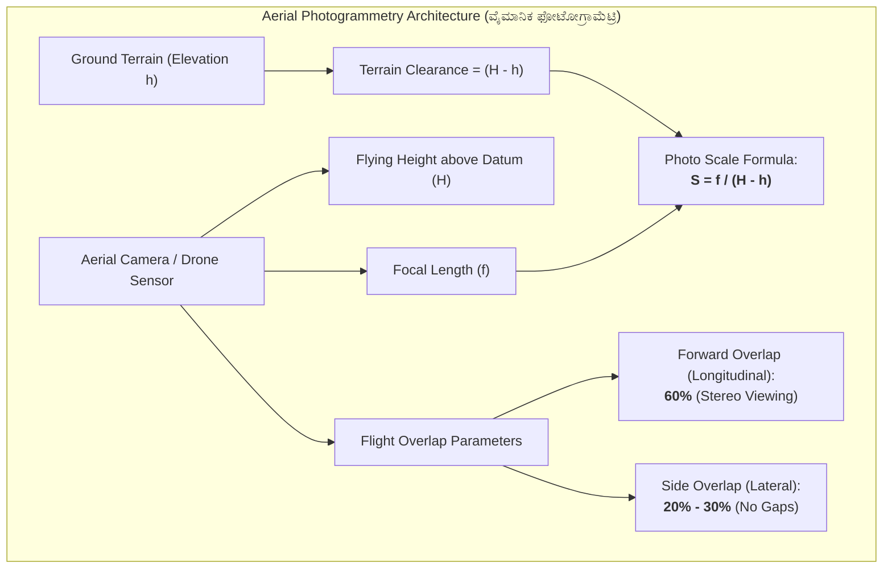
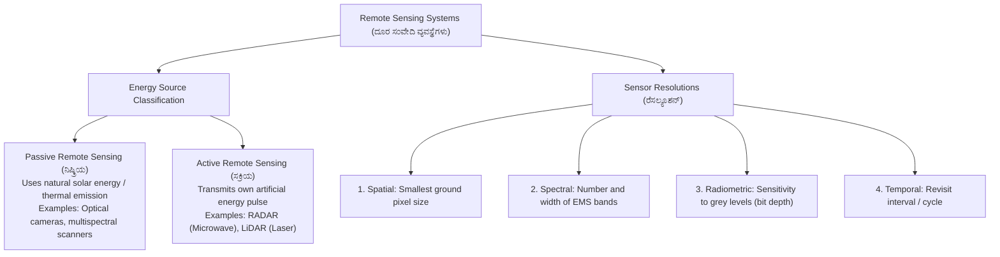
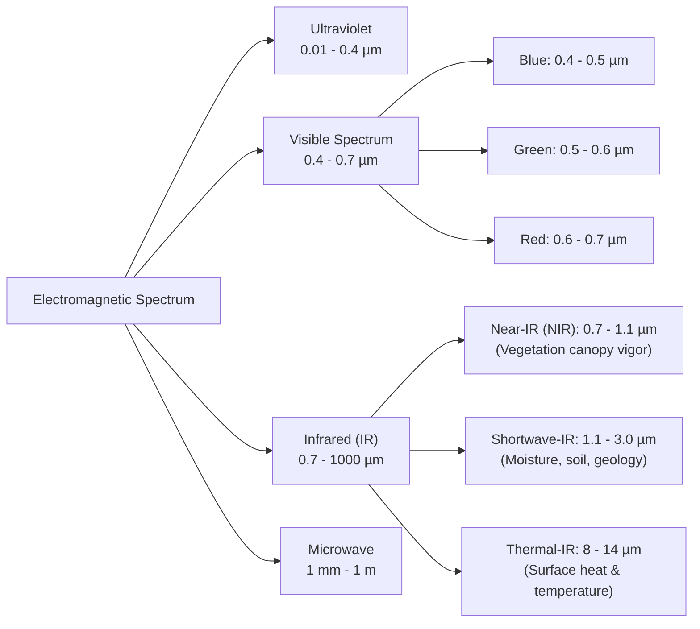
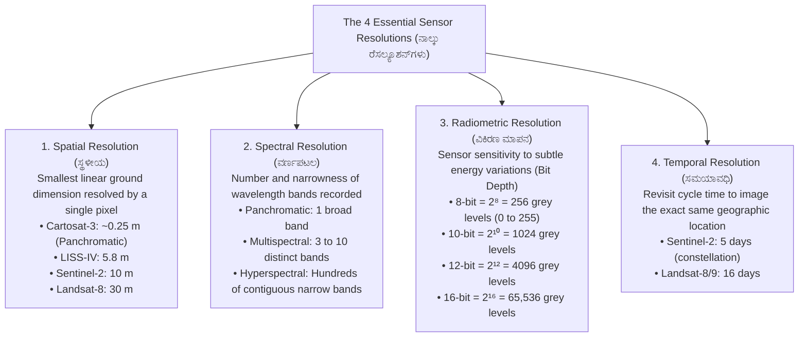

# 03. Modern Surveying: Photogrammetry & Remote Sensing (ಫೋಟೋಗ್ರಾಮೆಟ್ರಿ ಮತ್ತು ದೂರ ಸಂವೇದಿ)

> [!IMPORTANT] Exam Focus & Mark Potential
> - **Expected Weightage:** **10–12 Questions** in Paper-II (Half of the 20-mark Modern Methods of Surveying section).
> - **Direct Syllabus Coverage:** `[P2-SURV-3.1]` & `[P2-SURV-3.2]` — Photogrammetry principles, aerial survey scale formula ($S = \frac{f}{H - h}$), flight overlaps (60% forward, 20–30% side), relief displacement ($d = \frac{rh}{H}$), active vs passive remote sensing, electromagnetic spectrum, spectral reflectance of vegetation/soil/water, and the 4 sensor resolutions.
> - **High-Frequency Formulas:**
>   - Scale of Vertical Aerial Photo: $\mathbf{S = \frac{f}{H - h}}$.
>   - Relief Displacement: $\mathbf{d = \frac{r \cdot h}{H}}$ (directed radially outward from principal point).
>   - Normalized Difference Vegetation Index: $\mathbf{\text{NDVI} = \frac{\text{NIR} - \text{Red}}{\text{NIR} + \text{Red}}}$.
>   - Radiometric Levels: $\mathbf{2^n}$ (where $n$ is bit depth: 8-bit = 256 levels, 12-bit = 4096 levels).

---

## 1. Principles of Photogrammetry & Aerial Survey (`P2-SURV-3.1`)



### Explanation of Photogrammetric Geometric Architecture
Photogrammetry is the science and art of obtaining reliable physical measurements and 3D terrain models through aerial photographs or drone imagery. The geometric scale of a vertical photograph is governed by the ratio of camera focal length ($f$) to the camera's height above the terrain ($H - h$). Overlaps are mandatory: forward overlap (60%) ensures that every ground point appears in at least two successive exposures for 3D stereoscopic depth perception, while side overlap (20–30%) prevents data gaps between parallel flight strips.

---

### Key Photogrammetric Terms & Geometric Definitions

| Technical Term | Kannada Equivalent | Precise Definition & Exam Role |
| :--- | :--- | :--- |
| **Principal Point ($P$)** | ಪ್ರಧಾನ ಬಿಂದು | The point where the camera optical axis intersects the photograph plane. Determined by intersecting opposing fiducial marks. |
| **Nadir Point ($N$)** | ಅಧೋಬಿಂದು / ನಾಡಿರ್ | The point vertically beneath the camera center on the photograph where plumb line intersects. In truly vertical photos, Nadir = Principal Point. |
| **Isocenter ($I$)** | ಐಸೋಸೆಂಟರ್ | The point on the photo halfway between the Principal Point and Nadir. Relief displacement is radial from Nadir; tilt displacement is radial from Isocenter. |
| **Fiducial Marks** | ಸೂಚಕ ಗುರುತುಗಳು | 4 or 8 precision index marks etched on the camera frame edge or corners, used to locate the principal point and calibrate film shrinkage. |
| **Forward Overlap (Longitudinal)** | ಮುಂಬದಿಯ ಅತಿಕ್ರಮಣ | **60%** (minimum 55%, maximum 65%). Required for stereoscopic 3D parallax reconstruction. |
| **Side Overlap (Lateral)** | ಪಾರ್ಶ್ವ ಅತಿಕ್ರಮಣ | **20% to 30%** (standard 25%). Prevents coverage gaps caused by aircraft drift or yaw. |
| **Stereoscopy** | ತ್ರಿමාණ ದೃಷ್ಟಿ | The science of viewing two overlapping photographs through a stereoscope (lens or mirror type) to perceive a realistic 3D optical model of terrain. |

---

### Scale of a Vertical Aerial Photograph
For a truly vertical photograph taken with a camera of focal length $f$ at flying height $H$ above Mean Sea Level (MSL):
- Scale at a point of ground elevation $h$:
  $$\mathbf{S = \frac{f}{H - h}}$$
- Scale for flat terrain at datum level ($h = 0$):
  $$\mathbf{S_0 = \frac{f}{H}}$$
- Average Scale over terrain with average elevation $h_{\text{avg}}$:
  $$\mathbf{S_{\text{avg}} = \frac{f}{H - h_{\text{avg}}}}$$

> [!EXAMPLE] Scale Calculation
> A vertical aerial photo is taken with a camera of focal length $f = 152\text{ mm}$ ($0.152\text{ m}$) from a flying altitude $H = 1800\text{ m}$ above MSL. The ground elevation of point $A$ is $h = 280\text{ m}$.
> $$S = \frac{0.152}{1800 - 280} = \frac{0.152}{1520} = \frac{1}{10000} \implies \mathbf{1:10000}$$

---

### Relief Displacement ($d$) on a Vertical Photograph
Relief displacement is the geometric shift in the position of an elevated ground feature on a photograph due to its terrain height above or below datum.
$$\mathbf{d = \frac{r \cdot h}{H}} \quad \implies \quad \mathbf{h = \frac{d \cdot H}{r}}$$
Where:
- $d =$ relief displacement measured on the photograph (distance between photo top and base).
- $r =$ radial distance from the principal point to the top of the image.
- $h =$ height of the object or terrain point.
- $H =$ flying height above the base datum.

> [!IMPORTANT] Core Laws of Relief Displacement
> 1. Relief displacement is **always radial from the principal point** (nadir point) in a vertical photograph.
> 2. Relief displacement is **zero at the principal point** ($r = 0$).
> 3. Relief displacement **increases linearly with increasing radial distance** ($r$) toward the photograph edges.
> 4. Relief displacement is directly proportional to object height ($h$) and inversely proportional to flying height ($H$).

---

## 2. Remote Sensing Principles (`P2-SURV-3.2`)



### Explanation of Remote Sensing Fundamentals
Remote sensing is the acquisition of qualitative and quantitative information about an object or phenomenon on Earth's surface without physical contact. The sensor records electromagnetic energy that is either reflected (solar energy by day) or emitted (thermal infrared day/night) by surface materials. Active sensors (such as LiDAR and RADAR) carry their own illumination source, functioning day and night and penetrating cloud cover, making them indispensable for modern cadastral surveying and Digital Elevation Model (DEM) generation.

---

### Active vs. Passive Remote Sensing Comparison

| Parameter | Passive Remote Sensing (ನಿಷ್ಕ್ರಿಯ) | Active Remote Sensing (ಸಕ್ರಿಯ) |
| :--- | :--- | :--- |
| **Energy Source** | External / Natural (Sun, Earth's thermal emission) | Internal / Self-generated sensor pulses |
| **Operating Conditions** | Daylight dependent (Optical); Day/Night (Thermal only) | All-weather, Day & Night operation |
| **Weather Dependency** | Blocked by thick clouds, haze, rain, and fog | Microwaves & Radar penetrate clouds, fog, and light rain |
| **Wavelength Bands Used** | Visible (0.4–0.7 $\mu m$), NIR, SWIR, Thermal IR | Microwave (Radar: 1 mm – 1 m), Laser (LiDAR: UV/Visible/NIR) |
| **Primary Examples** | Landsat, Sentinel-2, IRS LISS-IV, Cartosat optical | Sentinel-1 (SAR), RISAT-1, Airborne LiDAR, Sonar |

---

### The Electromagnetic Spectrum (EMS) in Remote Sensing



### Explanation of Spectral Windows
The Earth's atmosphere absorbs specific wavelengths due to water vapor, carbon dioxide, and ozone. Remote sensing sensors operate exclusively within **Atmospheric Windows**—spectral bands where the atmosphere is transparent and allows electromagnetic radiation to pass freely without severe attenuation.

---

### Spectral Reflectance Curves (Vegetation, Soil, Water)

```
Reflectance (%)
  80 │                     ┌─────────┐ (NIR Plateau: 40-60%)
  60 │                     │         │
  40 │               ┌─────┘         └─────────┐ (SWIR)
  20 │       /\      │                         │
   0 └───┴───┴───┴───┴───┴───┴───┴───┴───┴───┴───┴──── Wavelength (µm)
       0.4  0.5 0.6 0.7 0.8 0.9 1.0 1.2 1.4 1.6
      (Blue)(Grn)(Red)  (---- NIR ----)  (SWIR)
```

1. **Healthy Green Vegetation (ಹಸಿರು ಸಸ್ಯವರ್ಗ):**
   - **Visible Spectrum:** Strong absorption in **Blue ($0.45\mu m$)** and **Red ($0.65\mu m$)** by chlorophyll pigments for photosynthesis. Peak reflection occurs in **Green ($0.55\mu m$)**, which is why healthy foliage appears green.
   - **Near-Infrared (NIR, $0.7 - 1.1\mu m$):** Extremely **high reflectance (40% to 60%)** caused by the internal cellular structure (spongy mesophyll) of healthy leaves.
   - **Normalized Difference Vegetation Index (NDVI):**
     $$\mathbf{\text{NDVI} = \frac{\text{NIR} - \text{Red}}{\text{NIR} + \text{Red}}}$$
     - Dense, healthy vegetation: $+0.5 \text{ to } +0.85$
     - Sparse / stressed vegetation: $+0.1 \text{ to } +0.3$
     - Bare soil / rock: $0.0 \text{ to } +0.1$
     - Clear deep water / snow: **Negative values ($-0.5 \text{ to } -0.1$)**

2. **Soil (ಮಣ್ಣು):**
   - Reflectance steadily increases from visible to SWIR wavelengths.
   - **Moisture Impact:** High soil moisture causes strong absorption and darkens soil (lowers reflectance across all bands).

3. **Clear Water (ಸ್ವಚ್ಛ ನೀರು):**
   - Moderate reflectance in blue-green ($0.4 - 0.55\mu m$).
   - **Almost complete absorption in the Near-Infrared (NIR) and SWIR regions.** Water bodies appear jet-black or dark blue in standard False Color Composites (FCC).

---

### The Four Sensor Resolutions



---

## 3. Authentic Verbatim PYQs & High-Yield Questions

> [!NOTE] Verbatim Previous Year Questions (KEA / KPSC Modern Surveying)
>
> **Q1. [KEA Land Surveyor PYQ]** In standard aerial photogrammetry for topographic and cadastral surveying, the recommended forward (longitudinal) overlap and side (lateral) overlap are respectively:
> - (A) 30% and 60%
> - (B) 60% and 20% to 30%
> - (C) 50% and 50%
> - (D) 80% and 10%
>
> *Answer:* **(B) 60% and 20% to 30%**
> *Explanation:* Forward overlap is maintained at 60% to ensure stereoscopic 3D coverage of adjacent exposures. Lateral side overlap is maintained between 20% and 30% to prevent gaps between adjacent flight strips.
>
> ---
>
> **Q2. [KPSC PWD / Surveyor PYQ]** In a truly vertical aerial photograph, relief displacement of an elevated tower or point is:
> - (A) Radial from the nadir / principal point
> - (B) Tangential to the flight line
> - (C) Parallel to the flight direction
> - (D) Zero at the edges of the photograph
>
> *Answer:* **(A) Radial from the nadir / principal point**
> *Explanation:* Relief displacement $d = \frac{rh}{H}$ is always directed radially away from the principal point (which coincides with nadir in vertical photos). It is zero at the principal point and maximum at the perimeter.
>
> ---
>
> **Q3. [KEA Land Surveyor PYQ]** Which of the following is an example of an **Active Remote Sensing** sensor?
> - (A) Multispectral optical camera
> - (B) Thermal Infrared Radiometer
> - (C) Light Detection and Ranging (LiDAR)
> - (D) Return Beam Vidicon (RBV)
>
> *Answer:* **(C) Light Detection and Ranging (LiDAR)**
> *Explanation:* LiDAR transmits its own laser light pulses to calculate distance and ground elevation, making it an active sensor. Optical and thermal radiometers rely on solar illumination or emitted heat and are passive.
>
> ---
>
> **Q4. [KPSC Technical Officer PYQ]** The Normalized Difference Vegetation Index (NDVI) is mathematically computed using which two spectral bands?
> - (A) Blue and Red
> - (B) Near-Infrared (NIR) and Red
> - (C) Thermal Infrared and Green
> - (D) Green and Blue
>
> *Answer:* **(B) Near-Infrared (NIR) and Red**
> *Explanation:* $\text{NDVI} = \frac{\text{NIR} - \text{Red}}{\text{NIR} + \text{Red}}$. Chlorophyll absorbs Red light while healthy spongy mesophyll reflects NIR strongly.
>
> ---
>
> **Q5. [KPSC / KEA Surveyor PYQ]** An optical sensor with a 12-bit radiometric resolution can record how many distinct digital grey level values?
> - (A) 256
> - (B) 1024
> - (C) 4096
> - (D) 65536
>
> *Answer:* **(C) 4096**
> *Explanation:* Radiometric levels $= 2^{\text{bits}} = 2^{12} = 4096$ levels (ranging from 0 to 4095).

---

## 4. Quick Revision Box (ಕಡ್ಡಾಯವಾಗಿ ನೆನಪಿಡಬೇಕಾದ ಮುಖ್ಯಾಂಶಗಳು)

```markdown
┌─────────────────────────────────────────────────────────────────────────────┐
│                    PHOTOGRAMMETRY & REMOTE SENSING CHEAT SHEET              │
├─────────────────────────────────────────────────────────────────────────────┤
│ 1. Photo Scale: S = f / (H - h). (f = focal length, H = altitude, h = elev).│
│ 2. Overlaps: Forward (Longitudinal) = 60%; Side (Lateral) = 20% to 30%.     │
│ 3. Relief Displacement: d = (r · h) / H. (Radial outward from principal pt). │
│ 4. Fiducial Marks: Etched marks used to locate Principal Point.             │
│ 5. Active RS: Own pulse (LiDAR, RADAR). Passive RS: Sun/Earth (Optical, TIR).│
│ 6. Atmospheric Windows: Spectral bands where atmosphere does NOT absorb EMS.│
│ 7. NDVI = (NIR - Red) / (NIR + Red). Clear water = Negative; Dense Crop > 0.5│
│ 8. Vegetation reflects GREEN in visible and peaks in NIR (spongy mesophyll).│
│ 9. Water absorbs NIR completely (appears black on False Color Composites). │
│ 10. Sensor Resolutions:                                                     │
│     • Spatial: Pixel ground size (Cartosat-3: 0.25 m)                       │
│     • Spectral: Number/narrowness of EMS bands                              │
│     • Radiometric: Bit depth (8-bit: 256; 12-bit: 4096 grey levels)         │
│     • Temporal: Revisit interval (Sentinel-2: 5 days)                       │
└─────────────────────────────────────────────────────────────────────────────┘
```
