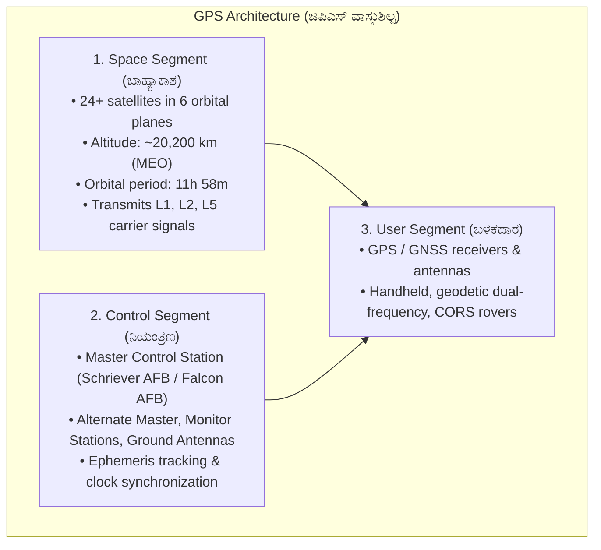
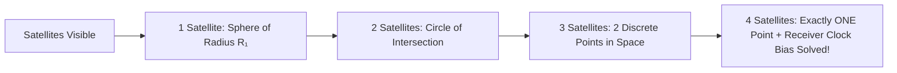
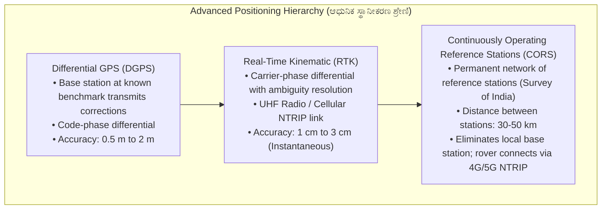
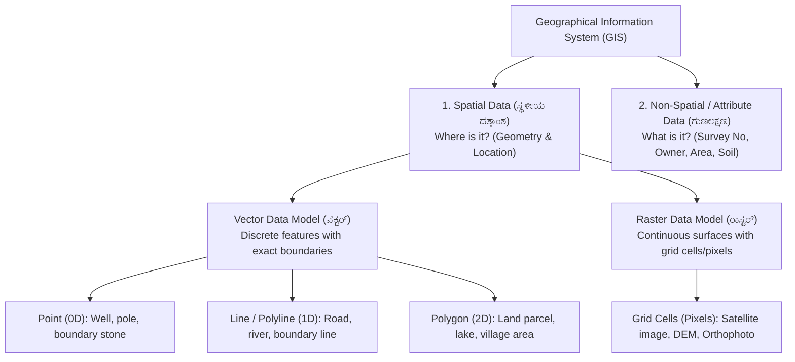
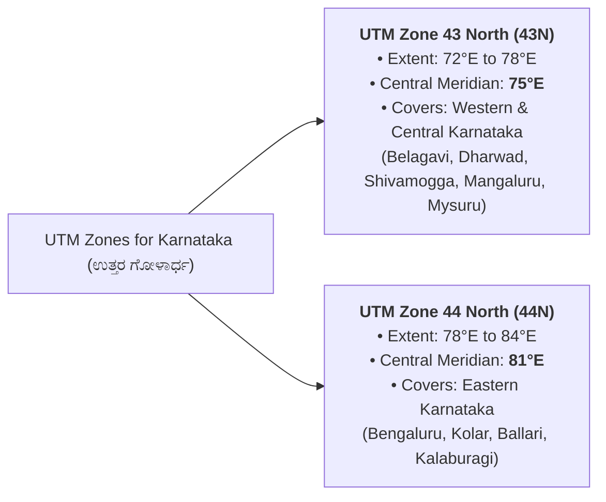

# 04. Modern Surveying: GPS, GIS & Advanced Positioning (ಜಿಪಿಎಸ್, ಜಿಐಎಸ್ ಮತ್ತು ಆಧುನಿಕ ಸ್ಥಾನೀಕರಣ)

> [!IMPORTANT] Exam Focus & Mark Potential
> - **Expected Weightage:** **10–12 Questions** in Paper-II (Second half of the 20-mark Modern Methods of Surveying section).
> - **Direct Syllabus Coverage:** `[P2-SURV-3.3]`, `[P2-SURV-3.4]`, & `[P2-SURV-3.5]` — GPS 3-segment architecture, trilateration, 4 satellites minimum for 3D fix, Dilution of Precision (DOP), GNSS constellations (NavIC / IRNSS, GPS, GLONASS, Galileo, BeiDou), DGPS, RTK, CORS network in Karnataka, SVAMITVA drone scheme, GIS data models (Vector vs Raster), and UTM map projection (Karnataka in Zones 43N & 44N).
> - **High-Frequency Formulas & Rules:**
>   - Minimum Satellites for 3D Positioning: **4 Satellites** ($X, Y, Z$ and receiver clock bias $\Delta t$).
>   - Ranging Equation: $\mathbf{\rho = c \cdot \Delta t}$ ($c \approx 3 \times 10^8\text{ m/s}$).
>   - Dilution of Precision: Lower value = superior satellite geometry ($\text{PDOP} < 3$ excellent, $> 6$ poor).
>   - UTM Zones for Karnataka: **Zone 43N** ($72^\circ\text{E}$ to $78^\circ\text{E}$, Central Meridian $75^\circ\text{E}$) and **Zone 44N** ($78^\circ\text{E}$ to $84^\circ\text{E}$, Central Meridian $81^\circ\text{E}$).

---

## 1. Global Positioning System (GPS) Architecture & Working (`P2-SURV-3.3`)



### Explanation of GPS Tri-Segment Architecture
The Global Positioning System (NAVSTAR) functions through three synchronized segments. The **Space Segment** consists of a nominal constellation of 24 operational satellites inclined at $55^\circ$ across 6 orbital planes at Medium Earth Orbit (MEO ~20,200 km). The **Control Segment** continuously monitors orbital telemetry, calculates atmospheric delays, and uploads ephemeris corrections. The **User Segment** comprises field receivers that process satellite radio signals to determine precise coordinates on the WGS-84 reference ellipsoid.

---

### Trilateration & Minimum Satellite Requirement
Positioning is achieved by **trilateration** (measuring distances from known satellite orbital positions):
$$\text{Pseudorange } (\rho) = c \cdot (t_{\text{receive}} - t_{\text{transmit}})$$
Where $c$ is the speed of light ($3 \times 10^8\text{ m/s}$).



> [!IMPORTANT] The Golden Rule of 4 Satellites
> To compute a definitive **3D position (Latitude, Longitude, Ellipsoidal Height / X, Y, Z)**, a receiver requires signals from a **minimum of 4 satellites simultaneously**.
> - 3 satellites solve for the three spatial unknowns $(X, Y, Z)$.
> - The 4th satellite is strictly required to eliminate **receiver clock bias** ($\Delta t$), since inexpensive quartz clocks in receivers cannot match atomic clocks on board satellites.

---

### Geometric Dilution of Precision (GDOP)
Dilution of Precision (DOP) is a dimensionless multiplier reflecting the quality of satellite geometry visible to the receiver antenna:
- **GDOP (Geometric DOP):** Overall uncertainty including 3D position and time.
- **PDOP (Position DOP):** Uncertainty in 3D position ($X, Y, Z$). $\text{PDOP} = \sqrt{\text{HDOP}^2 + \text{VDOP}^2}$.
- **HDOP (Horizontal DOP):** Uncertainty in horizontal plane (Latitude & Longitude). Vital for cadastral boundary surveys.
- **VDOP (Vertical DOP):** Uncertainty in elevation (always higher than HDOP due to satellites being only overhead, never below the ground).

| DOP Value Range | Rating for Surveying | Practical Survey Action |
| :---: | :---: | :--- |
| **1 – 2** | **Ideal / Excellent** | Highest precision; ideal for cadastral boundary & baseline work |
| **2 – 4** | **Good** | Standard threshold for DGPS/RTK field survey |
| **4 – 6** | **Moderate** | Acceptable for reconnaissance only |
| **> 6** | **Poor** | Unacceptable; pause survey until satellite geometry improves |

---

### Global & Regional GNSS Constellations

| Constellation Name | Operating Country / Agency | Operational Satellites | Orbital Altitude | Coverage Type |
| :--- | :--- | :---: | :---: | :--- |
| **NAVSTAR GPS** | United States (DoD) | 24+ (MEO) | ~20,200 km | Global |
| **GLONASS** | Russia (Roscosmos) | 24 (MEO) | ~19,100 km | Global |
| **Galileo** | European Union (ESA) | 24+ (MEO) | ~23,222 km | Global (Civilian operated) |
| **BeiDou (BDS-3)** | China (CNSA) | 35 (GEO/IGSO/MEO) | Hybrid | Global |
| **NavIC (IRNSS)** | **India (ISRO)** | **7–8 Satellites** | ~36,000 km | **Regional:** India + 1500 km boundary |
| **QZSS (Michibiki)** | Japan (JAXA) | 4 (Quasi-Zenith) | Hybrid | Regional (Asia-Oceania) |

> [!TIP] NavIC (Navigation with Indian Constellation / IRNSS) Exam Facts
> - Developed independently by **ISRO**.
> - Constellation consists of **7 active satellites**: **3 in Geostationary Orbit (GEO)** at $32.5^\circ\text{E}, 83^\circ\text{E}, 129.5^\circ\text{E}$, and **4 in Geosynchronous Orbit (GSO)** inclined at $29^\circ$.
> - Operating Frequencies: **L5 band (1176.45 MHz)** and **S band (2492.028 MHz)**.
> - Service Area: Entire Indian landmass plus a buffer extending **1500 km beyond India's international borders**.

---

## 2. Advanced Positioning: DGPS, RTK & CORS Network (`P2-SURV-3.4`)



### Explanation of Kinematic Surveying Evolution
Standard standalone GPS yields horizontal accuracy of 3–5 meters due to ionospheric, tropospheric, and orbital clock errors. **DGPS** cancels atmospheric errors common to nearby receivers, improving accuracy to sub-meter levels. **RTK** measures carrier wavelengths ($\approx 19\text{ cm}$ for L1), resolving integer ambiguities in real time to reach survey-grade 1-to-2 centimeter precision. **CORS networks** (established across Karnataka by Survey of India and the SSLR Department) provide permanent state-wide NTRIP correction streams, enabling a single surveyor with a rover to achieve instant centimeter-accurate cadastral measurements without setting up an independent base station.

---

### The SVAMITVA Scheme & Drone Surveying in Land Records
- **Acronym:** **SVAMITVA** = *Survey of Villages and Mapping with Improvised Technology in Village Areas*.
- **Implementing Nodal Ministry:** Ministry of Panchayati Raj, Government of India, along with State Revenue/SSLR Departments and Survey of India.
- **Technology Stack:** High-resolution drone cameras combined with CORS network ground control points.
- **Deliverable:** Large-scale digital property maps (**Scale 1:500**) for rural inhabited areas (*Abadi* / ಗ್ರಾಮಠಾಣಾ) and generation of legal Property Ownership Cards (**Aasti Card / E-Swathu**).

---

## 3. Geographical Information System (GIS) Architecture (`P2-SURV-3.5`)



### Explanation of Spatial vs. Attribute Data
GIS couples geometric location with descriptive database tables:
1. **Spatial Data (ಸ್ಥಳೀಯ ದತ್ತಾಂಶ):** Stores geographic coordinates $(X, Y, Z)$ defining spatial location and geometry.
2. **Attribute Data (ಅಸ್ಥಳೀಯ / ಗುಣಲಕ್ಷಣ ದತ್ತಾಂಶ):** Tabular alphanumeric details linked to spatial features by unique identifiers (e.g., Survey Number, Hissa Number, Owner Name, Land Classification, Revenue Assessment).

---

### Vector vs. Raster Data Model Comparison

| Feature / Criteria | Vector Data Model (ವೆಕ್ಟರ್ ಮಾದರಿ) | Raster Data Model (ರಾಸ್ಟರ್ ಮಾದರಿ) |
| :--- | :--- | :--- |
| **Basic Unit** | Coordinates: Points $(x, y)$, Lines, Polygons | Regular grid cells / Pixels |
| **Geometry Representation** | Discrete boundaries with exact coordinates | Continuous pixel matrix (row, column) |
| **Cadastral Suitability** | **Highest:** Ideal for legal parcel boundaries & plots | Poor for sharp boundaries (suffers from pixelation) |
| **Data Storage Size** | Compact / Low file size | Large file size (increases with finer resolution) |
| **Topology Support** | Full topological relationships (adjacency, connectivity) | Implicit neighborhood adjacency |
| **Examples** | Mojini digital cadastre shapefiles, road centerlines | Drone orthomosaics, Cartosat DEM, satellite images |

---

### Map Projections & UTM Zones for Karnataka
- **Geographic Coordinate System (GCS):** 3D spherical coordinates measured in angular degrees, minutes, seconds ($\text{Latitude } \phi, \text{Longitude } \lambda$) on the **WGS-84** reference ellipsoid.
- **Universal Transverse Mercator (UTM):** A conformal cylindrical projection dividing the Earth into **60 longitudinal zones**, each spanning **$6^\circ$ of longitude** (numbered 1 to 60 from $180^\circ\text{W}$ eastward).



> [!IMPORTANT] UTM False Coordinates
> To eliminate negative coordinates in calculation:
> - **False Easting:** **$500,000\text{ m}$** assigned to the Central Meridian.
> - **False Northing (Northern Hemisphere):** **$0\text{ m}$** at the Equator.

---

## 4. Authentic Verbatim PYQs & High-Yield Questions

> [!NOTE] Verbatim Previous Year Questions (KEA / KPSC GNSS & GIS)
>
> **Q1. [KEA Land Surveyor PYQ]** What is the minimum number of satellites required by a GPS receiver to accurately determine a three-dimensional position (Latitude, Longitude, Altitude) and correct receiver clock bias?
> - (A) 2
> - (B) 3
> - (C) 4
> - (D) 5
>
> *Answer:* **(C) 4**
> *Explanation:* 3 satellites determine $(X, Y, Z)$ spatial coordinates via trilateration, while the 4th satellite is mathematically required to resolve receiver clock bias $\Delta t$.
>
> ---
>
> **Q2. [KPSC PWD / Surveyor PYQ]** In satellite surveying, a lower value of PDOP (Position Dilution of Precision) signifies:
> - (A) Poorer satellite geometry and lower accuracy
> - (B) Better satellite geometry and higher positioning accuracy
> - (C) High atmospheric attenuation
> - (D) Low satellite elevation angles
>
> *Answer:* **(B) Better satellite geometry and higher positioning accuracy**
> *Explanation:* PDOP is inversely proportional to geometric accuracy. Values $< 3$ indicate widely spaced satellites providing sharp intersection angles and high accuracy.
>
> ---
>
> **Q3. [KEA Land Surveyor PYQ]** NavIC (IRNSS), India's indigenous satellite navigation system developed by ISRO, consists of how many operational satellites in its primary constellation?
> - (A) 24 satellites
> - (B) 12 satellites
> - (C) 7 satellites
> - (D) 3 satellites
>
> *Answer:* **(C) 7 satellites**
> *Explanation:* The primary operational NavIC space segment consists of 7 satellites: 3 in Geostationary Orbit (GEO) and 4 in inclined Geosynchronous Orbit (GSO).
>
> ---
>
> **Q4. [KPSC Technical Officer PYQ]** In a Geographic Information System (GIS), land parcel boundaries and property ownership plots are most accurately represented using which data model?
> - (A) Raster Data Model (Grid cells)
> - (B) Vector Data Model (Polygons)
> - (C) Triangular Irregular Network (TIN) only
> - (D) Digital Elevation Model (DEM)
>
> *Answer:* **(B) Vector Data Model (Polygons)**
> *Explanation:* The Vector model uses exact coordinate vertices to define closed area polygons, preserving precise legal boundary definitions without the discretization errors of raster cells.
>
> ---
>
> **Q5. [KEA Land Surveyor PYQ]** The state of Karnataka spans across which of the following Universal Transverse Mercator (UTM) zones?
> - (A) Zone 41N and 42N
> - (B) Zone 43N and 44N
> - (C) Zone 45N and 46N
> - (D) Zone 47N and 48N
>
> *Answer:* **(B) Zone 43N and 44N**
> *Explanation:* Karnataka lies between longitudes $74^\circ\text{E}$ and $78.5^\circ\text{E}$. Zone 43N ($72^\circ - 78^\circ\text{E}$) covers Western/Central Karnataka, and Zone 44N ($78^\circ - 84^\circ\text{E}$) covers Eastern Karnataka.

---

## 5. Quick Revision Box (ಕಡ್ಡಾಯವಾಗಿ ನೆನಪಿಡಬೇಕಾದ ಮುಖ್ಯಾಂಶಗಳು)

```markdown
┌─────────────────────────────────────────────────────────────────────────────┐
│                       GNSS, ADVANCED SURVEYING & GIS CHEAT SHEET            │
├─────────────────────────────────────────────────────────────────────────────┤
│ 1. GPS 3 Segments: Space (24+ MEO sats), Control (Master station), User.    │
│ 2. Minimum Satellites: 4 sats for 3D fix (X, Y, Z + clock bias Δt).        │
│ 3. PDOP Quality: < 3 Excellent, 3-6 Acceptable, > 6 Reject survey.         │
│ 4. NavIC (IRNSS): 7 sats (3 GEO + 4 GSO), ISRO, coverage India + 1500 km.   │
│ 5. Global GNSS: GPS (USA), GLONASS (Russia), Galileo (EU), BeiDou (China).  │
│ 6. RTK Accuracy: 1–2 cm real-time using carrier phase & NTRIP corrections.   │
│ 7. CORS Network: Permanent reference stations (Survey of India / SSLR).     │
│ 8. SVAMITVA: Drone mapping of rural abadi lands at 1:500 scale (Aasti card).│
│ 9. GIS Models: Vector (Points, Lines, Polygons) & Raster (Pixels / Grids). │
│ 10. UTM Zones for Karnataka: Zone 43N (CM 75°E) and Zone 44N (CM 81°E).     │
│ 11. UTM False Easting: 500,000 meters at the Central Meridian.              │
└─────────────────────────────────────────────────────────────────────────────┘
```
