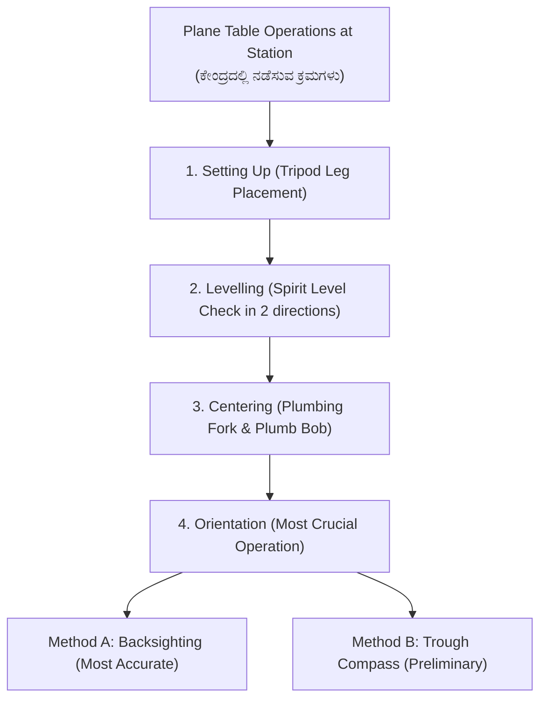
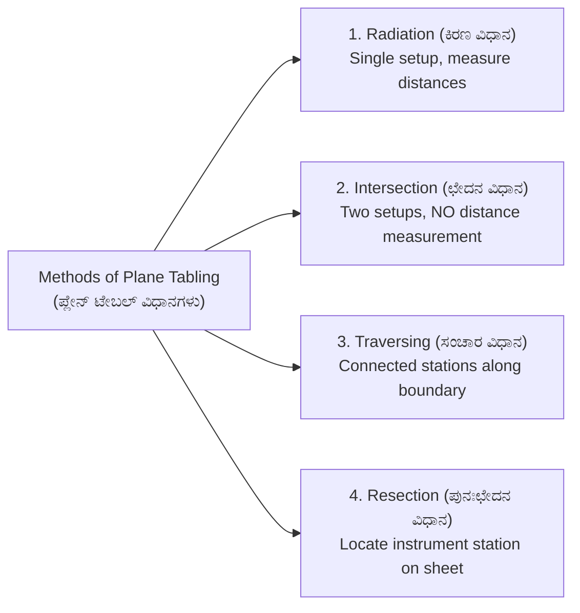
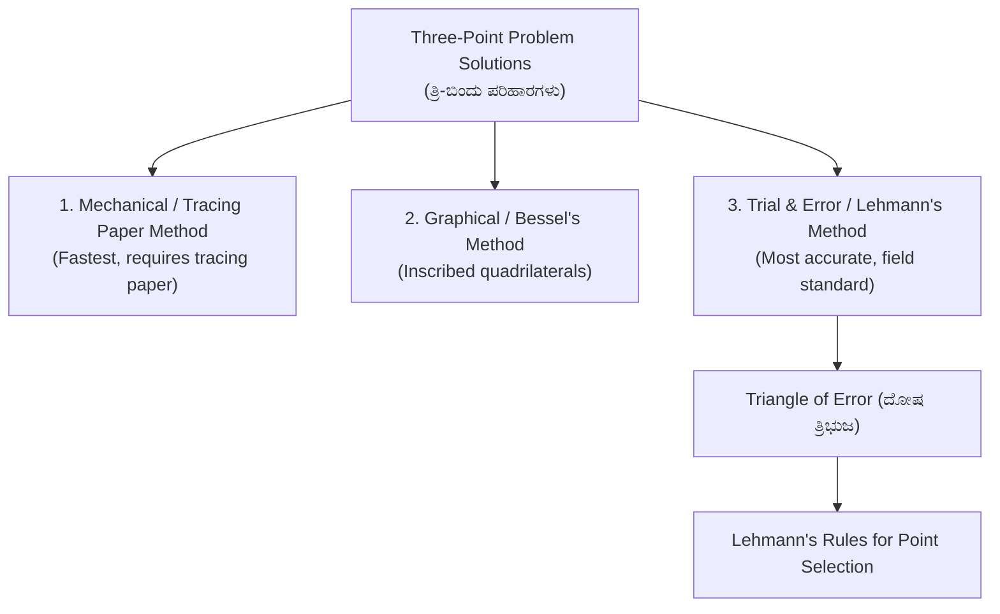

# 04. Plane Table Surveying (ಪ್ಲೇನ್ ಟೇಬಲ್ ಸಮೀಕ್ಷೆ)

> [!IMPORTANT] Exam Focus & Mark Potential
> - **Expected Weightage:** 8–10 Questions in Paper-II.
> - **Core Concepts Tested:** Principle of Parallelism, Plane table accessories and their specific functions, Operational sequence (Levelling $\to$ Centering $\to$ Orientation), Methods of plotting (Radiation, Intersection, Traversing, Resection), and Solutions to the Three-Point Problem (Lehmann's method & Triangle of Error).
> - **Exam Alert:** **Orientation** is the most critical operation; non-parallelism introduces compounding angular displacement across the entire map.

---

## 1. Principles of Plane Table Surveying

Plane Table Surveying is a graphical method of surveying in which fieldwork and plotting are done simultaneously on the drawing sheet. It eliminates the need for maintaining a separate field book and allows direct comparison of the drawn map with physical terrain, making omissions impossible.

### Fundamental Principle: Parallelism (ಸಮಾನಾಂತರ ತತ್ವ)
The fundamental principle of plane table surveying is **Parallelism**. All rays drawn through station points on the sheet must remain parallel to the corresponding physical lines on the ground at every setup.



### Operational Sequence at Every Station
1. **Fixing & Levelling:** The board is mounted at elbow height. A **spirit level** is placed in two mutually perpendicular positions, and the board is tilted until the bubble stays centered in both positions.
2. **Centering:** The pointed arm of the **plumbing fork (U-frame)** rests on the plotted station point on paper, while the plumb bob suspended from the lower arm hangs directly over the ground peg.
3. **Orientation (ದಿಕ್ಸ್ಥಾಪನೆ):** The process of keeping the table at a new station strictly parallel to its position at previous stations.
   - *By Trough Compass:* Quick, but subject to local attraction errors.
   - *By Backsighting:* Highly accurate and immune to magnetic anomalies; sight back along the plotted line joining previous station to current station and clamp board.

---

## 2. Plane Table Accessories & Functions

| Accessory | Construction & Geometry | Specific Function / Exam Point |
| :--- | :--- | :--- |
| **Alidade (ಅಲಿಡೇಡ್)** | Wooden/brass straight edge with beveled **fiducial edge**. Contains sight vane (narrow slit) and object vane (stretched horsehair). | Used for sighting target objects and drawing directional rays along the fiducial edge. |
| **Telescopic Alidade** | Telescope with vertical circle and stadia cross-hairs mounted on an alidade base. | Enables long-range sighting, inclined sights, and stadia distance calculations in hilly terrain. |
| **Trough Compass** | Long narrow brass box with magnetic needle ($0^\circ$ at both ends, swing $\pm 5^\circ$). | Used to mark the Magnetic North direction on the top corner of the drawing sheet. |
| **Plumbing Fork (U-frame)** | Hairpin-shaped metal frame with pointed upper arm and plumb-bob loop on lower arm. | Used for exact centering of the plotted station point over the ground survey peg. |
| **Spirit Level** | Tubular level tube mounted on a flat base. | Used to test the horizontal level of the drawing board. |

---

## 3. Four Methods of Plane Tabling



### Comparative Analysis of Methods

| Method | Field Procedure | Distance Measurement Needed? | Ideal Practical Application |
| :--- | :--- | :---: | :--- |
| **1. Radiation (ಕಿರಣ ವಿಧಾನ)** | Plane table is set at a single central station. Rays are drawn to all surrounding boundary points with the alidade, and ground distances are chained and scaled onto the rays. | **Yes** (Chaining to every point required) | Small, open, flat areas where all boundary points are accessible and visible from one central point. |
| **2. Intersection (ಛೇದನ ವಿಧಾನ)** | Table is set at Station $A$; rays are sighted to objects. Table shifts to Station $B$ (at opposite end of a measured base line $AB$); intersecting rays are sighted to the same objects. Intersection of rays plots point. | **No** (Only base line $AB$ is measured) | Inaccessible points, across rivers, steep hill slopes, broken ground, or locating distant lighthouses/towers. |
| **3. Traversing (ಸಂಚಾರ ವಿಧಾನ)** | Table is set up sequentially at each station of a closed loop or open traverse ($A \to B \to C \to D$). Station distances are measured. | **Yes** (Distance between consecutive stations) | Road, canal, railway route surveys, or large property perimeter surveys. |
| **4. Resection (ಪುನಃಛೇದನ ವಿಧಾನ)** | Determining the unknown position of the station currently occupied by the plane table on the drawing sheet using known plotted stations. | **No** (Angular resection rays) | Establishing new instrument setups from established control stations. |

---

## 4. The Three-Point Problem (ತ್ರಿ-ಬಿಂದು ಸಮಸ್ಯೆ)

**Definition:** Given the plotted locations of three visible ground stations ($a, b, c$ representing physical stations $A, B, C$), determine the location of the plane table station $p$ on the sheet.



### Lehmann's Rules for Solving the Triangle of Error
When the plane table is not correctly oriented, the three resection rays do not intersect at a single point, but form a small **triangle of error**. Lehmann's rules guide the surveyor to converge on the true point $p$:

1. **Ray Distance Proportion Rule:** The distance of the true station point $p$ from each resection ray is directly proportional to the physical ground distance of the corresponding station ($A, B, C$).
2. **Side of Rays Rule:** The true point $p$ lies either **to the right of all three rays** or **to the left of all three rays** when facing the stations; it cannot lie between rays.
3. **Great Triangle Rule:**
   - If the instrument station lies **inside the Great Triangle** formed by stations $ABC$, the true point $p$ lies **inside the triangle of error**.
   - If the station lies **outside the Great Triangle**, the true point $p$ lies **outside the triangle of error**.
4. **Danger Circle / Critical Condition (ಅಪಾಯಕಾರಿ ವೃತ್ತ):**
   - If the three control stations $A, B, C$ and the instrument station $P$ all lie on the circumference of a **common circle (circumcircle)**, the three resection rays will intersect in a point regardless of the table's orientation!
   - Under this condition, the solution is **indeterminate** (impossible to solve). To avoid this, select control stations such that the surveyor's position does not lie on or near the circle passing through $A, B$, and $C$.

---

## 5. High-Yield Mnemonics

> [!NOTE] Memory Aids
> - **Operational Order: "L-C-O"**
>   - **L**evelling $\to$ **C**entering $\to$ **O**rientation. (Always level before centering; orient last before sighting).
> - **Methods without Tape: "Intersection = Inaccessible"**
>   - When you cannot chain to an object across a river, use **Intersection**.
> - **Great Triangle Point Location: "Inside stays Inside, Outside stays Outside"**
>   - Inside $\Delta ABC \implies$ Inside triangle of error.
>   - Outside $\Delta ABC \implies$ Outside triangle of error.

---

## 6. Likely Exam Questions & PYQ Patterns

1. **[KEA Land Surveyor PYQ]** *The primary principle upon which plane table surveying is based is:*
   - **Answer:** Parallelism.
2. **[KEA PYQ]** *Which method of plane tabling is most suitable for surveying inaccessible points or mountainous terrain without chaining distances?*
   - **Answer:** Intersection method (ಛೇದನ ವಿಧಾನ).
3. **[Expected Question]** *In plane tabling, the plumbing fork with a plumb bob is used for:*
   - **Answer:** Accurate centering of the plotted station point on the board over the ground station.
4. **[Expected Question]** *Under what condition does the Three-Point Problem fail to yield a definite solution?*
   - **Answer:** When the instrument station and the three control stations lie on the circumference of the same circle (Danger circle / Critical condition).
5. **[Expected Question]** *The fiducial edge of an alidade is:*
   - **Answer:** The beveled, graduated ruling edge used for drawing directional rays.

---

## 7. Quick Revision Box

```
┌────────────────────────────────────────────────────────────────────────┐
│ PLANE TABLE SURVEYING REVISION CHEAT SHEET                             │
├────────────────────────────────────────────────────────────────────────┤
│ • Governing Principle: Parallelism. Fieldwork & plotting simultaneous. │
│ • Operational Steps: 1. Levelling → 2. Centering → 3. Orientation.     │
│ • Orientation Methods: Trough compass (rough) vs Backsighting (exact). │
│ • Alidade: Ruling along beveled fiducial edge.                         │
│ • Plumbing Fork (U-frame): Station centering over ground peg.          │
│ • Radiation: Measure all rays with tape (flat, open plots).            │
│ • Intersection: Measure base line only (inaccessible targets, rivers). │
│ • Resection: Locates instrument station on paper.                      │
│ • Three-Point Problem Methods: Mechanical, Bessel's, Lehmann's.        │
│ • Danger Circle: Indeterminate when station lies on circumcircle ABC.  │
│ • Triangle of error: p lies inside if station is inside Great Δ ABC.   │
└────────────────────────────────────────────────────────────────────────┘
```

---
*Related Notes:*
- [[01_Chain_Surveying_and_Linear_Measurements]]
- [[02_Compass_Surveying_and_Traversing]]
- [[05_Theodolite_and_Tacheometry]]
