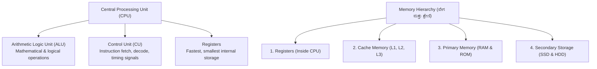
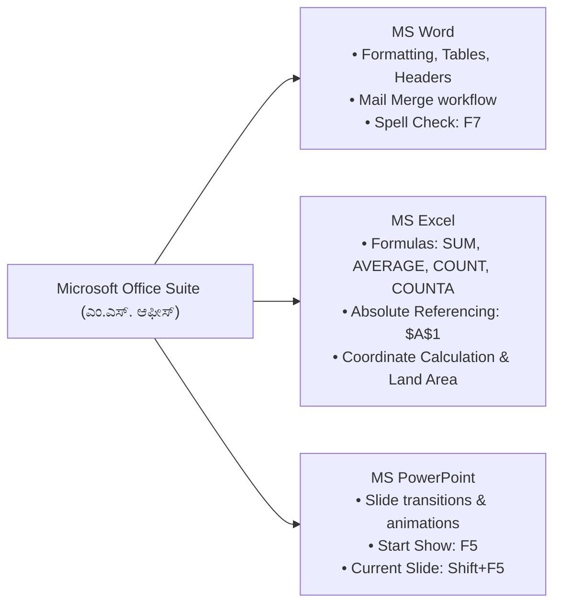
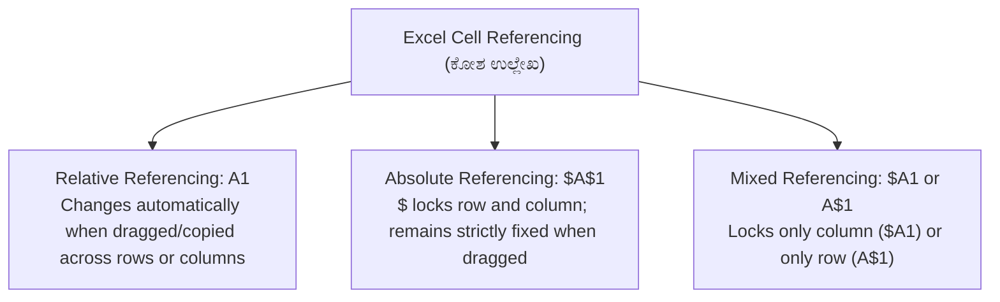
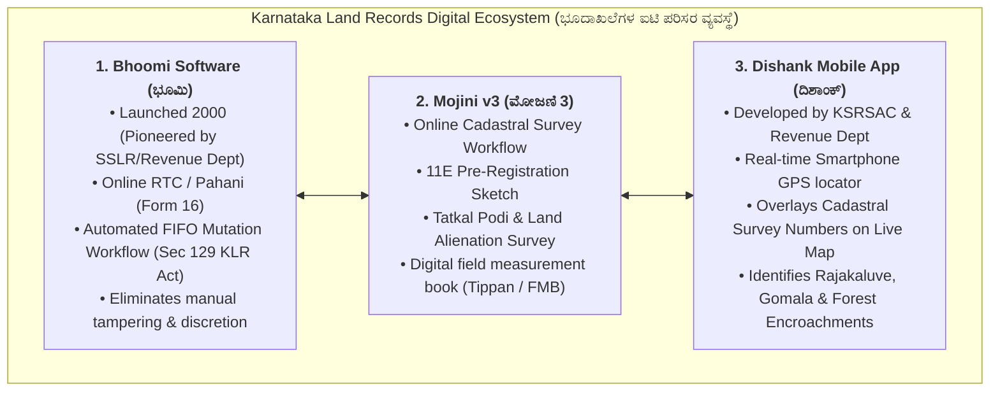
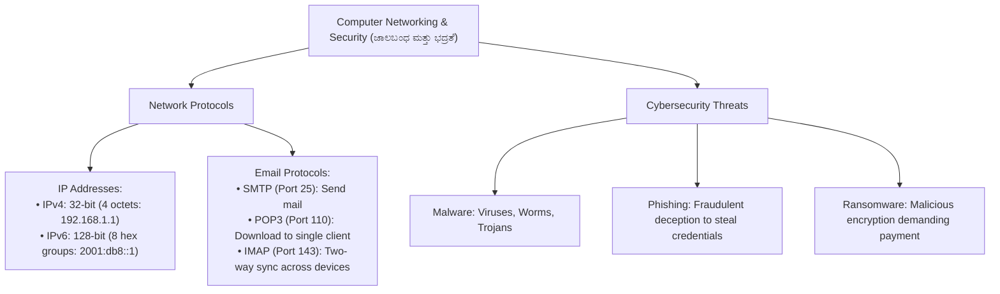

# 05. Computer Applications & Land Records IT (ಗಣಕಯಂತ್ರ ಅನ್ವಯಗಳು ಮತ್ತು ಭೂದಾಖಲೆಗಳ ಐಟಿ)

> [!IMPORTANT] Exam Focus & Mark Potential
> - **Expected Weightage:** **20 Questions (20 Marks)** in Paper-II (Dedicated 20% syllabus section).
> - **Direct Syllabus Coverage:** `[P2-COMP-4.1]` to `[P2-COMP-4.4]` — Computer Architecture & OS, MS Office (Word, Excel formulas/referencing, PowerPoint shortcuts), Karnataka Land Records Software Suite (**Bhoomi**, **Mojini v3**, **Dishank App**), Networking (IPv4 vs IPv6, SMTP/POP3/IMAP), and Cybersecurity fundamentals.
> - **High-Frequency Formulas & Shortcuts:**
>   - Excel Absolute Referencing: $\mathbf{\$A\$1}$ (Locks row and column during fill).
>   - Excel Functions: $\mathbf{=COUNTA()}$ (counts all non-empty cells including text), $\mathbf{=COUNT()}$ (counts numbers only).
>   - PowerPoint Slideshow: **F5** (start from beginning), **Shift + F5** (start from current slide).
>   - IPv4 vs IPv6: **IPv4 = 32 bits** (4 octets); **IPv6 = 128 bits** (8 hexadecimal groups).
>   - Bhoomi Workflow: **FIFO (First-In, First-Out)** principle under **Section 129 of KLR Act 1964**.

---

## 1. Computer Architecture & Operating Systems (`P2-COMP-4.1`)



### Explanation of Memory & Storage Architecture
Computer processing speed is governed by the memory hierarchy. Registers operate at CPU clock speeds, backed by high-speed SRAM cache (L1/L2/L3). **RAM (Random Access Memory)** is volatile working memory where active survey software runs. **ROM (Read Only Memory)** stores non-volatile startup firmware (**BIOS / UEFI**). Solid State Drives (SSD) use flash NAND memory without moving parts, offering significantly faster read/write speeds compared to traditional magnetic Hard Disk Drives (HDD).

---

### Operating Systems & File Formats

| Category | Component / File Extension | Description & Significance in Land Surveying |
| :--- | :--- | :--- |
| **Operating Systems** | Windows, Linux, Android | Manage hardware resources, file management, process scheduling. Linux is open-source based on Unix kernel; Android is mobile OS. |
| **Document Files** | `.docx`, `.pdf`, `.txt` | `.pdf` (Portable Document Format) is the non-editable standard for legal land records, RTC copies, and 11E survey sketches. |
| **Spreadsheet Files** | `.xlsx`, `.csv` | `.csv` (Comma Separated Values) standard format for exporting Total Station & DGPS point coordinates $(N, E, Z)$. |
| **CAD / GIS Formats** | `.dwg`, `.dxf`, `.shp`, `.kml` | `.dwg` (AutoCAD Drawing), `.dxf` (Drawing Exchange Format for boundary plots), `.shp` (ESRI Shapefile for Mojini vector parcels), `.kml` (Keyhole Markup for Google Earth/Dishank). |

---

## 2. Microsoft Office Suite Fundamentals (`P2-COMP-4.2`)



### 1. Microsoft Word
- **Essential Keyboard Shortcuts:**
  - `Ctrl + C` (Copy), `Ctrl + X` (Cut), `Ctrl + V` (Paste), `Ctrl + Z` (Undo), `Ctrl + Y` (Redo).
  - `Ctrl + B` (Bold), `Ctrl + I` (Italic), `Ctrl + U` (Underline), `Ctrl + E` (Center align), `Ctrl + J` (Justify).
  - `Ctrl + F` (Find), `Ctrl + H` (Replace), `Ctrl + K` (Insert Hyperlink).
  - **F7:** Run Spelling and Grammar check.
- **Mail Merge:** Efficient tool to batch-generate personalized legal notices (e.g., Land Survey Notice to adjoining landholders) by linking a master Word template to an Excel database of names and survey numbers.

---

### 2. Microsoft Excel & Formulas



#### High-Yield Excel Formulas for Land Records

| Formula / Function | Exact Syntax | Operational Behavior & Competitive Exam Tip |
| :--- | :--- | :--- |
| **Sum** | `=SUM(A1:A10)` | Adds all numerical values in range $A1$ through $A10$. |
| **Average** | `=AVERAGE(A1:A10)` | Computes arithmetic mean of numeric cells. Ignores empty cells. |
| **Count Numbers** | `=COUNT(A1:A10)` | Counts cells that contain **numbers only**. Ignores text and blank cells. |
| **Count All** | `=COUNTA(A1:A10)` | Counts **all non-empty cells** (cells containing numbers, text, symbols, or errors). |
| **Count Blank** | `=COUNTBLANK(A1:A10)` | Counts completely empty cells in the selected range. |
| **Conditional Logic** | `=IF(condition, val_if_true, val_if_false)` | Returns first value if true, second if false. E.g., `=IF(C2>5, "Large", "Small")`. |
| **Maximum / Minimum** | `=MAX(A1:A10)`, `=MIN(A1:A10)` | Returns highest or lowest numeric value in range. |

---

### 3. Microsoft PowerPoint
- **Slide Transitions vs. Animations:**
  - **Transitions (ವರ್ಗಾವಣೆ):** Visual effects that occur when moving from **one slide to another slide**.
  - **Animations (ಆನಿಮೇಷನ್):** Visual effects applied to individual **objects, text, or shapes within a single slide**.
- **Crucial Slide Show Shortcuts:**
  - **F5:** Starts slide show from the **very first slide (Beginning)**.
  - **Shift + F5:** Starts slide show from the **currently active slide**.
  - **Esc:** Terminates and exits the slide show back to normal editing view.

---

## 3. Land Records Software Solutions of Karnataka (`P2-COMP-4.3`)



### 1. Bhoomi Project (ಭೂಮಿ ತಂತ್ರಾಂಶ)
- **Genesis:** Conceptualized and implemented in Karnataka in **2000–2002**; India’s first large-scale e-governance project for computerized land records management.
- **RTC / Pahani (Record of Rights, Tenancy and Crops):** Governed by **Form 16** under the Karnataka Land Revenue Act, 1964. Contains 16 columns detailing ownership, extent, soil type, irrigation source, crop details, and liabilities/mortgages.
- **First-In, First-Out (FIFO) Mutation Process:**
  - Mutation petitions under **Section 129 of the Karnataka Land Revenue Act, 1964** are strictly processed in the chronological order of submission.
  - Revenue officials cannot pick and choose mutation cases, completely eliminating discretionary delays and bribery.
- **Mutation Workflow:**
  1. Registration of sale/gift deed at Sub-Registrar Office triggers electronic intimation (**J-Slip** / ಕಾವೇರಿ-ಭೂಮಿ ಸಂಯೋಜನೆ).
  2. Notice generation (Form 21) giving 30 days for public objections.
  3. Village Accountant & Revenue Inspector verification.
  4. Final order pass by Shirastedar / Tahsildar.

---

### 2. Mojini v3 (ಮೋಜಣಿ 3 ತಂತ್ರಾಂಶ)
- **Purpose:** A centralized web-enabled workflow application for managing end-to-end cadastral survey requests in Karnataka.
- **Pre-Registration 11E Sketch:**
  - Mandatory requirement for property sale or division involving partial land parcels.
  - A licensed surveyor or government surveyor surveys the physical land parcel and prepares a digitally signed **11E sketch** before the sale deed can be registered.
- **Podi / Phodi (ಪೋಡಿ / ಪೋಡಿ ಮುಕ್ತ ಗ್ರಾಮ):**
  - Process of subdividing joint ownership survey numbers into independent, distinct survey numbers (Hissa numbers) with individual new RTCs.
  - **Tatkal Podi (ತ್ವರಿತ ಪೋಡಿ):** Fast-track scheme for individual farmers to separate land parcels without waiting for whole-village surveys.
- **Online Technical Scrutiny (OTR):** Digital verification of field measurement books (Tippan, Pakka Book, Atlas) against Mojini vector plots to guarantee zero boundary overlaps.

---

### 3. Dishank Mobile Application (ದಿಶಾಂಕ್ ಮೊಬೈಲ್ ಆಪ್)
- **Developers:** Jointly developed by **KSRSAC (Karnataka State Remote Sensing Applications Centre)** and the Revenue Department.
- **Working Principle:** Uses the smartphone’s internal GPS receiver to determine the user's live geographic coordinates (Latitude, Longitude) and displays the corresponding:
  1. Exact **Cadastral Survey Number** and Hissa Number.
  2. **Village, Hobli, and Taluk boundaries**.
  3. Land classification (Private Patta land, Government land, *Gomala*, Forest land, *Rajakaluve* / Stormwater drain, or Lake bed).
- **Primary Public & Surveyor Benefit:** Prevents citizens from purchasing encroached lake beds, government lands, or storm drains by displaying real-time ownership status in the field.

---

## 4. Networking & Cybersecurity Fundamentals (`P2-COMP-4.4`)



### Network Topology & Architecture
- **LAN (Local Area Network):** Covers small geographic area (office, survey room). Uses Ethernet cables or Wi-Fi.
- **WAN (Wide Area Network):** Spans large geographic regions (Internet, Karnataka State Wide Area Network - KSWAN connecting all Taluk survey offices).
- **IP Addressing:**
  - **IPv4:** **32-bit** binary address written as 4 decimal octets separated by dots (e.g., `192.168.1.100`). Range: `0.0.0.0` to `255.255.255.255`.
  - **IPv6:** **128-bit** hexadecimal address developed to overcome IPv4 address exhaustion. Written in 8 groups of 4 hexadecimal digits separated by colons.

---

### Email Protocols & Port Numbers

| Protocol Name | Full Form | Function & Operating Characteristic | Standard Port |
| :--- | :--- | :--- | :---: |
| **SMTP** | Simple Mail Transfer Protocol | Used for **sending / pushing outgoing email** messages from client to server or between mail servers. | **25** (or 587) |
| **POP3** | Post Office Protocol version 3 | Downloads email from server to a single local device and deletes it from server by default. | **110** (or 995 SSL) |
| **IMAP** | Internet Message Access Protocol | Modern two-way synchronization; emails remain on server and sync status across multiple devices (phone, laptop). | **143** (or 993 SSL) |

---

## 5. Authentic Verbatim PYQs & High-Yield Questions

> [!NOTE] Verbatim Previous Year Questions (KEA / KPSC Computer & Land IT)
>
> **Q1. [KEA Land Surveyor PYQ]** In Karnataka, which electronic land records software pioneered the computerized issuance of Record of Rights, Tenancy and Crops (RTC / Pahani) and introduced the FIFO mutation workflow?
> - (A) Mojini
> - (B) Bhoomi
> - (C) Dishank
> - (D) Kaveri
>
> *Answer:* **(B) Bhoomi**
> *Explanation:* The Bhoomi project was launched in Karnataka to computerize 20 million rural land records, issuing tamper-proof RTCs (Form 16) and processing mutations strictly on a First-In, First-Out (FIFO) basis under Section 129 of the KLR Act.
>
> ---
>
> **Q2. [KPSC FDA/SDA Computer PYQ]** In Microsoft Excel, which symbol is used to create an **Absolute Cell Reference** that prevents row and column coordinates from changing when copied?
> - (A) `#`
> - (B) `&`
> - (C) `$`
> - (D) `%`
>
> *Answer:* **(C) `$`**
> *Explanation:* The dollar sign (`$`) locks cell references (e.g., `$A$1` keeps both column A and row 1 constant when dragging formulas).
>
> ---
>
> **Q3. [KEA Land Surveyor PYQ]** What is the mandatory pre-registration digital land survey sketch required in Karnataka for selling a divided portion of agricultural land under the Mojini system?
> - (A) Form 16
> - (B) 11E Sketch
> - (C) Akarband
> - (D) Tippan Copy
>
> *Answer:* **(B) 11E Sketch**
> *Explanation:* Under the Mojini workflow, an 11E sketch prepared by a licensed or government surveyor is legally compulsory prior to the registration of any sale or partition deed dividing a survey number.
>
> ---
>
> **Q4. [KPSC PWD / Surveyor PYQ]** The Dishank mobile application developed by Karnataka State Remote Sensing Applications Centre (KSRSAC) enables citizens to check what information in real-time?
> - (A) Crop market prices (MSP)
> - (B) Exact cadastral survey number and land ownership status at their live GPS location
> - (C) Groundwater borewell drilling permissions
> - (D) Gram Panchayat tax assessment details
>
> *Answer:* **(B) Exact cadastral survey number and land ownership status at their live GPS location**
> *Explanation:* Dishank links the user's smartphone GPS position with digitized cadastral survey maps to immediately display the survey number, village boundary, and whether the land is private patta, government, forest, or rajakaluve.
>
> ---
>
> **Q5. [KEA Land Surveyor PYQ]** What is the address length in bits of an Internet Protocol version 6 (IPv6) address?
> - (A) 32 bits
> - (B) 64 bits
> - (C) 128 bits
> - (D) 256 bits
>
> *Answer:* **(C) 128 bits**
> *Explanation:* IPv4 addresses are 32 bits long (4 octets), whereas IPv6 addresses are 128 bits long (represented as 8 groups of 4 hexadecimal characters).

---

## 6. Quick Revision Box (ಕಡ್ಡಾಯವಾಗಿ ನೆನಪಿಡಬೇಕಾದ ಮುಖ್ಯಾಂಶಗಳು)

```markdown
┌─────────────────────────────────────────────────────────────────────────────┐
│                      COMPUTERS & LAND RECORDS IT CHEAT SHEET                │
├─────────────────────────────────────────────────────────────────────────────┤
│ 1. Bhoomi: Digital RTC / Pahani (Form 16), FIFO mutation (Sec 129 KLR Act). │
│ 2. Mojini v3: Cadastral survey workflow, 11E sketch, Tatkal Podi, Phodi.    │
│ 3. Dishank App: Smartphone GPS locator showing cadastral survey number & type│
│ 4. Kaveri-Bhoomi Link: Online intimation of registered sale deeds (J-Slip). │
│ 5. Excel Shortcuts & Formulas:                                              │
│    • $A$1 = Absolute referencing (locks row & column).                      │
│    • =COUNT() counts numbers; =COUNTA() counts all non-empty cells.         │
│ 6. PowerPoint: F5 = start from beginning; Shift + F5 = start from current.  │
│ 7. Word: F7 = Spell Check; Mail Merge = batch document personalization.    │
│ 8. Network IP: IPv4 = 32 bits; IPv6 = 128 bits.                             │
│ 9. Email Protocols: SMTP = Send (Port 25); POP3/IMAP = Receive/Sync.        │
│ 10. Threats: Phishing (fraud links), Ransomware (data hostage encryption).  │
└─────────────────────────────────────────────────────────────────────────────┘
```
