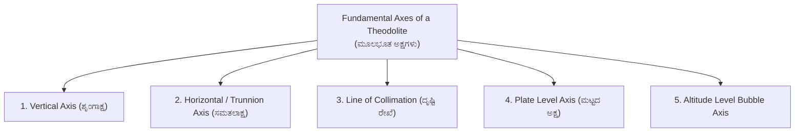
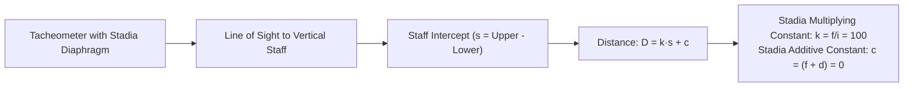

# 05. Theodolite Surveying & Tacheometry (ಥಿಯೋಡೊಲೈಟ್ ಮತ್ತು ಟ್ಯಾಕಿಯೋಮೆಟ್ರಿ)

> [!IMPORTANT] Exam Focus & Mark Potential
> - **Expected Weightage:** 10–12 Questions in Paper-II.
> - **Core Concepts Tested:** Size designation of theodolite, Fundamental axes and their geometric relationships, Repetition vs Reiteration methods, Latitude & Departure coordinates, Bowditch vs Transit traverse balancing rules, Stadia constants ($k=100, c=0$), and Anallatic lens function.
> - **High-Frequency Formulas:**
>   - Latitude $L = l \cos \theta$, Departure $D = l \sin \theta$.
>   - Closing Error $e = \sqrt{(\sum L)^2 + (\sum D)^2}$.
>   - Horizontal Stadia Distance $D = k \cdot s + c$ ($k=100, c=0$).

---

## 1. Theodolite Construction & Fundamental Axes

A theodolite is the most versatile instrument for measuring precise horizontal and vertical angles.
- **Transit Theodolite:** The telescope can be rotated through a complete revolution ($180^\circ$) about its horizontal axis in a vertical plane.
- **Size of a Theodolite (ಗಾತ್ರ):** Designated by the **inside diameter of the graduated lower horizontal circle** (e.g., $10\text{ cm to }12\text{ cm}$ for engineering work).



### Essential Geometric Relationships Between Axes
1. **Plate Level Axis** must be **strictly perpendicular** to the **Vertical Axis**. (Ensures vertical axis is truly plumb).
2. **Line of Collimation** must be **perpendicular** to the **Horizontal (Trunnion) Axis**. (Prevents conical sweep when plunging).
3. **Horizontal Axis** must be **perpendicular** to the **Vertical Axis**. (Ensures telescope traverses a truly vertical plane).
4. **Axis of Altitude Level** must be **parallel** to the **Line of Collimation** when the vertical circle reads zero.

---

## 2. Angle Measurement Methods

| Method | Field Procedure | Specific Purpose / Errors Eliminated |
| :--- | :--- | :--- |
| **Repetition Method (ಪುನರಾವರ್ತನೆ ವಿಧಾನ)** | The angle is added mechanically multiple times (e.g., 3 times Face Left, 3 times Face Right) on the graduated circle. The final reading divided by the number of repetitions gives the true angle. | **Eliminates:** Eccentricity of centers, eccentricity of verniers, imperfect graduations, and observational reading errors. (Note: Only suitable for single angles). |
| **Reiteration / Direction Method (ಪುನರುಚ್ಚಾರಣೆ ವಿಧಾನ)** | Several angles are measured successively all around the horizon from a single setup, closing the horizon back onto the initial reference station. | Used when **multiple angles** diverge from one common station (e.g., triangulation hubs). Saves substantial time compared to repetition. |

> [!TIP] Face Left vs Face Right Observations
> Taking the mean of **Face Left (Normal)** and **Face Right (Inverted)** observations automatically eliminates:
> 1. Error due to imperfect collimation adjustment.
> 2. Error due to lack of perpendicularity of horizontal axis to vertical axis.
> 3. Index error of the vertical circle.
> *(It does NOT eliminate error due to improper levelling of plate bubbles).*

---

## 3. Traverse Computations: Latitude, Departure & Balancing

For a traverse leg of length $l$ and reduced bearing $\theta$:
- **Latitude (L - ಅಕ್ಷಾಂಶ):** Coordinate length along North-South axis $= \mathbf{l \cos \theta}$. (North is positive, South is negative).
- **Departure (D - ರೇಖಾಂಶ):** Coordinate length along East-West axis $= \mathbf{l \sin \theta}$. (East is positive, West is negative).

```mermaid
quadrantChart
    title Consecutive Coordinates Sign Convention
    x-axis West (-) --> East (+)
    y-axis South (-) --> North (+)
    "Quadrant II: -L, +D (SE)": [0.8, 0.2]
    "Quadrant I: +L, +D (NE)": [0.8, 0.8]
    "Quadrant III: -L, -D (SW)": [0.2, 0.2]
    "Quadrant IV: +L, -D (NW)": [0.2, 0.8]
```

### Closed Traverse Conditions & Closing Error
For a mathematically perfect closed loop traverse:
$$\sum \text{Latitude} = 0 \quad \text{and} \quad \sum \text{Departure} = 0$$
If $\sum L \neq 0$ and $\sum D \neq 0$, the closure error ($e$) and its bearing ($\theta$) are:
$$\mathbf{e = \sqrt{(\sum L)^2 + (\sum D)^2}}, \quad \tan \theta = \frac{|\sum D|}{|\sum L|}$$

### Traverse Balancing Rules

| Balancing Method | Governing Assumption | Correction to Latitude ($C_L$) | Correction to Departure ($C_D$) |
| :--- | :--- | :---: | :---: |
| **Bowditch's Rule (Compass Rule)** | Linear and angular measurements are made with **equal precision**; linear errors $\propto \sqrt{l}$. | $C_L = \sum L \times \left(\frac{l}{\sum l}\right)$ | $C_D = \sum D \times \left(\frac{l}{\sum l}\right)$ |
| **Transit Rule** | **Angular measurements are more precise** than linear measurements. | $C_L = \sum L \times \left(\frac{|L|}{\sum |L|}\right)$ | $C_D = \sum D \times \left(\frac{|D|}{\sum |D|}\right)$ |

---

## 4. Tacheometric Surveying (ಟ್ಯಾಕಿಯೋಮೆಟ್ರಿ)

Tacheometry is a branch of angular surveying in which horizontal distances and elevation differences are determined purely through optical staff readings, completely bypassing physical taping.



### The Stadia Formula (Horizontal Sight)
$$D = k \cdot s + c = \left(\frac{f}{i}\right) s + (f + d)$$
- $s = \text{Staff Intercept} = (\text{Top stadia reading} - \text{Bottom stadia reading})$.
- $k = \frac{f}{i} = \textbf{Multiplying Constant}$ (Nominally calibrated to **$100$**).
- $c = (f + d) = \textbf{Additive Constant}$ (Nominally ranges from $30\text{ to }45\text{ cm}$ in external focusing, but **$0$** with anallatic lens).

### Anallatic Lens (ಅನಲ್ಲಾಟಿಕ್ ಮಸೂರ)
- Invented by **Porro**.
- A convex lens placed between the objective lens and eyepiece.
- **Function:** Eliminates the additive constant entirely, making **$c = 0$**.
- With an anallatic lens, horizontal distance simplifies directly to:
  $$\mathbf{D = 100 \cdot s}$$

### Inclined Sights (Staff Held Vertically)
When the telescope is inclined at angle $\theta$ to the horizontal:
- **Horizontal Distance:** $\mathbf{D = k \cdot s \cos^2 \theta + c \cos \theta}$
- **Vertical Height:** $\mathbf{V = \frac{1}{2} k \cdot s \sin 2\theta + c \sin \theta}$

---

## 5. High-Yield Mnemonics

> [!NOTE] Memory Aids
> - **Bowditch vs Transit Rule: "Bowditch balances on Length, Transit balances on Terms"**
>   - **B**owditch distributes proportional to **Length of line** ($l / \sum l$).
>   - **T**ransit distributes proportional to **Latitude/Departure magnitude** ($|L| / \sum |L|$).
> - **Latitude vs Departure Trig Functions: "Latitude = Cosine, Departure = Sine"**
>   - **L**atitude $\implies$ **L**adders climb up ($Y$-axis, $\cos \theta$).
>   - **D**eparture $\implies$ **D**rift horizontally ($X$-axis, $\sin \theta$).
> - **Anallatic Lens: "Anallatic Annihilates the Additive"**
>   - Anallatic lens makes Additive constant **$c = 0$**.

---

## 6. Likely Exam Questions & PYQ Patterns

1. **[KEA Land Surveyor PYQ]** *The size of a theodolite is specified by:*
   - **Answer:** The diameter of the lower horizontal graduated circle.
2. **[KEA PYQ]** *In tacheometry, if the focal length of the objective is 25 cm, distance from objective to trunnion axis is 15 cm, and stadia wire interval is 2.5 mm, the multiplying constant is:*
   - $k = \frac{f}{i} = \frac{25\text{ cm}}{0.25\text{ cm}} = \mathbf{100}$.
3. **[Expected Question]** *An anallatic lens fitted in a tacheometer makes:*
   - **Answer:** The additive constant equal to zero ($c = 0$).
4. **[KEA PYQ]** *Bowditch's rule for balancing a traverse is applied when:*
   - **Answer:** Linear and angular measurements are of equal precision.
5. **[Expected Question]** *If the latitude and departure of a line are $+60\text{ m}$ and $-80\text{ m}$ respectively, the whole circle bearing of the line is:*
   - Latitude positive $\implies$ North; Departure negative $\implies$ West. (Quadrant IV, N-W).
   - $\tan \theta = \frac{80}{60} = \frac{4}{3} \implies \theta = 53^\circ 08'$.
   - $\text{WCB} = 360^\circ - 53^\circ 08' = \mathbf{306^\circ 52'}$.

---

## 7. Quick Revision Box

```
┌────────────────────────────────────────────────────────────────────────┐
│ THEODOLITE & TACHEOMETRY REVISION CHEAT SHEET                          │
├────────────────────────────────────────────────────────────────────────┤
│ • Theodolite size = Diameter of lower graduated plate (10-12 cm).      │
│ • Face Left + Face Right mean eliminates collimation & index errors.   │
│ • Repetition: Single angle precision | Reiteration: Horizon closing.   │
│ • Latitude = l cos θ (N/S) | Departure = l sin θ (E/W).                │
│ • Closing Error e = √((∑L)² + (∑D)²) | tan θ = |∑D| / |∑L|.            │
│ • Bowditch: Corr ∝ line length (l / ∑l). For equal precision.          │
│ • Transit: Corr ∝ |Latitude| or |Departure|. When angles are superior. │
│ • Stadia: D = k·s + c where k = f/i = 100, c = (f + d) = 0.            │
│ • Anallatic Lens: Convex lens by Porro, forces c = 0.                  │
│ • Inclined stadia: D = 100 s cos² θ | V = 50 s sin 2θ.                 │
└────────────────────────────────────────────────────────────────────────┘
```

---
*Related Notes:*
- [[02_Compass_Surveying_and_Traversing]]
- [[03_Levelling_and_Contouring]]
- [[07_Total_Station_and_EDM]]
