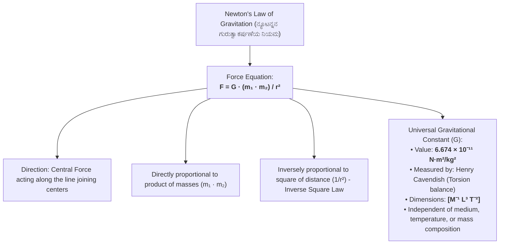
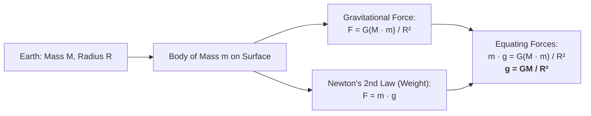
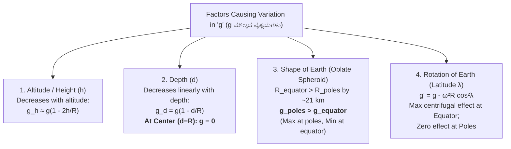
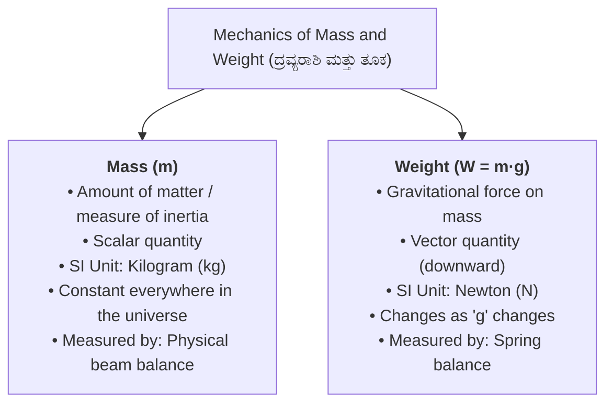
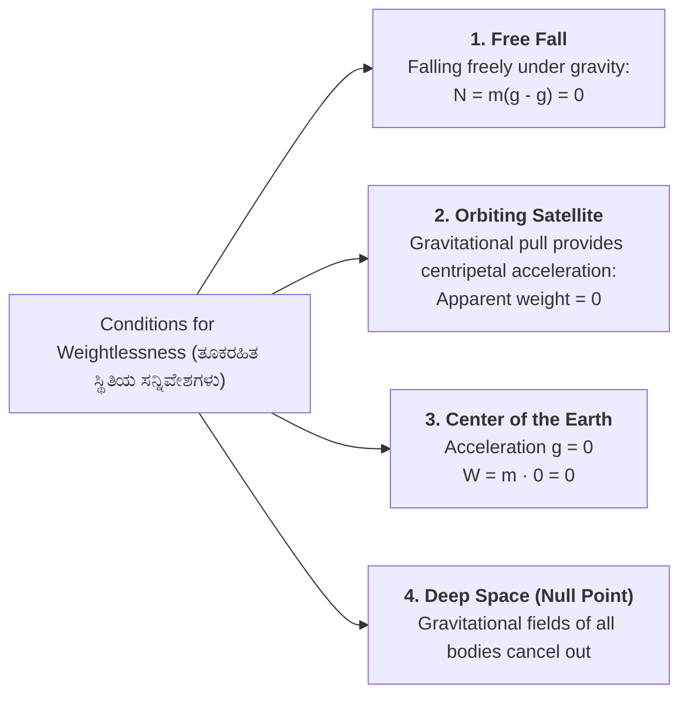

# 06. Applied Physics: Gravitation & Mechanics (ಅನ್ವಯಿಕ ಭೌತಶಾಸ್ತ್ರ: ಗುರುತ್ವಾಕರ್ಷಣೆ)

> [!IMPORTANT] Exam Focus & Mark Potential
> - **Expected Weightage:** **10 Questions (10 Marks)** in Paper-II (Dedicated 10% Physics section).
> - **Direct Syllabus Coverage:** `[P2-PHYS-5.1]` to `[P2-PHYS-5.4]` — Newton's Universal Law of Gravitation, Gravitational Constant $G$, Acceleration due to gravity $g$, Variations of $g$ (altitude, depth, earth shape, rotation), Mass vs Weight, and the phenomenon of Weightlessness.
> - **High-Frequency Formulas:**
>   - Newton's Law of Gravitation: $\mathbf{F = G \frac{m_1 m_2}{r^2}}$.
>   - Universal Constant: $\mathbf{G = 6.674 \times 10^{-11} \text{ N}\cdot\text{m}^2/\text{kg}^2}$ ($[M^{-1}L^3T^{-2}]$).
>   - Surface Acceleration: $\mathbf{g = \frac{GM}{R^2} \approx 9.81\text{ m/s}^2}$.
>   - Altitude Variation ($h \ll R$): $\mathbf{g_h \approx g \left(1 - \frac{2h}{R}\right)}$.
>   - Depth Variation: $\mathbf{g_d = g \left(1 - \frac{d}{R}\right)}$ (At center of Earth, $d = R \implies \mathbf{g = 0}$).
>   - Poles vs Equator: $\mathbf{g_{\text{poles}} > g_{\text{equator}}}$ ($R_e - R_p \approx 21\text{ km}$).

---

## 1. Newton's Universal Law of Gravitation (`P2-PHYS-5.1`)



### Explanation of Universal Gravitation
Gravitation is the universal attractive force existing between any two material bodies in the cosmos. It is the weakest fundamental force in nature ($10^{-38}$ times weaker than the strong nuclear force), yet it completely dominates planetary orbits, satellite geodesy, and Earth's geodetic shape. The constant of proportionality, $G$, is universally identical whether measured between laboratory spheres or orbiting GNSS satellites.

---

## 2. Gravity Near Earth's Surface & Relation Between 'g' and 'G' (`P2-PHYS-5.2`)



### Explanation of Surface Gravity
The acceleration experienced by a freely falling body near Earth's surface, denoted by $g$, is strictly independent of the falling object's mass ($m$). In a vacuum, a feather and a bowling ball fall with identical accelerations. Standard acceleration due to gravity adopted internationally at sea level is $\mathbf{g = 9.80665\text{ m/s}^2 \approx 9.8\text{ m/s}^2}$.

### Fundamental Differences Between 'G' and 'g'

| Parameter | Universal Constant ($G$) | Acceleration Due to Gravity ($g$) |
| :--- | :--- | :--- |
| **Definition** | Universal constant of attraction between unit masses at unit distance | Acceleration produced in a freely falling body by Earth's gravity |
| **Nature of Quantity** | **Scalar** quantity | **Vector** quantity (directed toward Earth's center of mass) |
| **Numerical Value** | $6.674 \times 10^{-11}\text{ N}\cdot\text{m}^2/\text{kg}^2$ everywhere in universe | $\approx 9.81\text{ m/s}^2$ at Earth's surface (varies with location) |
| **Dependence on Medium** | Completely independent of intervening medium | Dependent on mass and radius of the specific planet |
| **Value at Earth's Center** | $6.674 \times 10^{-11}\text{ N}\cdot\text{m}^2/\text{kg}^2$ | **Strictly ZERO ($g = 0$)** |
| **Dimensional Formula** | $[M^{-1} L^3 T^{-2}]$ | $[M^0 L^1 T^{-2}]$ |

---

## 3. Four Major Variations in the Value of 'g' (`P2-PHYS-5.3`)



### 1. Variation with Altitude (Height $h$ Above Surface)
As altitude increases, distance from Earth's center increases:
$$g_h = \frac{GM}{(R + h)^2} = g \left(\frac{R}{R + h}\right)^2 = g \left(1 + \frac{h}{R}\right)^{-2}$$
For small heights ($h \ll R$, where $R \approx 6400\text{ km}$):
$$\mathbf{g_h \approx g \left(1 - \frac{2h}{R}\right)}$$
- *Conclusion:* Acceleration due to gravity **decreases steadily with increasing altitude**.

### 2. Variation with Depth ($d$ Below Surface)
Inside the Earth, only the inner sphere of radius $(R - d)$ exerts gravitational pull (the outer spherical shell exerts zero net force):
$$\mathbf{g_d = g \left(1 - \frac{d}{R}\right)}$$
- At the surface ($d = 0$): $g_d = g$.
- At the center of the Earth ($d = R$):
  $$g_{\text{center}} = g \left(1 - \frac{R}{R}\right) = g(0) = \mathbf{0}$$
- *Conclusion:* Value of $g$ **decreases linearly with depth and becomes exactly zero at Earth's center**.

> [!TIP] Height vs. Depth Rate Comparison
> The rate of decrease of $g$ with height is **twice** the rate of decrease with depth!
> To produce the same reduction in $g$, you must go to height $h$ or depth $d = 2h$.

---

### 3. Variation Due to Earth's Shape (Geoid / Oblate Spheroid)
The Earth is not a perfect sphere; it bulges at the equator and is flattened at the poles due to its rotation over geological eons.
- **Equatorial Radius ($R_e$):** $\approx 6378\text{ km}$
- **Polar Radius ($R_p$):** $\approx 6357\text{ km}$
- **Difference:** $R_e - R_p \approx \mathbf{21\text{ km}}$
Since $g = \frac{GM}{R^2} \implies g \propto \frac{1}{R^2}$:
$$\mathbf{g_{\text{poles}} > g_{\text{equator}}}$$
- At the **Poles**: $g_{\text{pole}} \approx \mathbf{9.83\text{ m/s}^2}$ (**Maximum**)
- At the **Equator**: $g_{\text{equator}} \approx \mathbf{9.78\text{ m/s}^2}$ (**Minimum**)

---

### 4. Variation Due to Earth's Axial Rotation
Earth rotates from west to east with angular velocity $\omega = \frac{2\pi}{86400}\text{ rad/s} \approx 7.29 \times 10^{-5}\text{ rad/s}$.
At latitude $\lambda$, centrifugal force reduces effective gravity:
$$\mathbf{g' = g - \omega^2 R \cos^2 \lambda}$$
- At the **Equator** ($\lambda = 0^\circ, \cos 0^\circ = 1$): $\mathbf{g'_{\text{eq}} = g - \omega^2 R}$ (**Maximum centrifugal reduction**).
- At the **Poles** ($\lambda = 90^\circ, \cos 90^\circ = 0$): $\mathbf{g'_{\text{pole}} = g}$ (**Zero centrifugal effect**).
- *Exam Fact:* If Earth stops rotating ($\omega = 0$), the value of $g$ at the equator would increase by $\omega^2 R \approx 0.034\text{ m/s}^2$, while $g$ at the poles would remain completely unchanged!

---

## 4. Mass, Weight & The Phenomenon of Weightlessness (`P2-PHYS-5.4`)



### The Phenomenon of Weightlessness (ತೂಕರಹಿತ ಸ್ಥಿತಿ)
Weight is felt not by the force of gravity itself, but by the **normal reaction force ($N$)** exerted by the supporting floor or scale on the body. When $N = 0$, the body feels completely weightless.



> [!IMPORTANT] Crucial Distinction
> Inside an orbiting satellite (such as ISS or GPS satellites), astronauts experience weightlessness **not because gravity is zero**, but because the spacecraft and astronauts are in a perpetual state of **free fall** together toward Earth with acceleration $a = g$. Gravity at typical satellite altitudes is still 85% to 90% of its surface value!

---

## 5. Authentic Verbatim PYQs & High-Yield Questions

> [!NOTE] Verbatim Previous Year Questions (KEA / KPSC Physics)
>
> **Q1. [KEA Land Surveyor PYQ]** What is the value of acceleration due to gravity ($g$) at the exact physical center of the Earth?
> - (A) $9.8\text{ m/s}^2$
> - (B) $4.9\text{ m/s}^2$
> - (C) $0\text{ m/s}^2$
> - (D) Infinite
>
> *Answer:* **(C) $0\text{ m/s}^2$**
> *Explanation:* By the depth formula $g_d = g(1 - d/R)$, at the center of the Earth $d = R$, making $g_{\text{center}} = g(1 - 1) = 0$.
>
> ---
>
> **Q2. [KPSC PWD / Surveyor PYQ]** A person weighs maximum on the Earth's surface at which of the following locations?
> - (A) Equator
> - (B) North and South Poles
> - (C) Tropic of Cancer
> - (D) At the bottom of a deep coal mine
>
> *Answer:* **(B) North and South Poles**
> *Explanation:* The Earth's polar radius is about $21\text{ km}$ shorter than the equatorial radius ($R_p < R_e$), and there is zero centrifugal reduction at the poles ($\cos 90^\circ = 0$). Hence, $g$ is maximum ($\approx 9.83\text{ m/s}^2$) at the poles, making weight $W = mg$ maximum.
>
> ---
>
> **Q3. [KEA Land Surveyor PYQ]** If the distance between two masses is doubled, the gravitational force of attraction between them becomes:
> - (A) Double
> - (B) Four times
> - (C) One-half
> - (D) One-fourth
>
> *Answer:* **(D) One-fourth**
> *Explanation:* According to Newton's law of gravitation, $F \propto \frac{1}{r^2}$. If distance $r$ is doubled ($2r$), force becomes $F' = \frac{G m_1 m_2}{(2r)^2} = \frac{F}{4}$.
>
> ---
>
> **Q4. [KPSC Technical Officer PYQ]** What are the dimensional units of the Universal Gravitational Constant ($G$)?
> - (A) $[M^1 L^2 T^{-2}]$
> - (B) $[M^{-1} L^3 T^{-2}]$
> - (C) $[M^0 L^1 T^{-2}]$
> - (D) $[M^1 L^1 T^{-1}]$
>
> *Answer:* **(B) $[M^{-1} L^3 T^{-2}]$**
> *Explanation:* From $F = G \frac{m_1 m_2}{r^2} \implies G = \frac{F r^2}{m^2}$. Substituting SI dimensions: $\frac{[M L T^{-2}] \cdot [L^2]}{[M^2]} = [M^{-1} L^3 T^{-2}]$.
>
> ---
>
> **Q5. [KEA Land Surveyor PYQ]** An astronaut experiences weightlessness inside an artificial satellite orbiting the Earth primarily because:
> - (A) There is zero gravitational pull of Earth at that altitude
> - (B) The satellite and astronaut are in a state of free fall under gravity with zero normal reaction force
> - (C) The atmosphere is absent in space
> - (D) Mass of the astronaut becomes zero
>
> *Answer:* **(B) The satellite and astronaut are in a state of free fall under gravity with zero normal reaction force**
> *Explanation:* Gravitational force provides the necessary centripetal acceleration, causing both satellite and astronaut to accelerate freely toward Earth at the exact same rate. Consequently, the apparent contact reaction force $N = 0$, giving the sensation of weightlessness.

---

## 6. Quick Revision Box (ಕಡ್ಡಾಯವಾಗಿ ನೆನಪಿಡಬೇಕಾದ ಮುಖ್ಯಾಂಶಗಳು)

```markdown
┌─────────────────────────────────────────────────────────────────────────────┐
│                       APPLIED PHYSICS CHEAT SHEET                           │
├─────────────────────────────────────────────────────────────────────────────┤
│ 1. Newton's Gravitation: F = G(m₁m₂)/r² (Inverse square central force).    │
│ 2. G = 6.674 × 10⁻¹¹ N·m²/kg² (Universal scalar, dimensions [M⁻¹ L³ T⁻²]). │
│ 3. Acceleration g = GM/R² ≈ 9.81 m/s² (Independent of object's mass).      │
│ 4. Altitude: g decreases with height: g_h ≈ g(1 - 2h/R).                    │
│ 5. Depth: g decreases linearly: g_d = g(1 - d/R). At Earth's center: g = 0.│
│ 6. Earth Shape: Poles are 21 km closer to center ⇒ g_pole > g_equator.     │
│ 7. Rotation: g' = g - ω²R cos²λ. Max reduction at equator; zero at poles.  │
│ 8. Mass vs Weight: Mass (kg) is constant scalar; Weight (N) is vector = mg.│
│ 9. Weightlessness (N = 0): Free fall, orbiting satellites, Earth's center. │
└─────────────────────────────────────────────────────────────────────────────┘
```
