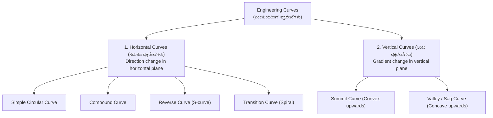
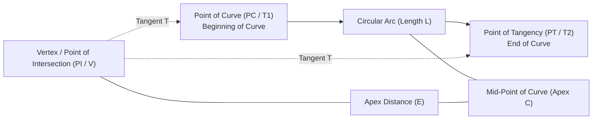
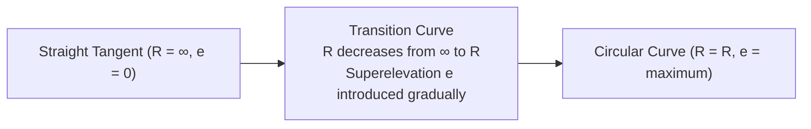

# 06. Curves & Advanced Surveying (ವಕ್ರರೇಖೆಗಳು & ಸುಧಾರಿತ ಸಮೀಕ್ಷೆ)

> [!IMPORTANT] Exam Focus & Mark Potential
> - **Expected Weightage:** 6–8 Questions in Paper-II.
> - **Core Concepts Tested:** Classification of curves (Circular, Compound, Reverse, Transition), Degree of curve to radius relation ($R = 1718.9/D$), Curve geometry elements (Tangent length, Long chord, Apex distance, Mid-ordinate), Rankine's deflection angle method, and Superelevation & Shift of transition curve ($S = L_s^2 / 24R$).
> - **High-Frequency Numerical:** For a 30 m arc, **$R \approx 1719 / D$**; for a 20 m arc, **$R \approx 1146 / D$**.

---

## 1. Classification of Engineering Curves

Curves are provided on highways and railways at points where alignment changes direction or gradient to ensure smooth, safe transit without sudden lateral acceleration.



### Definitions of Horizontal Curve Types
1. **Simple Circular Curve:** A single arc of constant radius connecting two straight tangent lines.
2. **Compound Curve:** Consists of two or more circular arcs of **different radii curving in the same direction**, with centers on the same side of the common tangent.
3. **Reverse Curve (S-Curve):** Consists of two circular arcs of equal or different radii **curving in opposite directions**, with centers on opposite sides of a common tangent. (Used in railway yards; avoided on high-speed highways due to rapid reversal of superelevation).
4. **Transition Curve:** A curve of varying radius (radius decreases from infinity at tangent point to $R$ at circular junction) introduced between tangent and circular curve to gradually introduce centrifugal force.

---

## 2. Geometry of a Simple Circular Curve

Let $R$ = radius of curve, $\Delta$ = total deflection angle, $I$ = intersection angle ($I = 180^\circ - \Delta$).



### Core Mathematical Formulas Matrix

| Curve Element | Mathematical Formula | Key Property / Derivation |
| :--- | :---: | :--- |
| **Tangent Length ($T$)** | $T = R \tan \left(\frac{\Delta}{2}\right)$ | Distance from Vertex ($V$) to Point of Curve ($T_1$ or $T_2$). |
| **Length of Curve ($L$)** | $L = \frac{\pi R \Delta}{180^\circ} = R \Delta_{\text{rad}}$ | Arc length along the curve from $T_1$ to $T_2$. |
| **Length of Long Chord ($C$)** | $C = 2 R \sin \left(\frac{\Delta}{2}\right)$ | Straight chord distance joining $T_1$ and $T_2$. |
| **Apex Distance / External ($E$)** | $E = R \left(\sec \frac{\Delta}{2} - 1\right)$ | Distance from Vertex ($V$) to Midpoint of Curve ($C$). |
| **Mid-Ordinate / Versed Sine ($M$)** | $M = R \left(1 - \cos \frac{\Delta}{2}\right)$ | Perpendicular distance from long chord midpoint to curve apex. |

---

## 3. Degree of Curve (ಡಿಗ್ರಿ ಆಫ್ ಕರ್ವ್)

The **Degree of Curve ($D$)** is the angle subtended at the center of the curve by an arc of standard length.

### Standard Relations:
1. **Based on 30 m Standard Arc:**
   $$\frac{D^\circ}{360^\circ} = \frac{30}{2 \pi R} \implies R = \frac{30 \times 180}{\pi D} \approx \mathbf{\frac{1718.9}{D} \approx \frac{1719}{D}\text{ metres}}$$
2. **Based on 20 m Standard Arc:**
   $$\frac{D^\circ}{360^\circ} = \frac{20}{2 \pi R} \implies R = \frac{20 \times 180}{\pi D} \approx \mathbf{\frac{1145.9}{D} \approx \frac{1146}{D}\text{ metres}}$$

---

## 4. Curve Setting Methods

### Linear Methods (Chain & Tape only)
- **Offsets from Long Chord:** Suitable for short curves ($R$ large, $L$ small). Mid-ordinate $y_0 = R - \sqrt{R^2 - (L/2)^2}$; offset $y_x = \sqrt{R^2 - x^2} - (R - y_0)$.
- **Offsets from Tangents:** Offsets erected perpendicular or radial from the tangent line ($y = \frac{x^2}{2R}$).
- **Offsets from Chords Produced:** Fastest linear method for setting long curves without optical instruments.

### Angular Methods (Theodolite Based)
- **Rankine's Method of Deflection Angles (ರಾನ್‌ಕಿನ್ ವಿಧಾನ - Most Accurate):**
  - Uses one theodolite set at $T_1$ and a chain/tape.
  - Deflection angle for chord length $c$:
    $$\mathbf{\delta = \frac{1718.9 \times c}{R}\text{ minutes of arc} = \frac{c}{2R}\text{ radians}}$$
  - Total deflection angle to $n$-th station: $\Delta_n = \delta_1 + \delta_2 + \dots + \delta_n$.
- **Two-Theodolite Method:**
  - One theodolite set at $T_1$, second at $T_2$.
  - Points set by intersecting lines of sight sighted at predetermined angles.
  - **Major Advantage:** **Requires zero linear tape measurement**; ideal for rough, marshy, or undulating ground!

---

## 5. Transition Curves & Superelevation (ಕ್ಯಾಂಟ್ / ಸೂಪರ್‌ಎಲಿವೇಶನ್)

When a vehicle travels around a horizontal curve, centrifugal force ($F = \frac{m v^2}{R}$) pushes it outward. To counter this, the outer edge of the pavement or track is raised above the inner edge.



### Superelevation Formula
$$e = \frac{v^2}{g R} = \mathbf{\frac{V^2}{127 R}}$$
- $V$ = speed in km/h, $R$ = curve radius in metres, $e$ = rate of superelevation.

### Ideal Transition Curve & Shift
- **Ideal Type:** **Clothoid / Euler's Spiral** (where curvature $\frac{1}{r}$ increases linearly with length $l$, i.e., $r \cdot l = \text{constant}$).
- **Cubic Parabola:** Used on Indian Railways where deflection angle is small ($< 9^\circ$).
- **Shift of Circular Curve ($S$):** The circular curve must be shifted inward to accommodate the transition curve.
  $$\mathbf{S = \frac{L_s^2}{24 R}}$$
  ($L_s$ = length of transition curve, $R$ = radius of circular curve).

---

## 6. High-Yield Mnemonics

> [!NOTE] Memory Aids
> - **Degree of Curve Constant: "1719 for Thirty"**
>   - $R = 1719 / D$ for **30 m** chain/arc.
> - **Rankine Constant: "1718.9 over Radius"**
>   - $\delta = (1718.9 \cdot c) / R$ in **minutes**.
> - **Shift Formula: "LS Squared over 24 R"**
>   - Shift $S = L_s^2 / (24 R)$.

---

## 7. Likely Exam Questions & PYQ Patterns

1. **[KEA Land Surveyor PYQ]** *If the degree of a curve is $3^\circ$ for a 30 m chain, what is its radius?*
   - $R = \frac{1718.9}{D} = \frac{1718.9}{3} = \mathbf{572.96\text{ m}} \approx 573\text{ m}$.
2. **[Expected Question]** *In Rankine's method of deflection angles, the tangential angle $\delta$ in minutes for a chord $c$ and radius $R$ is given by:*
   - **Answer:** $\delta = \frac{1718.9 \times c}{R}$.
3. **[KEA PYQ]** *Which curve setting method is entirely independent of linear chaining and suitable for broken ground?*
   - **Answer:** Two-Theodolite Method.
4. **[Expected Question]** *The shift of a circular curve to accommodate a transition curve of length $L_s$ and radius $R$ is:*
   - **Answer:** $S = \frac{L_s^2}{24 R}$.
5. **[Expected Question]** *An ideal transition curve is:*
   - **Answer:** Clothoid (Euler's spiral).

---

## 8. Quick Revision Box

```
┌────────────────────────────────────────────────────────────────────────┐
│ CURVES & ADVANCED SURVEYING REVISION CHEAT SHEET                       │
├────────────────────────────────────────────────────────────────────────┤
│ • 30m Arc: R = 1718.9 / D | 20m Arc: R = 1145.9 / D.                   │
│ • Tangent T = R tan(Δ/2) | Long Chord C = 2R sin(Δ/2).                 │
│ • Curve Length L = π R Δ / 180° = R Δrad.                              │
│ • Apex Distance E = R(sec(Δ/2) - 1) | Mid-ordinate M = R(1 - cos(Δ/2)).│
│ • Rankine's deflection angle: δ = (1718.9 · c) / R (minutes).          │
│ • Two-theodolite method: Zero linear measurement needed.               │
│ • Superelevation: e = V² / (127 R).                                    │
│ • Ideal Transition Curve: Euler's Spiral (Clothoid) where r · l = const│
│ • Shift of curve: S = Ls² / (24 R).                                    │
│ • Vertical curves: Parabolic (ensures constant rate of grade change).  │
└────────────────────────────────────────────────────────────────────────┘
```

---
*Related Notes:*
- [[01_Chain_Surveying_and_Linear_Measurements]]
- [[05_Theodolite_and_Tacheometry]]
- [[07_Total_Station_and_EDM]]
