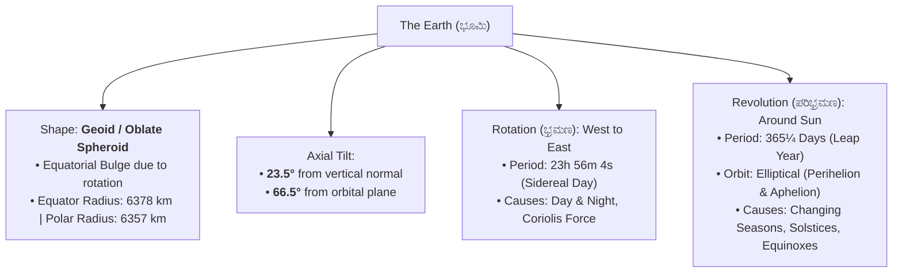
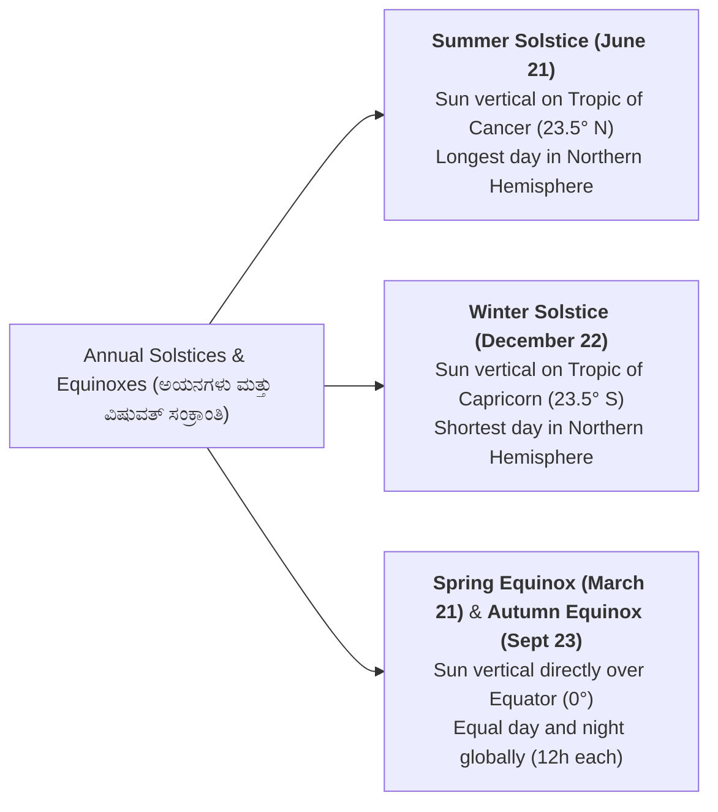
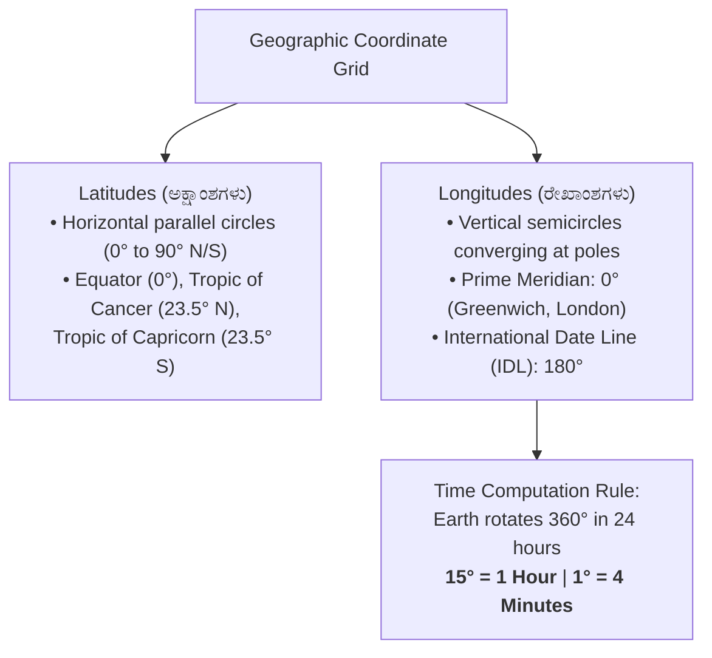
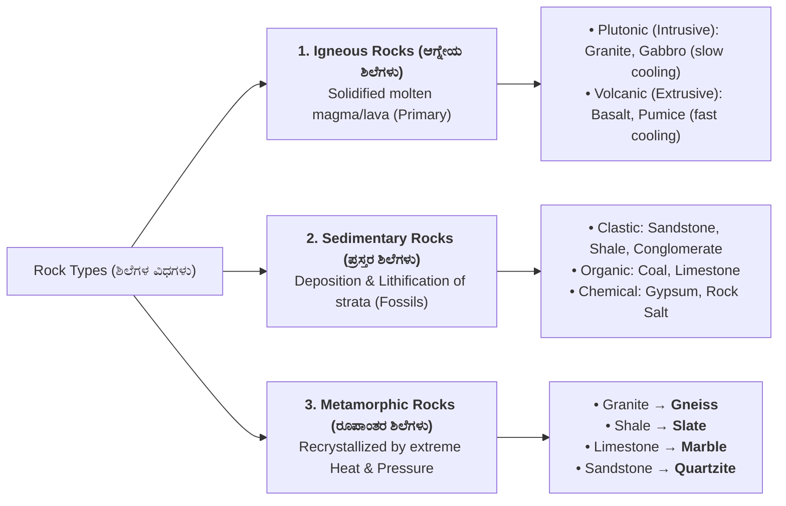
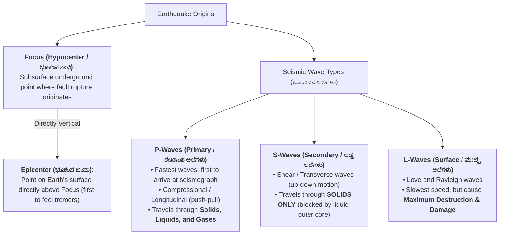

# 07. Physical Geography: The Earth & Lithosphere (ಭೌತಿಕ ಭೂಗೋಳ: ಭೂಮಿ ಮತ್ತು ಶಿಲಾಗೋಳ)

> [!IMPORTANT] Exam Focus & Mark Potential
> - **Expected Weightage:** **5–6 Questions** in Paper-II (First part of the 10-mark Geography section).
> - **Direct Syllabus Coverage:** `[P2-GEOG-6.1]`, `[P2-GEOG-6.2]`, & `[P2-GEOG-6.3]` — Earth's origin, shape (Geoid), axial tilt ($23.5^\circ$), rotation & revolution, solstices & equinoxes, Geographic Grid, Local Time & IST ($82.5^\circ\text{ E} = \text{GMT} +5:30$), Earth's interior (Crust, Mantle, Core - SIAL, SIMA, NIFE), Rock classification (Igneous, Sedimentary, Metamorphic), Weathering, Earthquakes (P, S, L waves), and Volcanoes.
> - **High-Frequency Formulas & Rules:**
>   - Longitude to Time: $\mathbf{15^\circ = 1\text{ Hour}} \implies \mathbf{1^\circ = 4\text{ Minutes}}$.
>   - Time Direction Rule: **East Gain Add (EGA)**, **West Lose Subtract (WLS)**.
>   - Indian Standard Time (IST): $\mathbf{82^\circ 30' \text{ E} = +5\text{ hours } 30\text{ minutes}}$ from Greenwich Mean Time (GMT).
>   - Seismic Waves Speed & Destruction: **P-waves (Fastest, all media)** > **S-waves (Solids only)** > **L-waves (Slowest, Maximum damage)**.

---

## 1. The Earth: Form, Rotation & Revolution (`P2-GEOG-6.1`)



### Explanation of Planetary Motions & Astronomical Events
The Earth's true geometric shape is a **Geoid** (an oblate spheroid flattened at poles and bulging at the equator). The Earth rotates counter-clockwise (West to East) causing daily diurnal cycles. Its revolution along an elliptical path combined with its fixed $23.5^\circ$ axial inclination produces seasonal variations:
- **Perihelion (ಸೂರ್ಯ ಸಮೀಪಕ):** Earth is closest to the Sun ($\approx 147\text{ million km}$) on **January 3**.
- **Aphelion (ಸೂರ್ಯ ದೂರಕ):** Earth is farthest from the Sun ($\approx 152\text{ million km}$) on **July 4**.



---

## 2. Geographic Grid, Longitude & Time Zones (`P2-GEOG-6.2`)



### Time Calculation Mechanics
- Earth rotates $360^\circ$ in 24 hours:
  $$\frac{360^\circ}{24\text{ hours}} = 15^\circ/\text{hour} \quad \implies \quad 1^\circ = \frac{60\text{ minutes}}{15} = \mathbf{4\text{ minutes}}$$
- **East Gain Add (EGA):** Moving East of Greenwich $\implies$ **Add 4 minutes per degree**.
- **West Lose Subtract (WLS):** Moving West of Greenwich $\implies$ **Subtract 4 minutes per degree**.

### Indian Standard Time (IST - ಭಾರತೀಯ ಪ್ರಮಾಣಿತ ಕಾಲಮಾನ)
- **Standard Meridian of India:** **$82^\circ 30' \text{ E}$ ($82.5^\circ\text{ E}$ Longitude)**.
- **Location:** Passes through **Mirzapur (near Prayagraj / Allahabad, Uttar Pradesh)**.
- **Time Offset from GMT/UTC:**
  $$\text{Offset} = 82.5^\circ \times 4\text{ minutes} = 330\text{ minutes} = \mathbf{+5\text{ hours } 30\text{ minutes}}$$
- **States traversed by $82.5^\circ\text{ E}$ Meridian (5 States):**
  1. Uttar Pradesh
  2. Madhya Pradesh
  3. Chhattisgarh
  4. Odisha
  5. Andhra Pradesh
- *Longitudinal Extent of India:* From $68^\circ 7' \text{ E}$ (Ghuar Mota, Gujarat) to $97^\circ 25' \text{ E}$ (Kibithu, Arunachal Pradesh) $\approx 30^\circ$ longitude difference, translating to a **2-hour local sunrise time difference** between Arunachal Pradesh and Gujarat.

---

## 3. The Lithosphere: Internal Layers & Discontinuities (`P2-GEOG-6.3`)

```mermaid
flowchart TD
    subgraph EarthInterior["Earth's Internal Structure (ಭೂಮಿಯ ಆಂತರಿಕ ರಚನೆ)"]
        CR["<b>1. Crust (ಭೂತೊಗಟೆ)</b> [0 to 30-70 km]<br/>• Continental Crust: SIAL (Silica + Alumina), Granite, density ~2.7<br/>• Oceanic Crust: SIMA (Silica + Magnesium), Basalt, density ~3.0"]
        CR -->|<b>Mohorovicic (Moho) Discontinuity</b>| MN["<b>2. Mantle (ಮ್ಯಾಂಟಲ್ / ಹೊದಿಕೆ)</b> [30 to 2900 km]<br/>• Asthenosphere (upper semi-molten layer, source of magma)<br/>• Rich in dense peridotite / silicate minerals"]
        MN -->|<b>Gutenberg Discontinuity</b>| OC["<b>3. Outer Core (ಹೊರ ತಿರುಳು)</b> [2900 to 5150 km]<br/>• Molten / Liquid Iron & Nickel<br/>• Generates Earth's Magnetic Field (Geodynamo)<br/>• S-waves cannot enter liquid outer core!"]
        OC -->|<b>Lehmann Discontinuity</b>| IC["<b>4. Inner Core (ಒಳ ತಿರುಳು)</b> [5150 to 6371 km]<br/>• Solid metallic sphere due to extreme pressure<br/>• NIFE (Nickel + Iron), Density ~13 g/cm³"]
    end
```

---

## 4. Classification of Rocks (ಶಿಲೆಗಳ ವರ್ಗೀಕರಣ)



---

## 5. Earthquakes & Seismic Waves (ಭೂಕಂಪಗಳು ಮತ್ತು ಭೂಕಂಪನ ಅಲೆಗಳು)



### Earthquake Measurement Scales

| Scale Name | Invented By | Measures | Scale Type / Range |
| :--- | :--- | :--- | :--- |
| **Richter Scale** | Charles Richter (1935) | **Magnitude** (Total kinetic energy released at focus) | Logarithmic scale ($1\text{ to }10+$). Each whole number increase represents a **$32\times$ increase in energy release** and $10\times$ increase in amplitude. |
| **Mercalli Scale** | Giuseppe Mercalli | **Intensity** (Observed ground shaking and structural damage) | Linear qualitative scale: **I to XII (Roman Numerals 1 to 12)** based on human observation. |

---

## 6. Authentic Verbatim PYQs & High-Yield Questions

> [!NOTE] Verbatim Previous Year Questions (KEA / KPSC Physical Geography)
>
> **Q1. [KEA Land Surveyor PYQ]** What is the exact time difference between Indian Standard Time (IST) and Greenwich Mean Time (GMT / UTC)?
> - (A) IST is 5 hours behind GMT
> - (B) IST is 5 hours 30 minutes ahead of GMT
> - (C) IST is 6 hours ahead of GMT
> - (D) IST is 4 hours 30 minutes ahead of GMT
>
> *Answer:* **(B) IST is 5 hours 30 minutes ahead of GMT**
> *Explanation:* IST is calibrated on the standard meridian of $82^\circ 30' \text{ E}$. Since each degree equals 4 minutes: $82.5^\circ \times 4 = 330\text{ minutes} = +5\text{ hours } 30\text{ minutes}$ ahead of Greenwich.
>
> ---
>
> **Q2. [KPSC PWD / Surveyor PYQ]** The boundary line of discontinuity separating the Earth's Crust from the underlying Mantle is known as:
> - (A) Gutenberg Discontinuity
> - (B) Mohorovicic (Moho) Discontinuity
> - (C) Lehmann Discontinuity
> - (D) Conrad Discontinuity
>
> *Answer:* **(B) Mohorovicic (Moho) Discontinuity**
> *Explanation:* The Moho discontinuity separates the crust from the mantle. The Gutenberg discontinuity separates the mantle from the liquid outer core.
>
> ---
>
> **Q3. [KEA Land Surveyor PYQ]** Which seismic waves are capable of travelling through solid, liquid, and gaseous media, and arrive first at a seismograph station?
> - (A) Secondary (S) waves
> - (B) Primary (P) waves
> - (C) Rayleigh surface waves
> - (D) Love surface waves
>
> *Answer:* **(B) Primary (P) waves**
> *Explanation:* Primary (P) waves are longitudinal compressional waves having the highest velocity, allowing them to penetrate solids, liquids, and gases alike. S-waves cannot travel through liquids.
>
> ---
>
> **Q4. [KPSC Technical Officer PYQ]** When limestone undergoes metamorphism under intense heat and geological pressure, it transforms into which rock?
> - (A) Quartzite
> - (B) Marble
> - (C) Slate
> - (D) Gneiss
>
> *Answer:* **(B) Marble**
> *Explanation:* Limestone (sedimentary calcium carbonate) recrystallizes under metamorphic conditions to produce marble. Sandstone transforms into quartzite, and shale transforms into slate.
>
> ---
>
> **Q5. [KEA Land Surveyor PYQ]** On which date does the Summer Solstice occur in the Northern Hemisphere, when the Sun is directly overhead at the Tropic of Cancer ($23.5^\circ\text{ N}$)?
> - (A) March 21
> - (B) June 21
> - (C) September 23
> - (D) December 22
>
> *Answer:* **(B) June 21**
> *Explanation:* June 21 marks the Summer Solstice in the Northern Hemisphere (longest day of the year). December 22 is the Winter Solstice (shortest day).

---

## 7. Quick Revision Box (ಕಡ್ಡಾಯವಾಗಿ ನೆನಪಿಡಬೇಕಾದ ಮುಖ್ಯಾಂಶಗಳು)

```markdown
┌─────────────────────────────────────────────────────────────────────────────┐
│                       PHYSICAL GEOGRAPHY CHEAT SHEET                        │
├─────────────────────────────────────────────────────────────────────────────┤
│ 1. Earth's Tilt: 23.5° from vertical; 66.5° from orbital plane.             │
│ 2. Perihelion: Jan 3 (closest); Aphelion: July 4 (farthest from Sun).       │
│ 3. Solstices: Summer = June 21 (Tropic of Cancer); Winter = Dec 22.         │
│ 4. Equinoxes: March 21 & Sept 23 (Equal day and night globally).            │
│ 5. Time Rule: 15° = 1 hour; 1° = 4 minutes. East = Add; West = Subtract.    │
│ 6. IST: 82.5° E (Mirzapur, UP) = GMT + 5:30. Passes through 5 states.       │
│ 7. Earth Discontinuities: Moho (Crust-Mantle), Gutenberg (Mantle-Core).     │
│ 8. Rocks: Igneous (Basalt/Granite), Sedimentary (Sandstone), Meta (Marble). │
│ 9. Metamorphic Pairs: Limestone → Marble; Sandstone → Quartzite; Shale→Slate│
│ 10. Seismic Waves: P-waves (Fastest, all media), S-waves (Solids only),      │
│     L-waves (Slowest, cause maximum surface destruction).                   │
│ 11. Earthquake Scales: Richter (Logarithmic Magnitude), Mercalli (I-XII Int).│
└─────────────────────────────────────────────────────────────────────────────┘
```
