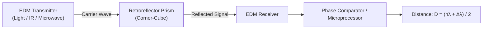
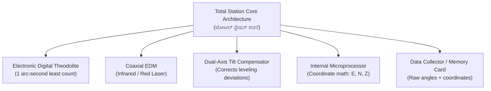
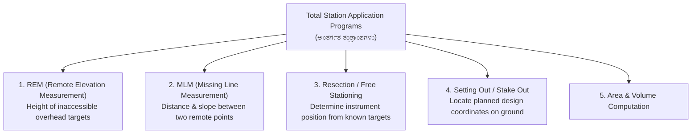

# 07. Total Station & EDM (ಟೋಟಲ್ ಸ್ಟೇಷನ್ & ಇ.ಡಿ.ಎಂ)

> [!IMPORTANT] Exam Focus & Mark Potential
> - **Expected Weightage:** 10–12 Questions in Paper-II.
> - **Core Concepts Tested:** EDM carrier waves (Microwave vs Infrared vs Light), Phase comparison principle, Total Station components (Dual-axis compensator, Corner-cube prism), Prism constant, and Built-in surveying programs (REM, MLM, Resection, Stake-out).
> - **High-Yield Fact:** Total Station measures **Slope Distance ($SD$)** and **Zenith Angle ($Z$)**, and mathematically computes **Horizontal Distance ($HD = SD \cdot \sin Z$)** and **Elevation Difference ($VD = SD \cdot \cos Z$)**.

---

## 1. Electronic Distance Measurement (EDM) Fundamentals

EDM measures distance electronically by transmitting modulated electromagnetic waves towards a distant reflector and measuring the transit time or phase displacement of the reflected wave.



### Phase Shift Measurement Principle
Instead of measuring transit time directly (which requires picosecond clocks), modern EDMs measure the **phase difference ($\Delta \phi$)** between transmitted and received continuous modulated waves:
$$\mathbf{D = \frac{n \lambda + \Delta \lambda}{2}}$$
- $\lambda$ = modulation wavelength.
- $n$ = integer number of full wave cycles.
- $\Delta \lambda$ = fractional wavelength determined by phase shift ($\Delta \lambda = \frac{\Delta \phi}{360^\circ} \cdot \lambda$).

### Classification of EDM Instruments by Carrier Wave

| Type | Instrument Example | Carrier Wave Type | Range | Atmospheric Correction Requirement |
| :--- | :--- | :--- | :---: | :--- |
| **Microwave Instruments** | **Tellurometer** | High-frequency radio microwaves ($3\text{ GHz to }10\text{ GHz}$). | Up to **$100\text{ km}$** | Highly sensitive to atmospheric humidity and water vapor pressure; requires master and remote active transceivers. |
| **Visible Light Instruments** | **Geodimeter** | Modulated visible light beam (mercury arc, tungsten lamp, laser). | Up to **$25\text{ km}$** (night), shorter by day | Sensitive to atmospheric temperature and pressure; uses passive glass prisms. |
| **Infrared Instruments** | **Distomat (Wild)** | Near-infrared light generated by Gallium Arsenide (GaAs) diode. | **$2\text{ to }5\text{ km}$** | Standard in modern civil surveying; compact, low power, uses passive corner-cube prisms. |

---

## 2. Total Station Architecture & Components

A **Total Station** is an integrated electro-optical surveying instrument combining:
1. An **electronic digital theodolite** (for horizontal and vertical angles).
2. An **electronic distance meter (EDM)** (coaxial with the telescope).
3. An **on-board microprocessor** and solid-state data collector.



### Essential Structural Components
- **Dual-Axis Compensator (ದ್ವಿ-ಅಕ್ಷೀಯ ಸಮತೋಲಕ):** Liquid-surface or pendulum sensor that continuously monitors and corrects errors caused by slight residual tilt of the vertical axis in both longitudinal and transverse directions.
- **Corner-Cube Retroreflector (ಪ್ರಿಸ್ಮ್):** An optical glass prism with three mutually perpendicular reflecting surfaces. It reflects incident light **exactly parallel to the incoming beam**, regardless of the incident angle!
- **Prism Constant ($k$):** The geometric offset between the physical mechanical center of the prism holder and the virtual optical reflection point (typically **$-30\text{ mm}$** or **$0\text{ mm}$**). If set incorrectly, every measured distance contains a systematic constant error.
- **Laser Plummet:** Replaces the traditional plumb bob with a red laser dot on the station ground peg for effortless sub-millimeter centering.

---

## 3. Total Station Built-In Application Programs

Modern Total Stations contain specialized firmware programs that perform complex calculations directly in the field:



### Program Function Breakdown

| Program | Field Function | How It Works & Practical Use Case |
| :--- | :--- | :--- |
| **REM (Remote Elevation Measurement)** | Measures vertical height of points where a prism cannot be placed. | Prism is placed at the ground base directly beneath the target (e.g., foot of electric transmission tower). Sighting the base measures distance $D$; tilting the telescope to the top reads vertical angle $\alpha$. Height $= D \tan \alpha + \text{prism height}$. |
| **MLM (Missing Line Measurement)** | Calculates horizontal distance, slope distance, and gradient between two remote ground points. | Surveyor sights Prism $A$, then sights Prism $B$ from a single instrument position without occupying either $A$ or $B$. Microprocessor calculates distance $AB$ using the cosine rule. |
| **Resection / Free Stationing** | Calculates the unknown coordinates $(E_0, N_0, Z_0)$ of the instrument setup point. | Surveyor sets up at any arbitrary convenient station with clear sightlines and shoots at least **two control points of known coordinates (distance & angle)** or **three control points (angles only)**. |
| **Stake Out / Setting Out** | Guides the prism holder to mark exact design coordinates in the field. | Design coordinates $(E, N)$ are entered. The instrument calculates required angle and distance, displaying visual directional cues (e.g., "Move Left $0.24\text{ m}$, Pull Back $1.15\text{ m}$"). |

---

## 4. Coordinate Computation Mechanics

The total station measures:
- Slope Distance ($SD$)
- Horizontal Angle ($\theta$)
- Zenith Angle ($Z$) (angle measured downward from true vertical upward direction; horizontal is $Z = 90^\circ$).

$$\text{Horizontal Distance:}\quad \mathbf{HD = SD \cdot \sin Z}$$
$$\text{Vertical Difference:}\quad \mathbf{VD = SD \cdot \cos Z}$$
$$\text{Easting:}\quad \mathbf{E_P = E_{\text{station}} + HD \cdot \sin \theta}$$
$$\text{Northing:}\quad \mathbf{N_P = N_{\text{station}} + HD \cdot \cos \theta}$$
$$\text{Elevation:}\quad \mathbf{Z_P = Z_{\text{station}} + HI + VD - HR}$$
*(where $HI$ = height of instrument axis, $HR$ = height of target reflector).*

---

## 5. High-Yield Mnemonics

> [!NOTE] Memory Aids
> - **EDM Instruments by Wave: "Tell-Micro, Geo-Light, Dist-Infra"**
>   - **Tell**urometer $\to$ **Micro**wave ($100\text{ km}$).
>   - **Geo**dimeter $\to$ Visible **Light** ($25\text{ km}$).
>   - **Dist**omat $\to$ **Infra**red ($2-5\text{ km}$).
> - **Zenith Angle vs Horizontal Angle: "Zenith from Zenith (Top)"**
>   - Zenith angle is $0^\circ$ at overhead vertical, $90^\circ$ at horizontal plane.

---

## 6. Likely Exam Questions & PYQ Patterns

1. **[KEA Land Surveyor PYQ]** *In an Electronic Distance Measurement (EDM) instrument, the Tellurometer utilizes which type of electromagnetic waves?*
   - **Answer:** Microwaves (radio waves).
2. **[KEA PYQ]** *The prism used as a reflector in Total Station surveying is a:*
   - **Answer:** Corner-cube retroreflector (reflects incident beam parallel to itself).
3. **[Expected Question]** *Which built-in Total Station program is used to find the height of a high-tension overhead cable where a reflector cannot be held?*
   - **Answer:** Remote Elevation Measurement (REM).
4. **[Expected Question]** *If the slope distance is 100.00 m and the zenith angle is 60°, what is the horizontal distance?*
   - $HD = SD \cdot \sin Z = 100 \cdot \sin(60^\circ) = 100 \times 0.8660 = \mathbf{86.60\text{ m}}$.
5. **[Expected Question]** *The dual-axis compensator in a total station functions to:*
   - **Answer:** Automatically detect and correct tilt errors of the vertical axis in both the longitudinal and transverse directions.

---

## 7. Quick Revision Box

```
┌────────────────────────────────────────────────────────────────────────┐
│ TOTAL STATION & EDM REVISION CHEAT SHEET                               │
├────────────────────────────────────────────────────────────────────────┤
│ • Tellurometer = Microwaves | Geodimeter = Visible Light               │
│ • Distomat = Infrared (GaAs diode) | Total Station = Theodolite + EDM. │
│ • Corner-cube retroreflector: Reflects rays parallel to incoming beam. │
│ • Dual-axis compensator: Corrects vertical axis leveling departures.   │
│ • Prism Constant: Offset between optical & mechanical centers (-30mm). │
│ • HD = SD · sin(Zenith Angle) | VD = SD · cos(Zenith Angle).           │
│ • REM: Measures inaccessible overhead heights (towers, power cables).  │
│ • MLM: Measures distance/gradient between two remote points.           │
│ • Resection: Calculates instrument setup coordinates from known pegs.   │
│ • Stake Out: Directs field staff to mark design coordinates.           │
└────────────────────────────────────────────────────────────────────────┘
```

---
*Related Notes:*
- [[05_Theodolite_and_Tacheometry]]
- [[08_GPS_GIS_and_Remote_Sensing]]
- [[10_Karnataka_Land_Records_Bhoomi_Mojini_Dishank]]
