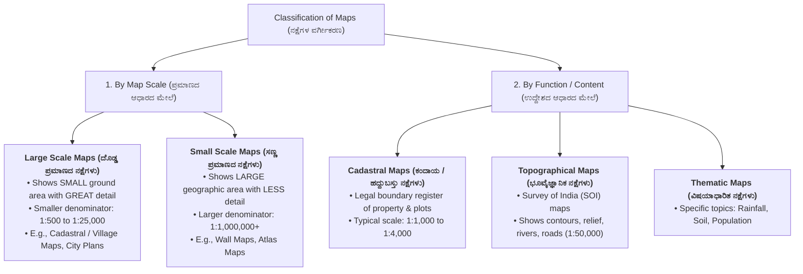
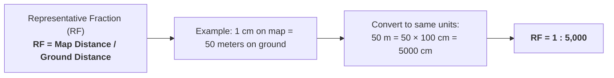
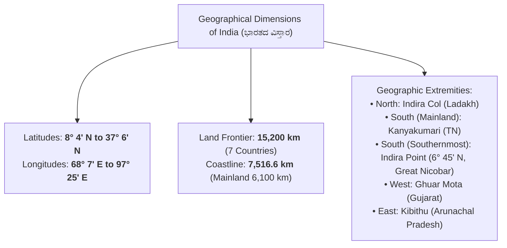
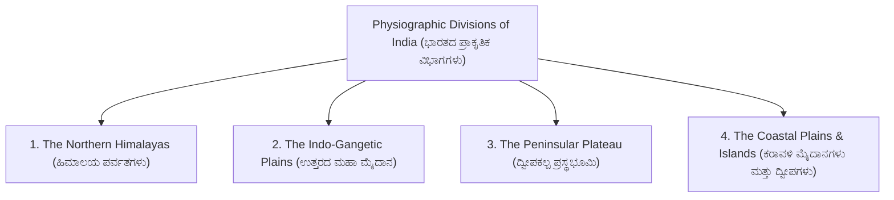
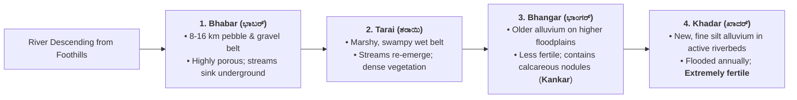
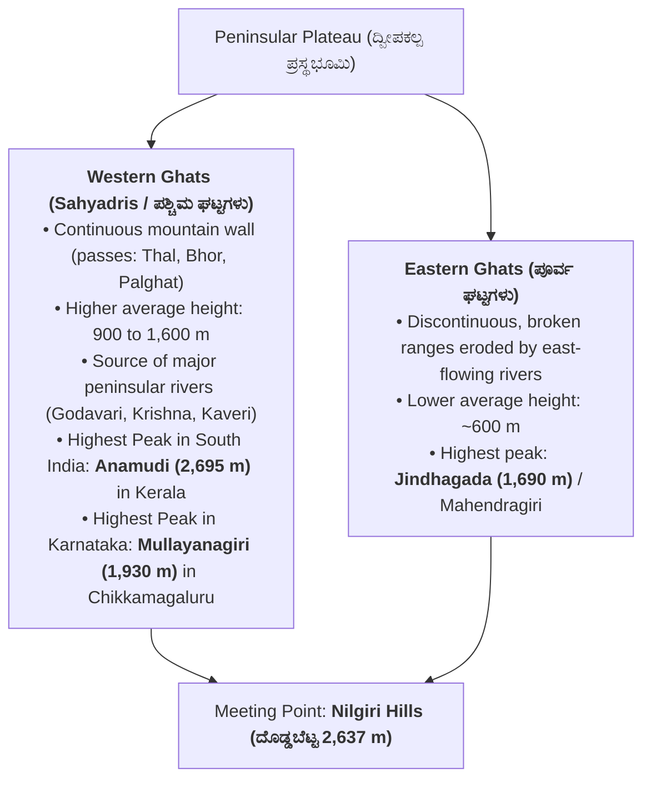
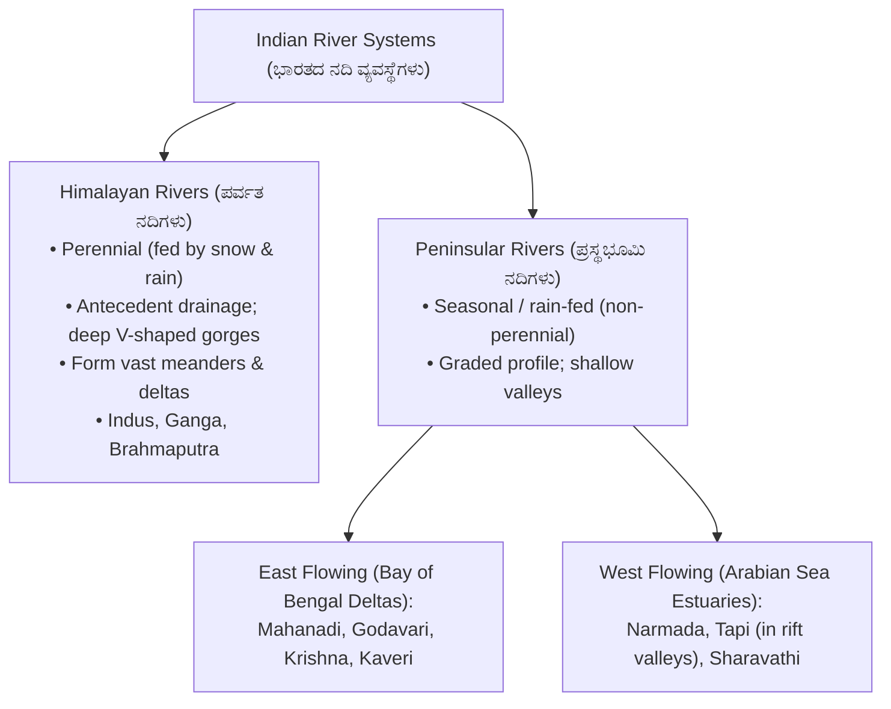

# 08. Cartography: Maps & Physical Features of India (ನಕ್ಷಾಶಾಸ್ತ್ರ ಮತ್ತು ಭಾರತದ ಪ್ರಾಕೃತಿಕ ಲಕ್ಷಣಗಳು)

> [!IMPORTANT] Exam Focus & Mark Potential
> - **Expected Weightage:** **5–6 Questions** in Paper-II (Second half of the 10-mark Geography section).
> - **Direct Syllabus Coverage:** `[P2-GEOG-6.4]` & `[P2-GEOG-6.5]` — Maps and Cartography (Cadastral vs Topographical vs Thematic, Large vs Small scale, Representative Fraction, Linear scale, conventional symbols) and Physical Features of India (Himalayas, Indo-Gangetic Plains Bhabar/Tarai/Bhangar/Khadar, Peninsular Plateau, Western vs Eastern Ghats, Coastal Plains, Islands, and Major River Systems).
> - **High-Frequency Formulas & Rules:**
>   - Representative Fraction (RF): $\mathbf{\text{RF} = \frac{\text{Map Distance}}{\text{Ground Distance}}}$ (both in identical units).
>   - Scale Magnitude Rule: **Smaller denominator = LARGER scale** ($1:1,000$ is much larger scale than $1:50,000$).
>   - Cadastral Maps are **Large Scale Maps** ($1:500$ to $1:4,000$).
>   - Physical Divisions: Bhabar (pebbles) $\to$ Tarai (marshy) $\to$ Bhangar (old alluvium / kankar) $\to$ Khadar (new flood alluvium).
>   - Highest Peaks: Anamudi ($2,695\text{ m}$) is highest in South India; Mullayanagiri ($1,930\text{ m}$) is highest in Karnataka.

---

## 1. Maps & Cartography Principles (`P2-GEOG-6.4`)



### Explanation of Cartographic Principles & Scale Architecture
Cartography is the science and art of designing, drafting, and interpreting maps. Because the Earth's 3D geoid surface cannot be flattened without distortion, scale defines the mathematical ratio between map distance and corresponding physical ground distance. In cadastral and land revenue administration, **Cadastral Maps** are large-scale records showing individual survey plot boundaries, tenure rights, and sub-divisions (Hissas).

---

### Representative Fraction (RF) & Graphical Scales



> [!IMPORTANT] The Golden Rule of Map Scales
> Candidates frequently confuse large vs. small scales:
> - A **Large Scale** map has a **smaller numerical denominator** in its RF (e.g., $1:1,000 > 1:50,000$). It zooms into a small plot with intense detail.
> - A **Small Scale** map has a **larger numerical denominator** in its RF (e.g., $1:1,000,000 < 1:10,000$). It covers an entire state or continent with generalized outlines.
> - **Graphical / Linear Scale Advantage:** When a map is reproduced, photocopied, or resized, statement scales become invalid, but a **graphical scale expands or contracts proportionally**, retaining its measurement integrity!

---

### Standard Conventional Cartographic Colors (Survey of India)

| Color on Map | Physical / Cultural Feature Represented | Cadastral / Topo Application |
| :--- | :--- | :--- |
| **Blue** (ನೀಲಿ) | Water features: Rivers, streams, lakes, ponds, canals, ocean | Boundary streams, village tanks (*kere*) |
| **Green** (ಹಸಿರು) | Vegetation: Forests, orchards, scrub, agricultural plantations | Reserve forest boundaries, Gomala grazing land |
| **Brown** (ಕಂದು) | Relief & Landforms: Contour lines, sand dunes, elevation numbers | Terrain elevation, hillock slopes |
| **Yellow** (ಹಳದಿ) | Cultivated agricultural land | Farmland parcels, cultivable patta land |
| **Red** (ಕೆಂಪು) | Man-made cultural features: Settlements, houses, roads, villages | Village Gaothan / Abadi limits, road networks |
| **Black** (ಕಪ್ಪು) | Administrative boundaries, railway lines, telephone lines, text | Survey boundary stones, village limits, railway tracks |

---

## 2. Physical Features of India: Geography & Boundaries (`P2-GEOG-6.5`)



### India's Terrestrial Land Neighbors

| Country | Shared Border Length | Bordering Indian States / UTs | Key Border Line Name |
| :--- | :---: | :--- | :--- |
| **Bangladesh** | **4,096.7 km** (Longest) | West Bengal, Assam, Meghalaya, Tripura, Mizoram | Radcliff Line (Zero Line) |
| **China** | 3,488 km | Ladakh, HP, Uttarakhand, Sikkim, Arunachal Pradesh | McMahon Line (Arunachal sector) |
| **Pakistan** | 3,323 km | Gujarat, Rajasthan, Punjab, J&K, Ladakh | Radcliff Line / Line of Control (LoC) |
| **Nepal** | 1,751 km | Uttarakhand, UP, Bihar, West Bengal, Sikkim | Open border |
| **Myanmar** | 1,643 km | Arunachal Pradesh, Nagaland, Manipur, Mizoram | Patkai & Arakan Hills |
| **Bhutan** | 699 km | Sikkim, West Bengal, Assam, Arunachal Pradesh | Peaceful Himalayan border |
| **Afghanistan** | **106 km** (Shortest) | Ladakh (PoK corridor) | Durand Line |

---

## 3. The Major Physiographic Divisions of India



### 1. The Northern Himalayan Ranges
- **Himadri (Greater Himalayas):** Highest continuous range (average elevation $6,000\text{ m}$). Peaks: Mount Everest ($8,848.86\text{ m}$ in Nepal), Kanchenjunga ($8,586\text{ m}$ in Sikkim - highest peak in undisputed Indian territory).
- **Himachal (Lesser Himalayas):** Rugged ranges (elevation $3,700\text{ to }4,500\text{ m}$). Includes Pir Panjal, Dhauladhar, and famous valleys (Kashmir, Kullu, Kangra).
- **Shiwaliks (Outer Himalayas):** Youngest foothills composed of unconsolidated sediments (elevation $900\text{ to }1,100\text{ m}$). Intermontane flat valleys are called **Duns** (e.g., Dehradun, Kotli Dun).
- **Trans-Himalayas:** Lies north of Great Himalayas; includes Karakoram range. **K2 / Godwin Austen ($8,611\text{ m}$)** is the 2nd highest peak in the world.

---

### 2. The Northern Great Plains (Alluvial Morphology)



---

### 3. Peninsular Plateau: Western Ghats vs. Eastern Ghats



---

### 4. Coastal Plains & Island Groups
- **Western Coastal Plains (Narrow strip along Arabian Sea):**
  - Konkan Coast (Maharashtra & Goa)
  - **Kanara / Karavali Coast (Karnataka)** — pristine beaches, estuaries, Netravati & Sharavathi river mouths.
  - Malabar Coast (Kerala) — characterized by saltwater lagoons (*Kayals* e.g., Vembanad Lake).
- **Eastern Coastal Plains (Wide strip along Bay of Bengal):**
  - Northern Circars (between Mahanadi and Krishna)
  - Coromandel Coast (between Krishna and Kaveri - receives retreating winter monsoon rains).
- **Islands of India:**
  - **Andaman & Nicobar Islands (Bay of Bengal):** Submerged volcanic summits. Separated by the **$10^\circ$ Channel**. India's only active volcano: **Barren Island**.
  - **Lakshadweep Islands (Arabian Sea):** Coral atolls. Separated from Maldives by **$8^\circ$ Channel**, and Minicoy from main group by **$9^\circ$ Channel**.

---

## 4. Drainage Systems of India: Himalayan vs. Peninsular Rivers



### Master Table of Major Peninsular Rivers

| River Name | Origin / Source | Major Tributaries | Key Multipurpose Dams / Falls |
| :--- | :--- | :--- | :--- |
| **Godavari** (*Dakshin Ganga*) | Trimbakeshwar (Nashik, Maharashtra) | Manjira, Pranhita, Indravati, Penganga | Polavaram Dam, Jayakwadi Dam (Longest peninsular river: $1,465\text{ km}$) |
| **Krishna** | Mahabaleshwar (Maharashtra) | **Tungabhadra**, Ghataprabha, Malaprabha, Bhima, Koyna | Almatti Dam (Lal Bahadur Shastri), Narayanpur Dam, Nagarjuna Sagar |
| **Kaveri** (*Jeevanadi of Karnataka*) | **Talakaveri (Brahmagiri Hills, Kodagu)** | Hemavati, Harangi, Shimsha, Arkavathi, Kabini, Bhavani | **Krishna Raja Sagara (KRS) Dam**, Mettur Dam, Shivanasamudra Falls |
| **Narmada** | Amarkantak Plateau (Madhya Pradesh) | Tawa, Hiran | Flows west through rift valley; Dhuandhar Falls, Sardar Sarovar Dam |
| **Tapi (Tapti)** | Betul District (Satpura Range, MP) | Purna | Flows west through rift valley parallel to Narmada; Ukai Dam |
| **Sharavathi** | Ambuthirtha (Thirthahalli, Karnataka) | Haridravathi | **Jog Falls (Gersoppa - 253 m)**, Linganamakki Dam |

---

## 5. Authentic Verbatim PYQs & High-Yield Questions

> [!NOTE] Verbatim Previous Year Questions (KEA / KPSC Cartography & Geography)
>
> **Q1. [KEA Land Surveyor PYQ]** In cartography, a village survey map drafted at a scale of $1:1,000$ compared to a district topographical map drafted at $1:50,000$ is classified as:
> - (A) A smaller scale map
> - (B) A larger scale map
> - (C) An equal scale map
> - (D) An aerial index map
>
> *Answer:* **(B) A larger scale map**
> *Explanation:* In representative fraction (RF), a smaller numerical denominator indicates a larger map scale. $\frac{1}{1000} > \frac{1}{50000}$, hence the $1:1,000$ map is a large-scale map showing individual parcels in high detail.
>
> ---
>
> **Q2. [KPSC PWD / Surveyor PYQ]** Which of the following physiographic sub-divisions of the Northern Great Plains consists of older alluvium containing calcareous deposits known as '*kankar*'?
> - (A) Bhabar
> - (B) Tarai
> - (C) Bhangar
> - (D) Khadar
>
> *Answer:* **(C) Bhangar**
> *Explanation:* Bhangar represents the older alluvial flood terrace above flood limits, characterized by clayey soil with nodular calcium carbonate concretions called *kankar*. Khadar is newer fertile flood silt.
>
> ---
>
> **Q3. [KEA Land Surveyor PYQ]** What is the highest mountain peak in the state of Karnataka?
> - (A) Kudremukh
> - (B) Mullayanagiri
> - (C) Pushpagiri
> - (D) Tadiandamol
>
> *Answer:* **(B) Mullayanagiri**
> *Explanation:* Mullayanagiri in the Chandra Drona / Baba Budangiri range of Chikkamagaluru district is Karnataka's highest peak at an elevation of $1,930\text{ meters}$ ($6,330\text{ ft}$).
>
> ---
>
> **Q4. [KPSC Technical Officer PYQ]** Which water body separates the Andaman group of islands from the Nicobar group of islands in the Bay of Bengal?
> - (A) Nine Degree Channel
> - (B) Ten Degree Channel
> - (C) Palk Strait
> - (D) Duncan Passage
>
> *Answer:* **(B) Ten Degree Channel**
> *Explanation:* The $10^\circ\text{ N}$ parallel of latitude forms the Ten Degree Channel separating the Andaman Islands from the Nicobar Islands.
>
> ---
>
> **Q5. [KEA Land Surveyor PYQ]** Which of the following major peninsular rivers flows westward through a rift valley into the Arabian Sea?
> - (A) Mahanadi
> - (B) Krishna
> - (C) Godavari
> - (D) Narmada
>
> *Answer:* **(D) Narmada**
> *Explanation:* The Narmada and Tapi rivers flow westward in tectonic rift valleys between the Vindhya and Satpura ranges, draining into the Gulf of Khambhat (Arabian Sea) without forming deltas.

---

## 6. Quick Revision Box (ಕಡ್ಡಾಯವಾಗಿ ನೆನಪಿಡಬೇಕಾದ ಮುಖ್ಯಾಂಶಗಳು)

```markdown
┌─────────────────────────────────────────────────────────────────────────────┐
│                       CARTOGRAPHY & INDIAN GEOGRAPHY CHEAT SHEET            │
├─────────────────────────────────────────────────────────────────────────────┤
│ 1. Large Scale = Small Denominator (Cadastral 1:1,000; high parcel detail). │
│ 2. Small Scale = Large Denominator (Atlas 1:1,000,000; broad continent).    │
│ 3. Linear Scale: Remains accurate when maps are photocopied or enlarged.   │
│ 4. Colors: Blue=Water, Green=Forest, Red=Roads/Settlement, Yellow=Farmland. │
│ 5. India Borders: Longest = Bangladesh (4,096 km); Shortest = Afghan (106 km)│
│ 6. Great Plains: Bhabar (pebbles) → Tarai (swamp) → Bhangar (old) → Khadar. │
│ 7. Western Ghats: Continuous; Anamudi (2,695 m, highest in S. India);       │
│    Mullayanagiri (1,930 m, highest in Karnataka).                           │
│ 8. Channels: 10° Channel separates Andaman & Nicobar; 8° Channel: Laksh/Mald│
│ 9. Peninsular Rivers: Longest = Godavari (1,465 km). West-flowing = Narmada.│
│ 10. Kaveri: Originates at Talakaveri (Kodagu); KRS Dam, Jog on Sharavathi.  │
└─────────────────────────────────────────────────────────────────────────────┘
```
