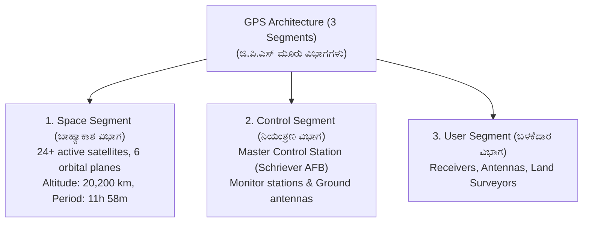
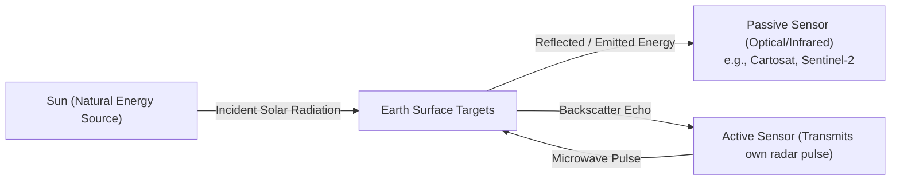
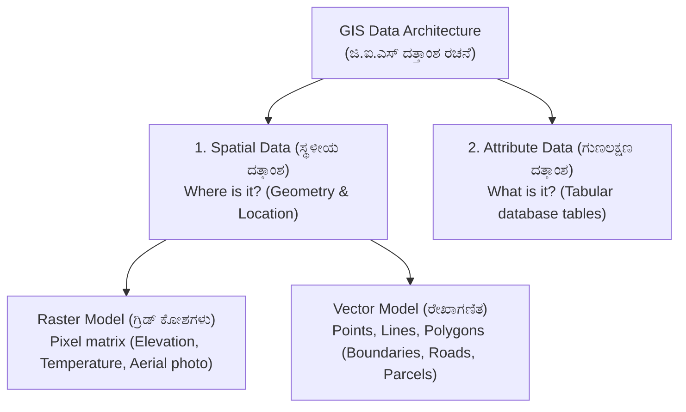

# 08. GPS, GIS & Remote Sensing (ಜಿ.ಪಿ.ಎಸ್, ಜಿ.ಐ.ಎಸ್ & ದೂರ ಸಂವೇದಿ)

> [!IMPORTANT] Exam Focus & Mark Potential
> - **Expected Weightage:** 12–14 Questions in Paper-II.
> - **Core Concepts Tested:** GPS 3 segments, Minimum satellites for 3D fix (4 satellites), Global constellations (NAVSTAR, GLONASS, Galileo, BeiDou, NavIC), DGPS vs RTK accuracy, Active vs Passive remote sensing, 4 RS resolutions, Raster vs Vector GIS data models, and UTM projection parameters.
> - **India Special:** **NavIC (IRNSS)** operates with **7 satellites** (3 Geostationary + 4 Geosynchronous) covering India and up to **1,500 km** beyond its borders.

---

## 1. Global Positioning System (GPS) Architecture

GPS (NAVSTAR - Navigation Satellite Timing and Ranging) is a satellite-based radio navigation system owned by the United States Government and operated by the US Space Force.



### Key Satellite Positioning Rules
- **Trilateration Principle:** GPS positioning works by calculating the distance (pseudorange) from multiple satellites of known orbital positions using the formula $\text{Distance} = \text{Speed of Light} \times \Delta t$.
- **Minimum Satellites for 3D Fix:** **4 Satellites** are mandatory to solve for four unknowns:
  1. $X$ (Latitude coordinate)
  2. $Y$ (Longitude coordinate)
  3. $Z$ (Ellipsoidal height)
  4. $t$ (Receiver clock error / bias)
  *(If receiver clock was atomic, 3 satellites would suffice, but cheap quartz receiver clocks require the 4th satellite to eliminate timing bias).*
- **GDOP (Geometric Dilution of Precision):** A multiplier describing how satellite geometry affects positional accuracy.
  - Satellites widely dispersed across the sky $\implies$ **Low GDOP ($< 2$) $\implies$ Excellent Accuracy**.
  - Satellites clustered closely together $\implies$ **High GDOP ($> 6$) $\implies$ Poor Accuracy**.

---

## 2. World Satellite Navigation Constellations (GNSS Matrix)

| Constellation | Country / Agency | Operational Satellites | Orbital Altitude | Coverage |
| :--- | :--- | :---: | :---: | :--- |
| **GPS (NAVSTAR)** | United States | 24–31 | $20,200\text{ km}$ | Global |
| **GLONASS** | Russia | 24 | $19,100\text{ km}$ | Global |
| **Galileo** | European Union | 24–30 | $23,222\text{ km}$ | Global (Civilian operated) |
| **BeiDou (BDS)** | China | 35 | $21,150\text{ km}$ | Global |
| **NavIC (IRNSS)** | **India (ISRO)** | **7 satellites** (3 GEO + 4 GSO) | **$36,000\text{ km}$** | **Regional** (India + $1,500\text{ km}$ border zone) |
| **QZSS (Michibiki)** | Japan | 4 (Quasi-zenith) | $32,000–40,000\text{ km}$ | Regional (Asia-Oceania) |

---

## 3. High-Precision Surveying: DGPS vs RTK

- **Autonomous Standard GPS:** Uses single receiver; subject to ionospheric delay, tropospheric delay, and ephemeris errors. Accuracy: **$3\text{ to }10\text{ metres}$**.
- **Differential GPS (DGPS - ಡಿ.ಜಿ.ಪಿ.ಎಸ್):**
  - Uses a stationary **Base station** placed at a known benchmark and a mobile **Rover station**.
  - Base computes pseudorange error corrections and transmits them to the rover.
  - Accuracy: **$0.5\text{ to }1.0\text{ metre}$**.
- **Real-Time Kinematic (RTK - ಆರ್.ಟಿ.ಕೆ):**
  - Measures the phase of the satellite carrier wave ($L_1/L_2$) rather than the binary code.
  - Provides instantaneous centimetre-level coordinates (**$1\text{ to }2\text{ cm}$ accuracy**).
  - Used in modern cadastral surveys under Karnataka's SVAMITVA and Mojini digital programs.

---

## 4. Remote Sensing Fundamentals (ದೂರ ಸಂವೇದಿ)

Remote sensing is the science of acquiring information about the Earth's surface without entering into physical contact with it, by recording and analyzing electromagnetic radiation.



### Active vs Passive Remote Sensing
- **Passive Remote Sensing:** Sensors record energy naturally reflected (sunlight) or emitted (thermal infrared) by the target. (e.g., Photography, Landsat, Cartosat). Cannot operate in complete darkness or through heavy clouds.
- **Active Remote Sensing:** The sensor provides its own source of electromagnetic illumination. It emits a pulse and measures the reflected return echo. (e.g., **RADAR, LiDAR, Sonar**). Can operate day and night, and penetrates cloud cover.

### The Four Core Resolutions in Remote Sensing
1. **Spatial Resolution:** The minimum ground area represented by a single image pixel (e.g., Cartosat-3 has high spatial resolution of $\approx 0.28\text{ m}$).
2. **Spectral Resolution:** The number and wavelength width of spectral bands recorded (Panchromatic = 1 broad band; Multispectral = 3–10 bands; Hyperspectral = hundreds of narrow contiguous bands).
3. **Radiometric Resolution:** The sensitivity of the sensor to slight differences in radiant energy, measured in bits ($8\text{-bit} = 256\text{ gray levels}$, $16\text{-bit} = 65,536\text{ levels}$).
4. **Temporal Resolution:** The revisit time interval of the satellite over the exact same geographic location (e.g., 5 days, 16 days).

### Vegetation Spectral Signature
- Healthy green vegetation strongly absorbs **Blue** and **Red** light (via chlorophyll for photosynthesis).
- It reflects **Green** light (hence looks green).
- It displays an extreme, dramatic reflectance spike in the **Near-Infrared (NIR, $0.7-1.1\,\mu\text{m}$)** due to spongy mesophyll leaf cell structure (the "Red Edge").
- **NDVI Formula (Normalized Difference Vegetation Index):**
  $$\mathbf{NDVI = \frac{\text{NIR} - \text{Red}}{\text{NIR} + \text{Red}}}$$
  (Values range from $-1$ to $+1$; healthy dense crops have NDVI between $0.6\text{ and }0.9$).

---

## 5. Geographic Information System (GIS) Architecture

GIS is a computer-based system designed to capture, store, manipulate, analyze, manage, and display all kinds of spatial or geographical data.



### Raster vs Vector Data Models

| Characteristic | Vector Data Model (ವೆಕ್ಟರ್) | Raster Data Model (ರಾಸ್ಟರ್) |
| :--- | :--- | :--- |
| **Basic Unit** | Coordinate points $(X, Y)$ forming vertices. | Uniform grid of square cells / pixels. |
| **Primitive Elements** | **Points** (Wells, trees), **Lines** (Streams, roads), **Polygons** (Land parcels, lakes). | Grid matrix with a single value assigned to each cell. |
| **Best Used For** | Discrete features with sharp boundaries (Cadastral land parcels, survey plots). | Continuous surfaces (Digital Elevation Models - DEM, satellite imagery, slope maps). |
| **Storage & Topology** | Compact file size; explicit network topology. | Large file size; complex topology. |

### Universal Transverse Mercator (UTM) Coordinate System
- Divides the Earth between $80^\circ\text{ S}$ and $84^\circ\text{ N}$ into **60 zones**.
- Each zone spans **$6^\circ$ of longitude** width.
- Zone 1 begins at the $180^\circ$ International Date Line moving east.
- Karnataka spans **UTM Zone 43N** ($72^\circ\text{E to }78^\circ\text{E}$) and **Zone 44N** ($78^\circ\text{E to }84^\circ\text{E}$).
- Standard GPS Datum: **WGS-84 (World Geodetic System 1984)**.

---

## 6. High-Yield Mnemonics

> [!NOTE] Memory Aids
> - **Minimum Satellites: "Four for Four"**
>   - **4** satellites solve **4** unknowns: $X, Y, Z$, and receiver clock time $t$.
> - **India's NavIC Count: "Lucky Seven NavIC"**
>   - **7** operational satellites ($3\text{ GEO} + 4\text{ GSO}$).
> - **Active vs Passive: "Active Actively Illuminates"**
>   - **A**ctive sends its own signal (RADAR, LiDAR); **P**assive relies on the Sun.
> - **NDVI Equation: "NIR minus Red over NIR plus Red"**
>   - Always subtract Red from NIR; divide by their sum.

---

## 7. Likely Exam Questions & PYQ Patterns

1. **[KEA Land Surveyor PYQ]** *How many satellites are minimum required to determine the precise three-dimensional position and clock error of a GPS receiver?*
   - **Answer:** 4 satellites.
2. **[KEA PYQ]** *The Indian regional satellite navigation system developed by ISRO is named:*
   - **Answer:** NavIC (Navigation with Indian Constellation) / IRNSS.
3. **[Expected Question]** *Which remote sensing sensor is an active sensor?*
   - **Answer:** RADAR (Radio Detection and Ranging) / LiDAR.
4. **[Expected Question]** *In GIS, cadastral property boundaries and survey numbers are best represented by which data model?*
   - **Answer:** Vector data model (Polygon features).
5. **[Expected Question]** *The Universal Transverse Mercator (UTM) grid divides the Earth into 60 longitudinal zones, each having a width of:*
   - **Answer:** $6^\circ$ longitude.

---

## 8. Quick Revision Box

```
┌────────────────────────────────────────────────────────────────────────┐
│ GPS, GIS & REMOTE SENSING REVISION CHEAT SHEET                         │
├────────────────────────────────────────────────────────────────────────┤
│ • GPS: 24+ satellites in 6 orbital planes at 20,200 km altitude.       │
│ • Minimum 4 satellites needed for 3D fix (X, Y, Z, t).                 │
│ • Low GDOP (<2) = High accuracy. High GDOP (>6) = Poor accuracy.       │
│ • NavIC (ISRO): 7 satellites (3 GEO + 4 GSO), 1500 km regional coverage│
│ • DGPS: Sub-meter | RTK: Carrier phase centimeter level (1-2 cm).      │
│ • Passive RS: Sun's energy (Cartosat) | Active RS: Emits pulse (RADAR).│
│ • 4 Resolutions: Spatial, Spectral, Radiometric (bits), Temporal (days)│
│ • NDVI = (NIR - Red) / (NIR + Red). Vegetation reflects high NIR.      │
│ • GIS Vector: Points, Lines, Polygons (Cadastral parcels).             │
│ • GIS Raster: Grid cells/pixels (DEM, satellite images).               │
│ • UTM: 60 zones of 6° longitude each. Karnataka is Zone 43N & 44N.     │
└────────────────────────────────────────────────────────────────────────┘
```

---
*Related Notes:*
- [[07_Total_Station_and_EDM]]
- [[09_Survey_Mathematics_and_Applied_Physics]]
- [[10_Karnataka_Land_Records_Bhoomi_Mojini_Dishank]]
