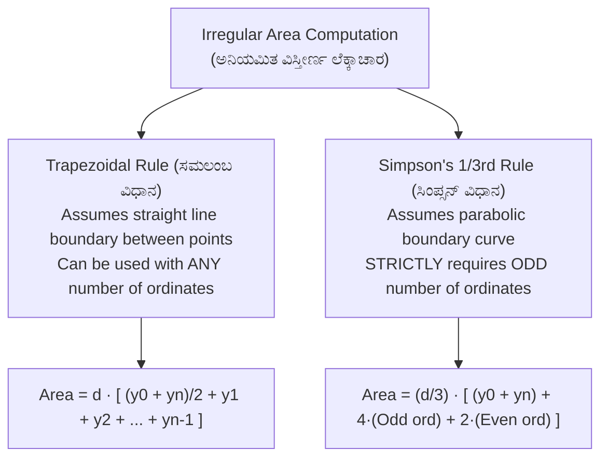
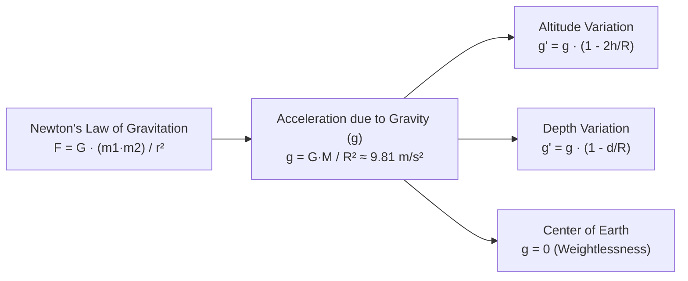

# 09. Survey Mathematics & Applied Physics (ಗಣಿತ & ಅನ್ವಯಿಕ ಭೌತಶಾಸ್ತ್ರ)

> [!IMPORTANT] Exam Focus & Mark Potential
> - **Expected Weightage:** 8–10 Questions in Paper-II.
> - **Core Concepts Tested:** Area calculations (Trapezoidal vs Simpson's rule), Prismoidal formula for earthwork volume, Planimeter zero-circle constant ($M \cdot C$), Coordinate area determinant, Gravitation ($g$ variation with depth and altitude), Mass vs Weight, and Barometric levelling.
> - **Rule Alert:** **Simpson's Rule** strictly requires an **ODD number of ordinates** (even number of strips).

---

## 1. Area Computation from Field Offsets

When computing land parcel areas with irregular or curved boundaries, perpendicular offsets ($y_0, y_1, y_2, \dots, y_n$) are measured at uniform common interval $d$ along a base line.



### Formulas Comparison Matrix

| Property | Trapezoidal Rule | Simpson's One-Third Rule |
| :--- | :--- | :--- |
| **Boundary Assumption** | Boundary between offsets is assumed to be a **straight line** (series of trapezoids). | Boundary between offsets is assumed to follow a **parabolic curve**. |
| **Number of Ordinates** | Applicable to **any number** of ordinates (odd or even). | Applicable **ONLY to an ODD number** of ordinates (even number of intervals). |
| **Precision** | Less accurate; underestimates concave areas, overestimates convex areas. | **Significantly more accurate**; preferred engineering standard. |
| **Formula** | $\text{Area} = d \left[ \frac{y_0 + y_n}{2} + y_1 + y_2 + \dots + y_{n-1} \right]$ | $\text{Area} = \frac{d}{3} \left[ (y_0 + y_n) + 4 \sum y_{\text{even indices}} + 2 \sum y_{\text{odd indices}} \right]$ |

---

## 2. Polar Planimeter & Zero Circle (ಪ್ಲಾನಿಮೀಟರ್)

A planimeter is a mechanical drafting instrument used to measure the area of any irregularly shaped two-dimensional figure plotted on paper.
$$\mathbf{\text{Area} = M (F - I \pm 10N + C)}$$
- $M$ = Initial multiplying constant (scale factor).
- $I, F$ = Initial and Final roller readings.
- $N$ = Number of complete revolutions of the dial disc (positive if clockwise, negative if counter-clockwise).
- $C$ = Constant added **only when the anchor (needle) point is kept INSIDE the figure**. (When anchor point is kept outside, $C = 0$).

### Zero Circle / Circle of Correction (ಶೂನ್ಯ ವೃತ್ತ)
- If the tracing point is guided along the circumference of a specific circle with the anchor point fixed at the center, the measuring wheel **slides purely tangentially without rotating at all** (reading remains zero).
- This circle is known as the **Zero Circle**.
- Area of the Zero Circle $= \mathbf{M \cdot C}$.

---

## 3. Earthwork Volume Formulas (ಭೂ-ಅಗೆತದ ಪರಿಮಾಣ)

For cross-sectional areas $A_0, A_1, A_2, \dots, A_n$ spaced at constant interval $d$:

1. **Trapezoidal Rule for Volume (Average End Area Method):**
   $$V_{\text{trap}} = d \left[ \frac{A_0 + A_n}{2} + A_1 + A_2 + \dots + A_{n-1} \right]$$
2. **Prismoidal Formula (Simpson's Rule for Volume):**
   $$V_{\text{prism}} = \frac{d}{3} \left[ (A_0 + A_n) + 4(A_1 + A_3 + \dots) + 2(A_2 + A_4 + \dots) \right]$$
   - Requires an odd number of cross-sections.
3. **Prismoidal Correction ($C_p$):**
   $$C_p = V_{\text{trap}} - V_{\text{prism}}$$
   - Prismoidal correction is **ALWAYS SUBTRACTIVE** from the volume calculated by the trapezoidal method!

---

## 4. Coordinate Geometry in Land Surveying

For a closed parcel with corner coordinates $(x_1, y_1), (x_2, y_2), \dots, (x_n, y_n)$:
$$\mathbf{\text{Area} = \frac{1}{2} |(x_1 y_2 + x_2 y_3 + \dots + x_n y_1) - (y_1 x_2 + y_2 x_3 + \dots + y_n x_1)|}$$

### Triangle Coordinate Determinant
$$\text{Area of } \Delta = \frac{1}{2} |x_1(y_2 - y_3) + x_2(y_3 - y_1) + x_3(y_1 - y_2)|$$

---

## 5. Applied Physics: Gravitation & Mechanics

The KEA syllabus includes core physical principles governing surveying levels, plumb bobs, and atmospheric instruments.



### Key Physics Concepts Matrix

| Topic / Principle | Law / Formula | Key Physical Implication in Surveying |
| :--- | :---: | :--- |
| **Gravitational Acceleration ($g$)** | $g = \frac{G M}{R^2} \approx 9.81\text{ m/s}^2$ | Maximum at **Poles** ($R$ is minimum); Minimum at **Equator** ($R$ is maximum). |
| **Variation with Altitude ($h$)** | $g' \approx g \left(1 - \frac{2h}{R}\right)$ | Gravity decreases linearly with elevation above Earth surface. |
| **Variation with Depth ($d$)** | $g' = g \left(1 - \frac{d}{R}\right)$ | Gravity decreases linearly down to **Zero at Earth's center**. |
| **Mass vs Weight** | $\text{Weight } W = m \cdot g$ | Mass is an intrinsic scalar (constant everywhere in kg); Weight is a downward vector (in Newtons) which vanishes at Earth's center. |
| **Atmospheric Pressure & Altitude** | $P = \rho g h$ | Pressure drops by $\approx 1\text{ cm of Hg}$ per $100\text{ m}$ elevation rise; basis of barometric levelling altimeters. |
| **Torricelli's Barometer** | $1\text{ atm} = 760\text{ mm of Hg} = 101.325\text{ kPa}$ | Standard atmospheric pressure at sea level. |

---

## 6. High-Yield Mnemonics

> [!NOTE] Memory Aids
> - **Simpson's Rule Prerequisite: "Simpson is Odd"**
>   - Simpson's 1/3rd rule requires an **ODD number of ordinates**.
> - **Planimeter Anchor Inside: "Constant inside, Zero outside"**
>   - Add constant $C$ only when anchor point is **Inside** the figure.
> - **Prismoidal Correction: "Prismoidal is Punitive (-)"**
>   - Prismoidal correction is **always subtracted** from the trapezoidal volume.
> - **Gravity Extremes: "Poles Peak, Equator Eases"**
>   - $g$ is **highest at Poles**, **lowest at Equator**.

---

## 7. Likely Exam Questions & PYQ Patterns

1. **[KEA Land Surveyor PYQ]** *In calculating area by Simpson's rule, the number of ordinates must be:*
   - **Answer:** Odd.
2. **[KEA PYQ]** *The constant C in a planimeter formula is added when:*
   - **Answer:** The anchor point is placed inside the boundary of the figure.
3. **[Expected Question]** *Calculate the area of a strip with 3 ordinates of lengths 2 m, 4 m, and 6 m spaced at 5 m interval using Simpson's rule:*
   - $\text{Area} = \frac{d}{3} [y_0 + y_2 + 4 y_1] = \frac{5}{3} [2 + 6 + 4(4)] = \frac{5}{3} [8 + 16] = \frac{5}{3} \times 24 = \mathbf{40\text{ m}^2}$.
4. **[Expected Question]** *The acceleration due to gravity at the center of the Earth is:*
   - **Answer:** Zero ($0\text{ m/s}^2$).
5. **[Expected Question]** *The prismoidal correction for volume computation is always:*
   - **Answer:** Negative (subtractive from trapezoidal volume).

---

## 8. Quick Revision Box

```
┌────────────────────────────────────────────────────────────────────────┐
│ SURVEY MATHEMATICS & PHYSICS REVISION CHEAT SHEET                      │
├────────────────────────────────────────────────────────────────────────┤
│ • Trapezoidal Area: Assumes straight boundary. Any number of ordinates.│
│ • Simpson's 1/3rd: Assumes parabolic boundary. Strictly ODD ordinates. │
│ • Planimeter: Area = M(F - I ± 10N + C). Zero circle Area = M · C.     │
│ • Prismoidal Correction Cp = Vtrap - Vprism (Always subtractive!).     │
│ • Coordinate Area = 1/2 |∑(x_i · y_{i+1} - y_i · x_{i+1})|.           │
│ • g at poles > g at equator (Earth is oblate spheroid).                │
│ • g at center of Earth = 0. Weight of body at Earth's center = 0.      │
│ • Mass is constant (kg) | Weight varies with gravity (N).              │
│ • Standard Atmospheric Pressure = 760 mm Hg = 101.325 kPa.             │
└────────────────────────────────────────────────────────────────────────┘
```

---
*Related Notes:*
- [[01_Chain_Surveying_and_Linear_Measurements]]
- [[03_Levelling_and_Contouring]]
- [[08_GPS_GIS_and_Remote_Sensing]]
