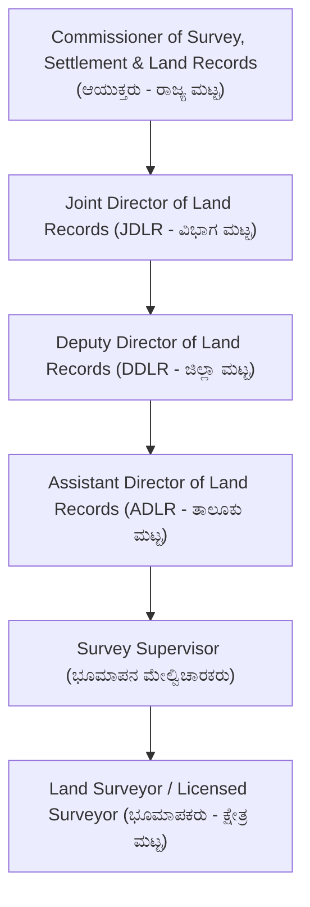
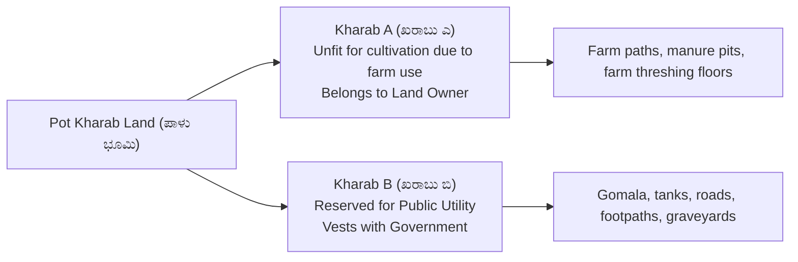
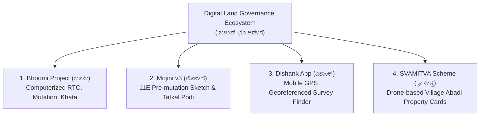

# 10. Karnataka Land Records, Bhoomi, Mojini & Dishank (ಭೂ ದಾಖಲೆಗಳು & ಮೋಜಣಿ ವ್ಯವಸ್ಥೆ)

> [!IMPORTANT] Exam Focus & Mark Potential
> - **Expected Weightage:** 8–10 Questions in Paper-II.
> - **Core Concepts Tested:** Hierarchy of SSLR department, Traditional land records (Akarband, Tippan, Atlas, Pakka book), Pot Kharab classification (Kharab A vs Kharab B), Bhoomi software workflow, Mojini v3 (11E sketch, Tatkal Podi), Dishank App features, and SVAMITVA drone survey.
> - **High-Frequency Trap:** **Kharab A** land belongs to the private owner (tax-exempt farm structures); **Kharab B** land vests strictly in the **Government for public utility** (roads, canals, graveyards) and can never be alienated!

---

## 1. Administrative Hierarchy: Department of Survey Settlement & Land Records (SSLR)

The Department of Survey Settlement and Land Records (ಭೂಮಾಪನ ಕಂದಾಯ ವ್ಯವಸ್ಥೆ ಮತ್ತು ಭೂದಾಖಲೆಗಳ ಇಲಾಖೆ) functions under the Karnataka Revenue Department.



---

## 2. Traditional Land Records & Technical Documents

Karnataka possesses one of the world's most detailed historical cadastral survey frameworks established during the British Mysore Revenue Survey (1863–1904).

| Land Document | Official Term / Purpose | Core Technical Contents & Significance |
| :--- | :--- | :--- |
| **Tippan (ಟಿಪ್ಪಣಿ)** | Original Field Measurement Sketch | Hand-drawn field survey sketch prepared at the time of original survey. Shows the base line, cross-staff offsets, diagonal check lines, and exact boundary dimensions of a survey number. |
| **Akarband (ಆಕಾರಬಂಧ)** | Village Assessment Register | Official register prepared from the survey settlement. Details total land extent, Kharab land, cultivable area, soil classification, and assessed land revenue. |
| **Atlas (ಅಟ್ಲಾಸ್)** | Cadastral Map (ಗ್ರಾಮ ನಕಾಶೆ) | Visual map of the entire revenue village showing boundaries of all survey numbers, water bodies, cart tracks, village sites, and forest fringes. |
| **Pakka Book (ಪಕ್ಕಾ ಪುಸ್ತಕ)** | Calculation Register | Computational logbook showing detailed step-by-step mathematical calculations of parcel areas derived from base lines and offset triangles in Tippan. |
| **RTC / Pahani (ಪಹಣಿ - ಫಾರಂ 16)** | Record of Rights, Tenancy & Crops | Legal document showing ownership (Column 9), liabilities/bank loans (Column 11), and crop/cultivation details (Column 12). |
| **Katha Extract (ಖಾತಾ)** | Municipal / Panchayat Property Register | Property tax liability assessment account certifying ownership for municipal taxation. |

---

## 3. Pot Kharab Land Classification (ಪಾಳು ಭೂಮಿ ವರ್ಗೀಕರಣ)

Under Rule 21(2) of the Karnataka Land Revenue Rules, 1966, uncultivable lands inside a survey number are categorized as Pot Kharab:



### Kharab A vs Kharab B Matrix

| Parameter | Kharab A (ಖರಾಬು 'ಎ') | Kharab B (ಖರಾಬು 'ಬಿ') |
| :--- | :--- | :--- |
| **Legal Nature** | Uncultivated land used for agriculture-supporting infrastructure (farm roads, threshing floors, wells, farmhouses). | Land reserved strictly for public, community, or state utility. |
| **Ownership** | **Vests with the Private Land Owner**. | **Vests entirely with the Government of Karnataka**. |
| **Tax Assessment** | Exempted from land revenue assessment. | Exempted from private assessment. |
| **Sale / Alienation** | Can be sold along with the main survey number. | **Cannot be sold, leased, encroached, or alienated**. |

---

## 4. Modern Digital Land Portals: Bhoomi, Mojini & Dishank



### 1. Bhoomi Project (ಭೂಮಿ ತಂತ್ರಾಂಶ)
- Pioneered in 2000–2002 under the leadership of IAS officer **Rajeev Chawla**.
- Fully digitized over 20 million rural land records across all 31 districts of Karnataka.
- Eliminates manual tampering by Village Accountants through biometric and digital signatures.
- **RTC (Pahani) Retrieval:** Enables farmers to obtain digitally signed land titles from any Grama One / Nada Kacheri kiosk.

### 2. Mojini v3 System (ಮೋಜಣಿ v3)
- An online end-to-end workflow software for managing all land survey requests in Karnataka.
- **11E Sketch (ನಮೂನೆ 11E):**
  - Mandatory pre-mutation survey sketch introduced under Section 131(c) of the Karnataka Land Revenue Act.
  - Before any portion of a survey number can be registered for sale, a licensed/government surveyor must physically measure the plot and generate an online digital 11E sketch.
- **Tatkal Podi (ತತ್ಕಾಲ್ ಪೋಡಿ):** A fast-track digital scheme to partition joint family lands and issue distinct, independent survey numbers (Hissa / ಹಿಸ್ಸಾ) to each legal owner.

### 3. Dishank Mobile Application (ದಿಶಾಂಕ್ ಆಪ್)
- Developed by the **Karnataka State Remote Sensing Applications Centre (KSRSAC)** in collaboration with the Bhoomi Monitoring Cell.
- **Functionality:** Uses the smartphone's real-time **GPS location** overlaid on digitized cadastral village maps.
- Instantly informs any citizen or surveyor standing on a field:
  - Exact Survey Number
  - Village, Hobli, and Taluk names
  - Extent of land and land classification
  - Whether the land is Gomala (grazing land), Lake buffer, Forest, or private land (prevents fraudulent real estate purchases).

### 4. SVAMITVA Scheme (ಸ್ವಾಮಿತ್ವ ಯೋಜನೆ)
- **Full Form:** *Survey of Villages and Mapping with Improvised Technology in Village Areas*.
- Joint collaboration between Ministry of Panchayati Raj, Survey of India, and Karnataka Revenue/RDPR departments.
- Employs **high-resolution camera drones** and **Continuously Operating Reference Stations (CORS)** to survey rural residential (Grama Thana / Abadi) inhabited parcels to issue legal Property Ownership Cards.

---

## 5. High-Yield Mnemonics

> [!NOTE] Memory Aids
> - **Kharab Lands: "A is for Agriculturist, B is for Bharat/Building"**
>   - Kharab **A** belongs to the **A**griculturist/farmer.
>   - Kharab **B** belongs to the **B**harat (State/Public).
> - **SSLR Hierarchy Order: "C-J-D-A-S-L"**
>   - **C**ommissioner $\to$ **J**oint Director $\to$ **D**eputy Director $\to$ **A**ssistant Director $\to$ **S**upervisor $\to$ **L**and Surveyor.
> - **11E Sketch Rule: "11E before you Exchange"**
>   - Form **11E** sketch is required **before registration/sale**.

---

## 6. Likely Exam Questions & PYQ Patterns

1. **[KEA Land Surveyor PYQ]** *Which sketch is legally mandatory under the Karnataka Land Revenue Act prior to the registration of a partitioned agricultural land parcel?*
   - **Answer:** 11E Sketch generated through the Mojini system.
2. **[KEA PYQ]** *Land classified as 'Kharab B' under the Karnataka Land Revenue Rules:*
   - **Answer:** Vests in the Government and is reserved for public purposes like roads, tanks, or graveyards.
3. **[Expected Question]** *The mobile application developed by KSRSAC that allows users to identify their exact survey number using smartphone GPS is:*
   - **Answer:** Dishank (ದಿಶಾಂಕ್).
4. **[Expected Question]** *In Karnataka land records, the original field measurement sketch containing base line and perpendicular offsets is called:*
   - **Answer:** Tippan (ಟಿಪ್ಪಣಿ).
5. **[Expected Question]** *The SVAMITVA scheme utilizes which modern surveying technology to map rural village abadi areas?*
   - **Answer:** High-resolution Drone Surveying combined with CORS network.

---

## 7. Quick Revision Box

```
┌────────────────────────────────────────────────────────────────────────┐
│ KARNATAKA LAND RECORDS REVISION CHEAT SHEET                            │
├────────────────────────────────────────────────────────────────────────┤
│ • SSLR: Dept of Survey Settlement and Land Records (ADLR at Taluk).   │
│ • Tippan: Original field offset measurement sketch.                    │
│ • Akarband: Land classification, assessment rates & total area.        │
│ • Atlas: Cadastral village map showing survey number boundaries.       │
│ • RTC / Pahani (Form 16): Col 9 (Owner), Col 11 (Loans), Col 12 (Crops)│
│ • Kharab A: Private farmer's land (threshing floor, well, farm road).  │
│ • Kharab B: Government public land (lake, road, burial ground, gomala).│
│ • Bhoomi: Digitized 20M+ land records (Rajeev Chawla, 2000-2002).     │
│ • Mojini v3: 11E pre-mutation sketch, Tatkal Podi, Phodi workflow.     │
│ • Dishank App: KSRSAC GPS app showing survey number in real-time.     │
│ • SVAMITVA: Drone mapping of rural abadi for property cards.           │
└────────────────────────────────────────────────────────────────────────┘
```

---
*Related Notes:*
- [[01_Chain_Surveying_and_Linear_Measurements]]
- [[07_Total_Station_and_EDM]]
- [[08_GPS_GIS_and_Remote_Sensing]]
