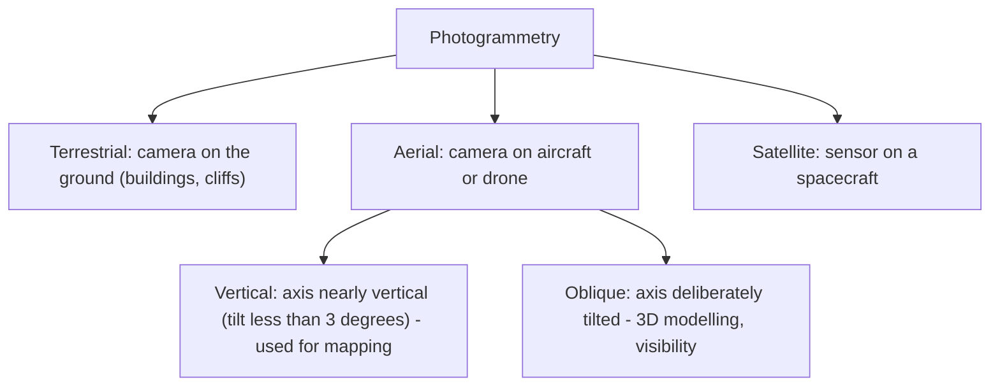
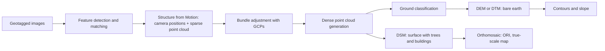

# 14. Photogrammetry, Aerial Survey & Drone (UAV) Survey

> [!IMPORTANT] Exam focus
> The notified syllabus lists: introduction, definition, basic principles, methods, importance of **scale and height**, applications — then **drone types, survey planning, GCPs, image acquisition, SfM, point cloud, DEM/DSM, orthomosaic (ORI), software**. Expect definition and "which term matches which step" MCQs, plus 1–2 formula questions.

---

## 1. Photogrammetry — definition and classification

**Photogrammetry** is the science and art of obtaining reliable measurements and maps of objects and terrain from **photographs** (images), without touching the objects.


Terrestrial photogrammetry works close to the ground, aerial photogrammetry covers large areas from above, and satellite photogrammetry extends the idea to space. Vertical photographs are used for mapping because scale is nearly uniform; oblique photographs show sides of objects.

**Methods (by instruments):** analogue (optical-mechanical plotters), analytical (computer-aided), **digital / softcopy** (fully computer-based; the present method).

**Basic principles**
- A photograph is a **central (perspective) projection**; a map is an orthogonal projection. Photogrammetry converts one to the other.
- **Stereoscopy:** two overlapping photographs of the same area taken from different positions give a 3D view; height is measured from **parallax** (apparent shift of a point between two photos).
- Measurements are made on image coordinates, then corrected for camera geometry (focal length, principal point) and tied to ground control.

**Applications:** topographic and cadastral mapping, village/abadi mapping (e.g. SVAMITVA), DEM and contour generation, road/canal alignment, mining volume, forest and crop studies, urban planning, disaster damage assessment.

---

## 2. Importance of scale and height

$$\text{Photo scale }S=\frac{\text{photo distance}}{\text{ground distance}}=\frac{f}{H-h}$$
- $f$ = focal length of camera, $H$ = flying height above datum (mean sea level), $h$ = ground elevation. So **$H-h$ = flying height above the ground**.
- If scale is given as RF $=1:\dfrac{H-h}{f}$: larger flying height → smaller scale → larger ground area per photo, but less detail.
- **Scale varies with terrain elevation:** a high point is nearer the camera and appears at larger scale.
- **Ground Sample Distance:** $GSD=\dfrac{\text{pixel size}\times(H-h)}{f}$ (ground size of one pixel; smaller GSD = finer detail).

**Relief displacement:** radial shift of a high object away from the **nadir** (photo centre for a truly vertical photo): $d=\dfrac{r\,h}{H}$, where $r$ = radial distance of the object's top from the nadir, $h$ = object height, $H$ = flying height above the object's base. Objects above the datum shift **outward**; below shift **inward**; nothing shifts at the nadir. Orthorectification removes this effect.

**Height from parallax:** $h=\dfrac{H\,\Delta p}{p+\Delta p}$ where $p$ = absolute stereoscopic parallax at the base, $\Delta p$ = difference of parallax between top and base.

**Overlap**

| Overlap | Typical value | Purpose |
| :--- | :--- | :--- |
| Forward (end lap) | 60% (55–65%) | gives stereo pairs along a flight line |
| Side lap | 30% (20–40%) | ensures no gaps between adjacent strips |

For drone mapping the overlaps are higher (see §4).

**Key points on a photograph:** *principal point* (foot of the optical axis on the photo), *nadir point* (vertical below the camera), *isocentre* (on the bisector between them, for a tilted photo). For a vertical photo all three coincide. **Tilt** = angle of the camera axis from vertical; **crab / drift** = photo edge not parallel to the flight line because of wind/heading.

**Flight-planning items:** area, required GSD/scale, camera focal length, flying height, overlap, strip spacing, number of photos, sun angle and weather, and control points.

---

## 3. Drone (UAV) imagery — types

| Type | Features | Best for |
| :--- | :--- | :--- |
| **Multirotor** (quad/hexa/octo-copter) | vertical take-off, hover, short endurance (20–40 min) | small areas, corridors, inspection |
| **Fixed-wing** | needs runway/launch, long endurance, faster | large-area mapping |
| **Hybrid VTOL** | takes off vertically, flies as a fixed wing | large areas without runway |

- **Payloads:** RGB camera (most common), multispectral (crop health), thermal, **LiDAR**.
- **Positioning:** standard GNSS gives metres of error; **RTK/PPK-enabled drones** record precise camera positions and need fewer GCPs.
- Regulation: in India drone operations follow the **Drone Rules, 2021** (Digital Sky platform, zones: green/yellow/red).

## 4. Drone survey planning and image acquisition

1. **Define the objective and area** (boundary KML/shapefile); get permissions; check weather (low wind, no rain, good light).
2. **Choose GSD** (e.g. about 2–5 cm for cadastral work) → this fixes the **flying height**.
3. **Set overlaps:** roughly **75–80% forward and 65–70% side** for mapping (higher for tall buildings or trees).
4. **Plan the flight lines** (grid; double grid for 3D models). Autonomous flight using mission-planning software.
5. **Place and survey Ground Control Points (GCPs)** before or during the flight.
6. **Fly, capture geotagged images**; keep camera settings fixed; avoid motion blur.

**Ground Control Points (GCPs)**
- Clearly visible marked targets (painted crosses/boards) or permanent features whose ground coordinates are measured with **GNSS (DGPS/RTK) or total station**.
- Distributed evenly around the edges and through the centre; usually at least 5–6 for a small site; add more for larger or uneven areas.
- Used to **georeference and scale** the model and to remove systematic drift.
- **Check points:** extra surveyed points *not* used in processing; used only to test accuracy (RMSE).

---

## 5. Drone image processing workflow


Overlapping images are matched by common features; **SfM** estimates the camera poses and a sparse 3D point cloud; **bundle adjustment** refines everything using GCPs; a dense cloud is built; a DSM is made from all points, a DEM from ground points only, and the images are corrected using the surface to create the orthomosaic.

| Term | Meaning |
| :--- | :--- |
| **Structure from Motion (SfM)** | algorithm that reconstructs 3D structure and camera positions from many overlapping 2D images taken from different viewpoints |
| **Point cloud** | set of 3D points (X, Y, Z, often colour) describing the surface |
| **DSM** (Digital Surface Model) | elevations of the top surface: includes buildings, trees |
| **DEM / DTM** (Digital Elevation / Terrain Model) | bare-earth elevations after removing objects |
| **nDSM / CHM** | DSM − DEM = object/canopy height |
| **Orthomosaic / Ortho-Rectified Image (ORI)** | mosaic of images corrected for tilt and relief displacement; uniform scale like a map, measurable |

- **True orthophoto** additionally corrects building lean.
- Typical outputs used in land records: ORI at about 5 cm resolution for village property cards, DEM/contours for drainage and layout.
- **Software:** Pix4Dmapper, Agisoft Metashape, DroneDeploy, **OpenDroneMap/WebODM** (open source), then QGIS / ArcGIS for GIS use; LAStools/CloudCompare for point clouds; mission planners (DJI Pilot, Mission Planner, UgCS).

**Accuracy checks:** RMSE on check points; horizontal accuracy ≈ 1–2 × GSD, vertical usually 2–3 × GSD with good GCPs.

---

## 6. Drone survey vs. aerial (manned) survey vs. satellite

| Feature | Drone | Manned aircraft | Satellite |
| :--- | :--- | :--- | :--- |
| Area | small–medium | large | very large |
| Resolution (GSD) | 1–10 cm | 5–50 cm | 0.3 m to tens of metres |
| Cost per small area | low | high | low–medium |
| Cloud limitation | flies below cloud | flies below cloud | optical images blocked by cloud |
| Turnaround | hours–days | weeks | fixed revisit time |

---

## 7. High-Yield Mnemonics

> [!NOTE] Memory aids
> - **Photo scale = f / (H − h)** — "focal over flying-height-above-ground".
> - **Overlap 60-30** for aerial photography; drones need **75-65+**.
> - **SfM → Sparse → Dense → DSM/DEM → Ortho** — "Some Students Draw Dull Orthographs".
> - **DSM = Surface (with trees); DEM/DTM = Terrain (bare earth).**

## 8. Likely Exam Questions

1. Photogrammetry is the science of taking measurements from — **photographs**.
2. Usual forward overlap in aerial photography — **60%**; side lap — **about 30%**.
3. Which model includes trees and buildings — **DSM**.
4. Algorithm that builds 3D structure from overlapping images — **Structure from Motion**.
5. GCP stands for — **Ground Control Point**; used to **georeference** the drone data.
6. If $f=150$ mm and height above ground $=3000$ m, scale $=0.15/3000=1:20{,}000$.
7. Orthomosaic is also called — **Ortho-Rectified Image (ORI)**.
8. Relief displacement is zero at the — **nadir point**.

## Quick Revision Box

```
+---------------------------------------------------------------+
| Photogrammetry = measurements from photographs                |
| Scale = f/(H-h) | GSD = pixel x (H-h)/f                        |
| Relief displacement d = r h / H (zero at nadir)               |
| Overlap: forward 60%, side 30% | Drone: 75-80% / 65-70%       |
| Drone types: multirotor, fixed-wing, hybrid VTOL              |
| GCP (surveyed by GNSS) georeferences; check points test       |
| Workflow: images > SfM > point cloud > DSM/DEM > ORI          |
| DSM = with objects | DEM/DTM = bare earth | ORI = true-scale  |
| Software: Pix4D, Metashape, OpenDroneMap, QGIS                |
+---------------------------------------------------------------+
```

*Related:* [[15_Satellite_Imagery_Remote_Sensing_and_GIS]] · [[16_GNSS_DGPS_RTK_and_CORS]] · [[10_Karnataka_Land_Records_Bhoomi_Mojini_Dishank]] (SVAMITVA)
