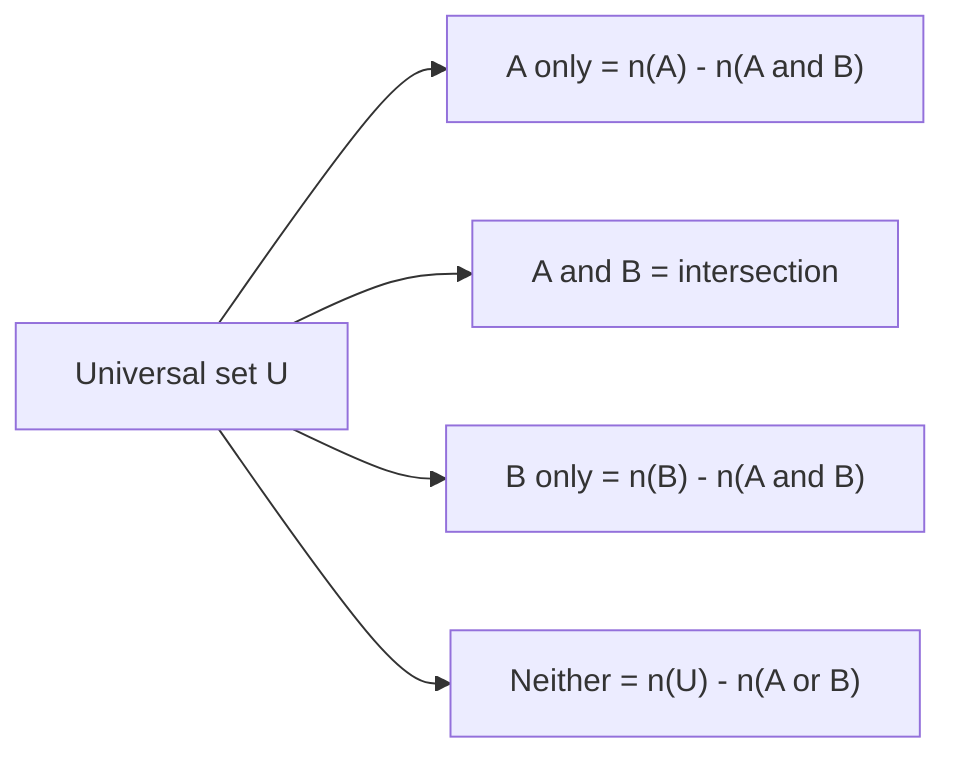

# 11. Maths — Arithmetic

> [!IMPORTANT] Exam focus
> Mathematics is **40 of 100 marks** in Paper-II. Arithmetic items are quick formula questions: 30–60 seconds each. Learn the formula boxes; do every example once by hand.

---

## 1. Squares, square roots, cubes, cube roots

**Squares**
- A perfect square ends only in **0, 1, 4, 5, 6, 9**. Never in 2, 3, 7, 8.
- $n^2$ = sum of the first $n$ odd numbers ($1+3+5+7 = 16 = 4^2$).
- $(n+1)^2 - n^2 = 2n+1$.
- A number of the form $n^2$ ends in an even number of zeros.
- Squares of decimals: $0.13^2 = 0.0169$ (decimal places double). So $\sqrt{0.0169}=0.13$, $\sqrt{1.44}=1.2$.

| n | 11 | 12 | 13 | 14 | 15 | 16 | 17 | 18 | 19 | 20 | 25 |
| :-: | :-: | :-: | :-: | :-: | :-: | :-: | :-: | :-: | :-: | :-: | :-: |
| $n^2$ | 121 | 144 | 169 | 196 | 225 | 256 | 289 | 324 | 361 | 400 | 625 |

**Square root methods**
1. *Prime factorisation (perfect squares):* pair equal primes, take one from each pair. $324 = 2^2\cdot 3^4 \Rightarrow \sqrt{324}=2\cdot 9=18$.
2. *Division (long-division) method:* pair digits from the decimal point, find the largest square ≤ first pair, subtract, bring down the next pair, double the quotient and find the next digit. Works for non-perfect squares and decimals.
3. *Estimation of a non-perfect square:* $\sqrt{50}$ lies between 7 and 8 ($49<50<64$); nearer to 7 so ≈ 7.07.

**Smallest number to add / subtract / multiply**
- *Add to make a perfect square:* find the next square above; difference is the answer. For 1000: $32^2 = 1024$, add **24**.
- *Subtract to make a perfect square:* $31^2 = 961$, subtract **39** from 1000.
- *Multiply to make a perfect square:* factorise, multiply by every prime with an odd power. $72 = 2^3\cdot 3^2$ → multiply by **2** → 144.
- *Divide to make a perfect square:* divide by the primes with odd power.

**Cubes**
- Cube of $n$ ends in: 1→1, 2→8, 3→7, 4→4, 5→5, 6→6, 7→3, 8→2, 9→9, 0→0. (Pairs that sum to 10 swap: 2↔8, 3↔7.)
- Cubes to know: $1, 8, 27, 64, 125, 216, 343, 512, 729, 1000, 1331, 1728$.
- *Cube root by factor method:* group prime factors in **triples**. $1728 = 2^6\cdot 3^3 \Rightarrow \sqrt[3]{1728}=2^2\cdot 3 = 12$.
- *Quick cube root (up to 6 digits):* last digit from the table above; drop the last three digits and take the largest cube ≤ the rest. $\sqrt[3]{9261}$: last digit 1 → unit digit 1; $8<9<27$ → tens digit 2 → **21**.
- Smallest number to multiply to make a perfect cube: $54 = 2\cdot 3^3$ → multiply by $2^2=4$ → 216.

---

## 2. Set theory

| Term | Meaning / notation |
| :--- | :--- |
| Roster form | $A=\{1,2,3\}$ |
| Set-builder form | $A=\{x : x \text{ is a natural number}, x<4\}$ |
| Empty set | $\varnothing$, no elements |
| Singleton | exactly one element |
| Finite / infinite | countable end / no end |
| Equal sets | same elements |
| Equivalent sets | same number of elements |
| Subset | $A\subseteq B$; proper subset $A\subset B$ (A ≠ B) |
| Power set | all subsets; number $=2^n$ |
| Universal set | $U$, contains everything under discussion |

**Operations**
- Union $A\cup B$: in A or B or both. Intersection $A\cap B$: in both.
- Difference $A-B$: in A, not in B. Complement $A'=U-A$.
- Disjoint sets: $A\cap B=\varnothing$.
- Symmetric difference: $(A-B)\cup(B-A)$.

**Laws**
- Commutative, associative; distributive: $A\cup(B\cap C)=(A\cup B)\cap(A\cup C)$.
- Idempotent: $A\cup A=A$. Identity: $A\cup\varnothing=A$, $A\cap U=A$.
- **De Morgan:** $(A\cup B)'=A'\cap B'$; $(A\cap B)'=A'\cup B'$.

**Counting formulas**
$$n(A\cup B)=n(A)+n(B)-n(A\cap B)$$
$$n(A\cup B\cup C)=n(A)+n(B)+n(C)-n(A\cap B)-n(B\cap C)-n(A\cap C)+n(A\cap B\cap C)$$
$$n(A-B)=n(A)-n(A\cap B)$$

> [!EXAMPLE] In a class of 60, 35 like tea, 30 like coffee, 10 like both. How many like neither?
> $n(T\cup C)=35+30-10=55$. Neither $=60-55=$ **5**.


The four regions of a two-set Venn diagram add up to $n(U)$. Fill the intersection first, then the "only" regions, then "neither".

---

## 3. Sequence and series

| | AP | GP | HP |
| :--- | :--- | :--- | :--- |
| Meaning | constant difference $d$ | constant ratio $r$ | reciprocals form an AP |
| $n$th term | $a+(n-1)d$ | $ar^{n-1}$ | $\dfrac{1}{a+(n-1)d}$ |
| Sum of $n$ terms | $\dfrac n2[2a+(n-1)d]=\dfrac n2(a+l)$ | $\dfrac{a(r^n-1)}{r-1}$ ($r\neq1$) | no simple formula |
| Sum to infinity | — | $\dfrac{a}{1-r}$, if $\lvert r\rvert<1$ | — |

- Three terms in AP: $a-d,\ a,\ a+d$. Three terms in GP: $a/r,\ a,\ ar$.
- Handy sums: $1+2+\dots+n=\dfrac{n(n+1)}2$; squares: $\dfrac{n(n+1)(2n+1)}6$; cubes: $\left[\dfrac{n(n+1)}2\right]^2$.
- **Means of $a,b$:** AM $=\dfrac{a+b}2$, GM $=\sqrt{ab}$, HM $=\dfrac{2ab}{a+b}$.
- Relations: $AM\times HM=GM^2$ and $AM\ge GM\ge HM$ (equal only if $a=b$).
- Series is the **sum** of a sequence; sequence is the ordered list.

> [!EXAMPLE] Sum of 2, 5, 8, … 20 terms
> $a=2,d=3,n=20$: $S=10[4+57]=$ **610**.

---

## 4. Matrices

A matrix is a rectangular array of numbers; order $m\times n$ means $m$ rows and $n$ columns (so $mn$ elements).

| Type | Property |
| :--- | :--- |
| Row / column matrix | one row / one column |
| Square | $m=n$ |
| Diagonal | square; non-diagonal elements 0 |
| Scalar | diagonal with equal diagonal elements |
| Identity $I$ | scalar with diagonal 1; $AI=IA=A$ |
| Zero (null) | all elements 0 |
| Upper / lower triangular | zeros below / above the diagonal |
| Symmetric | $A^T=A$ |
| Skew-symmetric | $A^T=-A$ (diagonal all 0) |

- **Equality:** same order and corresponding elements equal.
- **Transpose** $A^T$: rows become columns. $(A^T)^T=A$, $(A+B)^T=A^T+B^T$, $(AB)^T=B^TA^T$.
- **Addition / subtraction:** only when both have the **same order**; add element by element.
- **Multiplication $AB$:** possible only if **columns of A = rows of B**. If $A$ is $m\times n$, $B$ is $n\times p$, then $AB$ is $m\times p$. Generally $AB\ne BA$.
- Scalar multiplication multiplies every element.
- Determinant (2×2): $\begin{vmatrix}a&b\\c&d\end{vmatrix}=ad-bc$.
- **Uses:** route maps and tabular data (rows = origins, columns = destinations, entries = number of routes/quantities).

> [!EXAMPLE] $A=\begin{pmatrix}1&2\\3&4\end{pmatrix}$, $B=\begin{pmatrix}0&1\\1&0\end{pmatrix}$
> $AB=\begin{pmatrix}1\cdot0+2\cdot1&1\cdot1+2\cdot0\\3\cdot0+4\cdot1&3\cdot1+4\cdot0\end{pmatrix}=\begin{pmatrix}2&1\\4&3\end{pmatrix}$.

---

## 5. Permutations and combinations

- $n!=n(n-1)\cdots 2\cdot1$; $0!=1$.
- **Permutation** (order matters): ${}^nP_r=\dfrac{n!}{(n-r)!}$.
- **Combination** (order does not matter): ${}^nC_r=\dfrac{n!}{r!(n-r)!}$.
- ${}^nP_r=r!\cdot{}^nC_r$; ${}^nC_r={}^nC_{n-r}$; ${}^nC_0={}^nC_n=1$; ${}^nC_1=n$.
- Pascal: ${}^nC_r+{}^nC_{r-1}={}^{n+1}C_r$.
- Arrangements with repeats: $\dfrac{n!}{p!\,q!\,r!}$ (e.g. MISSISSIPPI $=\dfrac{11!}{4!\,4!\,2!}$).
- Circular arrangement of $n$ objects: $(n-1)!$.
- **Memory hook:** *P* for *P*osition (line-up), *C* for *C*ommittee (choose).
- Quick uses: handshakes among $n$ people $={}^nC_2$; diagonals of an $n$-gon $={}^nC_2-n$.

> [!EXAMPLE] Choose a 3-member team from 8 → ${}^8C_3=56$. Arrange 3 of 8 in a row → ${}^8P_3=336$.

---

## 6. Statistics

**Frequency distribution:** class interval, frequency $f$, class mark $x=\dfrac{\text{lower}+\text{upper}}2$, cumulative frequency $cf$.

| Measure | Ungrouped | Grouped |
| :--- | :--- | :--- |
| Mean $\bar x$ | $\dfrac{\sum x}{n}$ | $\dfrac{\sum fx}{\sum f}$; step-deviation $\bar x=A+h\dfrac{\sum fu}{\sum f}$, $u=\frac{x-A}{h}$ |
| Median | middle value (average of two middle values if $n$ even) | $l+\dfrac{N/2-cf}{f}\times h$ |
| Mode | most frequent value | $l+\dfrac{f_1-f_0}{2f_1-f_0-f_2}\times h$ |

- Empirical relation: **Mode = 3 Median − 2 Mean**.
- **Range** = max − min. **Quartiles** $Q_1,Q_2,Q_3$ split ordered data in four; IQR $=Q_3-Q_1$; quartile deviation $=\dfrac{Q_3-Q_1}2$.
- **Mean deviation** $=\dfrac{\sum\lvert x-\bar x\rvert}{n}$.
- **Standard deviation:** $\sigma=\sqrt{\dfrac{\sum(x-\bar x)^2}{n}}=\sqrt{\dfrac{\sum x^2}{n}-\bar x^2}$; grouped: $\sqrt{\dfrac{\sum fx^2}{\sum f}-\bar x^2}$. Variance $=\sigma^2$.
- **Coefficient of variation** $CV=\dfrac{\sigma}{\bar x}\times100\%$ (lower CV = more consistent).
- Adding a constant to every value changes the mean but not $\sigma$; multiplying by $k$ multiplies both.

**Graphs**
- *Bar chart:* separate bars, height ∝ value (categories).
- *Histogram:* touching bars for continuous class intervals; height ∝ frequency.
- *Frequency polygon:* join mid-points of the tops of histogram bars.
- *Ogive:* plot of cumulative frequency (less-than / more-than); intersection of the two ogives gives the median.
- *Pie chart / sector graph:* central angle $=\dfrac{\text{value}}{\text{total}}\times360^\circ$.

> [!EXAMPLE] Data 2, 4, 4, 4, 5, 5, 7, 9 → mean $=40/8=5$; median $=(4+5)/2=4.5$; mode $=4$; range $=7$.

---

## 7. HCF and LCM

- $\text{HCF}\times\text{LCM}=\text{product of the two numbers}$ (for two numbers only).
- HCF = product of **lowest** powers of common primes; LCM = product of **highest** powers of all primes.
- Co-prime numbers: HCF = 1, so LCM = product.
- Fractions: $\text{HCF}=\dfrac{\text{HCF of numerators}}{\text{LCM of denominators}}$, $\text{LCM}=\dfrac{\text{LCM of numerators}}{\text{HCF of denominators}}$.
- **Use HCF for:** largest tile / greatest length that measures given lengths exactly; splitting into equal groups.
- **Use LCM for:** events that repeat together (bells, traffic lights); smallest number divisible by all.
- Remainder problems: largest number dividing $a,b$ leaving remainder $r$ → HCF of $(a-r),(b-r)$. Smallest number leaving remainder $r$ on division by $a,b$ → LCM$(a,b)+r$.
- Division (Euclid) method for HCF: divide larger by smaller, then divisor by remainder, until remainder 0.

> [!EXAMPLE] Bells ring every 12, 15, 20 minutes. Together again after LCM $=$ **60 min**. Largest tile for a 24 m × 18 m floor = HCF $=$ **6 m**.

---

## Quick Revision Box

```
+---------------------------------------------------------------+
| Square ends 0,1,4,5,6,9 | n^2 = sum of first n odd numbers   |
| Cube root: group factors in threes | Add/subtract to square: |
|   next square - n  or  n - previous square                   |
| n(AUB)=n(A)+n(B)-n(A^B) | De Morgan: (AUB)'=A'^B'            |
| AP: a+(n-1)d, Sn=n/2[2a+(n-1)d] | GP: ar^(n-1), Sinf=a/(1-r) |
| AM x HM = GM^2 | AM >= GM >= HM                               |
| AB exists if cols(A)=rows(B) | (AB)^T = B^T A^T               |
| nPr = n!/(n-r)! | nCr = n!/(r!(n-r)!) | nCr = nC(n-r)        |
| Mode = 3 Median - 2 Mean | CV = SD/Mean x 100                 |
| HCF x LCM = a x b | Bells/lights -> LCM | Tiles -> HCF        |
+---------------------------------------------------------------+
```

*Related:* [[LandSurveyor/AGY/03_Notes/_Out_of_Syllabus/Drafts_Archive/12_Maths_Algebra_and_Coordinate_Geometry]] · [[LandSurveyor/AGY/03_Notes/_Out_of_Syllabus/Drafts_Archive/13_Maths_Geometry_and_Mensuration]]
