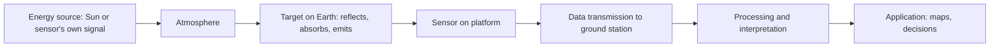

# 15. Satellite Imagery, Remote Sensing, LiDAR & GIS

> [!IMPORTANT] Exam focus
> Syllabus items: types of satellites (optical, multispectral, hyperspectral, SAR), image acquisition, four resolutions, processing (rectification, orthorectification, mosaicking, classification, information extraction), software (Earth Engine, GIS Image Analyst), remote-sensing principle, EMR types, sensors, **LiDAR**, digital image processing, and GIS principle/components/applications.
> Your existing note [[08_GPS_GIS_and_Remote_Sensing]] covers the basics of resolutions and raster/vector; this note adds the rest.

---

## 1. Principle of remote sensing

**Remote sensing** = acquiring information about an object or area **without physical contact**, using energy reflected or emitted from it and recorded by a sensor.


The seven elements: energy source, radiation and atmosphere, interaction with the target, recording by the sensor, transmission and reception, processing and interpretation, application.

**Electromagnetic radiation (EMR):** transverse waves travelling at $c=3\times10^8$ m/s; $c=f\lambda$. Order of increasing wavelength: gamma < X-ray < ultraviolet < **visible (0.4–0.7 µm)** < near-IR < shortwave-IR < thermal IR < microwave < radio.

| Type | Region | Remote-sensing use |
| :--- | :--- | :--- |
| Visible | 0.4–0.7 µm | true colour photos, water depth, urban |
| Near-IR (NIR) | 0.7–1.3 µm | vegetation health (strong reflection) |
| Shortwave IR | 1.3–3 µm | soil/vegetation moisture, minerals |
| Thermal IR | 3–14 µm | surface temperature, fires |
| Microwave | 1 mm–1 m | radar, **penetrates cloud and works at night** |

- **Atmospheric windows:** wavelength bands where the atmosphere lets energy pass (used for imaging).
- **Spectral signature:** each surface reflects differently by wavelength. Healthy vegetation: low red, **very high NIR**; water: absorbs NIR (dark); dry soil: gradually increasing reflectance.
- **NDVI** $=\dfrac{NIR-Red}{NIR+Red}$; ranges −1 to +1; dense vegetation about 0.6–0.9; water negative.

**Passive vs active:** passive sensors record reflected sunlight or emitted heat (optical, thermal); active sensors send their own signal (radar/SAR, LiDAR) and record the return.

---

## 2. Platforms, satellites and orbits

| Orbit | Height | Feature | Examples |
| :--- | :--- | :--- | :--- |
| **Geostationary** | about 35,786 km over the equator | fixed view of one region, continuous | INSAT/GSAT weather and communication |
| **Sun-synchronous polar** | about 500–900 km | passes over a place at the same local solar time; near-polar; used for Earth observation | Landsat, Sentinel-2, IRS/Resourcesat, Cartosat |

**Types of satellite sensors (by data)**

| Type | Bands | Notes |
| :--- | :--- | :--- |
| **Optical (panchromatic)** | one broad visible band, high spatial resolution | black-and-white, sharp; used for **pan-sharpening** |
| **Multispectral** | 3–15 broad bands (blue, green, red, NIR, SWIR) | land cover, vegetation; Landsat, Sentinel-2, LISS |
| **Hyperspectral** | hundreds of narrow contiguous bands | fine material identification (minerals, crop stress) |
| **SAR (Synthetic Aperture Radar)** | microwave bands (X, C, S, L, P) | works day/night, through cloud; measures roughness and moisture; used for floods, subsidence, soil moisture |
| **Thermal** | thermal IR | temperature, urban heat |

Indian and other satellites to know: **IRS / Resourcesat (LISS-III 23.5 m, LISS-IV 5.8 m), Cartosat series (Cartosat-3 about 0.25 m, for cadastral/urban mapping), RISAT (SAR), NISAR (NASA-ISRO L+S band SAR), Oceansat, INSAT**; foreign: Landsat (30 m, 16-day revisit), Sentinel-2 (10 m, ~5-day), Sentinel-1 (C-band SAR), WorldView/Pleiades (sub-metre commercial).

---

## 3. The four resolutions

| Resolution | Meaning | Improves as |
| :--- | :--- | :--- |
| **Spatial** | size of one pixel on the ground (detail) | pixel size gets smaller |
| **Spectral** | number and narrowness of bands | more, narrower bands |
| **Temporal** | revisit interval over the same place | shorter interval |
| **Radiometric** | number of brightness levels; bit depth ($2^n$: 8-bit = 256, 11-bit = 2048) | higher bit depth |

Trade-off: very high spatial resolution usually means a narrow swath and longer revisit.

---

## 4. Image acquisition and processing

**Acquisition:** the sensor scans the swath, records digital numbers (DN) per pixel, data is downlinked to a ground station, then supplied as levels (raw → radiometrically/geometrically corrected → orthorectified).

**Digital image processing steps**

| Step | What it does |
| :--- | :--- |
| **Pre-processing** | radiometric correction (sensor noise, atmospheric haze, DN to reflectance), geometric correction |
| **Rectification (georeferencing)** | fitting the image to a map coordinate system using ground control points and a transformation, followed by **resampling** (nearest neighbour keeps original values; bilinear and cubic convolution smooth) |
| **Orthorectification** | removes distortion from **terrain relief and sensor tilt** using a DEM and sensor model → true-scale image; more accurate than simple rectification |
| **Mosaicking** | joining several adjacent, overlapping images into one seamless image (with colour balancing) |
| **Enhancement** | contrast stretch, filtering, band combinations (false-colour composite: NIR-Red-Green shows vegetation as red) |
| **Classification** | assigning each pixel to a class |
| **Information extraction** | vectors of land cover, change detection, indices (NDVI, NDWI), building/road footprints, area statistics |

**Classification**
- **Unsupervised:** software groups pixels into clusters by similarity (e.g. K-means, ISODATA); the analyst labels clusters afterwards.
- **Supervised:** analyst supplies **training samples** of known classes; algorithm (maximum likelihood, random forest, SVM) classifies all pixels; accuracy checked with a **confusion matrix** and kappa.
- Object-based and machine-learning/deep-learning methods are used for buildings and land parcels.

**Visual interpretation elements:** tone/colour, shape, size, pattern, texture, shadow, site, association.

**Software:** **Google Earth Engine** (cloud platform, huge archives, JavaScript/Python), **ArcGIS Pro with Image Analyst extension** ("GIS Image Analyst"), QGIS (+ Semi-Automatic Classification plugin), ERDAS Imagine, ENVI, SNAP (Sentinel), Bhuvan (ISRO's geoportal).

---

## 5. LiDAR

**LiDAR = Light Detection and Ranging.** An **active** sensor that emits laser pulses and measures the **time of flight** to compute distance: $d=\dfrac{c\,t}{2}$.
- Mounted on aircraft, drone, vehicle or tripod (terrestrial laser scanner).
- Combines laser range, scan angle, **GNSS** (position) and **IMU** (attitude) to give 3D coordinates.
- Output: dense **point cloud** (also intensity and return number). Pulses can have multiple returns: **first return** = canopy/roof top, **last return** = ground.
- Products: **DSM** (all returns), **DEM/DTM** (ground returns only), contours, canopy height, building models, flood and corridor mapping.
- **Advantages:** penetrates vegetation gaps, works at night, very high vertical accuracy (few cm). **Limits:** cost; poor in heavy rain/fog; laser does not penetrate water well (bathymetric LiDAR uses green laser).

---

## 6. GIS — principle, components, applications

**GIS (Geographic Information System):** a system to **capture, store, manage, analyse and display geographically referenced data**. Principle: every feature has a **location (coordinates)** and **attributes**, organised in layers that can be overlaid and queried.

**Five components**

| Component | Content |
| :--- | :--- |
| Hardware | computers, servers, GNSS, scanners, plotters, mobile devices |
| Software | QGIS, ArcGIS, GRASS, PostGIS, GeoServer |
| **Data** | spatial (vector, raster) + attribute (tabular) |
| People | analysts, surveyors, users |
| Methods | procedures, standards, workflows |

- **Vector** (points, lines, polygons: parcels, roads, wells) vs **raster** (grid of cells: satellite images, DEM) — see note 08.
- Typical operations: **buffer**, **overlay** (union, intersect, clip), spatial query, network analysis, interpolation, map algebra.
- **Coordinate systems:** geographic (lat/long, WGS84) vs projected (UTM, metres).
- **Applications:** cadastral and land-record mapping, urban planning, utilities, disaster management, agriculture, water resources, forest and environment, health, transport, election mapping.

---

## 7. High-Yield Mnemonics

> [!NOTE] Memory aids
> - **Four resolutions "SSTR": Spatial, Spectral, Temporal, Radiometric.**
> - **Rectify → Ortho → Mosaic → Classify → Extract** = processing order.
> - **SAR sees through cloud** (microwave); **optical sensors are stopped by cloud.**
> - **LiDAR = laser; last return = ground; first return = top.**
> - **NDVI = (NIR − Red)/(NIR + Red)** — plants love NIR.

## 8. Likely Exam Questions

1. Sensor that sends its own signal — **active (SAR, LiDAR)**.
2. Satellite images with hundreds of narrow bands — **hyperspectral**.
3. Removes relief displacement using a DEM — **orthorectification**.
4. Joining adjacent images — **mosaicking**.
5. Number of brightness levels a sensor can record — **radiometric resolution**.
6. Range measured by LiDAR from — **time of laser pulse travel**.
7. Geostationary satellite altitude — **about 35,786 km**.
8. Name a cloud-based platform for satellite analysis — **Google Earth Engine**.

## Quick Revision Box

```
+---------------------------------------------------------------+
| RS = information without contact | EMR: c = f x lambda        |
| Visible 0.4-0.7 um | Vegetation: high NIR | Water: dark in NIR |
| Passive: optical, thermal | Active: SAR, LiDAR                 |
| Types: PAN, multispectral, hyperspectral, SAR                  |
| Resolutions: spatial, spectral, temporal, radiometric (bits)   |
| Rectification (GCP) < Orthorectification (DEM, relief)         |
| Mosaic = join | Supervised (training) vs Unsupervised (cluster)|
| LiDAR: d = ct/2 | first return top, last return ground         |
| GIS parts: hardware, software, DATA, people, methods           |
| Software: Earth Engine, Image Analyst, QGIS, SNAP, Bhuvan      |
+---------------------------------------------------------------+
```

*Related:* [[08_GPS_GIS_and_Remote_Sensing]] · [[LandSurveyor/AGY/03_Notes/_Out_of_Syllabus/Drafts_Archive/14_Photogrammetry_Aerial_and_Drone_Survey]] · [[LandSurveyor/AGY/03_Notes/_Out_of_Syllabus/Drafts_Archive/16_GNSS_DGPS_RTK_and_CORS]] · [[18_Computer_GIS_Software_QGIS_GeoServer_PostGIS]]
