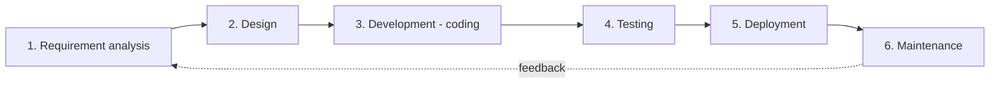

# 19. Software Solutions & Land Records Information Technology

> [!IMPORTANT] Exam focus
> Notified: SDLC; web application development, web portals and citizen-service portals; **mobile apps for field use: offline-first, geo-tagging, digital signature (eSign/DSC), sync with server**; how spatial and textual data is procured, stored and retrieved (**State Data Centre**, database storage, access methods); **API concepts: REST and SOAP, API gateway, integrating mobile apps with backends and portals; UX basics; Java, JSON, XML, HTML, HTTPS.**
> Application examples are in [[10_Karnataka_Land_Records_Bhoomi_Mojini_Dishank]].

---

## 1. Software Development Life Cycle (SDLC)


Each phase produces a document or product that feeds the next; maintenance feedback starts the next cycle.

| Phase | What happens | Output |
| :--- | :--- | :--- |
| Requirement analysis | gather needs from users (e.g. surveyors, tahsildars, citizens) | SRS (Software Requirement Specification) |
| Design | architecture, database design, UI mock-ups | design documents, ER diagrams |
| Development | programmers write code | working modules |
| Testing | unit, integration, system, **UAT** (User Acceptance Testing); find bugs | test reports |
| Deployment | release on servers / app stores | live system |
| Maintenance | fix bugs, upgrades, support | patches, new versions |

**Models:** **Waterfall** (sequential, no going back; simple, rigid), **Agile** (short **sprints**, continuous feedback; flexible, e.g. Scrum), **Spiral** (risk-driven iterations), **V-model** (each phase paired with a test phase), Prototype.
**Testing types:** *white-box* (code visible) vs *black-box* (only inputs/outputs); *alpha* (in-house) vs *beta* (limited users); regression testing (re-test after changes).

---

## 2. Web applications and portals

- **Client–server model:** browser (client) sends an **HTTP request** → server processes → sends **response**. Layers: **presentation (front end)** → **business logic (back end)** → **data (database)** — three-tier architecture.
- **Front-end:** **HTML** (structure), **CSS** (style), **JavaScript** (behaviour). **Back-end:** Java, PHP, Python, .NET, Node.js.
- **Web portal:** a single web gateway to many services/information (login, search, forms, payments). **Citizen service portals:** government portals for online services — e.g. **Bhoomi** (RTC/pahani), **Kaveri** (property registration), **e-Swathu** (rural property records), Seva Sindhu (government services), and **Mojini** (survey services).
- Features of a good portal: authentication, role-based access, audit logs, online payment, SMS/e-mail alerts, digital signature on certificates, accessibility, support for Kannada (Unicode) and English.
- **HTTP vs HTTPS:** HTTPS = HTTP over **TLS/SSL** — encrypts data, authenticates the server through a digital certificate; default port **443** (HTTP port 80). Look for the padlock. **HTML** = HyperText Markup Language (tags like `<h1>`, `<p>`, `<a>`, `<table>`, `<form>`).
- **URL** parts: protocol://domain/path?query. **DNS** converts domain names to IP addresses.

**Data formats**

| Format | Features | Example |
| :--- | :--- | :--- |
| **JSON** (JavaScript Object Notation) | light, human-readable key–value text; the default for REST APIs | `{"surveyNo": "45/2", "area": 2.5}` |
| **XML** (eXtensible Markup Language) | tag-based, self-describing, verbose; used by SOAP, GML | `<survey><no>45/2</no></survey>` |
| CSV | plain table | — |
| GeoJSON / GML | spatial data in JSON / XML | — |

**Java:** high-level, object-oriented (classes, inheritance, encapsulation, polymorphism), **platform-independent** — source `.java` is compiled to **bytecode** (`.class`) run by the **JVM** ("write once, run anywhere"). Widely used for enterprise and government back-ends and Android; GeoServer is written in Java. (Java is not JavaScript.)

---

## 3. Mobile application development for field work

| Concept | Meaning |
| :--- | :--- |
| **Offline-first design** | app works fully **without network** (stores data in a local database such as SQLite), and **syncs** when connectivity returns — essential in rural areas |
| **Geo-tagging** | attaching **latitude/longitude (and time)** to a photo or record from the phone GPS/GNSS; each surveyed parcel or photo gets its coordinates |
| **Sync with central server** | upload local changes, download updates; handle **conflicts** (last-write-wins or manual merge), retry on failure, incremental sync, encryption in transit |
| **Digital signature** | proves authenticity and integrity of a document/record |
| **Native vs hybrid apps** | native (Android/Kotlin/Java, iOS/Swift) vs cross-platform (Flutter, React Native) |

**Digital signature basics**
- Uses **PKI (public key infrastructure)**: the signer's **private key** signs a hash (message digest) of the document; anyone verifies with the **public key** in a **digital certificate** issued by a Certifying Authority (CA). Any change to the document breaks the signature.
- **DSC (Digital Signature Certificate)** — stored on a USB token; classes (Class 3 for e-filing/tenders); legally valid under the **IT Act, 2000**.
- **eSign** — online, **Aadhaar-based** service: user authenticates with Aadhaar OTP/biometric and a short-validity certificate is generated to sign; no token required. Used for online land certificates.
- Related: **hash** (SHA-256) gives a fixed-size fingerprint; encryption keeps data confidential.

---

## 4. How spatial and textual data is stored and retrieved

- **Textual (attribute) data:** owner names, survey numbers, RTC columns, crop, mutation — stored in **relational databases (RDBMS)** as tables: rows (records), columns (fields), **primary key** uniquely identifies a row, **foreign key** links tables; queried with **SQL** (`SELECT ... FROM ... WHERE`). Examples: PostgreSQL, Oracle, MySQL.
- **Spatial data:** parcel boundaries, ORI, DEM — vector geometries in a **spatial database (PostGIS)**; rasters/imagery in files or raster stores; standard services WMS/WFS.
- **State Data Centre (SDC):** the government's centralised facility hosting servers, storage, network and security for departmental applications — Karnataka's SDC is operated with the state's e-governance agency. Features: high-availability servers, virtualisation/cloud, **firewalls**, backups and **disaster recovery (DR) site**, monitored 24×7. Departments host portals and databases here rather than in local offices.
- **Data access and retrieval methods:** direct SQL, **stored procedures**, **APIs/web services**, database drivers (**JDBC** for Java, **ODBC**), file transfer (SFTP), map services (WMS/WFS), batch export/import, data replication and backup.
- **Data quality and security:** validation, role-based access, encryption, audit trail, regular backups, data-sharing policies.

---

## 5. APIs — REST, SOAP, API gateway

**API (Application Programming Interface):** a defined way for one software system to request services or data from another (a "waiter between the kitchen and the customer").

| Feature | **REST** (Representational State Transfer) | **SOAP** (Simple Object Access Protocol) |
| :--- | :--- | :--- |
| Type | architectural style | strict protocol |
| Format | JSON (also XML/HTML/text) | **XML only** (envelope: header + body) |
| Transport | HTTP/HTTPS | HTTP, SMTP, others |
| State | **stateless** — each request carries all information | can be stateful |
| Operations | HTTP verbs on URLs (resources) | operations defined in **WSDL** (Web Services Description Language) |
| Speed | lighter, faster, cacheable | heavier |
| Security | HTTPS, tokens (OAuth/JWT) | built-in **WS-Security**, transactions (ACID) |
| Typical use | mobile apps, public web APIs | banking/enterprise, legacy government integration |

**REST HTTP verbs (CRUD):** `GET` read, `POST` create, `PUT` update/replace, `PATCH` partial update, `DELETE` remove. Status codes: 200 OK, 201 Created, 400 Bad request, 401 Unauthorised, 403 Forbidden, **404 Not found**, 500 Server error.

> [!EXAMPLE] `GET https://api.example.gov.in/rtc?district=Mysuru&survey=45` → returns JSON with the RTC details.

**API Gateway:** a **single entry point** in front of many back-end services. It handles **authentication/authorisation, rate limiting (throttling), routing, load-balancing, monitoring/logging, caching, protocol translation, API keys and versioning**, so mobile apps and portals need only one address.

**Integration of mobile apps with backend databases and portals**
1. Mobile app calls **REST APIs** (JSON over HTTPS) exposed through the **API gateway**.
2. Gateway authenticates (token/API key), routes to the application server.
3. Application server reads/writes the **database (PostgreSQL/PostGIS)**, which is also used by the **web portal**, so both show the same record.
4. Response returns as JSON; the app displays or stores it offline and syncs later.
- Benefits: one source of truth, loose coupling, easy updates.

---

## 6. User Experience (UX) basics

- **UX** = how easy, efficient and pleasant a system is to use; **UI** = look of the interface.
- Principles: **simplicity**, consistency, clear navigation, feedback (loading, success/error messages), error prevention and helpful error messages, **accessibility** (contrast, font size, screen-reader support), **responsive design** (fits mobile/tablet/desktop), **multilingual support (Kannada/English)**, minimal typing (dropdowns, GPS auto-fill), fast loading, user testing (usability testing, personas, wireframes/prototypes).
- For field apps: large buttons, works with sunlight and gloves, offline mode indicator.

---

## High-Yield Mnemonics

> [!NOTE] Memory aids
> - **SDLC = "Ready, Design, Code, Test, Deploy, Maintain"** (6 phases).
> - **REST = JSON, stateless, HTTP verbs; SOAP = XML, strict, WSDL.**
> - **HTTPS = HTTP + TLS, port 443.**
> - **DSC = token; eSign = Aadhaar OTP.**
> - **Offline-first: local store now, sync later.**
> - **API gateway = single front door.**

## Likely Exam Questions

1. The correct order of SDLC begins with — **Requirement analysis**.
2. REST APIs commonly exchange data in — **JSON**.
3. SOAP messages use — **XML**.
4. Full form of HTTPS — **HyperText Transfer Protocol Secure**.
5. Aadhaar-based online signing service — **eSign**.
6. Storing data locally and syncing later — **offline-first design**.
7. Single entry point for multiple APIs — **API gateway**.
8. Java code runs on — **JVM (via bytecode)**.
9. Centralised government hosting facility — **State Data Centre (SDC)**.
10. HTTP method used to retrieve data — **GET**.

## Quick Revision Box

```
+---------------------------------------------------------------+
| SDLC: Requirements > Design > Development > Testing >          |
|       Deployment > Maintenance | Models: Waterfall, Agile, Spiral |
| Web: HTML (structure) CSS (style) JS (behaviour) | HTTPS 443   |
| JSON key-value | XML tags | Java: bytecode on JVM             |
| Mobile: offline-first, geo-tag (lat/long), sync, conflict     |
| Digital signature: private key signs hash, public key verifies |
| DSC = USB token (IT Act 2000) | eSign = Aadhaar-based online   |
| Data: RDBMS + SQL (attributes), PostGIS (spatial), SDC hosts   |
| API: REST (JSON, stateless, GET POST PUT DELETE) vs SOAP (XML, |
|      WSDL, WS-Security) | API gateway = auth, routing, throttle |
| UX: simple, consistent, accessible, responsive, feedback       |
+---------------------------------------------------------------+
```

*Related:* [[10_Karnataka_Land_Records_Bhoomi_Mojini_Dishank]] · [[18_Computer_GIS_Software_QGIS_GeoServer_PostGIS]] · [[LandSurveyor/AGY/03_Notes/_Out_of_Syllabus/Drafts_Archive/17_Computer_MSOffice_and_AutoCAD]]
