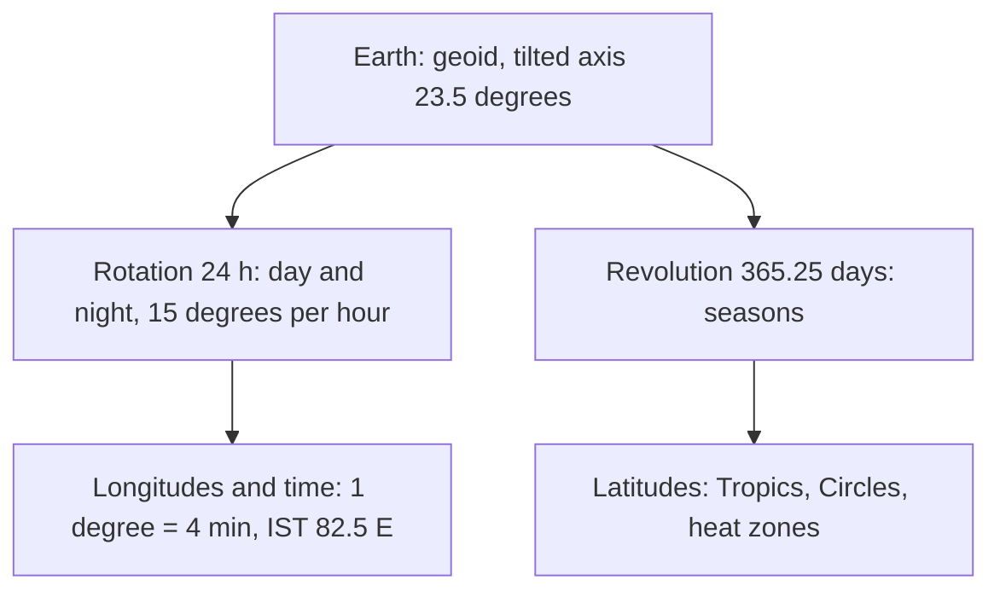
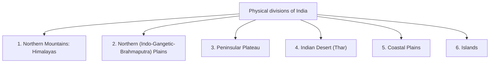

# 21. Geography — The Earth, Lithosphere, Maps, Physical Features of India

> [!IMPORTANT] Exam focus
> The notified list has four headings: **The Earth · The Lithosphere · Maps · Physical Features of India**. Latitude/longitude/time and map scale questions overlap with surveying, so they are high-value. Karnataka-specific geography is in [[02_Karnataka_and_India_Geography]].

---

## 1. The Earth

**Universe and solar system:** the Universe began with the **Big Bang** (about 13.8 billion years ago). Our galaxy is the **Milky Way** (spiral). The Solar System has the Sun and **8 planets** (Mercury, Venus, Earth, Mars, Jupiter, Saturn, Uranus, Neptune). Sunlight takes about **8 min 20 s** to reach Earth. Earth is the 3rd planet, the densest, and the only one known to support life ("blue planet").

**Shape of the Earth:** an **oblate spheroid / geoid** (slightly flattened at the poles, bulging at the equator) — not a perfect sphere.
- Equatorial diameter about **12,756 km**; polar diameter about **12,714 km**; equatorial circumference about **40,075 km**.
- Proofs: ships disappearing hull-first, circular shadow in lunar eclipse, satellite photographs, time differences around the globe, circumnavigation.

**Axis:** imaginary line through the poles; tilted **23½°** from the vertical (i.e. **66½°** to the orbital plane) and always pointing towards the Pole Star.

| Motion | Rotation | Revolution |
| :--- | :--- | :--- |
| Meaning | spinning on its axis, west → east | orbiting the Sun (elliptical orbit) |
| Period | 24 h (23 h 56 min 4 s sidereal) | 365¼ days |
| Causes | **day and night**; deflection of winds/currents (Coriolis); tides timing | **seasons** (due to tilt), varying day length; leap year (extra day every 4 years) |

- **Solstices:** 21 June (Sun overhead the Tropic of Cancer; longest day in the north) and 22 December (Tropic of Capricorn). **Equinoxes:** 21 March and 23 September (equal day and night; Sun overhead the equator). **Perihelion** (nearest Sun, about 3 Jan) and **aphelion** (farthest, about 4 July).

**Latitudes** are imaginary circles parallel to the equator: **Equator 0°**, **Tropic of Cancer 23½° N**, **Tropic of Capricorn 23½° S**, **Arctic Circle 66½° N**, **Antarctic Circle 66½° S**, poles 90°.
- All latitudes are parallel circles, different in length (largest at the equator); 1° latitude ≈ 111 km.

| Heat zone | Range |
| :--- | :--- |
| **Torrid** | between the Tropics (23½° N–23½° S), Sun overhead at some time |
| **Temperate** | 23½°–66½° (both hemispheres) |
| **Frigid** | 66½°–90° |

**Longitudes** are imaginary semicircles from pole to pole; all equal length; **Prime Meridian = 0° at Greenwich (UK)**; 180 east + 180 west; the **180° meridian** is opposite.
- **Longitude and time:** Earth turns 360° in 24 h → **15° per hour**, **1° = 4 minutes**. East = ahead (later), west = behind.
- **Indian Standard Time (IST)** uses **82½° E** (passes near Mirzapur, Uttar Pradesh), which is **GMT + 5 h 30 min**. India spans about 29° of longitude (68°7′ E to 97°25′ E) → about 2 hours' local-time difference between Gujarat and Arunachal Pradesh.
- **Local time vs standard time:** difference in longitude × 4 min. *Example:* Bengaluru is at about 77.6° E: $(82.5-77.6)\times4\approx20$ min behind IST.
- **Zonal (standard) time:** the world is divided into **24 time zones of 15° each**, each with its central meridian's time.
- **International Date Line (IDL):** roughly the **180° meridian**, drawn in a zig-zag to avoid splitting countries/islands. Crossing **eastward** → subtract one day (repeat the date); **westward** → add a day.
- Latitude and longitude together give a place's **geographical coordinates** (a grid); Bengaluru ≈ 13° N, 77.6° E; Karnataka lies between about 11.5°–18.5° N and 74°–78.5° E.


Rotation links to longitude and time; revolution with the tilted axis links to the seasons and the latitude-based heat zones.

---

## 2. The Lithosphere

**Layers of the Earth**

| Layer | Depth / thickness | Composition |
| :--- | :--- | :--- |
| **Crust** | 5–10 km (oceanic), 30–70 km (continental) | continental = **SiAl** (silica + alumina); oceanic = **SiMa** (silica + magnesium) |
| **Mantle** | to about 2,900 km | dense silicate rock; upper part (asthenosphere) partly molten → source of **magma** |
| **Core** | 2,900–6,371 km | **NiFe** (nickel + iron); outer core liquid, inner core solid |

- **Lithosphere** = crust + uppermost solid mantle (broken into **tectonic plates**). Discontinuities: **Moho** (crust–mantle), **Gutenberg** (mantle–core).
- Temperature and pressure increase with depth; the centre is about 5,000–6,000 °C.
- Most abundant elements in the crust: oxygen (46%), silicon, aluminium, iron; most abundant mineral group: silicates (feldspar).
- **Plate tectonics:** plates move a few cm/year; boundaries: divergent (new crust, mid-ocean ridges), convergent (mountains, subduction, trenches), transform (earthquakes). Himalayas formed by the collision of the Indian and Eurasian plates.

**Rocks**

| Type | Formation | Examples |
| :--- | :--- | :--- |
| **Igneous** | cooling of magma/lava (primary rocks); intrusive (granite) vs extrusive (**basalt** — Deccan Trap) | granite, basalt, gabbro |
| **Sedimentary** | deposition and compaction of sediments; layered, contain **fossils** | sandstone, limestone, shale, coal |
| **Metamorphic** | change of existing rocks by heat and pressure | marble (from limestone), slate (from shale), gneiss (from granite), quartzite (from sandstone) |

- **Rock cycle:** rocks change from one type to another over time. Karnataka's plateau is mostly ancient granite–gneiss (Archaean/Dharwar); Deccan basalt in the north; laterite on the Western Ghats and coast.

**Weathering** = in-place breakdown of rocks. **Physical/mechanical** (temperature change, frost, exfoliation), **chemical** (oxidation, carbonation, solution, hydrolysis; forms laterite and karst), **biological** (roots, burrowing animals, lichens). *Erosion* = removal and transport by wind, water, ice, gravity; *deposition* builds landforms (deltas, dunes, alluvial plains).

**Earthquakes and volcanoes**
- **Earthquake:** sudden release of energy in the crust. **Focus (hypocentre)** = origin underground; **epicentre** = point on the surface directly above; measured by **seismograph** (a record = seismogram). **Richter scale** (magnitude, logarithmic; each whole number is about 32 times more energy) and **Mercalli** (intensity); moment magnitude is now used.
- **Seismic waves**

| Wave | Also called | Nature | Speed / medium |
| :--- | :--- | :--- | :--- |
| **P-waves** | **Primary** | longitudinal (push–pull) | fastest; travel through **solids, liquids and gases** |
| **S-waves** | **Secondary** | transverse (shear) | slower; only through **solids** (cannot pass the liquid outer core → shadow zone) |
| **L-waves** | **Long / surface** waves (Love, Rayleigh) | surface | slowest, arrive last, **most destructive** |

- Earthquake belts: Circum-Pacific "Ring of Fire" (about 75% of volcanoes and 90% of earthquakes), Alpine–Himalayan belt, Mid-Atlantic ridge. India's seismic zones II to V; Himalaya and Kutch (Bhuj 2001) are most active; peninsular India (including most of Karnataka, which lies mainly in Zones II and III) is comparatively stable, though not free of tremors.
- **Volcano:** vent through which magma erupts (lava, ash, gases); active, dormant, extinct types; **Barren Island (Andaman & Nicobar)** is India's only active volcano; Mauna Loa is the largest, Mount Etna, Vesuvius, Krakatoa are famous. Deccan Traps = ancient flood basalt from fissure eruptions.

---

## 3. Maps

**Map** = a scaled, symbolic representation of the whole or part of the Earth on a flat surface. **Globe** = a model of the Earth; shows true shape, areas, distances and directions, but is not portable and cannot show much detail. **Atlas** = a collection of maps.

**Characteristics/essentials of a map (DEBTS-like list):** **D**istance (scale), **D**irection (north arrow), **S**ymbols (conventional signs and legend/key), **T**itle, **G**rid (latitude/longitude), and the projection.

**Types of maps**
- **Physical** (relief, landforms, drainage), **political** (boundaries), **thematic/distribution** (rainfall, soil, population density, crops, land use), **cadastral** (property/plot boundaries and survey numbers — the surveyor's map), topographical (Survey of India toposheets), **weather charts**.
- **By scale:**

| | Large-scale map | Small-scale map |
| :--- | :--- | :--- |
| Scale | e.g. 1:500 to 1:50,000 (**larger fraction**) | e.g. 1:250,000 and smaller (atlas, world maps) |
| Area shown | small | large |
| Detail | **high** | low, generalised |
| Examples | cadastral map, village map, city plan, toposheet 1:25,000 / 1:50,000 | state, country, world map |

- **Scale forms:** **statement** ("1 cm = 5 km"), **Representative Fraction (RF)** ($1:50{,}000$ — unitless, same for any unit), **graphical/linear (bar) scale**. RF = map distance ÷ ground distance. *Example:* RF 1:50,000 → 2 cm on map = 1 km on ground.
- **Conventional colours:** blue = water, green = vegetation, brown = contours/relief, black = man-made features and lettering, red = roads and buildings (varies).
- **Thematic maps** show one subject: choropleth (shaded by density), isopleth (isolines: contours, isotherms, isobars, isohyets), dot maps, flow maps.
- **Survey of India (SOI)** publishes topographic sheets; the open series map of India is numbered on a **1° × 1° = 1:250,000** grid and subdivided into 1:50,000 sheets (Karnataka sheets are numbered 48, 57 and 58); 1:25,000 sheets exist for detailed work.
- **Map projections:** transferring the curved Earth to a flat sheet, always with some distortion — **cylindrical** (Mercator: true direction, distorts area near poles), **conic** (mid-latitude countries; India commonly uses Lambert conformal conic), **zenithal/azimuthal** (polar regions). UTM divides the world into 60 zones of 6° each (see [[08_GPS_GIS_and_Remote_Sensing]]).

**Relevance:** the cadastral (village) maps used by Survey Settlement and Land Records are **large-scale maps** (commonly 1:5,000 to 1:1,000 or larger); a "Tippan"/sketch in Bhoomi is a hand-drawn measurement sketch not to scale.

---

## 4. Physical features of India

**Location and extent:** entirely in the northern and eastern hemispheres. Mainland latitude **8°4′ N to 37°6′ N**, longitude **68°7′ E to 97°25′ E**; Tropic of Cancer (23½° N) passes through **eight states** (Gujarat, Rajasthan, Madhya Pradesh, Chhattisgarh, Jharkhand, West Bengal, Tripura, Mizoram). Area about **3.28 million km²** (7th largest country, about 2.4% of world area). Land frontier about 15,200 km; coastline about **7,517 km** (including islands). Southernmost point of the mainland: Kanyakumari; Indira Point (Great Nicobar) is the southernmost tip of India. Neighbours: Pakistan, Afghanistan, China, Nepal, Bhutan, Bangladesh, Myanmar; Sri Lanka and Maldives across the sea. India has **28 states and 8 Union Territories**.

**Six physiographic divisions**


The country breaks into six physiographic regions: mountain wall in the north, river plains below it, ancient plateau in the south, desert in the north-west, coasts on both sides and island groups.

**1. Northern Mountains (Himalayas)** — young fold mountains, about 2,400 km long, formed by collision of plates; three parallel ranges:

| Range | Also called | Features |
| :--- | :--- | :--- |
| **Himadri** | Greater/Inner Himalaya | highest, average over 6,000 m, permanent snow, glaciers; **Kanchenjunga (8,586 m, highest in India)**, Nanda Devi (7,816 m, highest fully within India), Nanga Parbat; Gangotri, Siachen glaciers |
| **Himachal** | Lesser/Middle Himalaya | 3,700–4,500 m; hill stations Shimla, Mussoorie, Nainital, Darjeeling |
| **Shiwaliks** | Outer Himalaya | lowest, 900–1,100 m; formed of sediments; **duns** (Dehradun) |

- **Purvanchal:** eastern hills (Patkai, Naga, Manipur, Mizo). Mount Everest is in Nepal–Tibet; K2 (Godwin-Austen, 8,611 m) is the highest peak in the Indian claim area (Pakistan-administered Kashmir).

**2. Northern Plains** — alluvial plains built by the **Indus, Ganga and Brahmaputra** systems; very fertile, densely populated. Sub-divisions: **Bhabar** (pebble belt at the foot of the Shiwaliks; streams disappear), **Terai** (marshy, forests), **Bhangar** (old alluvium; has *kankar*), **Khadar** (new alluvium; fertile, floods). **Sundarbans** delta (largest delta) in the east.

**3. Peninsular Plateau** — oldest and most stable landmass (Gondwana), rocks of igneous/metamorphic origin; **Deccan Plateau** (triangular, tilted eastward — hence peninsular rivers flow east), **Central Highlands** (Malwa plateau, Aravalli, Vindhya, Satpura), Chotanagpur plateau (rich minerals), Meghalaya plateau.
- **Western Ghats (Sahyadri):** continuous, higher (average 900–1,600 m), steep western face, catch monsoon; **Anamudi (2,695 m, Kerala)** highest peak in peninsular India; **Doddabetta (2,637 m, Nilgiris)**; passes: Thal Ghat, Bhor Ghat, **Palghat Gap**. UNESCO World Heritage biodiversity hotspot (2012). In Karnataka: Kudremukh, Mullayanagiri (1,930 m, highest in Karnataka), Baba Budan Giri.
- **Eastern Ghats:** discontinuous, lower (avg 600 m), cut by rivers (Mahanadi, Godavari, Krishna, Kaveri); **Mahendragiri (1,501 m)**; meet the Western Ghats at the **Nilgiris**.
- **Aravalli:** one of the oldest fold mountains in the world; Guru Shikhar (Mount Abu, 1,722 m) is the highest peak.
- **Narmada and Tapi** flow west through rift valleys (block-faulted troughs) between the Vindhya and Satpura, forming estuaries, not deltas.

**4. Indian (Thar) Desert** — west of the Aravalli, Rajasthan; sand dunes (barchans), **Luni** is the main river (ends in the Rann of Kutch).

**5. Coastal Plains**
- **West coast** (narrow): **Konkan** (Maharashtra–Goa), **Kannada/Karnataka coast**, **Malabar** (Kerala) with **lagoons/backwaters (kayals)**; rivers form estuaries.
- **East coast** (wide): **Utkal** (Odisha), **Northern Circars** (Andhra), **Coromandel** (Tamil Nadu); deltas of Mahanadi, Godavari, Krishna, Kaveri. Lakes: **Chilika** (largest coastal lagoon/brackish lake, Odisha), **Pulicat** (Andhra–Tamil Nadu).

**6. Islands:** **Andaman & Nicobar** (Bay of Bengal, about 572, volcanic/hilly; Ten Degree Channel separates the two groups; **Barren Island** volcano; Saddle Peak highest) and **Lakshadweep** (Arabian Sea, coral atolls, 36 islands, Eight Degree Channel separates from Maldives).

**Rivers and lakes**

| | Himalayan rivers | Peninsular rivers |
| :--- | :--- | :--- |
| Source | glaciers/snow | rain-fed |
| Flow | **perennial**, large basins, deep valleys, meanders | **seasonal**, shorter, fixed courses |
| Examples | Indus, Ganga, Yamuna, Brahmaputra | Godavari, Krishna, Kaveri, Mahanadi, Narmada, Tapi |

- **Ganga** (2,525 km; from Gangotri/Bhagirathi + Alaknanda at Devprayag); tributaries: Yamuna, Ghaghara, Gandak, Kosi, Son. **Brahmaputra** (Tsangpo in Tibet; Jamuna in Bangladesh). **Indus** (flows through Ladakh; **Indus Waters Treaty 1960** with Pakistan).
- **Godavari** (about 1,465 km; longest peninsular river, "Dakshin Ganga", Nasik origin), **Krishna** (Mahabaleshwar), **Kaveri** (Talakaveri, Kodagu), **Mahanadi**; **Narmada** (Amarkantak; west-flowing; largest west-flowing river; Sardar Sarovar Dam), **Tapi**. Tungabhadra is a Krishna tributary (Karnataka); Sharavathi (Jog Falls) flows west.
- **Lakes:** **Wular** (Jammu & Kashmir; largest freshwater lake), **Dal**, **Loktak** (Manipur; floating phumdis), **Sambhar** (Rajasthan; largest inland saltwater lake), Vembanad (Kerala; longest), Kolleru (Andhra), Lonar (Maharashtra; meteorite-impact crater lake).
- **Delta of the Ganga–Brahmaputra** is the world's largest; drainage: **Bay of Bengal** (about 77%) vs **Arabian Sea** (about 23%).

---

## High-Yield Mnemonics

> [!NOTE] Memory aids
> - **Layers "CMC": Crust (SiAl/SiMa), Mantle (2,900 km), Core (NiFe).**
> - **P = Primary = Pushes (longitudinal), all media; S = Secondary = Shear, solids only; L = Last, Long, most destructive.**
> - **1° longitude = 4 min; 15° = 1 h; IST 82.5° E = GMT + 5:30.**
> - **Himalaya order (north → south): Himadri, Himachal, Shiwalik = "HHS".**
> - **Large-scale map = large fraction (1:1,000 > 1:100,000) = more detail, less area.**
> - **Western Ghats continuous & higher; Eastern Ghats broken & lower.**

## Likely Exam Questions

1. Shape of the Earth — **oblate spheroid (geoid)**.
2. Earth's axis is tilted at — **23½°** (66½° to orbit).
3. Rotation causes — **day and night**; revolution causes — **seasons**.
4. Time difference for 1° of longitude — **4 minutes**. IST meridian — **82½° E**.
5. Latitude of the Tropic of Cancer — **23½° N**.
6. Fastest seismic waves — **P-waves**; most destructive — **L (surface) waves**.
7. Igneous rock — **granite/basalt**; metamorphic from limestone — **marble**.
8. Layer of the Earth made of nickel and iron — **core**.
9. Map with a scale of 1:1,000 is a — **large-scale map**.
10. Highest peak in India — **Kanchenjunga**; in peninsular India — **Anamudi**; in Karnataka — **Mullayanagiri**.
11. Longest peninsular river — **Godavari**; largest freshwater lake — **Wular**.
12. Only active volcano in India — **Barren Island**.

## Quick Revision Box

```
+---------------------------------------------------------------+
| Earth: geoid | eq dia 12,756 km | axis 23.5 deg | rot 24 h |    |
|   rev 365.25 d | solstices 21 Jun/22 Dec | equinox 21 Mar/23 Sep|
| Lat: Eq 0, Cancer 23.5N, Capricorn 23.5S, Arctic 66.5N        |
| Long: Greenwich 0 | 15 deg/h | 1 deg=4 min | IST 82.5E | IDL 180|
| Layers: crust (SiAl/SiMa), mantle 2,900 km, core NiFe          |
| Rocks: igneous, sedimentary (fossils), metamorphic             |
| Quake: focus/epicentre | P (fastest, all) S (solids) L (surface) |
| Richter magnitude | seismograph | Ring of Fire                   |
| Map: scale, direction, symbols | RF | large scale = more detail  |
| India: 8N-37N, 68E-97E | 3.28 mkm2 | 7,517 km coast | 28+8      |
| Himalaya: Himadri, Himachal, Shiwalik | Kanchenjunga 8,586 m   |
| Plains: Bhabar, Terai, Bhangar, Khadar | Thar | W Ghats Anamudi |
| Godavari longest peninsular | Wular freshwater | Chilika lagoon |
+---------------------------------------------------------------+
```

*Related:* [[02_Karnataka_and_India_Geography]] · [[08_GPS_GIS_and_Remote_Sensing]] · [[LandSurveyor/AGY/03_Notes/_Out_of_Syllabus/Drafts_Archive/15_Satellite_Imagery_Remote_Sensing_and_GIS]]
