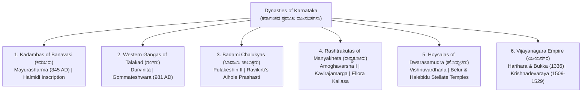
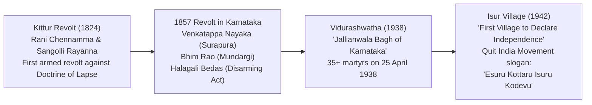

---exam: KEA Land Surveyor
subject: Paper I - General Knowledge
topic: Karnataka History, Dynasties & Freedom Movement (ಕರ್ನಾಟಕ ಇತಿಹಾಸ & ರಾಜವಂಶಗಳು)
priority: Tier 1 (15-18 Marks)
tags:
  - land-surveyor
  - vao
  - general-knowledge
  - karnataka-history
  - paper-1
  - high-yield
syllabus_refs:
  - P1-GK-1.3
last_verified: 2026-09-30
sources:
  - KEA Official Syllabus Specification
  - Karnataka State Gazetteer & NCERT History
---

# 01. Karnataka History, Dynasties & Heritage (ಕರ್ನಾಟಕ ಇತಿಹಾಸ)

> [!IMPORTANT] Exam Focus & Mark Potential
> - **Expected Weightage:** 15–18 Questions in Paper-I (Crucial for both Land Surveyor and VAO exams).
> - **Core Eras Tested:** First Kannada Inscription (Halmidi, 450 AD), Badami Chalukyas (Pulakeshin II & Aihole Inscription), Rashtrakutas (Kavirajamarga & Ellora), Hoysala Architecture, Vijayanagara Golden Age (Krishnadevaraya), Mysore Wodeyars (Nalvadi Krishnaraja Wodeyar & Sir MV), Kittur Chennamma, and Karnataka Unification (Alur Venkata Rao & 1 Nov 1956 / 1973).

---

## 1. Ancient & Medieval Dynasties of Karnataka



### Dynastic Master Summary Matrix

| Dynasty & Capital | Founder & Greatest Ruler | Monumental Architecture & Inscriptions | Literary Landmarks & Key Exam Facts |
| :--- | :--- | :--- | :--- |
| **Kadambas of Banavasi** (ಉತ್ತರ ಕನ್ನಡ) | **Mayurasharma** (Founder)<br>Kakusthavarma | Madhukeshwara Temple, Banavasi. | **Halmidi Inscription (ಹಾಲ್ಮಿಡಿ ಶಾಸನ, c. 450 AD)**: Earliest copper/stone record in classical Kannada. First indigenous Kannada kingdom. |
| **Western Gangas of Talakad** (ಮೈಸೂರು) | Dadiga & Madhava<br>**Durvinita** (Greatest) | **Gommateshwara Monolith at Shravanabelagola (981 AD)**: Commissioned by military commander **Chavundaraya**; 57-ft granite monolith. | Durvinita translated Gunadhya's *Brihatkatha* into Sanskrit and wrote commentary on Bharavi's *Kiratarjuniya*. |
| **Badami Chalukyas** (ಬಾಗಲಕೋಟೆ) | Jayasimha (Founder)<br>**Pulakeshin II** (ಇಮ್ಮಡಿ ಪುಲಕೇಶಿ) | Rock-cut cave temples at Badami, Virupaksha temple at Pattadakal (UNESCO World Heritage Site), Lad Khan temple at Aihole. | **Aihole Inscription (ಐಹೊಳೆ ಶಾಸನ, 634 AD)**: Composed by court poet **Ravikirti**; chronicles Pulakeshin II's victory over Northern Emperor Harsha on the banks of Narmada River. |
| **Rashtrakutas of Manyakheta** (ಮಳಖೇಡ, ಕಲಬುರಗಿ) | **Dantidurga** (Founder)<br>**Amoghavarsha I (Nrupatunga)** | **Kailasanatha Rock-Cut Temple at Ellora (Cave 16)**: Monolith carved top-down from single basalt cliff under **Krishna I**. | **Kavirajamarga (ಕವಿರಾಜಮಾರ್ಗ, c. 850 AD)**: First available poetic and rhetorical work in Kannada, authored by Sri Vijaya under Amoghavarsha's patronage. Famous line: *"ಕಾವೇರಿಯಿಂದಮಾ ಗೋದಾವರಿವರಮಿರ್ಪ ನಾಡದಾ ಕನ್ನಡದೊಳ್"*. |
| **Hoysalas of Dwarasamudra** (ಹಳೇಬೀಡು, ಹಾಸನ) | Sala (Legendary)<br>**Vishnuvardhana** (Bittideva) | **Chennakeshava Temple (Belur)**, **Hoysaleshwara Temple (Halebidu)**, Keshava Temple (Somanathapura). Characteristic **star-shaped (stellate) plinth** using chloritic schist (**soapstone**). | Vishnuvardhana converted from Jainism to Srivaishnavism under saint **Ramanujacharya**. Eminent master sculptors: **Jakanachari** and Dankanachari. |
| **Vijayanagara Empire** (ಹಂಪಿ, ವಿಜಯನಗರ) | **Harihara I & Bukka I** (1336 AD, on advice of **Sage Vidyaranya**). 4 Dynasties: Sangama, Saluva, Tuluva, Aravidu. | Virupaksha Temple, Stone Chariot at Vijaya Vittala Temple, Lotus Mahal, Mahanavami Dibba, Hazara Rama Temple (UNESCO World Heritage). | Greatest Emperor: **Sri Krishnadevaraya (1509–1529)** of Tuluva dynasty. Titles: *Kannada Rajya Rama Ramana*, *Andhra Bhoja*. Authored *Amuktamalyada* (Telugu) and *Jambavati Kalyanam* (Sanskrit). Battle of Rakkasa-Tangadi (Talikota) in **1565 AD** led to collapse. |
| **Adil Shahis of Vijayapura** (ಬಿಜಾಪುರ) | Yusuf Adil Shah | **Gol Gumbaz (ಗೋಲ್ ಗುಂಬಜ್)**: Tomb of Mohammed Adil Shah. Features second-largest dome in the world supported without pillars, famous for its **Whispering Gallery** (ಪಿಸುಗುಟ್ಟುವ ಗ್ಯಾಲರಿ). **Ibrahim Rauza**: "Taj Mahal of the South". | Court language Persian, patronized Dakhani Urdu. Ibrahim Adil Shah II authored *Kitab-e-Navras* (songs praising Hindu deities and music). |

---

## 2. Mysore Wodeyars & Modern Karnataka Builders

- **Founders:** Yaduraya and Krishnaraya (1399 AD).
- **Raja Wodeyar (1610 AD):** Shifted capital from Mysore to **Srirangapatna**; inaugurated the world-famous **Mysore Dasara** festivities.
- **Chikka Devaraja Wodeyar:** Introduced the **Athara Kacheri (18 Departments)** administrative system; established the postal system (*Anche*).
- **Hyder Ali & Tipu Sultan (1761–1799):**
  - **Four Anglo-Mysore Wars:**
    1. First (1767–69): Treaty of Madras.
    2. Second (1780–84): Treaty of Mangalore (Hyder died 1782).
    3. Third (1790–92): **Treaty of Srirangapatna** (Tipu ceded half his kingdom, sent sons as hostages).
    4. Fourth (1799): Fall of Srirangapatna on **4 May 1799**; Tipu killed; Kingdom restored to 5-year-old **Mummadi Krishnaraja Wodeyar**.
- **Nalvadi Krishnaraja Wodeyar (1902–1940 - ನಾಲ್ವಡಿ ಕೃಷ್ಣರಾಜ ಒಡೆಯರ್):**
  - Revered as **"Rajarshi"** by Mahatma Gandhi. Made Mysore a "Model State".
  - **1911–1932:** Krishna Raja Sagara (KRS) Dam constructed across Cauvery at Kannambadi.
  - **1916:** University of Mysore established (First university in a princely state).
  - **1918:** Miller Committee appointed to ensure reservation for backward classes in state administration.
  - **Sir M. Visvesvaraya (ಸರ್ ಎಂ.ವಿ. - Dewan 1912–1918):**
    - Birthday: **September 15** celebrated nationwide as **Engineers' Day**.
    - Motto: *"Industrialize or Perish"*.
    - Founded: Bhadravati Iron and Steel Works (1923), State Bank of Mysore (1913), UVCE (1917), Kannada Sahitya Parishat (1915). Awarded Bharat Ratna in 1955.

---

## 3. Freedom Movement Landmarks in Karnataka



1. **Kittur Rani Chennamma (1824):** Led armed uprising against British collector Thackeray after he refused to recognize her adopted son Shivalingappa. Her commander **Sangolli Rayanna** waged guerrilla warfare until hanged at Nandagad (1831).
2. **Vidurashwatha Tragedy (ವಿ his ದುರಾಶ್ವತ್ಥ - 25 April 1938, Chikkaballapur):** British police fired on peaceful Satyagrahis hoisting the National Flag, killing over 35 people. Known as the **"Jallianwala Bagh of Karnataka"**.
3. **Shivapura Flag Satyagraha (ಏಪ್ರಿಲ್ 1938, Mandya):** Organized under **T. Siddalingayya** defying British flag ban.
4. **Isur Incident (ಈಸೂರು - 1942, Shikaripura, Shivamogga):** Villagers declared their village a free sovereign republic, hoisting the Tricolor with the slogan: *"ಏಸೂರು ಕೊಟ್ಟರೂ ಈಸೂರು ಕೊಡೆವು"*. Five patriots were subsequently hanged.

---

## 4. Unification of Karnataka (ಕರ್ನಾಟಕ ಏಕೀಕರಣ ಚಳವಳಿ)

Prior to 1956, Kannada-speaking regions were fragmented across 20+ administrative units (Bombay Presidency, Madras Presidency, Hyderabad-Karnataka, Kodagu, Mysore State).

- **Father / Kulapurohita of Karnataka Unification:** **Alur Venkata Rao (ಆಲೂರು ವೆಂಕಟರಾವ್)**. His magnum opus book ***Karnataka Gatha Vaibhava (ಕರ್ನಾಟಕ ಗತ ವೈಭವ, 1912)*** ignited national pride.
- **Dharwad Vidyavardhaka Sangha (1890):** Founded by R.H. Deshpande.
- **Karnataka Ekikarana Sabha (1916):** Formed in Belagavi.
- **Belgaum Congress Session (1924):** Only Congress session presided over by **Mahatma Gandhi**. Huilgol Narayana Rao sang the welcome anthem: *"ಉದಯವಾಗಲಿ ನಮ್ಮ ಚೆಲುವ ಕನ್ನಡ ನಾಡು"*.
- **States Reorganization Commission (SRC / Fazal Ali Commission - 1953):** Recommended the formation of a unified Kannada-speaking state.
- **1 November 1956:** **Mysore State** formed with 19 districts; **K. Chengalaraya Reddy** was first Chief Minister (1947–52), **S. Nijalingappa** was CM during reorganization.
- **1 November 1973:** Chief Minister **D. Devaraj Urs** officially rechristened Mysore State as **"Karnataka"**.

---

## 5. High-Yield Mnemonics

> [!NOTE] Memory Aids
> - **Earliest Kannada Milestone: "Halmidi at Four-Fifty"**
>   - Halmidi inscription dates to **c. 450 AD** (Kadamba period).
> - **Kavirajamarga Range: "Cauvery to Godavari"**
>   - Traditional cultural boundary of Karnataka: From river **Cauvery** in the south to **Godavari** in the north.
> - **Karnataka Martyrs: "Vidurashwatha = Jallianwala, Isur = Independence"**
>   - Vidurashwatha: Massacre in 1938.
>   - Isur: First free village in 1942.

---

## 6. Likely Exam Questions & PYQ Patterns

1. **[KEA PYQ]** *The earliest written stone inscription in the Kannada language is the:*
   - **Answer:** Halmidi Inscription (ಹಾಲ್ಮಿಡಿ ಶಾಸನ, Hassan district, c. 450 AD).
2. **[KEA PYQ]** *The court poet who authored the famous Aihole Inscription praising Badami Chalukya King Pulakeshin II was:*
   - **Answer:** Ravikirti (ರfilteredಿಕೀರ್ತಿ).
3. **[Expected Question]** *Who is celebrated as the "Karnataka Kulapurohita" for pioneering the Unification of Karnataka?*
   - **Answer:** Alur Venkata Rao (ಆಲೂರು ವೆಂಕಟರಾವ್).
4. **[Expected Question]** *The Mysore State was officially renamed as Karnataka on 1st November 1973 during the tenure of which Chief Minister?*
   - **Answer:** D. Devaraj Urs (ಡಿ. ದೇವರಾಜ ಅರಸು).
5. **[Expected Question]** *Which tragic incident during Karnataka's freedom struggle is known as the "Jallianwala Bagh of Karnataka"?*
   - **Answer:** Vidurashwatha firing (25 April 1938, Chikkaballapur district).

---

## 7. Quick Revision Box

```
┌────────────────────────────────────────────────────────────────────────┐
│ KARNATAKA HISTORY & HERITAGE REVISION CHEAT SHEET                      │
├────────────────────────────────────────────────────────────────────────┤
│ • Halmidi Inscription: 450 AD, Kadambas, first Kannada inscription.    │
│ • Gommateshwara (981 AD): Chavundaraya (Ganga general), 57 ft.         │
│ • Aihole Inscription (634 AD): Ravikirti, Pulakeshin II beats Harsha.  │
│ • Kavirajamarga (850 AD): Sri Vijaya / Amoghavarsha I (Rashtrakuta).   │
│ • Hoysala Architecture: Stellate plan, soapstone, Belur/Halebidu.      │
│ • Vijayanagara (1336): Harihara & Bukka. Krishnadevaraya (1509-1529).  │
│ • Gol Gumbaz: Whispering Gallery, Mohammed Adil Shah (Vijayapura).     │
│ • Tipu Sultan: Died 4 May 1799 in 4th Anglo-Mysore War at Srirangapatna│
│ • Nalvadi Krishnaraja Wodeyar + Sir MV: KRS Dam, Mysore Univ (1916).   │
│ • Vidurashwatha: 25 Apr 1938 | Isur: 1942 Quit India martyr village.   │
│ • Unification: Alur Venkata Rao. Nov 1, 1956 (Mysore) -> Nov 1, 1973 (Karnataka).│
└────────────────────────────────────────────────────────────────────────┘
```

---
*Related Notes:*
- [[02_Karnataka_and_India_Geography]]
- [[03_Indian_Constitution_and_Polity]]
- [[05_Karnataka_Current_Affairs_and_State_Schemes_2026]]
