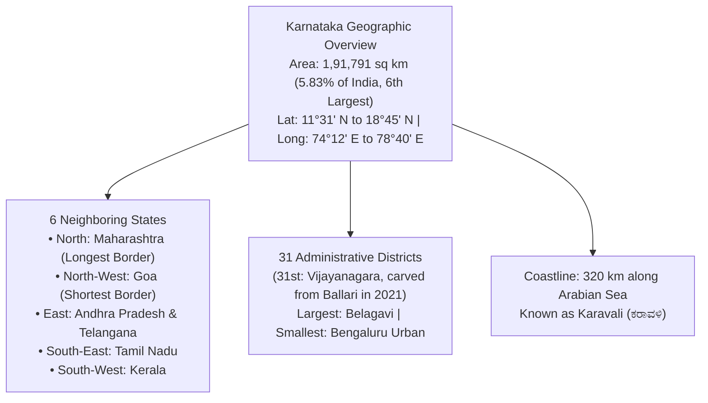
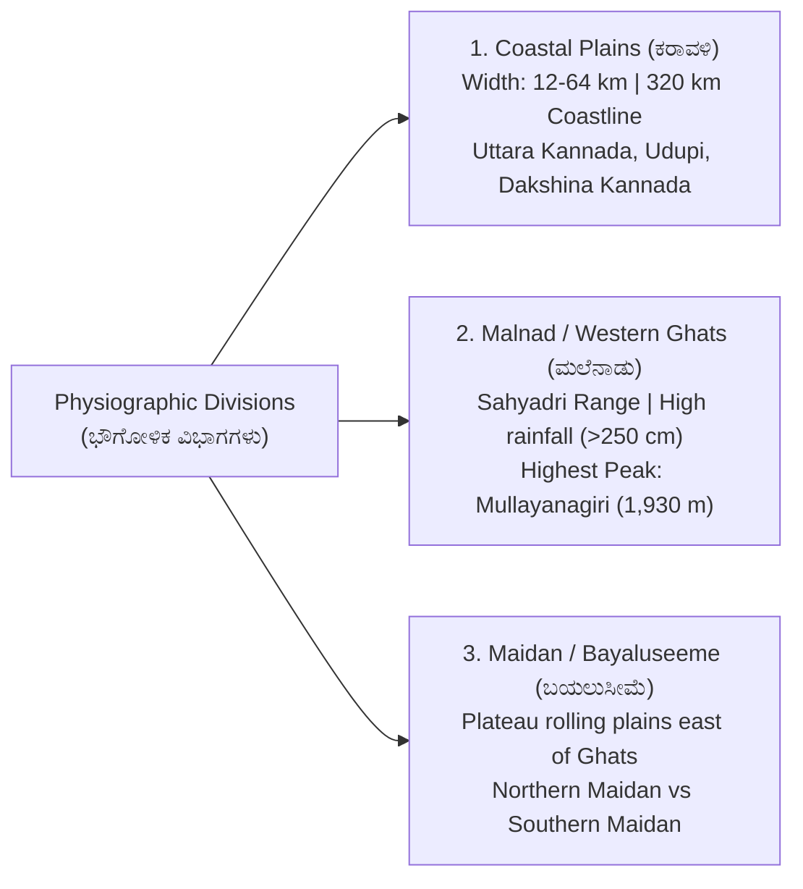
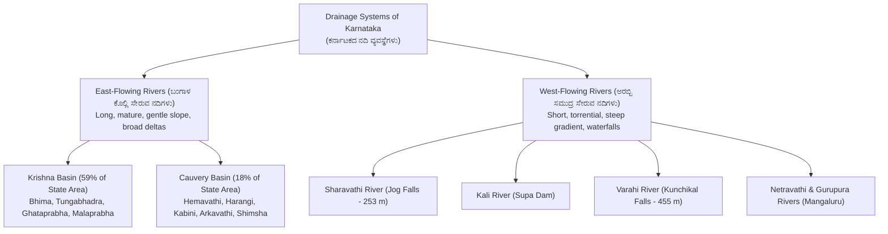

# 02. Karnataka & India Geography (ಭೂಗೋಳಶಾಸ್ತ್ರ)

> [!IMPORTANT] Exam Focus & Mark Potential
> - **Expected Weightage:** 16–20 Questions in Paper-I.
> - **Core Physical Features Tested:** Geographic coordinates & borders (31 districts, 6 neighboring states), 3 Physiographic regions (Coastal, Malnad, Maidan), Highest peak (Mullayanagiri, 1,930 m), River systems (Krishna vs Cauvery basins, West-flowing rivers), Waterfalls (Jog, Shivanasamudra, Kunchikal), and Soil types & National Parks.

---

## 1. Geographical Profile & Administrative Boundaries of Karnataka



---

## 2. Three Physiographic Divisions of Karnataka



### Physical Features Matrix

| Region | Elevation & Climate | Soil & Vegetation | Critical Peaks & Landmarks |
| :--- | :--- | :--- | :--- |
| **Coastal Region (ಕರಾವಳಿ)** | Sea level to $300\text{ m}$; hot and humid climate. | Alluvial along river banks, Laterite on hillocks. Tropical evergreen and mangrove patches. | 320 km coastline; New Mangalore Port (only major port in Karnataka, known as "Gateway of Karnataka"). |
| **Malnad / Western Ghats (ಮಲೆನಾಡು)** | $900\text{ to }1,900\text{ m}$; heavy monsoon rainfall ($2,500–4,000\text{ mm}$). UNESCO World Heritage natural site. | Laterite and forest soils. Dense tropical evergreen, semi-evergreen, and shola forests. | **Mullayanagiri (ಮುಳ್ಳಯ್ಯನಗಿರಿ - 1,930 m)** in Bababudangiri range (Highest peak in Karnataka). **Kudremukha (1,892 m)**, **Pushpagiri (1,712 m)**. Agumbe (Cherrapunji of South India). |
| **Northern Maidan (ಉತ್ತರ ಬಯಲುಸೀಮೆ)** | $300\text{ to }600\text{ m}$; semi-arid, low rainfall ($500–700\text{ mm}$). Treeless rolling plains. | **Black Cotton Soil (Regur / ಕರಿಮಣ್ಣು)** derived from Deccan trap basalt. Ideal for cotton, jowar, sunflower. | Krishna, Bhima, Ghataprabha, Malaprabha valleys. Land of waterfalls (Gokak falls across Ghataprabha). |
| **Southern Maidan (ದಕ್ಷಿಣ ಬಯಲುಸೀಮೆ)** | $600\text{ to }900\text{ m}$; undulating plateau with granite monadnocks. | **Red Sandy & Loamy Soils (ಕೆಂಪು ಮಣ್ಣು)** derived from Dharwar and Peninsular gneisses. Ideal for Ragi, groundnut, pulses. | Cauvery, Shimsha, Arkavathi valleys. Monolithic inselbergs (Madhugiri Monolith - second largest monolith in Asia). |

---

## 3. River Drainage Systems of Karnataka

Karnataka is drained by two distinct river systems: East-flowing rivers emptying into the Bay of Bengal, and West-flowing rivers discharging into the Arabian Sea.



### Major River Comparison & Dam Matrix

| River & Origin | Total / State Length | Major Tributaries | Key Dams & Hydroelectric Projects | Famous Waterfalls |
| :--- | :---: | :--- | :--- | :--- |
| **Krishna River** (Mahabaleshwar, Maharashtra) | $1,400\text{ km}$ ($483\text{ km}$ in KA) | **Ghataprabha**, **Malaprabha**, **Bhima**, **Tungabhadra** (formed at Kudli by Tunga + Bhadra). | **Almatti Dam (Lal Bahadur Shastri Sagar)**, **Narayanpur Dam (Basava Sagar)**, Tungabhadra Dam at Hosapete. | **Gokak Falls** (Ghataprabha, 52 m), Chunchanakatte. |
| **Cauvery River** (Talakaveri, Brahmagiri, Kodagu) | $805\text{ km}$ ($380\text{ km}$ in KA) | Harangi, **Hemavathi** (Gorur), **Kabini** (Beechanahalli), Lakshmanathirtha, Shimsha, Arkavathi. | **Krishna Raja Sagara (KRS) Dam** (Kannambadi), Harangi Dam, Kabini Dam. | **Shivanasamudra Falls** (Gaganachukki & Bharachukki, 98 m) - Asia's first hydroelectric power station (1902). |
| **Sharavathi River** (Ambuthirtha, Thirthahalli) | $128\text{ km}$ (Entirely in KA) | Haridravathi, Yennehole. | **Linganamakki Dam** (Sharavathi Hydroelectric Project). | **Jog Falls / Gersoppa (253 m)** - 4 distinct cascades: **Raja, Roarer, Rocket, Rani**. |
| **Varahi River** (Hebbagilu, Shivamogga) | $66\text{ km}$ | Kalandur | Mani Dam (Underground powerhouse). | **Kunchikal Falls (455 m)** - Highest tiered waterfall in India. |

---

## 4. Soils, Forests & Wildlife Conservation in Karnataka

### Soil Distribution
1. **Red Soil (ಕೆಂಪು ಮಣ್ಣು):** Covers the largest geographical area ($\approx 60\%$) of Karnataka; rich in iron and aluminium, deficient in nitrogen and humus. Predominant in southern and eastern districts.
2. **Black Cotton Soil (ಕರಿಮಣ್ಣು / Regur):** Covers $\approx 25\%$ of state (Northern Karnataka: Belagavi, Vijayapura, Bagalkote, Dharwad, Kalaburagi). High moisture-retention capacity; rich in calcium and magnesium.
3. **Laterite Soil (ಜಂಬಿಟ್ಟಿಗೆ ಮಣ್ಣು):** Found in heavy rainfall belts (Uttara Kannada, Udupi, Dakshina Kannada, Kodagu, Shivamogga). Highly leached, acidic, rich in iron oxide. Supports cashew, tea, coffee, rubber.
4. **Coastal Alluvial Soil:** Deposited along river mouths; ideal for paddy and coconut.

### National Parks of Karnataka (5 Official Parks)
1. **Bandipur National Park (Chamarajanagar):** First Project Tiger reserve in Karnataka (1973–74); part of Nilgiri Biosphere Reserve.
2. **Nagarahole National Park / Rajiv Gandhi NP (Kodagu & Mysuru):** Famous for Asian elephants and tigers.
3. **Kudremukha National Park (Chikkamagaluru, Udupi, Dakshina Kannada):** Shola grasslands, origin of Tunga, Bhadra, and Netravathi rivers.
4. **Anshi National Park / Kali Tiger Reserve (Uttara Kannada):** Dense evergreen rainforest, habitat of black panthers.
5. **Bannerghatta National Park (Bengaluru):** India's first butterfly park, biological park and safari.

---

## 5. High-Yield Mnemonics

> [!NOTE] Memory Aids
> - **Jog Falls Cascades: "4 R's of Jog"**
>   - **R**aja, **R**oarer, **R**ocket, **R**ani.
> - **Highest Waterfall vs Highest Single Drop:**
>   - **Kunchikal** (Varahi, 455 m) $\to$ Highest tiered cascade in India.
>   - **Jog** (Sharavathi, 253 m) $\to$ Highest untiered single plunge waterfall.
> - **Highest Peak: "Mullayanagiri at Nineteen-Thirty"**
>   - Elevation: **1,930 metres** in Chikkamagaluru.

---

## 6. Likely Exam Questions & PYQ Patterns

1. **[KEA PYQ]** *Which is the highest mountain peak in Karnataka?*
   - **Answer:** Mullayanagiri (ಮುಳ್ಳಯ್ಯನಗಿರಿ - 1,930 m) in Chikkamagaluru district.
2. **[KEA PYQ]** *Asia's very first hydroelectric power generation generating station was established in 1902 at:*
   - **Answer:** Shivanasamudra Falls (ಶಿವನಸಮುದ್ರ) on the Cauvery River.
3. **[Expected Question]** *Which river forms the famous Jog Falls (Gersoppa Falls)?*
   - **Answer:** Sharavathi River (ಶರಾವತಿ ನದಿ).
4. **[Expected Question]** *The 31st district of Karnataka, Vijayanagara, was carved out of which parent district?*
   - **Answer:** Ballari district (ಬಳ್ಳಾರಿ - formed 2 October 2021).
5. **[Expected Question]** *Black cotton soil (Regur soil) in Karnataka is predominantly found in which geographical region?*
   - **Answer:** Northern Maidan (ಉತ್ತರ ಬಯಲುಸೀಮೆ - Deccan trap basalt region).

---

## 7. Quick Revision Box

```
┌────────────────────────────────────────────────────────────────────────┐
│ KARNATAKA GEOGRAPHY REVISION CHEAT SHEET                               │
├────────────────────────────────────────────────────────────────────────┤
│ • Area: 1,91,791 sq km (5.83% of India, 6th largest). 31 Districts.   │
│ • Border States: 6 (Maharashtra longest, Goa shortest). Coast = 320 km.│
│ • Highest Peak: Mullayanagiri (1,930 m) in Bababudangiri range.        │
│ • Agumbe: Cherrapunji of South India (highest rainfall in state).      │
│ • Krishna Basin: 59% state area (Almatti Dam, Narayanpur Dam).         │
│ • Cauvery Basin: 18% state area (Origin Talakaveri, KRS Dam).          │
│ • Jog Falls: Sharavathi (253 m - Raja, Roarer, Rocket, Rani).          │
│ • Kunchikal Falls: Varahi River (455 m - highest cascade in India).    │
│ • Shivanasamudra: 1902 first hydro-power in Asia.                      │
│ • Soils: Red (60%, most widespread), Black (25%, Northern cotton belt).│
│ • 5 National Parks: Bandipur, Nagarahole, Kudremukha, Anshi, Bannerghatta.│
└────────────────────────────────────────────────────────────────────────┘
```

---
*Related Notes:*
- [[01_Karnataka_History_and_Dynasties]]
- [[03_Indian_Constitution_and_Polity]]
- [[05_Karnataka_Current_Affairs_and_State_Schemes_2026]]
