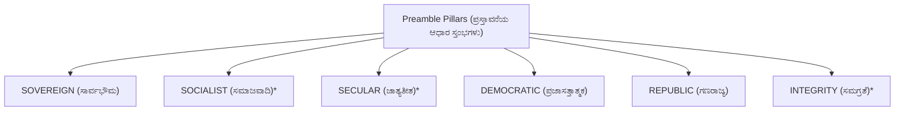
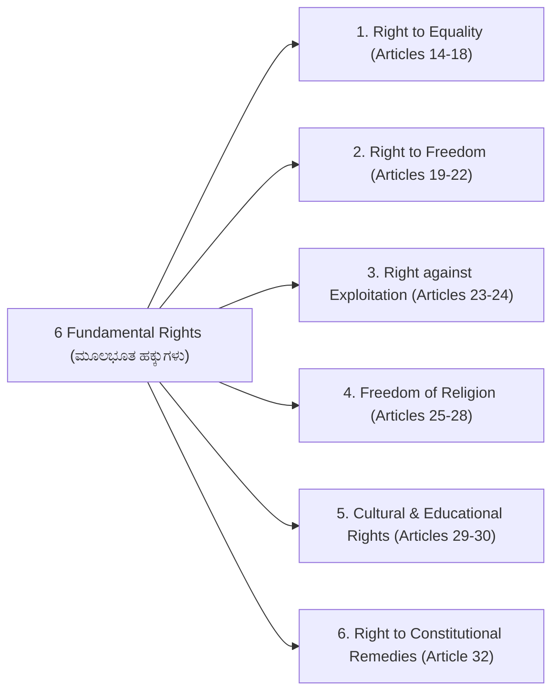
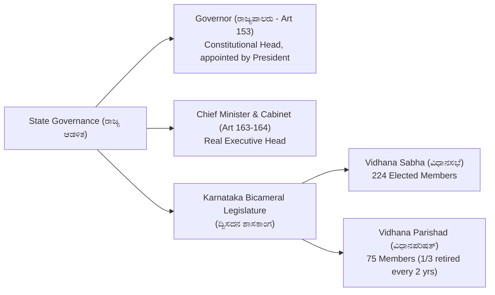

# 03. Indian Constitution & Polity (ಭಾರತೀಯ ಸಂವಿಧಾನ)

> [!IMPORTANT] Exam Focus & Mark Potential
> - **Expected Weightage:** 14–16 Questions in Paper-I.
> - **Core Constitutional Provisions Tested:** Preamble keywords & 42nd Amendment, Fundamental Rights (Articles 14, 17, 19, 21, 21A, 32), 5 Prerogative Writs, Directive Principles (Articles 40, 44, 50), Fundamental Duties (Art 51A), Governor's powers, Karnataka Bicameral Legislature (224 + 75 seats), and 73rd Amendment / Panchayati Raj 3-tier architecture.

---

## 1. Preamble & Constitutional Architecture

The Constitution of India was drafted by the Constituent Assembly under the Drafting Committee chaired by **Dr. B.R. Ambedkar** (Father of the Indian Constitution). Adopted on **26 November 1949** (Constitution Day / ಸಂವಿಧಾನ ದಿನ) and came into full legal force on **26 January 1950** (Republic Day).


*\*Added by the **42nd Constitutional Amendment Act, 1976** (Mini-Constitution).*

---

## 2. Fundamental Rights (ಮೂಲಭೂತ ಹಕ್ಕುಗಳು - Part III, Articles 12–35)

Fundamental Rights are justiciable in courts and defended by the Supreme Court (Art 32) and High Courts (Art 226). Borrowed from the **US Bill of Rights**.



### Essential Articles Tested in KEA Exams

| Article | Legal Provision & Guarantee | Key Landmark / Amendment |
| :---: | :--- | :--- |
| **Article 14** | **Equality before law** and equal protection of the laws. | Fundamental bedrock of rule of law. |
| **Article 15** | Prohibition of discrimination on grounds of religion, race, caste, sex, or place of birth. | State may make special provisions for women, children, and backward classes. |
| **Article 16** | **Equality of opportunity in public employment**. | Enables affirmative reservation policies. |
| **Article 17** | **Abolition of Untouchability (ಅಸ್ಪೃಶ್ಯತೆ ನಿರ್ಮೂಲನೆ)**. | Absolute fundamental right; violation is a punishable criminal offense under PCR Act 1955. |
| **Article 19** | Protection of **6 democratic freedoms**: Speech, Assembly, Association, Movement, Residence, Profession. | Subject to "reasonable restrictions". |
| **Article 21** | **Protection of Life and Personal Liberty (ಜೀವಿಸುವ ಹಕ್ಕು)**. | Broadest right interpreted by SC (includes right to privacy, clean environment, dignity). |
| **Article 21A** | **Right to Free & Compulsory Education** for children aged 6 to 14 years. | Added by **86th Amendment Act, 2002** (RTE Act, 2009). |
| **Article 24** | **Prohibition of child labour** in hazardous factories, mines, or employment under 14 years. | Child Labour Prohibition Act. |
| **Article 32** | **Right to Constitutional Remedies**. Described by Dr. Ambedkar as the **"Heart and Soul of the Constitution"**. | Empowers Supreme Court to issue 5 Writs. |

---

## 3. The Five Constitutional Writs (ಆದೇಶಗಳು - Articles 32 & 226)

| Writ Name | Literal Latin Meaning | Legal Scope & Application |
| :--- | :--- | :--- |
| **Habeas Corpus (ಹೆಬಿಯಸ್ ಕಾರ್ಪಸ್)** | *"To have the body"* | Issued against illegal detention by police or private individual. Court orders the detained person to be produced before it to test the legality of detention. |
| **Mandamus (ಮ್ಯಾಂಡಮಸ್)** | *"We command"* | Issued to a public official, tribunal, or government body commanding them to perform a mandatory statutory public duty they have failed or refused to do. |
| **Prohibition (ಪ್ರೊಹಿಬಿಷನ್)** | *"To forbid"* | Issued by a higher court to a lower judicial or quasi-judicial body to **stop proceedings** that exceed its legal jurisdiction. |
| **Certiorari (ಸರ್ಷಿಯೋರರಿ)** | *"To be certified"* | Issued to quash an order already passed by a lower court or tribunal acting without or in excess of jurisdiction. |
| **Quo-Warranto (ಕೋ-ವಾರಂಟೋ)** | *"By what authority"* | Issued to challenge the legal right of a person holding a substantive public office to prevent unlawful usurpation. |

---

## 4. Directive Principles (DPSP - Part IV) & Fundamental Duties (Part IV-A)

### High-Yield DPSP Articles (Borrowed from Ireland):
- **Article 40:** **Organization of Village Panchayats (ಗ್ರಾಮ ಪಂಚಾಯಿತಿಗಳ ರಚನೆ)**.
- **Article 44:** **Uniform Civil Code (ಏಕರೂಪ ನಾಗರಿಕ ಸಂಹಿತೆ)**.
- **Article 45:** Provision for early childhood care and education to children below 6 years.
- **Article 50:** **Separation of Judiciary from Executive (ನ್ಯಾಯಾಂಗವನ್ನು ಕಾರ್ಯಾಂಗದಿಂದ ಪ್ರತ್ಯೇಕಿಸುವುದು)**.
- **Article 51:** Promotion of international peace and security.

### Fundamental Duties (Article 51A):
- Added by the **42nd Amendment Act, 1976** based on the recommendations of the **Swaran Singh Committee**.
- Originally **10 duties**; the **11th duty** (parent/guardian duty to educate child aged 6–14) was added by the **86th Amendment Act, 2002**.

---

## 5. State Executive & Karnataka Legislature



### Panchayati Raj System (73rd Constitutional Amendment Act, 1992)
- Added **Part IX** and **11th Schedule (29 functional subjects)** to the Constitution.
- Established a mandatory **3-tier structure**:
  1. **Gram Panchayat (ಗ್ರಾಮ ಪಂಚಾಯಿತಿ)** at village level.
  2. **Taluk Panchayat (ತಾಲೂಕು ಪಂಚಾಯಿತಿ)** at intermediate block level.
  3. **Zilla Panchayat (ಜಿಲ್ಲಾ ಪಂಚಾಯಿತಿ)** at district level.
- **Karnataka Specific Rule:** Karnataka was among the first states to implement the Karnataka Panchayat Raj Act, 1993. While the 73rd Amendment mandates a minimum of $33.33\%$ reservation for women, **Karnataka provides 50% reservation for women in all Panchayati Raj bodies!**

---

## 6. High-Yield Mnemonics

> [!NOTE] Memory Aids
> - **42nd Amendment Added Words: "S-S-I"**
>   - **S**ocialist, **S**ecular, **I**ntegrity.
> - **Writs Memory Word: "H-M-P-C-Q"**
>   - **H**abeas Corpus, **M**andamus, **P**rohibition, **C**ertiorari, **Q**uo-Warranto.
> - **Ambedkar's Heart & Soul: "Article 32"**
>   - Right to Constitutional Remedies.

---

## 7. Likely Exam Questions & PYQ Patterns

1. **[KEA PYQ]** *Which article of the Indian Constitution was described by Dr. B.R. Ambedkar as the "Heart and Soul of the Constitution"?*
   - **Answer:** Article 32 (Right to Constitutional Remedies).
2. **[KEA PYQ]** *The abolition of untouchability is enacted under which article of the Indian Constitution?*
   - **Answer:** Article 17.
3. **[Expected Question]** *Which Constitutional Amendment introduced Article 21A making free and compulsory elementary education a Fundamental Right?*
   - **Answer:** 86th Constitutional Amendment Act, 2002.
4. **[Expected Question]** *How many seats are there in the Karnataka Legislative Assembly (Vidhana Sabha) and Legislative Council (Vidhana Parishad)?*
   - **Answer:** Vidhana Sabha has 224 elected seats; Vidhana Parishad has 75 seats.
5. **[Expected Question]** *What percentage of seats are reserved for women in Panchayati Raj institutions in Karnataka?*
   - **Answer:** 50% reservation.

---

## 8. Quick Revision Box

```
┌────────────────────────────────────────────────────────────────────────┐
│ INDIAN CONSTITUTION & POLITY REVISION CHEAT SHEET                      │
├────────────────────────────────────────────────────────────────────────┤
│ • Adopted: 26 Nov 1949 (Constitution Day) | Enforced: 26 Jan 1950.     │
│ • 42nd Amendment 1976: Added Socialist, Secular, Integrity to Preamble.│
│ • Art 14: Equality before law | Art 17: Untouchability abolished.      │
│ • Art 19: 6 Freedoms | Art 21: Life & Liberty | Art 21A: RTE (86th Amd)│
│ • Art 32: Constitutional Remedies (Heart & Soul) - 5 Writs.            │
│ • Art 40: Village Panchayats | Art 44: Uniform Civil Code.             │
│ • Art 51A: 11 Fundamental Duties (Swaran Singh Committee, 42nd Amd).   │
│ • Karnataka Assembly: 224 MLAs | Council: 75 MLCs (Bicameral).        │
│ • 73rd Amendment: 3-tier Panchayati Raj, 11th Schedule (29 subjects).  │
│ • Karnataka provides 50% reservation for women in Panchayati Raj.      │
└────────────────────────────────────────────────────────────────────────┘
```

---
*Related Notes:*
- [[01_Karnataka_History_and_Dynasties]]
- [[02_Karnataka_and_India_Geography]]
- [[05_Karnataka_Current_Affairs_and_State_Schemes_2026]]
