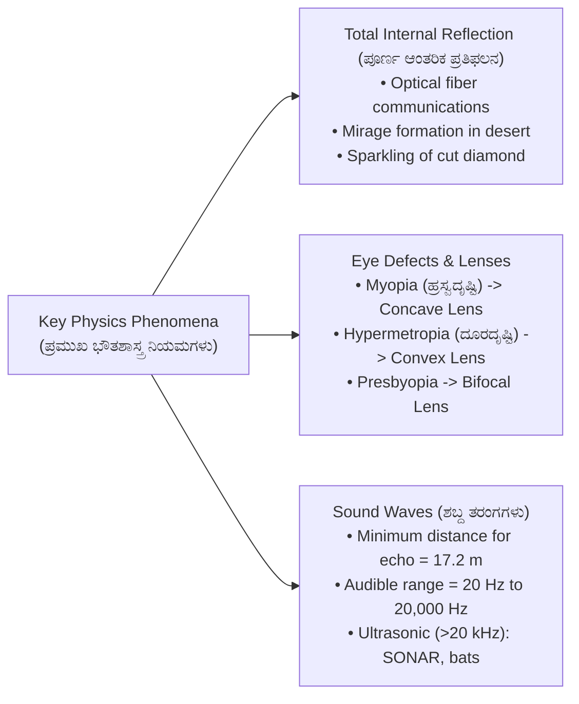
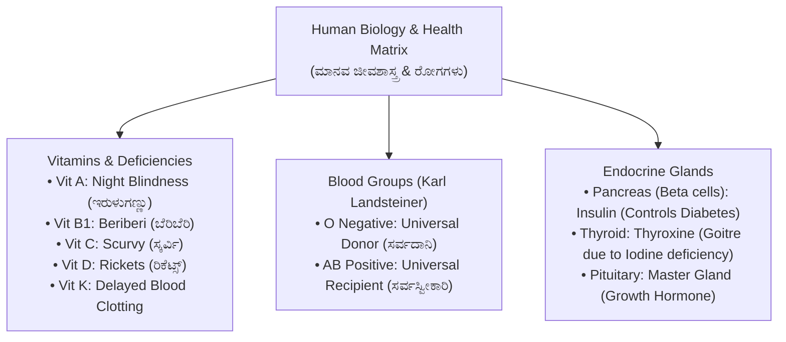

---exam: KEA Land Surveyor
subject: Paper I - General Knowledge
topic: General Science & Mental Ability (ಸಾಮಾನ್ಯ ವಿಜ್ಞಾನ & ಮಾನಸಿಕ ಸಾಮರ್ಥ್ಯ)
priority: Tier 2 (20-24 Marks combined)
tags:
  - land-surveyor
  - vao
  - general-knowledge
  - general-science
  - mental-ability
  - paper-1
  - high-yield
syllabus_refs:
  - P1-GK-1.1
  - P1-GK-1.7
last_verified: 2026-09-30
sources:
  - KEA Official Syllabus Specification
  - NCERT Science Standard VIII-X
---

# 04. General Science & Mental Ability (ಸಾಮಾನ್ಯ ವಿಜ್ಞಾನ & ಮಾನಸಿಕ ಸಾಮರ್ಥ್ಯ)

> [!IMPORTANT] Exam Focus & Mark Potential
> - **Expected Weightage:** 20–24 Questions in Paper-I (10–12 Science, 10–12 Reasoning & Aptitude).
> - **Core High-Yield Science:** Total Internal Reflection, Myopia vs Hypermetropia lens corrections, pH scale & everyday chemical formulas (Baking soda, Bleaching powder, POP), Vitamins & deficiency diseases, and Blood groups.
> - **Core High-Yield Mental Ability:** Number/Alphabet series, Direction sense tests, Time & Work shortcuts, and Speed/Distance train problems.

---

## 1. High-Yield General Science: Physics in Everyday Life



### Essential Physics Formulas Matrix
- **Work & Power:** $\text{Work } W = F \cdot d \cos \theta$; $\text{Power } P = \frac{W}{t}$ (Unit: Watt; **$1\text{ Horsepower (HP)} = 746\text{ Watts}$**).
- **Kinetic Energy:** $KE = \frac{1}{2} m v^2$; **Potential Energy:** $PE = m g h$.
- **Ohm's Law:** $V = I \cdot R$ (Resistance in series: $R_s = R_1 + R_2$; Parallel: $\frac{1}{R_p} = \frac{1}{R_1} + \frac{1}{R_2}$).

---

## 2. Everyday Chemistry: Acids, Bases, Salts & Alloys

| Chemical Name | Common / Trade Name | Chemical Formula | High-Frequency Exam Use |
| :--- | :--- | :--- | :--- |
| **Sodium Bicarbonate** | Baking Soda (ಅಡುಗೆ ಸೋಡಾ) | $\text{NaHCO}_3$ | Food leavening, fire extinguishers, antacid. |
| **Sodium Carbonate** | Washing Soda (ತೊಳೆಯುವ ಸೋಡಾ) | $\text{Na}_2\text{CO}_3 \cdot 10\text{H}_2\text{O}$ | Detergent, removing permanent hardness of water. |
| **Calcium Hypochlorite** | Bleaching Powder (ಬ್ಲೀಚಿಂಗ್ ಪುಡಿ) | $\text{CaOCl}_2$ | Disinfectant in drinking water, textile bleaching. |
| **Calcium Sulphate Hemihydrate** | Plaster of Paris (POP) | $\text{CaSO}_4 \cdot \frac{1}{2}\text{H}_2\text{O}$ | Bone fracture casts, building sculptures. Prepared by heating Gypsum ($\text{CaSO}_4 \cdot 2\text{H}_2\text{O}$) to $373\text{ K}$. |
| **Sodium Hydroxide** | Caustic Soda | $\text{NaOH}$ | Soap manufacture, paper pulp. |

### Common Alloys & Composition
- **Brass (ಹಿತ್ತಾಳೆ):** Copper ($60-70\%$) + Zinc ($30-40\%$).
- **Bronze (ಕಂಚು):** Copper ($88\%$) + Tin ($12\%$).
- **Solder (ಬೆಸುಗೆ ಲೋಹ):** Lead ($50\%$) + Tin ($50\%$) (Low melting point).
- **Stainless Steel:** Iron + Chromium ($18\%$) + Nickel ($8\%$) + Carbon.

---

## 3. Human Biology, Health & Nutrition



---

## 4. Mental Ability & Quantitative Aptitude Shortcuts

### 1. Time & Work (ಸಮಯ ಮತ್ತು ಕೆಲಸ)
- If person $A$ finishes work in $x$ days and $B$ finishes in $y$ days, together they complete it in:
  $$\mathbf{\text{Days Together} = \frac{x \cdot y}{x + y}}$$
- *Example:* $A$ takes 10 days, $B$ takes 15 days $\implies \frac{10 \times 15}{10 + 15} = \frac{150}{25} = \mathbf{6\text{ days}}$.

### 2. Speed, Time & Distance / Trains
- $\text{Speed in m/s} = \text{Speed in km/h} \times \mathbf{\frac{5}{18}}$.
- $\text{Speed in km/h} = \text{Speed in m/s} \times \mathbf{\frac{18}{5}}$.
- **Time to cross a stationary pole/man:** $\text{Time} = \frac{\text{Length of Train}}{\text{Speed}}$.
- **Time to cross a bridge/platform of length $L_p$:** $\text{Time} = \frac{\text{Length of Train } + L_p}{\text{Speed}}$.

### 3. Direction Sense Tests
Always draw the 4 cardinal directions ($N, S, E, W$).
- Clockwise from North: North $\to$ East $\to$ South $\to$ West.
- Turning right $= 90^\circ$ clockwise; Turning left $= 90^\circ$ counter-clockwise.
- Use Pythagoras theorem ($H = \sqrt{P^2 + B^2}$) to calculate straight-line displacement from start.

---

## 5. High-Yield Mnemonics

> [!NOTE] Memory Aids
> - **Fat-Soluble Vitamins: "K-E-D-A"**
>   - Vitamins **K, E, D, A** are stored in fat/liver.
>   - Vitamins **B and C** are water-soluble (excreted in urine).
> - **Eye Defects & Lenses: "My Concave Cave, Hyper Convex"**
>   - **My**opia $\to$ **Concave** lens.
>   - **Hyper**metropia $\to$ **Convex** lens.
> - **Km/h to m/s: "Smaller unit gets Smaller fraction (5/18)"**
>   - Multiply by $5/18$ to get m/s; multiply by $18/5$ to get km/h.

---

## 6. Likely Exam Questions & PYQ Patterns

1. **[KEA PYQ]** *Which lens is prescribed to correct Myopia (Short-sightedness)?*
   - **Answer:** Concave lens (ನಿಮ್ನ ಮಸೂರ).
2. **[KEA PYQ]** *Deficiency of Vitamin C leads to which of the following diseases?*
   - **Answer:** Scurvy (ಸ್ಕರ್ವಿ - bleeding gums).
3. **[Expected Question]** *Optical fibers used in high-speed telecommunications operate on the optical principle of:*
   - **Answer:** Total Internal Reflection (ಪೂರ್ಣ ಆಂತರಿಕ ಪ್ರತಿಫಲನ).
4. **[Expected Question]** *A train 150 m long passes an electric pole in 10 seconds. What is the speed of the train in km/h?*
   - Speed in m/s $= \frac{150}{10} = 15\text{ m/s}$.
   - Speed in km/h $= 15 \times \frac{18}{5} = 3 \times 18 = \mathbf{54\text{ km/h}}$.
5. **[Expected Question]** *Which blood group is known as the Universal Donor?*
   - **Answer:** O negative ($O^-$).

---

## 7. Quick Revision Box

```
┌────────────────────────────────────────────────────────────────────────┐
│ GENERAL SCIENCE & MENTAL ABILITY REVISION CHEAT SHEET                  │
├────────────────────────────────────────────────────────────────────────┤
│ • 1 Horsepower (HP) = 746 Watts. Echo minimum distance = 17.2 m.      │
│ • Total Internal Reflection: Optical fibers, mirages, cut diamond.    │
│ • Myopia = Concave lens | Hypermetropia = Convex lens.                 │
│ • POP = CaSO4 · 1/2 H2O (heated Gypsum). Baking Soda = NaHCO3.         │
│ • Brass = Cu + Zn | Bronze = Cu + Sn | Solder = Pb + Sn.               │
│ • Fat-soluble: K, E, D, A. Water-soluble: B, C.                        │
│ • Universal Donor: O Negative | Universal Recipient: AB Positive.      │
│ • Insulin: Beta cells of Pancreas. Iodine deficiency: Goitre.          │
│ • Work together days: (x · y) / (x + y).                               │
│ • Convert km/h to m/s: Multiply by 5/18. m/s to km/h: Multiply by 18/5.│
└────────────────────────────────────────────────────────────────────────┘
```

---
*Related Notes:*
- [[01_Karnataka_History_and_Dynasties]]
- [[02_Karnataka_and_India_Geography]]
- [[03_Indian_Constitution_and_Polity]]
- [[05_Karnataka_Current_Affairs_and_State_Schemes_2026]]
