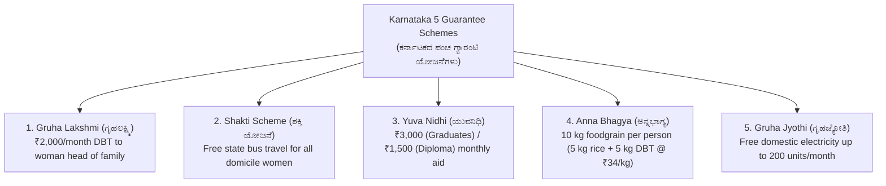
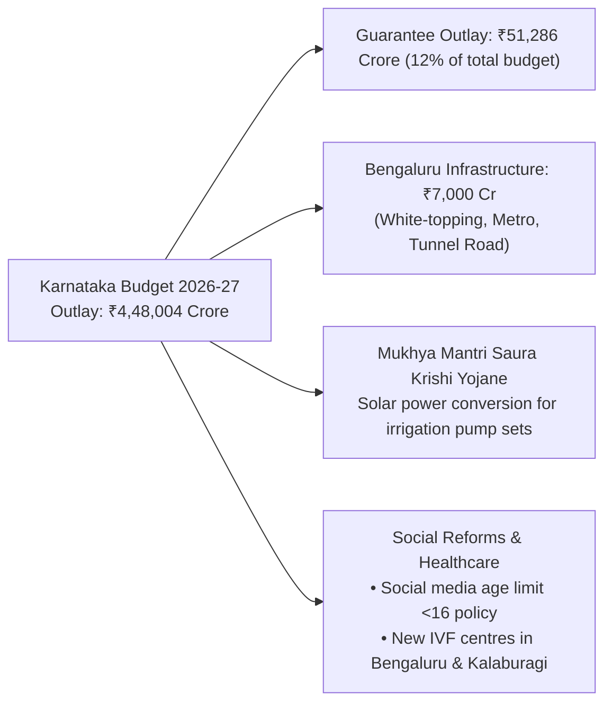
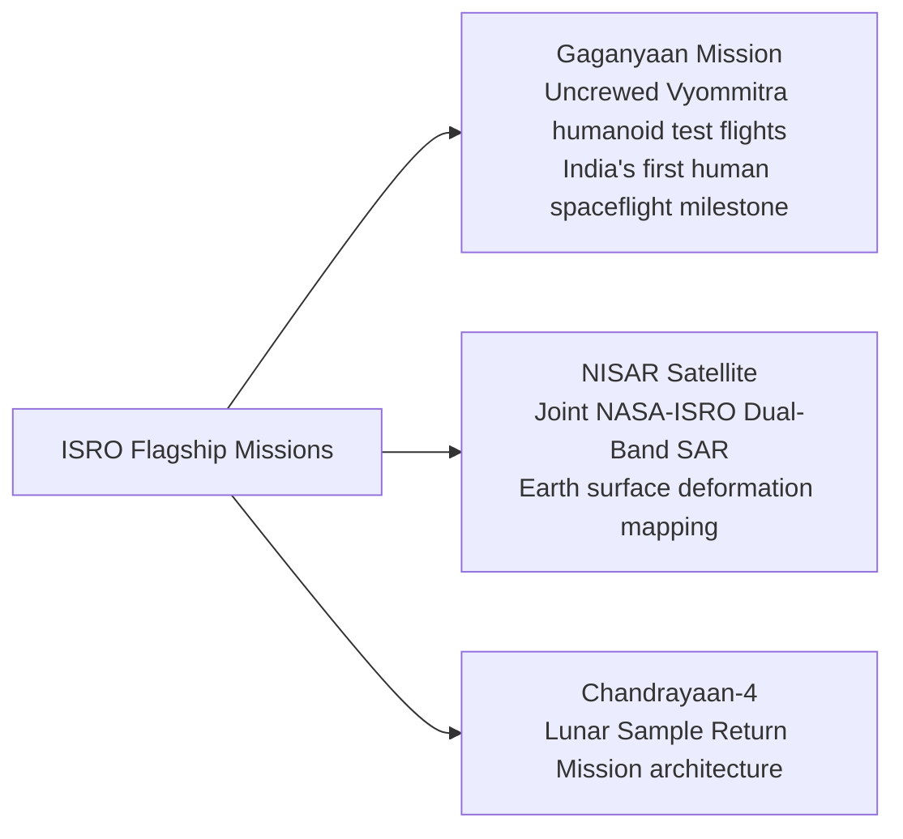

---exam: KEA Land Surveyor
subject: Paper I - General Knowledge
topic: Karnataka Current Affairs, Budget & State Schemes 2026 (ಪ್ರಚಲಿತ ವಿದ್ಯಮಾನಗಳು & ಯೋಜನೆಗಳು)
priority: Tier 1 (20-25 Marks)
tags:
  - land-surveyor
  - vao
  - general-knowledge
  - current-affairs
  - karnataka-schemes
  - paper-1
  - high-yield
syllabus_refs:
  - P1-GK-1.2
  - P1-GK-1.6
last_verified: 2026-09-30
sources:
  - Karnataka State Budget 2026-27 Speech
  - Karnataka Guarantee Schemes Implementation Directorate
  - The Hindu (2026)
---

# 05. Karnataka Current Affairs, State Budget & Welfare Schemes 2026 (ಪ್ರಚಲಿತ ವಿದ್ಯಮಾನಗಳು & ಯೋಜನೆಗಳು)

> [!IMPORTANT] Exam Focus & Mark Potential
> - **Expected Weightage:** 20–25 Questions in Paper-I (Highest weightage module in General Studies).
> - **Core High-Yield Focus:** The Five Flagship Guarantee Schemes (Gruha Lakshmi, Shakti, Yuva Nidhi, Anna Bhagya, Gruha Jyothi), Karnataka Budget 2026–27 announcements (₹4,48,004 crore outlay), Mukhya Mantri Saura Krishi Yojane, Land records digitization initiatives, and ISRO mission milestones.

---

## 1. The Five Flagship Guarantee Schemes of Karnataka

The Government of Karnataka's developmental model centers on its five universal social security guarantee schemes with an annual budget allocation exceeding ₹51,280 crore.



### In-Depth Policy & Eligibility Matrix

| Scheme Name | Beneficiary Target | Financial / Material Benefit | Eligibility & Implementation Mechanism |
| :--- | :--- | :--- | :--- |
| **Gruha Lakshmi (ಗೃಹಲಕ್ಷ್ಮಿ)** | Women heads of families (ಯಜಮಾನಿ). | **₹2,000 per month** transferred via Direct Benefit Transfer (DBT). | • Family must possess Antyodaya (AAY), BPL, or APL card.<br>• Woman or her husband must not be an income tax or GST payer.<br>• Enrolled through Grama One, Karnataka One, or Bapuji Seva Kendra. |
| **Shakti Scheme (ಶಕ್ತಿ ಯೋಜನೆ)** | All women and transgender persons domiciled in Karnataka. | **Free bus travel** in state road transport corporation buses. | • Valid across **KSRTC, BMTC, NWKRTC, and KKRTC**.<br>• Applies to ordinary, city, and express buses (excludes luxury/AC buses: Rajahamsa, Non-AC Sleeper, Airavat, Flybus).<br>• Shakti Smart Card / Government photo ID with Karnataka address mandatory. |
| **Yuva Nidhi (ಯುವನಿಧಿ)** | Educated unemployed youth graduating in recent academic years. | • **₹3,000 / month** for Degree Graduates.<br>• **₹1,500 / month** for Diploma holders. | • Disbursed for a maximum period of **2 years** or until employment/self-employment is obtained.<br>• Candidate must have remained unemployed for at least **6 months** after graduation.<br>• Must be Karnataka domicile. |
| **Anna Bhagya (ಅನ್ನಭಾಗ್ಯ)** | BPL and Antyodaya cardholders. | **10 kg free foodgrains** per person per month. | • 5 kg rice provided under Central Government PMGKAY.<br>• Additional 5 kg covered by Karnataka Government (disbursed as **cash DBT at ₹34 per kg = ₹170/person/month** when physical rice procurement is constrained). |
| **Gruha Jyothi (ಗೃಹಜ್ಯೋತಿ)** | Domestic household electricity consumers. | **Free electricity up to 200 units** per month. | • Calculated based on 12-month average consumption + 10% buffer.<br>• If average + 10% is below 200 units, consumption within that limit is completely free.<br>• Valid for single domestic meter per household linked to Aadhaar. |

---

## 2. Karnataka State Budget 2026–27 Key Highlights

Presented on **March 6, 2026**, with a record total expenditure outlay of **₹4,48,004 crore**.



### Major Strategic Announcements:
1. **Mukhya Mantri Saura Krishi Yojane:** Major initiative to shift hundreds of thousands of agricultural irrigation pump sets to grid-connected solar power feeders, eliminating state electricity subsidies and ensuring daytime power for farmers.
2. **Bengaluru Mobility & Infrastructure:**
   - ₹3,000 crore dedicated to white-topping 450 km of arterial road networks.
   - ₹2,250 crore allocated for high-density traffic corridor tunnel roads and Namma Metro Phase 2A/2B and Phase 3 expansion.
3. **Mysuru as Second IT Hub:** Comprehensive plan to establish the "Beyond Bengaluru" cluster, developing Mysuru as the state's secondary technology and semiconductor park.
4. **Child Safety Social Regulation:** Proposed framework to restrict access to algorithmic social media platforms for children under the age of 16.
5. **State Leadership Transition:** Following the budget session, **D.K. Shivakumar** assumed the office of Chief Minister of Karnataka on **June 3, 2026**.

---

## 3. Land & Revenue Administration Innovations in Karnataka

- **SVAMITVA Scheme (ಸ್ವಾಮಿತ್ವ):** Nationwide drone mapping of rural inhabited abadi lands. Over 15,000 villages in Karnataka mapped using Survey of India drones, generating digitized **Property Cards (ಆಸ್ತಿ ಕಾರ್ಡ್ / ಹಕ್ಕು ಪತ್ರ)** for rural homeowners.
- **Mojini v3 (ಮೋಜಣಿ 3):** Standardized online workflow for generating **11E pre-mutation sketches** and resolving land partition disputes via **Tatkal Podi**.
- **Dishank Mobile App (ದಿಶಾಂಕ್):** GPS georeferenced mobile tool developed by KSRSAC displaying real-time revenue survey numbers, parcel boundaries, and RTC ownership classification.
- **Kaveri 2.0 (ಕಾವೇರಿ 2.0):** 100% online property registration system eliminating sub-registrar office middlemen, integrated with Bhoomi and e-Swathu.

---

## 4. National & ISRO Milestones (2025–2026)



- **Gaganyaan Programme:** Successful completion of uncrewed test flight with the female humanoid robot **"Vyommitra"**, paving the way for the maiden crewed orbital flight.
- **NISAR Satellite:** World's first dual-frequency (L-band and S-band) Synthetic Aperture Radar satellite launched jointly by ISRO and NASA to track land subsidence, earthquakes, and glacier flows.
- **Padma Awards 2026 (Karnataka Recipients):** Recognitions across folk arts (Yakshagana, Bidriware), literature, and agrarian sciences.

---

## 5. High-Yield Mnemonics

> [!NOTE] Memory Aids
> - **Five Guarantees Mnemonic: "S-A-Y-G-G"**
>   - **S**hakti (Bus)
>   - **A**nna Bhagya (Rice)
>   - **Y**uva Nidhi (Youth allowance)
>   - **G**ruha Lakshmi (₹2,000 woman head)
>   - **G**ruha Jyothi (200 units power)
> - **Yuva Nidhi Rates: "3000 Degree, 1500 Diploma"**
>   - Double allowance for degree graduates compared to diploma holders.
> - **Total Budget Outlay 2026: "4.48 Lakh Crores"**
>   - ₹4,48,004 crore total expenditure outlay.

---

## 6. Likely Exam Questions & PYQ Patterns

1. **[KEA PYQ]** *Under the Karnataka Government's 'Gruha Lakshmi' scheme, what is the monthly financial assistance provided to the woman head of eligible households?*
   - **Answer:** ₹2,000 per month via DBT.
2. **[Expected Question]** *What is the maximum limit of free electricity provided per month to domestic consumers under the 'Gruha Jyothi' scheme?*
   - **Answer:** Up to 200 units (based on 12-month average + 10%).
3. **[Expected Question]** *The 'Yuva Nidhi' scheme provides monthly financial assistance of how much to unemployed degree graduates and diploma holders respectively?*
   - **Answer:** ₹3,000 for Degree graduates and ₹1,500 for Diploma holders.
4. **[Expected Question]** *The total outlay of the Karnataka State Budget for the financial year 2026–27 presented in March 2026 was approximately:*
   - **Answer:** ₹4,48,004 crore.
5. **[Expected Question]** *Which satellite mission jointly developed by ISRO and NASA utilizes dual-frequency Synthetic Aperture Radar for Earth observation?*
   - **Answer:** NISAR (NASA-ISRO SAR).

---

## 7. Quick Revision Box

```
┌────────────────────────────────────────────────────────────────────────┐
│ KARNATAKA CURRENT AFFAIRS & SCHEMES 2026 REVISION CHEAT SHEET          │
├────────────────────────────────────────────────────────────────────────┤
│ • Budget 2026-27: ₹4,48,004 Crore total outlay (₹51,286 Cr for 5 Guarantees). │
│ • Gruha Lakshmi: ₹2,000/month to woman head of family (DBT).           │
│ • Shakti Scheme: 100% free bus travel for women in KSRTC/BMTC/NW/KK.   │
│ • Yuva Nidhi: ₹3,000 (Graduates) / ₹1,500 (Diploma) for max 2 years.   │
│ • Anna Bhagya: 10 kg foodgrains (5 kg PMGKAY + 5 kg DBT @ ₹34/kg).     │
│ • Gruha Jyothi: Free power up to 200 units/month for domestic meters.  │
│ • Saura Krishi Yojane: Solar power conversion for farm irrigation pumps│
│ • Social Media: Proposed age restriction for children under 16.        │
│ • CM of Karnataka (June 2026): D.K. Shivakumar.                        │
│ • SVAMITVA: Drone mapping of rural abadi for property cards.           │
│ • ISRO: Vyommitra robot in Gaganyaan, NISAR dual-band SAR.             │
└────────────────────────────────────────────────────────────────────────┘
```

---
*Related Notes:*
- [[01_Karnataka_History_and_Dynasties]]
- [[02_Karnataka_and_India_Geography]]
- [[03_Indian_Constitution_and_Polity]]
- [[../03_Notes/05_Computer_Applications_and_Land_Records_IT]]
