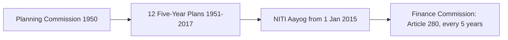

---exam: KEA Land Surveyor 2026
subject: Paper I - General Knowledge
topic: Indian Economy Essentials - concepts, planning, budget, banking, taxes, agriculture, industry, current data
priority: Tier 1 (part of the 15-mark Economy block; supports Karnataka economy)
tags: [land-surveyor, general-knowledge, economy, india, paper-1]
syllabus_refs:
  - P1-GK-1.6
last_verified: 2026-09-30
sources:
  - KEA Official Syllabus Specification
  - Union Budget 2026-27 & RBI Bulletins
---

# 06. Indian Economy Essentials

> [!IMPORTANT] Exam focus
> The notification asks for the **Economy of Karnataka**, but questions on India's basic economics, budget, RBI and taxes usually appear alongside. Learn the definitions and the *numbers marked "verify"* (they are current as of 29 Sep 2026 and change every year).

> [!WARNING] Current numbers
> Figures for the Union Budget 2026-27, RBI policy and growth were checked against PRS India, RBI and news sources on 29 Sep 2026. If a newer RBI policy (early October) or estimate is released, the newer number wins.

---

## 1. Basic concepts

| Term | Meaning |
| :--- | :--- |
| **GDP** | total value of final goods and services produced **within India** in a year |
| **GNP** | GDP + net factor income from abroad |
| **NDP / NNP** | GDP / GNP minus **depreciation** |
| **Real vs nominal GDP** | real = at constant (base-year) prices, removes inflation; nominal = at current prices |
| **GVA** | GDP minus net product taxes (production-side measure) |
| **Per capita income** | national income ÷ population |
| **Sectors** | **Primary** (agriculture, mining), **Secondary** (manufacturing, construction, power), **Tertiary** (services). In India, services are the largest share of GDP (about 55%). |
| **Economic system** | capitalist, socialist, **mixed** (India chose mixed economy) |
| **Inflation** | sustained rise in general price level; **CPI** (consumer prices; used by RBI, target **4% ± 2%**), **WPI** (wholesale) |
| **Deflation / stagflation** | fall in prices / high inflation with low growth and unemployment |
| **Poverty and inequality** | measured by consumption/income thresholds; **NITI Aayog's Multidimensional Poverty Index (MPI)** uses health, education, living standards |

- **Data agencies:** **MoSPI** (Ministry of Statistics and Programme Implementation) — GDP, CPI, NSO (National Statistics Office), NSSO surveys, **Census** (10-yearly; the last full Census was 2011, the next is being conducted in this cycle).
- **Growth of India (verify):** real GDP growth in 2025-26 about **7.4%** (per figures cited with the Karnataka Economic Survey); India is the **world's 4th/5th-largest economy** by nominal GDP (check the latest ranking). The Union Budget 2026-27 assumes nominal GDP growth of about **10%**. RBI's August 2026 policy projected FY27 real GDP growth **6.7%** and CPI inflation **5.0%**.

---

## 2. Economic planning and NITI Aayog


Planning was centralised through the Planning Commission until 2015, when it was replaced by NITI Aayog, while the Finance Commission continues to decide the Centre–state sharing of taxes.

- **Planning Commission** set up 1950 (chairman: PM); **First Plan (1951-56)** — agriculture, Harrod–Domar model; **Second Plan (1956-61)** — heavy industry, **Mahalanobis model**, Bhilai/Rourkela/Durgapur steel plants; Green Revolution in the third/fourth plan era (mid-1960s, **M.S. Swaminathan**, Norman Borlaug, HYV wheat/rice in Punjab-Haryana); **12th Plan (2012-17)** was the last. **Plan holidays** 1966-69.
- **NITI Aayog** = National Institution for Transforming India (1 January 2015): a think-tank/policy body; **cooperative federalism**; CEO is appointed by the PM; publishes **SDG India Index**, Multidimensional Poverty Index, Export Preparedness Index, Innovation Index. It has no power to allocate funds.
- **National Development Council (NDC)** reviews plans; **Finance Commission** (Art. 280, every 5 years) recommends the share of Union taxes for states and grants. **16th Finance Commission** (chairman: Dr. Arvind Panagariya) covers **2026-31**. The Union Budget 2026-27 accepted a **41%** share of the divisible pool for states (as reported). Karnataka has been vocal about its tax share.

**Economic reforms 1991 (LPG):** **Liberalisation, Privatisation, Globalisation** under PM P.V. Narasimha Rao and FM **Manmohan Singh** after the balance-of-payments crisis: industrial licensing abolished, FDI opened, rupee devalued, import tariffs cut. Later: **Make in India (2014)**, **Digital India**, **Atmanirbhar Bharat**, **PLI schemes**, **Startup India**, **GST (2017)**, **IBC (2016)**.

---

## 3. Union Budget and public finance

- **Article 112** — Annual Financial Statement (Union Budget), presented by the Finance Minister (Feb 1). Financial year **1 April–31 March**. **Article 266** — **Consolidated Fund of India**; **Article 267** — **Contingency Fund** (imprest for urgent expenses); **Public Account**.
- **Revenue receipts** (tax + non-tax) vs **capital receipts** (borrowings, recoveries, disinvestment). **Revenue expenditure** (salaries, subsidies, interest) vs **capital expenditure** (roads, buildings, machinery).

| Deficit | Formula |
| :--- | :--- |
| **Revenue deficit** | revenue expenditure − revenue receipts |
| **Fiscal deficit** | total expenditure − total receipts (excluding borrowings) = **borrowing requirement** |
| **Primary deficit** | fiscal deficit − interest payments |
| Effective revenue deficit | revenue deficit − grants for capital assets |

- **FRBM Act 2003:** the Fiscal Responsibility and Budget Management law to bring discipline; target of fiscal deficit **3% of GDP** (deadlines revised repeatedly; states also have FRBM limits — Karnataka has enacted the **Karnataka Fiscal Responsibility Act, 2002**).
- **Union Budget 2026-27 (presented 1 Feb 2026) — key numbers (verify):**
  - Fiscal deficit **4.3% of GDP** (revised estimate 2025-26: 4.4%); revenue deficit about **1.5%**.
  - **Debt-to-GDP** target **55.6%** in FY27; medium-term goal **50% ± 1% by FY31** (debt becomes the main fiscal anchor).
  - **Capital expenditure ₹12.2 lakh crore** (about 3.1% of GDP); total expenditure about **₹53.5 lakh crore**; gross market borrowing about ₹17.2 lakh crore.
  - Nominal GDP growth assumed about **10%**.
- **Taxes:** **Direct** (burden cannot be shifted: income tax, corporation tax) vs **Indirect** (shifted to the consumer: GST, customs, excise on petroleum). **GST** — introduced **1 July 2017** (**101st Constitutional Amendment**, Art. 279A **GST Council**, chairperson: Union Finance Minister); replaced VAT, service tax, excise etc.; **dual GST** (CGST + SGST for intra-state, **IGST** for inter-state); **destination-based**. In September 2025 GST slabs were simplified to mainly **5% and 18%** (plus a higher rate for demerit/luxury goods) — as far as I know; verify slab details. Petroleum and alcohol remain outside GST.
- **Cesses and surcharges** are not shared with states (a point in Karnataka's demand for fair devolution).

---

## 4. RBI, money and banking

- **Reserve Bank of India:** established **1 April 1935** (RBI Act 1934; nationalised 1949); HQ **Mumbai**; central bank — **issues currency notes (except ₹1)**, banker to the government and banks, controls credit, manages forex, regulates banks. **Governor: Sanjay Malhotra.**
- **Monetary Policy Committee (MPC):** 6 members (3 RBI + 3 external) decides the **repo rate**; meets at least 4 times a year (in practice bi-monthly); inflation target **4% (±2%)**.

| Rate | Meaning | Current (verify) |
| :--- | :--- | :---: |
| **Repo rate** | rate at which RBI lends to banks (short-term) | **5.25%** (unchanged in Apr, Jun and Aug 2026) |
| Reverse repo | rate at which RBI borrows from banks (now the **SDF**) | SDF 5.00% |
| **MSF rate / Bank rate** | emergency borrowing / long-term lending rate | 5.50% |
| **CRR** | % of deposits banks keep with RBI as cash | 3.00% |
| **SLR** | % of deposits banks keep in liquid assets (gold, G-secs, cash) | 18.00% |

- **Expansionary (easy) policy:** cut rates, lower CRR/SLR → more credit; **contractionary:** the opposite to fight inflation. **Stance:** neutral (now).
- **Banking structure:** RBI → scheduled commercial banks (public sector, private, foreign, RRBs, small finance banks, payment banks) → cooperative banks. **Nationalisation:** **19 July 1969** (14 banks, PM Indira Gandhi) and 1980 (6 more). **SBI** (1955, from Imperial Bank of India) largest. Bank mergers in 2019–20 reduced the number of public-sector banks to 12.
- **NABARD** (1982): apex development bank for agriculture and rural development; **SIDBI** (small industries); **EXIM Bank**; **SEBI** (securities market regulator, statutory from 1992); **IRDAI** (insurance); **PFRDA** (pension). **UPI** (NPCI, 2016) — India leads in real-time digital payments. **Jan Dhan Yojana (2014)** financial inclusion.
- **Kisan Credit Card (KCC)**, priority-sector lending (40% of credit), **Mudra loans**.
- **Foreign exchange:** rupee is a managed-float currency; **Forex reserves** held by RBI; **FDI vs FPI**; **balance of payments** = current account + capital account; India runs a trade deficit but a large **services surplus** (IT exports).

---

## 5. Agriculture in the Indian economy

- Employs about **45%** of the workforce but contributes only about **15–18%** of GDP (hence low productivity/underemployment).
- **Seasons:** **Kharif** (June–Oct; rice, jowar, bajra, maize, cotton, groundnut, soybean), **Rabi** (Oct–March; wheat, barley, gram, mustard), **Zaid** (summer; watermelon, cucumber).
- **MSP (Minimum Support Price):** announced by the Centre on the recommendation of **CACP** (Commission for Agricultural Costs and Prices); the Food Corporation of India procures. **PDS** (Public Distribution System) and **National Food Security Act 2013** (subsidised grain to about two-thirds of the population).
- **Green Revolution** (1960s) raised wheat and rice output; **White Revolution** (Operation Flood, **Verghese Kurien**, Amul; NDDB); **Blue** (fisheries), **Yellow** (oilseeds).
- **Schemes:** **PM-KISAN** (₹6,000 per year in 3 instalments to farmer families), **PMFBY** (crop insurance), **PM-KUSUM** (solar pumps), **eNAM** (online market), **Soil Health Card**, **PMKSY** (irrigation, "per drop more crop").
- **Land reforms** (abolition of intermediaries — zamindari, tenancy reform, land ceilings, consolidation of holdings; **Bhoodan** by Vinoba Bhave 1951). Land records modernisation: **DILRMP** (Digital India Land Records Modernization Programme, 2008) — computerisation of RTC, survey/re-survey, registration. **Karnataka's Land Reforms Act (1961, amended 1974)** under CM **D. Devaraj Urs** — "land to the tiller"; strict ceilings. (Links: [[../03_Notes/05_Computer_Applications_and_Land_Records_IT]].)
- Land-holding: about **86% of holdings are small/marginal (below 2 ha)**.

## 6. Industry, infrastructure and trade

- **Industrial Policy Resolutions:** 1948, **1956** (Schedules A/B/C, public-sector dominance), **1991** (liberalisation). **MSMEs:** classified by investment and turnover; **Udyam** registration.
- **Public sector:** Maharatna, Navratna, Miniratna categories. **Disinvestment** = sale of government stake. **Infrastructure:** **National Infrastructure Pipeline**, **Bharatmala**, **Sagarmala**, **UDAN** (regional flights), **Gati Shakti**, **Dedicated Freight Corridors**.
- **Energy:** coal is the main source of electricity; renewables growing fast (solar, wind); India's target of **500 GW non-fossil capacity by 2030**, **net-zero by 2070**.
- **Foreign trade:** main exports — petroleum products, gems and jewellery, engineering goods, pharmaceuticals, IT services; main imports — crude oil, gold, electronics. **WTO** member; **RCEP** not joined; FTAs with UAE, Australia, UK (2025) and others.
- **Employment:** unemployment measured by **PLFS** (Periodic Labour Force Survey); **Skill India**, **PM Vishwakarma**.

## 7. Human development and welfare snapshots

- **HDI** (UNDP): health, education, income; India in the "medium" band; states' HDI: Kerala highest, Karnataka high (about 0.75 in recent estimate).
- **Social security:** **Ayushman Bharat (PM-JAY)** health cover ₹5 lakh; **Atal Pension Yojana**, **PMJJBY/PMSBY** insurance; **Direct Benefit Transfer (DBT)** — the base for Karnataka's guarantee schemes.

---

## High-Yield Mnemonics

> [!NOTE] Memory aids
> - **Deficits: Revenue (spend − income), Fiscal (borrowing), Primary (fiscal − interest).**
> - **CRR 3%, SLR 18%, Repo 5.25%, MSF/Bank 5.50%, SDF 5.00%.**
> - **Article 112 = Budget; 266 = Consolidated Fund; 267 = Contingency Fund; 280 = Finance Commission; 279A = GST Council.**
> - **Planning Commission 1950 → NITI Aayog 2015.**
> - **KCC / NABARD / PACS = farmer credit chain.**
> - **PM-KISAN = ₹6,000 in 3 × ₹2,000.**

## Likely Exam Questions

1. Article dealing with the Union Budget — **Article 112**.
2. NITI Aayog replaced the — **Planning Commission** (2015).
3. Fiscal deficit = **total expenditure − total receipts excluding borrowings**.
4. Repo rate is the rate at which — **RBI lends to commercial banks**.
5. India's fiscal deficit target in Union Budget 2026-27 — **4.3% of GDP**.
6. GST came into force on — **1 July 2017**.
7. Apex bank for agriculture and rural development — **NABARD**.
8. Green Revolution in India is associated with — **M.S. Swaminathan**.
9. Minimum Support Price is recommended by — **CACP**.
10. Chairman of the 16th Finance Commission — **Arvind Panagariya**.

## Quick Revision Box

```
+---------------------------------------------------------------+
| GDP within borders | GNP = GDP + NFIA | NNP = GNP - depreciation|
| Sectors: primary, secondary, tertiary (services largest)      |
| Plan Comm 1950 -> NITI Aayog 1 Jan 2015 | 12 plans 1951-2017   |
| Budget Art 112 | FY 1 Apr-31 Mar | Consolidated Fund Art 266   |
| Revenue deficit | Fiscal deficit (borrowing) | Primary deficit  |
| Union 2026-27: FD 4.3% | debt 55.6% | capex Rs 12.2 lakh crore   |
| RBI 1935 Mumbai | Repo 5.25 | CRR 3 | SLR 18 | Governor Malhotra |
| CPI target 4% +/-2% | MPC 6 members | GST 1 Jul 2017 (Art 279A)  |
| NABARD 1982 | SEBI | KCC | PM-KISAN Rs 6,000 | MSP by CACP     |
| Land: DILRMP 2008 | Karnataka Land Reforms Act 1961/74 (Urs)     |
+---------------------------------------------------------------+
```

*Related:* [[07_Karnataka_Economy_Survey_and_Budget]] · [[08_Rural_Development_Panchayat_Raj_Cooperatives]] · [[05_Karnataka_Current_Affairs_and_State_Schemes_2026]]
