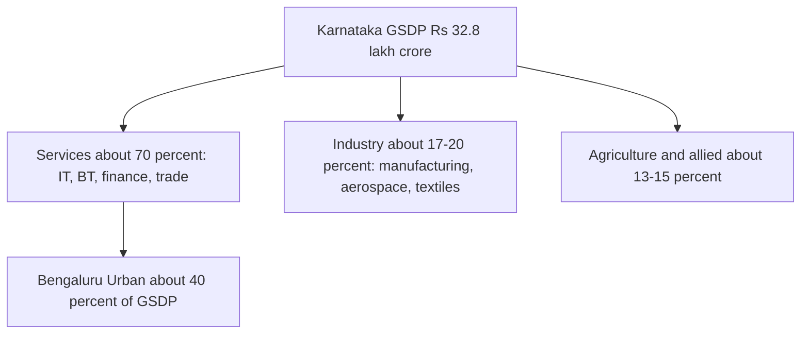

# 07. Karnataka Economy — Economic Survey 2025-26 & Budget 2026-27

> [!IMPORTANT] Exam focus
> "Economy of Karnataka" is named in the notification. Expect: GSDP and per capita income, sector shares, budget numbers, deficits, guarantees, leading products (coffee, ragi, silk, gold), IT/BT, districts' rank, 2032 target. Numbers in **bold** are the ones most likely to be asked.

> [!WARNING] Numbers were compiled on 29 Sep 2026
> Sources: Karnataka Economic Survey 2025-26 (press coverage), PRS India budget analysis 2026-27, budget documents. Slight differences exist between sources (marked "verify"); when two options are close in the exam, use the figure in the Budget/Economic Survey.

---

## 1. Karnataka at a glance

- **Rank:** among the **top 4–5 state economies** by GSDP (sources differ: commonly quoted as 3rd or 4th, behind Maharashtra and Tamil Nadu; check the wording of the option). Karnataka contributes about **9.19%** of India's GDP in 2025-26 (up from 8.9% in 2024-25).
- **Per capita income (PCI):** ranked **3rd, after Delhi and Telangana**, in coverage of the 2025-26 Economic Survey.
- **Vision:** the state's target of a **US$ 1 trillion economy by 2032**; Bengaluru is the country's main technology and startup hub.
- Fiscal year: 1 April–31 March. The state Economic Survey is tabled by the Planning, Programme Monitoring and Statistics Department a day before the budget in the legislature; **the Budget is presented by the CM/Finance Minister.**

## 2. Economic Survey 2025-26 — key figures

| Indicator | Value |
| :--- | :--- |
| **GSDP at current prices** | **₹32.81 lakh crore** (about US$ 357 billion), up **12.9%** from ₹29.06 lakh crore |
| **GSDP at constant prices (2011-12)** | **₹17.23 lakh crore**, growth **8.1%** (from ₹15.94 lakh crore) |
| India's real growth in same year | 7.4% → Karnataka grew faster |
| **Per capita income (current prices)** | **₹4,33,326**, up **12.2%** from about ₹3.86 lakh; national average about ₹2.19 lakh (Karnataka's PCI is roughly **97% above** the national average) |
| **Karnataka's share in India's GDP** | **9.19%** (2025-26) |
| **Services share** | about **69.9%** of GSDP |
| Sector growth (real) | agriculture about 9.1%, services 8.1%, industry about 6.7%, manufacturing about 7.2% |
| **Exports** | rose about **13.8%** year-on-year |
| **Bengaluru Urban** | about **40%** of the state's GSDP (₹11.7 lakh crore); highest per capita income of any district (about ₹8.55 lakh in 2024-25) |
| Poorest districts (per capita) | mostly in **Kalyana-Karnataka** — Kalaburagi, Bidar, Yadgir, Raichur, Koppal, plus Belagavi (regional disparity) |

**Sector structure (rough, current prices):** Agriculture and allied about **13–15%**, Industry about **17–20%**, **Services about 66–70%** (largest; computer/IT-related services single largest sub-sector). Agriculture and industry shares are shrinking while services rise — "structural change". The **workforce** is still concentrated in agriculture (about 45%), i.e. low labour productivity in farming.


Services dominate the state economy and are concentrated in Bengaluru, which explains the regional inequality between Bengaluru and the northern districts.

**Human development:** Karnataka's HDI is in the "high" band (about 0.75); IMR/MMR have fallen steadily; unemployment is below the national average (about 2.4% in 2022-23 per NITI Aayog summary).

## 3. State Budget 2026-27

**Presented:** March 2026 by then-CM **Siddaramaiah**, who held the Finance portfolio (his **17th budget**; a record for the state). Since **3 June 2026** **D.K. Shivakumar** is CM and Finance Minister. Theme: the "**11G**" economic model — welfare *Guarantee* economy, growth, gender equality, etc.

| Item | 2026-27 Budget Estimate |
| :--- | :--- |
| **Total expenditure (outlay)** | **₹4,48,004 crore** |
| Total receipts (including borrowings) | ₹4,47,240 crore |
| **Revenue receipts** | about **₹3,15,050 crore** = State's own tax ₹2,20,000 cr + non-tax ₹16,000 cr + receipts from Centre ₹79,050 cr |
| **Revenue expenditure** | ₹3,38,007 crore |
| Gross capital expenditure | about ₹84,567 crore (net about ₹74,682 crore) |
| **Gross borrowings** | ₹1,32,000 crore |
| **Revenue deficit** | **₹22,957 crore** (**0.7% of GSDP**) — a revenue-deficit budget for the 3rd year |
| **Fiscal deficit** | **₹97,448 crore** (about **2.9–2.95% of GSDP**; within the 3% FRBM limit) |
| Primary deficit | about ₹44,117 crore (1.5% of GSDP) |
| Committed expenditure | salaries, pensions and interest about ₹1.85 lakh crore ≈ **59% of revenue receipts** |
| **Guarantee schemes** | about **₹51,000 crore** (roughly 12–14% of expenditure). *Sources give ₹51,034 crore (PRS/2025-26 budget) and ₹51,286 crore (some 2026-27 summaries) — verify with the question's wording.* |
| Devolution to local bodies | share of state's revenue devolved to local bodies raised (from 48%, per PRS) |

- **Comparison:** 2025-26 outlay was about ₹4.09 lakh crore (Budget Estimate), so 2026-27 is about **9–13% higher** depending on whether Budget or Revised Estimates are used.
- **Debt:** the state's debt is around 25–27% of GSDP (limit under the state's fiscal responsibility rules 25%–30%; near the ceiling).
- **Revenue sources of the state:** **GST (SGST)**, **stamps and registration**, **state excise** (liquor), **motor vehicle tax**, **petrol/diesel sales tax**, land revenue (small), **share in central taxes** (devolution via the Finance Commission) and **grants-in-aid**.
- **Major spending heads:** education, health, rural development, agriculture, social welfare/guarantees, energy, water resources/irrigation, roads and transport, Bengaluru development.
- Announcements noted in your existing note [[05_Karnataka_Current_Affairs_and_State_Schemes_2026]] (Saura Krishi Yojane, Bengaluru infrastructure, Mysuru as the second IT hub). Karnataka argues the Centre's **tax devolution share is unfair** (it contributes about 9% of India's GDP but receives a smaller fraction); central tax share was reported at about **4.13%** under the 16th Finance Commission (verify).

## 4. Five Guarantees (fiscal angle)

Gruha Lakshmi, Shakti, Anna Bhagya, Gruha Jyothi, Yuva Nidhi — see [[05_Karnataka_Current_Affairs_and_State_Schemes_2026]] for benefits. **Fiscal point for MCQs:** guarantees are the main reason for the **persisting revenue deficit** (CAG and PRS have noted the rise in revenue expenditure); they are funded through **DBT** (Direct Benefit Transfer) and depend on tax buoyancy.

## 5. Resources and sectors

**Agriculture (about two-thirds of the area is rainfed / dry land; monsoon-dependent)**
- **Ragi** — Karnataka is the **largest producer** in India (Mandya, Tumakuru, Hassan). **Coffee** — Karnataka produces about **70%** of India's coffee (Kodagu, Chikkamagaluru, Hassan). **Jowar**, **cotton**, **sugarcane**, **tur (pigeon pea)** (Kalaburagi "tur bowl"), **arecanut** (Shivamogga, Davanagere), **sunflower**, **sericulture** (Karnataka is the **largest producer of mulberry silk**; **Ramanagara** has Asia's largest silk-cocoon market), **horticulture** (grapes, pomegranate, mango, flowers), **spices and plantation** (cardamom, pepper, tea, rubber).
- **Dairy:** **KMF (Karnataka Milk Federation) — brand "Nandini"**, a cooperative; one of India's largest dairy cooperatives after Amul.
- **Irrigation:** rivers **Krishna, Cauvery, Tungabhadra**; major projects: **KRS (Krishnaraja Sagar)** on Cauvery, **Almatti** (Krishna), **Tungabhadra Dam** (Hosapete), **Narayanpur**, **Hemavati**. Karnataka is one of the most drought-prone states (only about 1/3 of the sown area is irrigated).

**Minerals**
- **Iron ore** (Ballari–Hospet–Sandur belt; Kudremukh), **gold** (**Hutti**, Raichur; **Kolar Gold Fields** now closed; Karnataka is India's main gold producer), **manganese**, **bauxite**, **limestone** (cement), **granite**, **chromite**, **copper**. **Fuel minerals are scarce** — no coal or oil; power depends on imports and renewables.

**Energy**
- Thermal: **Raichur (RTPS)**, **Bellary (BTPS)**, **Yermarus**; Hydro: **Sharavathi (Jog/Linganamakki)**, **Kali (Kadra, Kodasalli, Supa)**, Varahi, Bhadra; Nuclear: **Kaiga** (Uttara Kannada); Renewable: **Pavagada Solar Park** (Tumakuru, about 2,050 MW, one of the world's largest), wind in Chitradurga, Gadag. Karnataka is a leader in **renewable capacity** in India.
- Power distribution companies: **BESCOM, MESCOM, HESCOM, GESCOM, CESC** — and KPTCL (transmission).

**Industry and services**
- **IT/ITeS:** Bengaluru = "Silicon Valley of India"; Karnataka accounts for the largest share of India's **software exports**; **BT (biotechnology)** — Karnataka has the largest number of biotech companies; **aerospace and defence** (**HAL**, **BEL**, **BEML**, **NAL**, **ISRO HQ**, **DRDO** labs, **Bharat Earth Movers**), **electronics/ESDM**, **machine tools (HMT)**, **automobile (Toyota-Kirloskar, Bidadi)**, **textiles and garments**, **sugar**, **cement**, **steel (JSW at Toranagallu)**, **agri-processing**.
- **Startups:** Bengaluru is among the world's top startup ecosystems; **"Beyond Bengaluru"** policy pushes clusters in Mysuru, Hubballi–Dharwad, Mangaluru, Belagavi, Kalaburagi.
- **Service exports and FDI:** Karnataka is a **leader in service exports and among top FDI destinations**. Ports: **New Mangalore Port** (Panambur), **Karwar**, Belekeri.
- **Tourism:** Hampi (UNESCO), Mysuru Dasara, Coorg, Gokarna, Badami-Aihole-Pattadakal; **Hoysala temples** (UNESCO 2023).
- **Regional imbalance:** **Article 371(J)** (98th Amendment, in force 2013) gives special status to the **Kalyana-Karnataka** region for development and reservation in education and jobs; **Kalyana Karnataka Regional Development Board (KKRDB)**; the **Nanjundappa Committee (2002)** identified backward taluks.

## 6. Planning and administration bodies

- **Karnataka State Planning Board / Planning, Programme Monitoring and Statistics Department**, **DPAR**, **State Finance Commission** (Art. 243-I; recommends the sharing between the state and panchayats/urban local bodies), **Karnataka Evaluation Authority**, **KIADB** (industrial area development), **KSIIDC**, **Invest Karnataka**, **KUIDFC**, **KRIDL**, **KSRSAC** (remote sensing — see Dishank).
- **Global Investors Meet:** "Invest Karnataka" is held periodically (Feb 2025 edition was a recent one).

## High-Yield Mnemonics

> [!NOTE] Memory aids
> - **GSDP 32.81 → PCI 4.33 → share 9.19 → services 69.9** ("3 2 8 1 – 4 3 3 – 9 1 9").
> - **Budget: 4.48 lakh crore; RD 22,957 cr (0.7%); FD 97,448 cr (2.9%).**
> - **Coffee 70% (Kodagu); Ragi #1; Silk #1 (Ramanagara market); Gold = Hutti.**
> - **Bengaluru Urban = 40% GSDP; Kalyana Karnataka = lowest per capita income.**
> - **Article 371(J) = Kalyana Karnataka special status.**

## Likely Exam Questions

1. Karnataka's GSDP in 2025-26 at current prices — **about ₹32.8 lakh crore**.
2. Karnataka's per capita income (current prices, 2025-26) — **₹4,33,326**.
3. Sector contributing the most to Karnataka's GSDP — **services**.
4. Total outlay of the Karnataka Budget 2026-27 — **₹4,48,004 crore**.
5. Karnataka's fiscal deficit target (2026-27) — **about 2.9% of GSDP (within the 3% limit)**.
6. Largest producer of ragi / silk in India — **Karnataka**.
7. Indian state producing the most coffee — **Karnataka (about 70%)**.
8. Special status to Kalyana Karnataka under — **Article 371(J)**.
9. Karnataka's target — **US$ 1 trillion economy by 2032**.
10. The state's milk cooperative brand — **Nandini (KMF)**.

## Quick Revision Box

```
+---------------------------------------------------------------+
| GSDP 2025-26: Rs 32.81 lakh cr (current, +12.9%); Rs 17.23 lakh |
|   cr (constant, +8.1%) | India real growth 7.4%                |
| PCI Rs 4,33,326 (+12.2%) | national ~Rs 2.19 lakh              |
| Share in India GDP 9.19% | Services ~69.9% | Bengaluru ~40%    |
| Exports +13.8% | Target: $1 trillion by 2032                   |
| Budget 2026-27: Outlay Rs 4,48,004 cr | Rev receipts 3,15,050 cr|
|   Rev exp 3,38,007 cr | RD 22,957 cr (0.7%) | FD 97,448 cr     |
|   (2.9%) | Borrowing 1,32,000 cr | Guarantees ~Rs 51,000 cr    |
| Own tax 2.20 lakh cr | Centre 79,050 cr | committed exp 59%    |
| CM/FM: D.K. Shivakumar (from 3 Jun 2026); budget by Siddaramaiah|
| Coffee 70% | Ragi #1 | Silk #1 | Gold Hutti | Pavagada Solar    |
| Art 371(J) Kalyana Karnataka | KMF Nandini | KIADB               |
+---------------------------------------------------------------+
```

*Related:* [[06_Indian_Economy_Essentials]] · [[05_Karnataka_Current_Affairs_and_State_Schemes_2026]] · [[08_Rural_Development_Panchayat_Raj_Cooperatives]] · [[02_Karnataka_and_India_Geography]]
