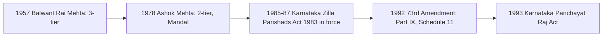

---exam: KEA Land Surveyor 2026
subject: Paper I - General Knowledge
topic: Rural development initiatives, Panchayat Raj institutions, rural cooperative societies, state and regional administration
priority: Tier 1 (notified: "initiatives related to rural development, Panchayat Raj institutions and rural cooperative societies")
tags: [land-surveyor, general-knowledge, rural-development, panchayat-raj, cooperatives, administration, paper-1]
syllabus_refs:
  - P1-GK-1.6
last_verified: 2026-09-30
sources:
  - Karnataka Gram Swaraj and Panchayat Raj Act, 1993
  - RDPR Department Reports
---

# 08. Rural Development, Panchayat Raj, Cooperatives & State Administration

> [!IMPORTANT] Exam focus
> The notification lists these together with the Economy of Karnataka. A Land Surveyor works in villages, so questions on Gram Panchayat, Gram Sabha, cooperative credit and rural schemes are natural. The general 73rd Amendment content is in [[03_Indian_Constitution_and_Polity]]; this note adds the Karnataka details and the schemes.

---

## 1. Panchayat Raj — evolution


India experimented with three-tier (Balwant Rai Mehta) and two-tier (Ashok Mehta) models; Karnataka pioneered the two-tier Mandal system in the 1980s, then adopted the constitutional three-tier system in 1993.

- **Balwant Rai Mehta Committee (1957):** recommended **three-tier** Panchayati Raj (village–block–district); first adopted in **Rajasthan (Nagaur), 2 Oct 1959**, then Andhra Pradesh.
- **Ashok Mehta Committee (1978):** two-tier (Zilla Parishad and Mandal Panchayat) — Karnataka's **Karnataka Zilla Parishads, Taluk Panchayat Samitis, Mandal Panchayats and Nyaya Panchayats Act, 1983** under CM **Ramakrishna Hegde** was in force from **1987**.
- **73rd Constitutional Amendment Act, 1992** (in force **24 April 1993**; **National Panchayati Raj Day = 24 April**): **Part IX (Arts. 243–243-O)**, **11th Schedule** (29 subjects); mandatory three-tier structure (for states with population above 20 lakh), **Gram Sabha**, 5-year term, **State Election Commission** (Art. 243K), **State Finance Commission** (Art. 243I), one-third reservation for women (Karnataka: **50%**), SC/ST reservation in proportion to population. The **74th** Amendment is for urban local bodies (12th Schedule, 18 subjects).
- **Karnataka Panchayat Raj Act, 1993** came into force on **10 May 1993**; replaced the 1983 Act; renamed the **Karnataka Gram Swaraj and Panchayat Raj Act** by the 2015 amendment (as far as I know); provides **50% reservation for women** at all three tiers.

## 2. Three-tier system in Karnataka

| Tier | Level | Head | Key facts |
| :--- | :--- | :--- | :--- |
| **Gram Panchayat (GP)** | village / group of villages | **Adhyaksha (President)** and Upadhyaksha (Vice-President), elected by members | population roughly **5,000–7,000**; roughly 5,800–6,000 GPs in the state; term **5 years**; members directly elected |
| **Taluk Panchayat (TP)** | taluk | Adhyaksha | intermediate level; about 230 taluk panchayats |
| **Zilla Panchayat (ZP)** | district | **Adhyaksha (President)**; **CEO** (an IAS officer) is the executive head | 31 districts (Bengaluru Urban and Bengaluru city have special arrangements) |

- **Gram Sabha** = all registered voters of the village; meets **at least twice a year** under the Act (more meetings are often held, e.g. on 2 October and 15 August); approves plans, selects beneficiaries, social audit. It is the **foundation of the system** ("grass-roots democracy").
- **Panchayat Development Officer (PDO)** is the secretary/executive officer of a GP; **Secretary/Bill collector** collect taxes; **Village Accountant / Grama Lekhadhikari (VA)** is the revenue-department village officer (maintains land records; earlier "Shanbhog/Patwari"); **Revenue Inspector**, **Tahsildar** (taluk), **Assistant Commissioner** (sub-division), **Deputy Commissioner** (district), **Divisional Commissioner** (4 divisions: Bengaluru, Mysuru, Belagavi, Kalaburagi) — the **revenue administration** ladder relevant to land records.
- **Sources of GP income:** house tax, taxes on fairs and markets, licence fees, water tax, grants from the state (**State Finance Commission**) and Centre (**Finance Commission** grants), share of land revenue and stamp duty (surcharge on stamp duty), MGNREGA/VB-G RAM G funds for works.
- **Social audit** and **ombudsman** for rural employment schemes; **Nirmala Grama Puraskara** and **Gandhi Grama Puraskara** — state awards for best-performing / cleanest panchayats (as far as I know).
- **Grama One** centres provide citizen services (RTC, certificates) — see [[../03_Notes/05_Computer_Applications_and_Land_Records_IT]].

**State and regional administration (notified item f)**
- **Governor** (**Thawar Chand Gehlot**), **Chief Minister** (**D.K. Shivakumar** since 3 June 2026; Deputy CM **G. Parameshwara**), Council of Ministers; **Chief Secretary** (head of civil service); **Vidhana Soudha** (Bengaluru; built 1956, Kengal Hanumanthaiah); **Suvarna Vidhana Soudha** (Belagavi, 2012; winter session); **High Court** at Bengaluru with benches at Dharwad and Kalaburagi; **Lokayukta** (Karnataka pioneered it, Act 1984).
- Districts: **31**; Vijayanagara (2021) the newest. Divisions: 4 (Bengaluru, Mysuru, Belagavi, Kalaburagi). **Kalyana Karnataka** = Kalaburagi, Yadgir, Bidar, Raichur, Koppal, Ballari, Vijayanagara (special provisions under **Art. 371(J)**).
- Regional bodies: **BBMP → Greater Bengaluru Authority**; **BDA**, **BMRDA**, **KIADB**, **KUWSDB**; urban local bodies: city corporations, city municipal councils, town municipal councils, town panchayats (Karnataka Municipalities Act 1964, Karnataka Municipal Corporations Act 1976).

---

## 3. Rural development — central schemes

| Scheme | Purpose / key facts |
| :--- | :--- |
| **VB-G RAM G** (Viksit Bharat – Guarantee for Rozgar and Ajeevika Mission (Gramin)) Act 2025 | replaced **MGNREGA** with effect from **1 July 2026**; guarantees **125 days** of wage employment per rural household per year (was 100); states can notify a **pause of up to 60 days** in peak farm seasons; funding **60:40** Centre:state (90:10 for north-eastern/Himalayan states); weekly wage payment |
| **MGNREGA** (2005; NREGA renamed 2009) | right-based, demand-driven 100-day wage employment; launched **2 Feb 2006** from Anantapur (Andhra Pradesh); replaced now (see above) — earlier facts can still appear in questions |
| **PMAY-G** (Pradhan Mantri Awas Yojana – Gramin) | pucca houses for rural poor; unit assistance in plains ₹1.2 lakh (hills ₹1.3 lakh) |
| **PMGSY** (2000) | all-weather roads to unconnected habitations |
| **DAY-NRLM** (National Rural Livelihoods Mission, 2011; "Aajeevika") | promotes **self-help groups (SHGs)** of women; in Karnataka the mission runs as **Sanjeevini – KSRLPS** |
| **SBM-G** (Swachh Bharat Mission - Gramin, 2014) | open-defecation-free villages; toilets |
| **Jal Jeevan Mission** (2019) | **Har Ghar Jal** — tap water to every rural household |
| **SVAMITVA** (2020) | drone mapping of rural inhabited land ("abadi") and issuing **property cards**; a Panchayati Raj ministry scheme, with the Survey of India as technical partner — see [[../03_Notes/03_Modern_Surveying_Photogrammetry_and_Remote_Sensing]] |
| **PM-KISAN** | ₹6,000 per year to farmer families |
| **NSAP** | pensions for old-age, widows, disabled (**IGNOAPS**) |
| **Deendayal Upadhyaya Gram Jyoti Yojana** | rural electrification; **Saubhagya** (household electrification) |
| **Rashtriya Gram Swaraj Abhiyan** | capacity-building of panchayats |
| **DILRMP** | computerisation of land records |
| **e-Gram Swaraj** and **Panchayat Nirnay** | online planning and accounting for GPs |

## 4. Rural development — Karnataka initiatives (verify names as questions use local wording)

- **Guarantees** delivered by DBT: Gruha Lakshmi, Anna Bhagya, Gruha Jyothi, Shakti, Yuva Nidhi (see note 05).
- **Rural development and Panchayat Raj Department (RDPR)** implements: **Suvarna Grama Yojana (SGY)** — infrastructure in selected villages; sanitation drives such as **Nirmala Grama**; **Karnataka Rural Infrastructure Development Ltd (KRIDL)**; state-funded rural road programmes (names change with governments).
- **Kalyana Karnataka** development through **KKRDB**; **Mukhyamantri Saura Krishi Yojane** for solar farm feeders.
- **Land-record reforms:** **Bhoomi**, **Mojini**, **Dishank**, **Kaveri**, **e-Swathu** (property records for rural non-agricultural properties, issuing Form-9/11-B), **Podi** and **Tatkal Podi** — these are directly tied to the department of a Land Surveyor.
- Village accountants' **Grama Lekhadhikari** and revenue village officers deliver RTC, caste/income certificates; **Nadakacheri / Atalji Janasnehi Kendra** offered citizen services at taluk level; **Grama One** centres at GP level.
- **Land reforms:** Karnataka Land Reforms Act 1961, **1974 amendment** (**Devaraj Urs**; "land to the tiller"), and **Karnataka Land Revenue Act 1964** (governs survey, settlement and the RTC).

---

## 5. Rural cooperative societies

- **Cooperative** = voluntary association of people for mutual economic benefit; principles: voluntary membership, **one member one vote**, democratic control, limited return on capital, service before profit.
- **History:** **Cooperative Credit Societies Act, 1904** (first law); **1912** (broader); the **first cooperative credit society in Karnataka** was started at **Kanaginahal (Gadag district) in 1905** by **Siddanagouda Patil** (as far as I know, widely cited). Cooperatives are a **state subject** but the **97th Constitutional Amendment (2011)** made the **right to form cooperatives a Fundamental Right (Art. 19(1)(c))** and added **Art. 43B** (DPSP) and Part IX-B. **Ministry of Cooperation** created at the Centre in **July 2021** (Minister: Amit Shah). National Cooperative Policy 2025 released.
- **Karnataka Co-operative Societies Act, 1959** governs registration and functioning; **Registrar of Co-operative Societies** in Bengaluru.

| Type | Structure |
| :--- | :--- |
| **Short/medium-term agricultural credit** (three-tier) | **PACS** (Primary Agricultural Credit Society at village level) → **DCCB** (District Central Cooperative Bank) → **State Apex Bank** (Karnataka State Cooperative Apex Bank, KSCAB, Bengaluru) → NABARD |
| **Long-term credit** | **PCARDB** (Primary Co-operative Agriculture & Rural Development Banks) → **SCARDB** (Karnataka State Co-operative Agriculture and Rural Development Bank), for land improvement, wells, tractors |
| **Marketing** | **APMC**, KSCMF (Karnataka State Co-operative Marketing Federation); **TAPCMS** |
| **Dairy** | village dairy cooperative → **District Milk Union** → **KMF (Nandini)**; Operation Flood link |
| **Others** | sugar cooperatives, weavers, housing, consumers, fisheries, labour, **urban cooperative banks** |

- **Self-Help Groups (SHGs):** 10–20 members, mostly women, savings + internal lending; linked to banks by NABARD (**SHG-Bank Linkage Programme, 1992**); **Stree Shakti** groups in Karnataka; **Mahila Samakhya**.
- **Kisan Credit Card (KCC)** issued through PACS/banks; **interest subvention** for short-term farm loans; crop-loan waiver policies by the state (e.g. Karnataka waived crop loans in 2018 and earlier).
- **Yeshasvini Cooperative Farmers Health Care Scheme** (Karnataka; health insurance for cooperative members).
- **APMC Act (Karnataka Agricultural Produce Marketing (Regulation and Development) Act 1966)** — regulated markets; **e-NAM**.
- **Problems:** politicisation, poor recovery/NPAs, low member participation, delayed audits; solutions: computerisation of PACS (central scheme, 2022), audit, professional management.

---

## High-Yield Mnemonics

> [!NOTE] Memory aids
> - **73rd Amendment = Part IX = 11th Schedule (29 subjects) = 24 April 1993.**
> - **Karnataka Panchayat Raj Act 10 May 1993; 50% women reservation.**
> - **Tiers: GP (village) – TP (taluk) – ZP (district); ZP CEO = IAS.**
> - **PACS → DCCB → Apex** ("P-D-A").
> - **VB-G RAM G: 125 days, 60:40, 60-day pause, 1 July 2026.**
> - **Rural roads PMGSY; houses PMAY-G; water JJM; SHG NRLM; mapping SVAMITVA.**
> - **97th Amendment = cooperatives (Art. 19(1)(c), 43B, Part IX-B).**

## Likely Exam Questions

1. 73rd Amendment added — **Part IX** and the **11th Schedule** (29 subjects).
2. National Panchayati Raj Day — **24 April**.
3. First state to implement three-tier Panchayati Raj — **Rajasthan (1959)**.
4. The foundation of Panchayat Raj — **Gram Sabha**.
5. Women's reservation in Karnataka panchayats — **50%**.
6. Executive head of Zilla Panchayat — **CEO (IAS officer)**.
7. Three-tier short-term credit structure — **PACS – DCCB – State Cooperative Bank**.
8. Successor to MGNREGA — **VB-G RAM G Act, 2025** (125 days).
9. Scheme that drone-maps rural abadi lands — **SVAMITVA**.
10. Constitutional amendment on cooperatives — **97th (2011)**.
11. Milk cooperative of Karnataka — **KMF (Nandini)**.
12. Special status for Kalyana Karnataka — **Article 371(J)**.

## Quick Revision Box

```
+---------------------------------------------------------------+
| BR Mehta 1957 (3-tier; Rajasthan 1959) | Ashok Mehta 1978 (2-tier)|
| Karnataka 1983 Act (Hegde, 1987) | 73rd Amend 1992, in force     |
|   24 Apr 1993 | Part IX | 11th Sch (29) | Art 243K SEC, 243I SFC  |
| Karnataka PR Act 1993 (10 May 1993) | women 50%                  |
| GP (President) - TP - ZP (CEO IAS) | Gram Sabha = foundation     |
| Revenue ladder: Village Accountant - RI - Tahsildar - AC - DC - |
|   Divisional Commissioner (4 divisions)                         |
| VB-G RAM G 1 Jul 2026 (125 d, 60:40, 90:10) replaced MGNREGA   |
| PMAY-G houses | PMGSY roads | JJM water | NRLM SHG | SVAMITVA    |
| Cooperatives: 1904 Act | Kanaginahal 1905 | 97th Amend 2011     |
| PACS-DCCB-Apex | KMF Nandini | Ministry of Cooperation 2021    |
+---------------------------------------------------------------+
```

*Related:* [[03_Indian_Constitution_and_Polity]] · [[06_Indian_Economy_Essentials]] · [[07_Karnataka_Economy_Survey_and_Budget]] · [[../03_Notes/05_Computer_Applications_and_Land_Records_IT]]
