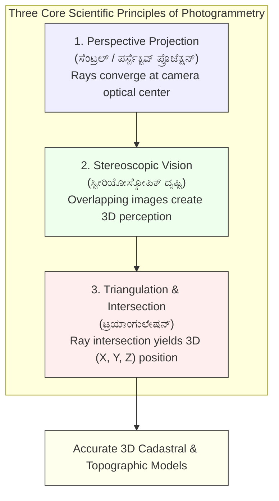

# Video Transcript & Structured Study Notes: Modern Methods of Surveying (Paper-II) — Photogrammetry & Remote Sensing Concepts

- **Source Channel:** Statecraft IAS Academy (Bharath Gowda Sir, Civil Engineer & UPSC CAPF AIR 208)
- **Direct Video URL:** [https://www.youtube.com/watch?v=30Va79yyDlg](https://www.youtube.com/watch?v=30Va79yyDlg)
- **Video ID:** `30Va79yyDlg`
- **Total Duration:** 58 minutes 20 seconds
- **Primary Exam Concordance:** 
  - KEA Land Surveyor Paper-II: Module 3 (`[[03_Modern_Surveying_Photogrammetry_and_Remote_Sensing|Modern Surveying, Photogrammetry & Remote Sensing]]`)

---

## 1. Executive Summary & Syllabus Context

This in-depth lecture launches the foundational technical series for **KEA Land Surveyor 2026 Paper-II (Specific Paper - 700+ Vacancies)**. 

Bharath Gowda Sir explains that while General Studies (Paper-I) is studied universally by competitive candidates, **Paper-II Modern Surveying** is a technical domain that determines final merit and rank. The lecture covers:
1. The formal definition and mathematical scope of **Photogrammetry (ಫೋಟೋಗ್ರಾಮೆಟ್ರಿ)**.
2. Direct vs. indirect measurement principles.
3. Historical milestones & verbatim competitive facts (**Father of Photogrammetry**, **First Earth Observation Satellite**).
4. The three core scientific principles of photogrammetry: **Perspective Projection**, **Stereoscopic Vision**, and **Triangulation**.
5. Electromagnetic Radiation (EMR) physics, the EMR spectrum mnemonic (**GXU-V-IMR**), and spectral reflection.
6. Mathematical derivation and calculation of **Photogrammetric Scale ($S = f/H$)**.
7. Practical engineering applications in cadastral mapping, contouring, and urban zoning.

---

## 2. Definition & Scope of Photogrammetry

> [!NOTE] Formal Technical Definition
> **Photogrammetry (ಫೋಟೋಗ್ರಾಮೆಟ್ರಿ)** is the science, art, and technology of obtaining reliable measurements, physical dimensions, geometric properties, and maps of ground objects from photographic images without establishing direct physical contact with the feature.
> - **Etymology:** Derived from Greek words *Photos* (Light), *Gramma* (Drawing / Letter), and *Metron* (To measure) $\to$ "Measuring through light drawings".

```
                          ┌─────────────────────────────────────┐
                          │   Photogrammetric Measurements      │
                          └──────────────────┬──────────────────┘
                                             │
             ┌───────────────────────┬───────┴───────┬───────────────────────┐
             ▼                       ▼               ▼                       ▼
      1. Distances &         2. Elevations &    3. 3D Coordinates       4. Surface Areas &
         Horizontal Lengths     Vertical Heights   (X, Y, Z Spatial)       Land Parcel Extents
```

- **Comparison with Conventional Surveying:**
  - *Conventional Ground Survey (Chain, Compass, Theodolite):* Requires physical presence at every station, clearing survey lines, and measuring point-by-point. Highly labour-intensive, slow in mountainous or marshy terrain.
  - *Photogrammetric Survey:* Captures massive spatial areas instantaneously from an airborne or spaceborne platform. Ground control points (GCPs) provide real-world georeferencing, while the internal geometry of overlapping photographs yields millimeter-to-centimeter coordinate accuracy.

---

## 3. High-Yield Historical Milestones for KEA 2026

The instructor highlights two indispensable competitive exam facts frequently tested in technical civil and survey examinations:

| Examination Fact | Official Attribution | Significance & Context |
| :--- | :--- | :--- |
| **Father of Photogrammetry** | **Aimé Laussedat (1819–1907)** | French military engineer who, in **1849**, first used terrestrial cameras and elevated kites/balloons to capture images for cartographic and topographic mapping. |
| **First Earth Observation Satellite** | **Landsat-1 (ERTS-1)** | Launched on **July 23, 1972** by NASA. Inaugurated the modern era of civilian satellite remote sensing and multispectral land monitoring. |

---

## 4. The Three Fundamental Principles of Photogrammetry

Photogrammetric reconstruction relies on three interrelated optical and geometric principles:



### Explanatory Analysis of the Diagram
The diagram displays the logical sequence of photogrammetric data recovery. Incoming light rays follow perspective geometry through the lens center (Principle 1). By taking two overlapping photographs from adjacent flight stations, binocular disparity allows the recreation of a three-dimensional stereo model with elevation data (Principle 2). Finally, geometric ray intersection from known camera stations computes exact spatial coordinates $(X,Y,Z)$ of ground points via spatial triangulation (Principle 3).

---

### 4.1 Principle 1: Perspective (Central) Projection
- Aerial photographs are **perspective projections**, whereas conventional maps are **orthographic projections**.
- In perspective projection, all light rays pass through a single point—the **perspective center (optical center of the lens)**—before impinging on the photographic sensor/film.
- **Consequence:** The scale of an aerial photograph is **not constant**. Objects closer to the camera (hilltops, elevated ground) appear larger than objects further away (valley floors, depressions).

### 4.2 Principle 2: Stereoscopic Vision & 3D Stereomodels
- Human eyes view objects from slightly different viewpoints (~65 mm apart), allowing the brain to compute depth perception (**ಸ್ಟೀರಿಯೋಸ್ಕೋಪಿಕ್ ದೃಷ್ಟಿ**).
- In photogrammetry, an aircraft takes overlapping photographs as it travels along a flight line:
  - **Endlap (Longitudinal Overlap):** Minimum **60%** overlap between successive photos along the line of flight.
  - **Sidelap (Lateral Overlap):** Minimum **25% to 30%** overlap between adjacent parallel flight strips.
- When an analyst views two consecutive overlapping photographs through a stereoscope (or digital polarized 3D monitors), a three-dimensional optical model of the terrain (**3D Stereo Model**) appears, enabling direct height and slope measurement.

### 4.3 Principle 3: Triangulation & Space Intersection
- The unknown ground coordinates $(X, Y, Z)$ of any feature (e.g., boundary mark, tree, building corner) are calculated by intersecting conjugate light rays reconstructed from two or more exposure stations whose camera positions and angles are known.

---

## 5. Electromagnetic Radiation (EMR) & Sensor Mechanics

To explain how cameras and sensors record imagery, the instructor breaks down the physics of Electromagnetic Radiation (EMR):

```
  High Frequency / High Energy                                Low Frequency / Low Energy
  Short Wavelength (λ)                                        Long Wavelength (λ)
  ◄─────────────────────────────────────────────────────────────────────────────►
     Gamma    │     X-Rays     │       UV      │  Visible  │   Infrared   │ Microwave │ Radio
     Rays (G) │      (X)       │      (U)      │ Light (V) │     (I)      │    (M)    │ Waves (R)
```

### 5.1 The EMR Spectrum Mnemonic: GXU-V-IMR
The instructor provides an intuitive mnemonic to recall the spectrum in decreasing energy / increasing wavelength order:
1. **G — Gamma Rays:** Highest frequency, extremely dangerous; blocked by Earth's atmosphere.
2. **X — X-Rays:** High penetration energy; filtered by atmospheric gases.
3. **U — Ultraviolet (UV):** Absorbed substantially by the stratospheric **ozone layer ($O_3$)**.
4. **V — Visible Light (0.4 – 0.7 $\mu m$):** The narrow band visible to the human eye, decomposed into **VIBGYOR** (Blue: $0.4-0.5\ \mu m$, Green: $0.5-0.6\ \mu m$, Red: $0.6-0.7\ \mu m$).
5. **I — Infrared (IR):** Subdivided into Near-Infrared (NIR - critical for vegetation health monitoring), Short-Wave IR (SWIR), and Thermal IR (emitted heat).
6. **M — Microwave:** Longer wavelengths ($1\text{ mm}$ to $1\text{ m}$); used in active RADAR and satellite microwave sensors capable of penetrating clouds and darkness.
7. **R — Radio Waves:** Longest wavelengths, lowest energy.

### 5.2 Sensor-Target Interaction
When incident EMR strikes a land surface, the total incident energy ($E_I$) satisfies conservation of energy:
$$E_I = E_R (\text{Reflected}) + E_A (\text{Absorbed}) + E_T (\text{Transmitted})$$
- Photogrammetric and optical remote sensing sensors record only the **reflected component ($E_R$)**.
- Healthy green vegetation reflects heavily in the Near-Infrared (NIR) band due to leaf mesophyll structure, while clear deep water absorbs almost all NIR radiation.

---

## 6. Photogrammetric Scale Derivation & Calculations

The scale of a vertical aerial photograph is the ratio of distance on the photo to the corresponding distance on the ground:

$$\text{Scale } (S) = \frac{\text{Photo Distance } (d)}{\text{Ground Distance } (D)} = \frac{f}{H - h}$$

Where:
- $f$ = Focal length of the camera lens (e.g., $152\text{ mm}$ or $6\text{ inches}$).
- $H$ = Flying height of aircraft above Mean Sea Level (MSL).
- $h$ = Elevation of ground point above MSL.
- $(H - h)$ = Flying height above the ground surface.
- For flat terrain at datum level ($h = 0$):
$$S = \frac{f}{H}$$

```
                           Exposure Station (Camera Lens)
                                      ●
                                     /|\
                                    / | \
                                   /  |  \
                         Photo    /---|---\  Focal Length (f)
                         Plane   /    |    \
                                /     |     \
                               /      |      \
                              /       |       \
                             /        |        \  Flying Height (H)
                            /         |         \
                           /          |          \
            Ground Level  ●-----------|-----------●
                                Ground Distance (D)
```

### Worked Numerical Example from Lecture
- **Problem Statement:** On an aerial photograph, a road measures $15\text{ cm}$. The actual ground survey distance between the same two endpoints is $1.5\text{ km}$ ($1,500\text{ m}$). What is the scale of the photograph?
- **Step 1:** Convert both measurements to the same units (centimeters):
  $$\text{Photo Distance } = 15\text{ cm}$$
  $$\text{Ground Distance } = 1.5\text{ km} = 1,500\text{ m} = 150,000\text{ cm}$$
- **Step 2:** Compute scale ratio:
  $$\text{Scale } (S) = \frac{15}{150,000} = \frac{1}{10,000}$$
- **Conclusion:** The photograph is at a scale of **$1:10,000$** ($1\text{ cm}$ on photo represents $100\text{ m}$ on ground).

---

## 7. Practical Engineering & Land Surveying Applications

The lecture highlights real-world civil engineering and cadastral governance applications:
1. **Cadastral Boundary Mapping:** Resolving extensive boundary disputes across rural villages where traditional chain/tape surveying is hindered by crops, terrain, or property resistance.
2. **Topographic Contouring:** Deriving high-resolution digital elevation models (DEM) and contour intervals without manual leveling staves.
3. **Urban Infrastructure & Master Planning:** Delineating residential zones on stable, high-elevation terrain while earmarking flood-prone lowlands near riverbanks as protective green zones.
4. **Volume Calculations:** Determining cut-and-fill quantities for road embankments, reservoirs, and mining quarries from stereo pairs.

---

## 8. High-Yield Exam Checklist for Paper-II

> [!IMPORTANT] Core Formulae & Facts to Memorise
> - **Father of Photogrammetry:** Aimé Laussedat (1849).
> - **First Civilian EO Satellite:** Landsat-1 / ERTS-1 (1972).
> - **EMR Spectrum Order (Highest to Lowest Energy):** Gamma $\to$ X-Ray $\to$ UV $\to$ Visible $\to$ IR $\to$ Microwave $\to$ Radio (**GXU-V-IMR**).
> - **Visible Light Range:** $0.4\ \mu m$ to $0.7\ \mu m$ ($400\text{ nm} - 700\text{ nm}$).
> - **Scale of Vertical Aerial Photo:** $S = \frac{f}{H - h}$.
> - **Overlap Standards:** Longitudinal / Endlap = **60%**; Lateral / Sidelap = **25% – 30%**.
> - **Type of Projection:** Aerial photo = **Perspective (Central)**; Topographic map = **Orthographic (Parallel)**.
