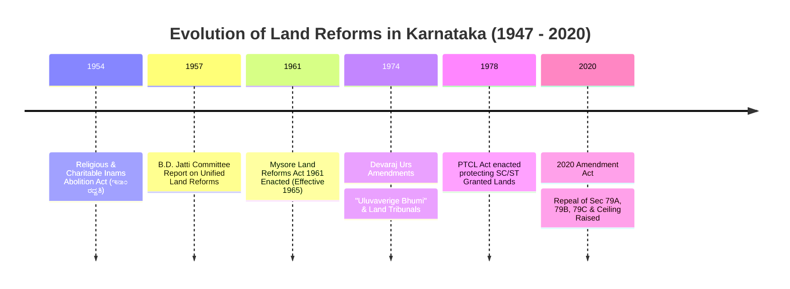
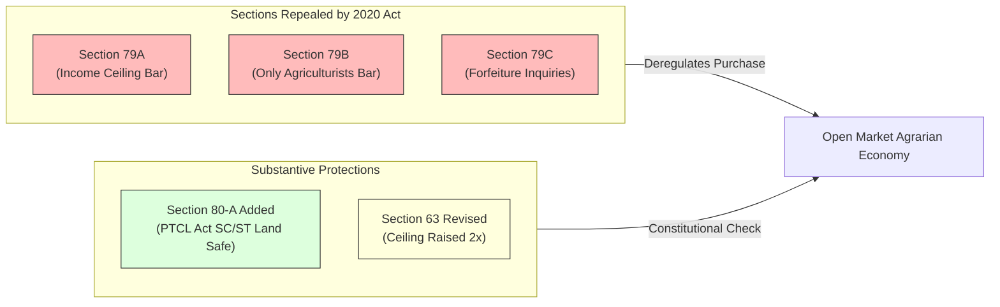

# Video Transcript & Structured Study Notes: Land Reforms in Karnataka (1947–2020) — Inam Abolition to 2020 Amendments

- **Source Channel:** Puneeth Forum
- **Direct Video URL:** [https://www.youtube.com/watch?v=ybC2c9st7Ls](https://www.youtube.com/watch?v=ybC2c9st7Ls)
- **Video ID:** `ybC2c9st7Ls`
- **Total Duration:** 1 hour 15 minutes 40 seconds (75m 40s)
- **Primary Exam Concordance:** 
  - KEA Land Surveyor Paper-II: Module 4 (`[[05_Computer_Applications_and_Land_Records_IT|Land Records, Bhoomi, Tenancy Rights, and Cadastral Governance]]`)
  - VAO Paper-I: Rural Governance & Karnataka Land Revenue/Reforms History

---

## 1. Executive Summary & Evolutionary Timeline

This comprehensive masterclass provides a complete statutory and socio-economic analysis of **Land Reforms in Karnataka from Pre-Independence through the Karnataka Land Reforms (Amendment) Act, 2020**. 

The lecture traces agrarian property relations through four distinct chronological phases:
1. **Pre-Independence & Early Post-Independence (1947–1956):** Abolition of feudal intermediaries, Inam tenures, and the Ayagar/Bara Balute system.
2. **Unified Statehood & Initial Legislation (1956–1971):** Recommendations of the B.D. Jatti Committee (1957) and the passage of the unified *Mysore Land Reforms Act, 1961*.
3. **Radical Tenancy Reforms (1971–1985):** The historic 1974 amendments under Chief Minister D. Devaraj Urs enshrining *"Uluvaverige Bhumi"* (Land to the Tiller), setting up quasi-judicial Land Tribunals, and abolishing tenancy.
4. **Liberalisation & Market Reforms (1985–2020):** Leasing policy changes, followed by the watershed *Karnataka Land Reforms (Amendment) Act, 2020* that repealed Sections 79A, 79B, and 79C, doubled ceiling limits under Section 63, and added Section 80-A for PTCL protection.



---

## 2. Pre-Independence Agrarian Structure in Karnataka

The speaker begins by contrasting historical feudal tenures across the Old Mysore, Bombay-Karnataka, and Hyderabad-Karnataka regions:

### 2.1 The Traditional Village System & Palegars
- **Vijayanagara Empire Period:** Sowing the roots of landlordism; appointment of trusted regional chiefs known as *Paleyas / Vyalepais*, who later evolved into feudal chieftains (**ಪಾಳೆಯಗಾರರು - Palegars**).
- **The Ayagar / Bara Balute System (ಆಯಗಾರ ಪದ್ಧತಿ / ಹನ್ನೆರಡು ಆಯಗಾರರು):**
  - **Administrative Officials:** *Shanbhog [ಶ್ಯಾನುಭೋಗ್]* (village accountant/records keeper) and *Gowda / Patel [ಗೌಡ / ಪಟೇಲ್]* (village headman responsible for law & order and tax collection).
  - **Village Servants:** *Chalavadi / Thoti [ಛಲವಾದಿ / ತೋಟಿ]* (messenger/attendant) and *Neeraganti [ನೀರಗಂಟಿ]* (irrigation tank water regulator).
  - **Artisans & Service Providers:** Blacksmiths (*Kammara*), carpenters (*Badagi*), barbers, goldsmiths, and the village astrologer (*Panchanga Jyotishi*). They were remunerated through non-alienable, revenue-free service grants (**ಉಂಬಳಿ / ಇನಾಂ ಭೂಮಿ**).

### 2.2 Tenancy Formats Prior to British Takeover (1831)
When the British assumed direct administration of Mysore State in 1831 following the Nagar Peasant Revolt, five primary land tenure forms were codified:
1. **Ryotwari Land (ರೈತವಾರಿ ಭೂಮಿ):** Cultivators holding direct occupancy and paying fixed annual cash assessment to the sovereign.
2. **Banjara / Shreya Lands (ಬಂಜಾರ / ಶ್ರೇಯಾ ಭೂಮಿ):** Waste or fallow lands granted on concessional, escalating rent scales over 3–4 years to incentivise reclamation.
3. **Khayam Gutta (ಖಾಯಂ ಗುತ್ತಾ ಗ್ರಾಮಗಳು):** Villages leased out by the Maharaja on fixed, permanent assessment.
4. **Jodi Lands (ಜೋಡಿ ಇನಾಂ ಭೂಮಿ):** Favourable quit-rent tenures originally resumed during Tipu Sultan's era and later re-granted under British commissioners.
5. **Inam Lands (ಇನಾಂ ಭೂಮಿಗಳು):** Alienated villages and holdings assigned to temples (*Devadaya*), religious charities (*Dharmadaya*), and Brahmins (*Brahmadaya*).

---

## 3. Post-Independence Phase I: Abolition of Inams (1947–1956)

Intermediary rent-receiving tenures created severe exploitation of actual tillers. The newly democratic state enacted special abolition statutes:
- **Mysore (Religious and Charitable) Inams Abolition Act, 1954:**
  - Abolished all feudal rights held by religious institutions (*Devadaya*) and charitable endowments (*Dharmadaya*).
  - All Inam lands were vested in the State Government free from all encumbrances.
  - Classified occupants into statutory categories:
    - **Kadim Tenants (ಕದಿಂ ಬಾಡಿಗೆದಾರರು):** Permanent customary tenants who had paid fixed rent before the grant; registered as occupants paying land revenue directly to government.
    - **Kayem Tenants (ಕಾಯಂ ಬಾಡಿಗೆದಾರರು):** Registered as occupants upon paying a nominal statutory purchase premium to the Government.
    - **Excluded Lands:** Tank beds (*Kere*), grazing pastures (**ಗೋಮಾಳ್ - Gomal**), uncultivable rocky wastes (**ಖರಾಬು - Kharab**), and communal threshing grounds were reserved as State public lands.

---

## 4. Phase II: The Mysore Land Reforms Act, 1961

Following the 1956 States Reorganisation, five distinct land tenure systems (Old Mysore, Bombay, Madras, Hyderabad, and Coorg) needed unification:

```
  1956 States Reorganisation ──► 1957 B.D. Jatti Committee ──► Mysore Land Reforms Act, 1961
  [5 Disparate Legal Codes]      [Unified Policy Blueprint]    [Enacted 1961, Effective 1965]
```

### 4.1 The B.D. Jatti Committee (1957)
- Chaired by **B.D. Jatti** (later Chief Minister and Vice President of India).
- Recommended:
  1. Complete abolition of intermediary rights across all regions of unified Karnataka.
  2. Imposition of ceilings on future land acquisitions and existing holdings.
  3. Regulation of rent paid by tenants (fixing fair rent).
  4. Restricting eviction and providing security of tenure.

### 4.2 Key Features of the 1961 Act
- **Ceiling on Land Holdings:** Set at **27 Standard Acres** for an existing family holding, and up to **32 acres of dry land** for a standard family of 5 members (extendable up to a maximum ceiling for larger families).
- **Regulation of Rent (ಬಾಡಿಗೆ ನಿಯಂತ್ರಣ):**
  - Assured irrigated land (*Tari*): Max **25% (1/4th)** of gross produce.
  - Rainfed / Dry land (*Kushki*): Max **20% (1/5th)** of gross produce.
- **Resumption for Personal Cultivation (ಭೂಮಿ ಮರುಸ್ವಾಧೀನ):**
  - Landowners were allowed to resume up to 50% of leased land for personal cultivation under stringent conditions, though this led to widespread informal evictions prior to 1974.

---

## 5. Phase III: The Historic 1974 Amendments (D. Devaraj Urs Era)

The **Karnataka Land Reforms (Amendment) Act, 1974**, spearheaded by Chief Minister **D. Devaraj Urs**, transformed Karnataka's agrarian landscape:

```
┌────────────────────────────────────────────────────────────────────────┐
│           Major Pillars of the 1974 Devaraj Urs Land Reforms           │
├───────────────────────────────────┬────────────────────────────────────┤
│ 1. "Uluvaverige Bhumi" Principle  │ Abolition of tenancy; all leased   │
│    [ಉಳುವವನಿಗೇ ಭೂಮಿ]               │ land vested in the Government      │
├───────────────────────────────────┼────────────────────────────────────┤
│ 2. Quasi-Judicial Land Tribunals  │ Summary disposal of Form 7 claims  │
│    [ಭೂ ನ್ಯಾಯಮಂಡಳಿಗಳು]            │ by Assistant Commissioner & MLAs   │
├───────────────────────────────────┼────────────────────────────────────┤
│ 3. Drastic Reduction of Ceilings  │ Standard family ceiling reduced to │
│    [ಸೀಲಿಂಗ್ ಮಿತಿ ಇಳಿಕೆ]          │ 10 - 20 Standard Units             │
├───────────────────────────────────┼────────────────────────────────────┤
│ 4. Non-Agriculturist Restrictions │ Sections 79A, 79B, 79C barring     │
│    [ಕೃಷಿಯೇತರರ ಮೇಲೆ ನಿರ್ಬಂಧಗಳು]     │ non-farmers and corporate buyers   │
└───────────────────────────────────┴────────────────────────────────────┘
```

### 5.1 Conferment of Ownership on Tillers (Form 7)
- All agricultural land held under tenancy as of **March 1, 1974** stood abolished and vested in the State Government.
- Eligible tenants filed **Form 7** before the local Land Tribunal to obtain occupancy rights (**ಆಕ್ಯುಪೆನ್ಸಿ ಹಕ್ಕು**).
- Tenants became direct owners upon paying a nominal premium to the Government, breaking generational bonded tenancy.

### 5.2 Constitution of Land Tribunals (ಭೂ ನ್ಯಾಯಮಂಡಳಿಗಳು)
- Composed of:
  - **Assistant Commissioner (AC)** as Chairman.
  - Tahsildar as Secretary.
  - Local Member of Legislative Assembly (MLA) and local social representatives.
- Functioned as quasi-judicial bodies holding summary spot enquiries to determine genuine tillers. Orders were final subject only to High Court writ review.

### 5.3 Statutory Protections: Sections 79A, 79B, and 79C
To prevent re-emergence of absentee landlords:
- **Section 79A:** Barred any person or family whose non-agricultural annual income exceeded a prescribed threshold (originally ₹12,000, later enhanced to ₹2 lakh, ₹25 lakh) from acquiring agricultural land.
- **Section 79B:** Mandated that **only genuine agriculturists (ಕೃಷಿ ಮಾಡುವವರು)** could own or purchase agricultural land; barred companies, trusts, and societies.
- **Section 79C:** Empowered Tahsildars and Assistant Commissioners to investigate fraudulent acquisitions and forfeit lands to the State Government without compensation.

---

## 6. Phase IV: The Karnataka Land Reforms (Amendment) Act, 2020

The lecture examines the profound policy shift introduced under the *Karnataka Land Reforms (Amendment) Act, 2020* (promulgated initially via Ordinance in July 2020):



### Explanatory Analysis of the Flowchart
The flowchart outlines the structural transition enacted in 2020. By repealing Sections 79A, 79B, and 79C, the legislature dismantled bureaucratic entry barriers for non-agricultural buyers. Simultaneously, it doubled the individual/family holding limits under Section 63 while carving out an absolute statutory immunity under Section 80-A to ensure that granted lands belonging to SC/ST communities remain fully protected under the PTCL Act, 1978.

---

### 6.1 Key Amendments of the 2020 Act

| Statutory Provision | Pre-2020 Position | 2020 Amended Position | Impact & Rationale |
| :--- | :--- | :--- | :--- |
| **Section 79A** | Non-agricultural income cap (max ₹25 Lakh/yr) to buy farmland. | **Repealed entirely.** | Any Indian citizen, regardless of non-farm income, can buy agricultural land. |
| **Section 79B** | Only practicing agriculturists could purchase agricultural land. | **Repealed entirely.** | Professionals, IT employees, companies, trusts, and agro-industries can purchase farmland. |
| **Section 79C** | Revenue officers conducted penalty inquiries for 79A/B violations. | **Repealed entirely.** | All pending proceedings under 79A/B/C before AC/DC courts abated. |
| **Section 63(2)** *(Ceiling Limits)* | Standard family (5 members) ceiling: **10 Units** (~54 acres dry land). | **Doubled to 20 Units** (~108 acres dry land). Max ceiling for family >10 members raised from 20 to **40 Units**. | Facilitates commercial farming, horticulture estates, and economies of scale. |
| **Section 80 & 81** | Strict statutory bar on transfer to non-agriculturists. | **Amended** to permit transfers to non-agriculturists and specified mortgage institutions. | Facilitates agricultural bank loans and institutional credit hypothecation. |
| **Section 80-A** *(New Section)* | Non-existent in 1961 Act. | **Newly Inserted:** Expressly declares that amendments *do not dilute or affect* the **PTCL Act, 1978**. | Granted lands to Scheduled Castes and Scheduled Tribes cannot be alienated to general buyers. |

> [!IMPORTANT] Unit of Measurement Definition
> - **1 Standard Unit** = **5.4 Acres of Dry Land (ಕುಷ್ಕಿ ಭೂಮಿ)**, or ~2.5 Acres of Wet Land (*Tari*), or ~1.3 Acres of Garden Land (*Bagayat*).
> - Pre-2020 Ceiling: 10 Units = **54 Acres** (Dry).
> - 2020 Amended Ceiling: 20 Units = **108 Acres** (Dry).
> - Extended Family Ceiling (>10 members): Up to **40 Units = 216 Acres**.

---

### 6.2 Socio-Economic Debate: Pros vs. Cons of the 2020 Act

The video presents an impartial comparative analysis of the arguments surrounding the 2020 reforms:

#### Advantages & Government Rationale (ಸಾಧಕಗಳು / ಅನುಕೂಲಗಳು)
1. **Capital Infusion into Agriculture:** Facilitates corporate investments, hi-tech farming, precision irrigation, cold chains, and food processing infrastructure.
2. **Fair Asset Valuation for Farmers:** Broadens the buyer pool beyond neighbouring farmers, allowing distressed or retiring farmers to realise market-competitive prices.
3. **Elimination of Bribery & Red Tape:** Sections 79A/B generated corruption in Tahsildar and AC offices where buyers routinely submitted forged farmer certificates (*Raitha Dakhale*).
4. **Promotion of Ease of Doing Business:** Simplifies direct land acquisition for renewable energy, solar parks, industrial corridors, and agro-processing clusters.

#### Criticisms & Societal Concerns (ಬಾಧಕಗಳು / ಅನನುಕೂಲಗಳು)
1. **Threat to Small & Marginal Farmers:** Fear of landlessness; vulnerable marginal farmers may sell ancestral holdings under economic distress or broker inducement.
2. **Real Estate Speculation:** Aggressive land-grabbing and speculative plotting surrounding Bengaluru, Mysuru, Hubballi-Dharwad, and Mangaluru.
3. **Debt Mortgages & Foreclosures:** Relaxed Section 80/81 mortgage rules expose indebted farmers to private non-institutional lenders and summary seizures.
4. **Subversion of "Land to the Tiller":** Critics and farmer unions labelled the 2020 changes a "Death Warrant" for smallholder peasantry, arguing it reverses the progressive social justice achievements of Devaraj Urs.

---

## 7. High-Yield Exam Summary & Statutory Terminology

| Statutory Milestone / Concept | Year / Section | Key Institutional Detail |
| :--- | :--- | :--- |
| **Inam Abolition Act** | 1954 / 1955 | Abolished Devadaya & Dharmadaya tenures; registered Kadim/Kayem tenants |
| **B.D. Jatti Committee** | 1957 | Recommended unified land reform law, uniform ceiling, and abolition of tenancy |
| **Mysore Land Reforms Act** | 1961 (eff. 1965) | First unified statute; ceiling of 27 standard acres; rent capped at 1/4th - 1/5th |
| **Devaraj Urs Amendment Act** | 1974 | Enshrined *"Uluvaverige Bhumi"*; constituted Land Tribunals; Form 7 tenancy claims |
| **PTCL Act (SC/ST Land Protection)** | 1978 | Prohibits transfer of granted lands; AC empowered to cancel sales and restore possession |
| **Sections 79A, 79B, 79C** | 1974 (Abolished 2020) | ₹25 Lakh non-agri income bar (79A); farmer-only status (79B); forfeiture inquiries (79C) |
| **2020 Amendment Act** | 2020 | Repealed 79A/B/C; doubled Section 63 ceiling (10 $\to$ 20 units); inserted Section 80-A |
| **1 Standard Unit** | KLR Act Sec 2(A) | **5.4 Acres** of Unirrigated/Dry Land (ಕುಷ್ಕಿ ಜಮೀನು) |
