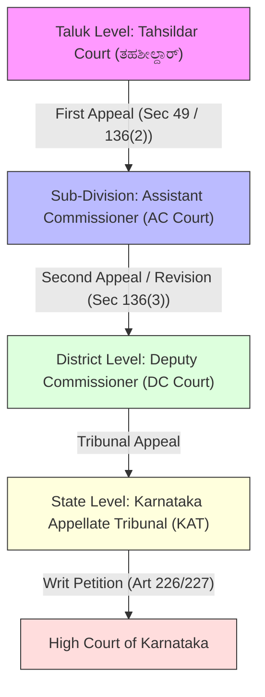

# Video Transcript & Structured Study Notes: Karnataka Land Revenue Act 1964 — Revenue Courts Hierarchy & Dispute Resolution

- **Source Channel:** Legal Voice Kannada (ಕನ್ನಡದಲ್ಲಿ ಕಾನೂನು)
- **Direct Video URL:** [https://www.youtube.com/watch?v=JAT-aMHzP9E](https://www.youtube.com/watch?v=JAT-aMHzP9E)
- **Video ID:** `JAT-aMHzP9E`
- **Total Duration:** 8 minutes 20 seconds
- **Relevant Exam Modules:** 
  - KEA Land Surveyor Paper-II: Module 4 (`[[05_Computer_Applications_and_Land_Records_IT|P2-COMP-4.4 Bhoomi & Revenue Records Management]]`) and (`[[10_Karnataka_Land_Records_Bhoomi_Mojini_Dishank|Boundary Demarcation & Field Enquiries]]`)
  - VAO Paper-I: Rural Administration & Revenue Officer Powers

---

## 1. Executive Summary & Core Purpose

This lecture delivers an authoritative legal exposition of the **Karnataka Land Revenue Act, 1964 (ಕರ್ನಾಟಕ ಭೂಕಂದಾಯ ಅಧಿನಿಯಮ, 1964)**, with special emphasis on the **jurisdiction, structure, and hearing procedures of Revenue Courts (ಕಂದಾಯ ನ್ಯಾಯಾಲಯಗಳು)** across Karnataka. 

It explains which land disputes must be addressed before revenue authorities rather than civil courts, establishes the four-tier quasi-judicial appellate hierarchy from Taluk to State level, and outlines the practical adjudication process including spot inspections, written submissions, and appeal timelines.

> [!NOTE] Fundamental Distinction: Revenue Courts vs. Civil Courts
> - **Civil Courts (ವ್ಯವಹಾರಿಕ ನ್ಯಾಯಾಲಯಗಳು):** Deal with questions of **title, ownership declarations (ಮಾಲೀಕತ್ವ ಘೋಷಣೆ), partition suits (ವಿಭಾಗ ಪತ್ರ ವಿವಾದ), and registered deed invalidation**.
> - **Revenue Courts (ಕಂದಾಯ ನ್ಯಾಯಾಲಯಗಳು):** Deal with the **maintenance of land records (ಕಂದಾಯ ದಾಖಲೆಗಳ ನಿರ್ವಹಣೆ), mutation entries (ಖಾತೆ ಬದಲಾವಣೆ), RTC/Pahani entries (ಪಹಣಿ ತಿದ್ದುಪಡಿ), physical boundary disputes (ಗಡಿ ವಿವಾದಗಳು), access/cart-tracks (ದಾರಿ / ರಸ್ತೆ ವಿವಾದ), and agricultural land conversions (ಭೂ ಬಳಕೆ ಪರಿವರ್ತನೆ)**.

---

## 2. Jurisdiction: Disputes Handled by Revenue Courts

The video identifies six major categories of agricultural land disputes that fall directly within the competence of Revenue Courts in Karnataka:

```
                      ┌───────────────────────────────────────────────┐
                      │ Agricultural Land Disputes in Revenue Courts  │
                      └───────────────────────┬───────────────────────┘
                                              │
         ┌───────────────────┬────────────────┼───────────────────┬───────────────────┐
         ▼                   ▼                ▼                   ▼                   ▼
   1. Khata &          2. Pahani / RTC    3. Boundary         4. Pathway &        5. Land Use &
      Mutation Entries    Corrections        Disputes            Easement Rights     Statutory Land
      [ಖಾತೆ ಬದಲಾವಣೆ]     [ಪಹಣಿ ತಿದ್ದುಪಡಿ]     [ಗಡಿ ವಿವಾದ]        [ದಾರಿ / ರಸ್ತೆ]     [ಭೂ ಪರಿವರ್ತನೆ / PTCL]
```

1. **Khata & Mutation Disputes (ಖಾತೆ ಬದಲಾವಣೆ / ಪೌತಿ ಖಾತೆ ವಿವಾದ):**
   - Inquiries following succession, inheritance, partition deeds, or registered sales under **Sections 128 and 129** of the KLR Act, 1964.
   - Resolution of objections raised during the 30-day statutory notice period against provisional mutation entries.

2. **Pahani / RTC Record of Rights Inaccuracies (ಪಹಣಿ / ಆರ್‌ಟಿಸಿ ದಾಖಲಾತಿ ವಿವಾದಗಳು):**
   - Errors in **Column 9 (Kabjedar / Owner's Name)** and **Column 12 (Cultivator Details / Tenancy / Crops)**.
   - Applications for adding legal heirs, correcting clerical errors, or deleting fraudulently inserted names.

3. **Boundary Disputes & Encroachments (ಗಡಿ ವಿವಾದಗಳು - Sections 139 & 140):**
   - Discrepancies between physical field boundaries (Haddobastu / Bandh) and official survey records (Tippani, Akarbandh, Village Map).
   - Fixation and demarcation of boundaries where adjacent landowners dispute the alignment of survey boundary stones.

4. **Cart-Track, Road, and Right-of-Way Disputes (ದಾರಿ / ರಸ್ತೆ / ಸುಗಮ ಸಂಚಾರ ವಿವಾದಗಳು):**
   - Obstruction of traditional pathways, bullock-cart roads, or tractor access traversing through agricultural fields to reach an interior survey number.
   - Proceedings conducted under **Section 103 / Section 67** to safeguard customary field roads.

5. **Land Use Conversion (ಭೂ ಬಳಕೆ ಪರಿವರ್ತನೆ - Section 95):**
   - Adjudication of violations or regularisation petitions when agricultural land is used for non-agricultural (residential, commercial, industrial) purposes without prior approval.

6. **PTCL Act Matters (ಪರಿಶಿಷ್ಟ ಜಾತಿ ಮತ್ತು ಪರಿಶಿಷ್ಟ ಪಂಗಡಗಳ ಜಮೀನು ಸಂರಕ್ಷಣೆ):**
   - Enquiries under the *Karnataka SC & ST (Prohibition of Transfer of Certain Lands) Act, 1978* concerning invalid transfers of granted lands, handled by Assistant Commissioner and Deputy Commissioner courts.

---

## 3. Four-Tier Hierarchy of Revenue Courts in Karnataka

The Karnataka Land Revenue Act, 1964 establishes a rigid, hierarchical quasi-judicial framework for the disposal of disputes and appeals:

| Tier | Administrative Level | Presiding Quasi-Judicial Authority | Original / Appellate Jurisdiction under KLR Act |
| :--- | :--- | :--- | :--- |
| **Tier 1** | **Taluk Level (ತಾಲೂಕು ಮಟ್ಟ)** | **Tahsildar Court (ತಹಶೀಲ್ದಾರ್ ನ್ಯಾಯಾಲಯ)** | **Original Jurisdiction:** Contested mutation disputes (Section 129), boundary demarcation (Section 139/140), preliminary record enquiries. Assisted by Revenue Inspector (RI) and Taluk Surveyor. |
| **Tier 2** | **Sub-Divisional Level (ಉಪವಿಭಾಗ ಮಟ್ಟ)** | **Assistant Commissioner Court (ಸಹಾಯಕ ಆಯುಕ್ತರ ನ್ಯಾಯಾಲಯ - AC Court)** | **First Appellate Authority:** Hears appeals against Tahsildar orders under **Section 49/Section 136(2)**. Original jurisdiction in PTCL restoration petitions and Section 95 land conversion applications. |
| **Tier 3** | **District Level (ಜಿಲ್ಲಾ ಮಟ್ಟ)** | **Deputy Commissioner Court (ಜಿಲ್ಲಾಧಿಕಾರಿಗಳ ನ್ಯಾಯಾಲಯ - DC Court)** | **Second Appellate / Revision Authority:** Hears appeals under Section 49 against original AC orders; exercises comprehensive **Revisionary Powers under Section 136(3)** and Section 56 to review records and correct illegal entries. |
| **Tier 4** | **State Level (ರಾಜ್ಯ ಮಟ್ಟ)** | **Karnataka Appellate Tribunal - KAT (ಕರ್ನಾಟಕ ಮೇಲ್ಮನವಿ ನ್ಯಾಯಾಧಿಕರಣ)** | **Apex Administrative Tribunal:** Final statutory appellate court for revenue cases under the Karnataka Appellate Tribunal Act, 1976. |
| **Constitutional** | **High Court of Karnataka (ಕರ್ನಾಟಕ ಉಚ್ಚ ನ್ಯಾಯಾಲಯ)** | **High Court (Writ Jurisdiction)** | Exercises constitutional supervisory review under **Articles 226 and 227** against final KAT or DC revisionary orders. |



### Explanatory Analysis of the Flowchart
The flowchart illustrates the statutory progression of a revenue dispute. A matter originating at the Taluk level before the Tahsildar cannot directly jump to the High Court; the litigant must exhaust the statutory remedy of appeal before the Assistant Commissioner under Section 136(2), followed by a revision petition before the Deputy Commissioner under Section 136(3). The Karnataka Appellate Tribunal (KAT) serves as the highest statutory administrative body before invoking constitutional writ jurisdiction under Articles 226/227.

---

## 4. Revenue Court Procedure & Adjudication Steps

The video breaks down the step-by-step procedure followed during hearings in Revenue Courts:

```
  1. Filing Petition ──► 2. Notice to Parties ──► 3. Written & Oral ──► 4. Spot Inspection ──► 5. Final Reasoned
     & Revenue Records      [ಪ್ರತಿವಾದಿ ನೋಟಿಸ್]       Arguments             & Mahazar              Order
     [ಅರ್ಜಿ ಸಲ್ಲಿಕೆ]                              [ಲಿಖಿತ / ಮೌಖಿಕ ವಾದ]    [ಸ್ಥಳ ತಪಾಸಣೆ / ನಕ್ಷೆ]    [ಅಂತಿಮ ಆದೇಶ]
```

1. **Petition Filing (ಅರ್ಜಿ ಸಲ್ಲಿಕೆ):**
   - The aggrieved party submits a formal petition detailing the dispute along with certified copies of supporting revenue documents: **RTC (ಪಹಣಿ), Mutation Extract (ಎಂ.ಆರ್), Akarbandh (ಆಕಾರಬಂಧು), Tippani (ಟಿಪ್ಪಣಿ), or Atlas (ಅಟ್ಲಾಸ್)**.
2. **Issue of Notices (ನೋಟಿಸ್ ಜಾರಿ):**
   - The court issues formal summons/notices to all interested parties and neighbouring survey number holders to present their counter-objections.
3. **Pleadings & Arguments (ವಾದ-ಪ್ರತಿವಾದ):**
   - Parties submit their **Written Statements / Arguments (ಲಿಖಿತ ವಾದ)** through their advocates or in person.
   - Oral arguments (**ಬಾಯಿಮಾತಿನ ವಾದ**) are conducted before the presiding revenue officer.
4. **Spot Inspection & Field Verification (ಸ್ಥಳ ತಪಾಸಣೆ ಮತ್ತು ಮಹಜರು):**
   - In boundary, encroachment, and cart-track disputes, the court orders a mandatory **spot inspection (ಸ್ಥಳ ತಪಾಸಣೆ)**.
   - The inspection is conducted by the **Taluk Surveyor (ತಾಲೂಕು ಸರ್ವೆಯರ್)** or **Revenue Inspector (ಕಂದಾಯ ನಿರೀಕ್ಷಕ)** in the presence of panchas.
   - A detailed **Spot Mahazar (ಸ್ಥಳ ಮಹಜರು)** and a **Survey Sketch (ನಕ್ಷೆ / ಸ್ಕೆಚ್)** depicting physical boundaries and encroachments are prepared and submitted to the court.
5. **Final Order & Judgment (ಅಂತಿಮ ತೀರ್ಪು / ಆದೇಶ):**
   - The presiding officer evaluates the survey sketch, oral submissions, and title records, and delivers a reasoned speaking order.
   - If a party is dissatisfied, they are entitled to file an appeal within the statutory limitation period (normally 30 to 60 days depending on the forum).

---

## 5. High-Yield Exam Takeaways

> [!IMPORTANT] Direct Exam Points for Land Surveyor & VAO
> - **Section 128 KLR Act:** Duty of any person acquiring right over agricultural land by succession, partition, or purchase to report to the village accountant / revenue authority within 3 months.
> - **Section 129 KLR Act:** Procedure for recording mutation entries and handling disputed cases (passed by Tahsildar).
> - **Section 136(2) KLR Act:** First appeal against Tahsildar's mutation order lies before the **Assistant Commissioner (AC)** within 60 days.
> - **Section 136(3) KLR Act:** Revisionary jurisdiction of the **Deputy Commissioner (DC)** to call for and examine records of any subordinate revenue officer.
> - **Section 139 & 140 KLR Act:** Powers to determine and physically settle field boundaries (conducted by Surveyors and Tahsildars).
> - **Section 95 KLR Act:** Permission for conversion of agricultural land to non-agricultural purposes granted by the Deputy Commissioner (DC).

---

## 6. Verbatim Technical Glossary

| Kannada Term | English Legal Equivalent | Administrative Context |
| :--- | :--- | :--- |
| **ಕರ್ನಾಟಕ ಭೂಕಂದಾಯ ಅಧಿನಿಯಮ 1964** | Karnataka Land Revenue Act, 1964 | Primary land governance statute in Karnataka |
| **ಕಂದಾಯ ನ್ಯಾಯಾಲಯ** | Revenue Court | Quasi-judicial tribunal headed by revenue officers |
| **ಖಾತೆ ಬದಲಾವಣೆ** | Khata Mutation / Transfer of Title Entry | Updation of ownership in revenue registers |
| **ಪಹಣಿ / ಆರ್‌ಟಿಸಿ** | Record of Rights, Tenancy, and Crops (RTC) | Primary land parcel document containing 16 columns |
| **ಗಡಿ ವಿವಾದ** | Boundary Dispute | Encroachment or misalignment of field borders |
| **ದಾರಿ / ರಸ್ತೆ ವಿವಾದ** | Cart-track / Easement Dispute | Customary field access right through agricultural lands |
| **ಸ್ಥಳ ತಪಾಸಣೆ** | Spot Inspection | On-site physical verification by surveyor / RI |
| **ಸ್ಥಳ ಮಹಜರು** | Spot Mahazar / Inquest Report | Witnessed panchanama recording on-site facts |
| **ತಹಶೀಲ್ದಾರ್ ನ್ಯಾಯಾಲಯ** | Tahsildar Court | Primary revenue court at Taluk jurisdiction |
| **ಸಹಾಯಕ ಆಯುಕ್ತರು (AC)** | Assistant Commissioner | Sub-divisional revenue and appellate head |
| **ಜಿಲ್ಲಾಧಿಕಾರಿಗಳು (DC)** | Deputy Commissioner / District Collector | District administrative head and revision authority |
| **ಕರ್ನಾಟಕ ಮೇಲ್ಮನವಿ ನ್ಯಾಯಾಧಿಕರಣ (KAT)** | Karnataka Appellate Tribunal | Apex revenue tribunal of the state |
