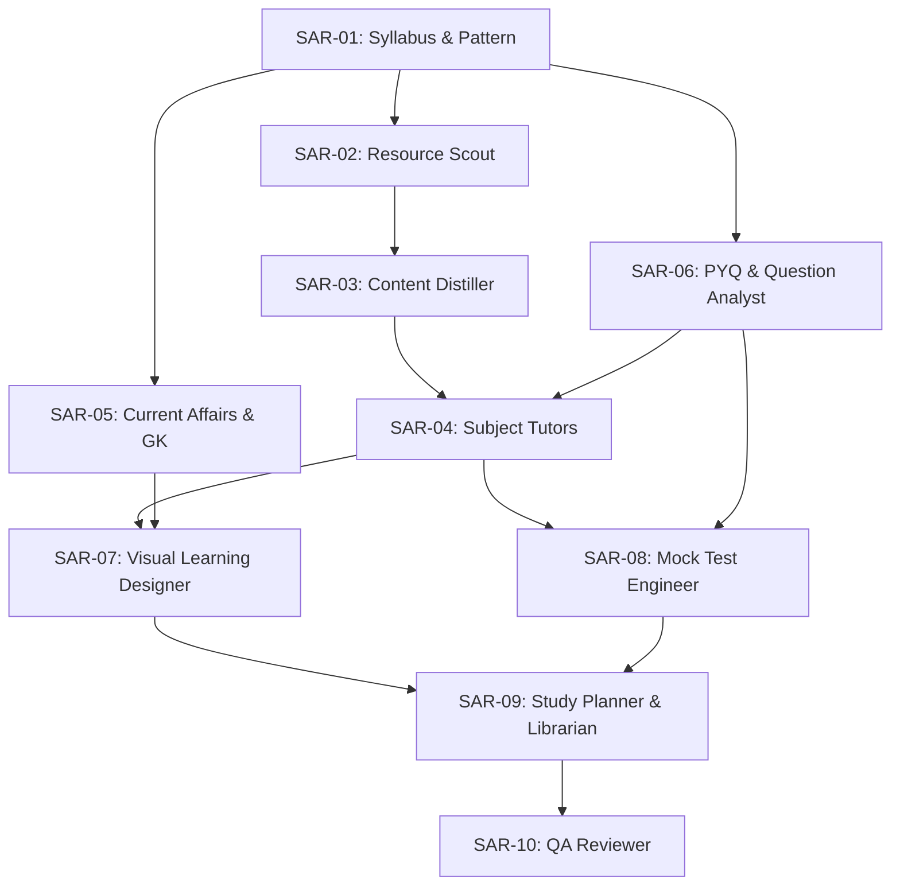

# Sub-Agent Roster & Execution Plan — KEA Land Surveyor 2026

## Overview
This plan coordinates specialized sub-agent tasks to build a complete, high-yield, Obsidian-ready study kit for the KEA (Karnataka Examination Authority) Land Surveyor competitive examination. The candidate has ~2–3 days before the exam, requiring maximum syllabus coverage per study hour.

## Sub-Agent Roster & Responsibilities

| Role ID | Role Name | Primary Objective & Deliverables | Dependencies |
| :--- | :--- | :--- | :--- |
| **SAR-01** | **Syllabus & Pattern Analyst** | Extract official KEA notification, exam pattern, Paper 1 & 2 details, marks (100+100 or specific format), duration, negative marking, section weightage, and official website sources. Output: `02_Syllabus_and_Pattern.md`. | None (Runs first) |
| **SAR-02** | **Resource Scout** | Identify 15–20 verified YouTube videos (coursework, technical surveying, mathematics, general knowledge; no notification/application chatter), authentic PYQ PDFs, official answer keys, and technical blogs. Output: `05_Resources/` and `07_Agent_Log/YouTube_Links.md`. | SAR-01 |
| **SAR-03** | **Content Distiller** | Ingest transcripts from key surveying and GK videos via yt-dlp/subtitles; distil core equations, surveying principles, instrument procedures, and field corrections into high-density reference digests. Output: `05_Resources/YouTube_Transcripts/`. | SAR-02 |
| **SAR-04** | **Subject Tutors (Technical & General)** | Produce exam-oriented revision notes for: Chain Surveying, Compass Surveying, Plane Table, Levelling & Contouring, Theodolite & Tacheometry, Total Station & GPS/GIS, Advanced Surveying/Curves, Survey Mathematics & Geometry, and General Papers. Output: `03_Notes/`. | SAR-01, SAR-03 |
| **SAR-05** | **Current Affairs & GK Researcher** | Compile high-yield Karnataka state events, land reforms (Bhoomi, Mojini, Dishank), economic survey, state schemes, and national current affairs. Output: `04_Current_Affairs_GK/`. | SAR-01 |
| **SAR-06** | **PYQ & Question Analyst** | Analyze previous Land Surveyor question papers (KEA / Survey Settlement & Land Records Dept), extract recurring numericals, formulas, instrument errors, and compile "Most Expected Questions". Output: `05_Resources/PYQ_Analysis.md` & embedded note sections. | SAR-01, SAR-02 |
| **SAR-07** | **Visual Learning Designer** | Review all notes to embed clean Obsidian-compatible Mermaid diagrams (instrument workflows, error corrections, traversing checks, triangulation networks) with prose explanations, tables, and mnemonics. Output: Enriched `03_Notes/` and `04_Current_Affairs_GK/`. | SAR-04, SAR-05 |
| **SAR-08** | **Mock Test Engineer** | Construct 2–3 fully offline, standalone HTML mock tests matching exact KEA question count, timer, negative marking (1/4th if applicable), question palette, mark for review, subject-wise scoring, and answer keys with explanations. Output: `06_Mock_Tests/`. | SAR-01, SAR-06 |
| **SAR-09** | **Study Planner & Vault Librarian** | Create the master index (`00_START_HERE.md`), hour-by-hour 3-day high-yield study plan and compressed 2-day track (`01_Study_Plan.md`), and ensure bidirectional wikilinks. | SAR-01 through SAR-08 |
| **SAR-10** | **QA Reviewer** | Rigorously test all external URLs, Obsidian wikilinks, Mermaid syntax, HTML mock test offline execution (timer, scoring, review), and document findings in `07_Agent_Log/qa_report.md`. | All prior deliverables |

## Execution Sequence

## Known Constraints & Verification Checkpoints
- Real links only: All YouTube URLs must be verified via yt-dlp or curl/HTTP status.
- Official KEA weightage and negative marking rules must be strictly adhered to.
- Notes must feature English technical terms with Kannada terminology where standard (e.g., ಸರಪಳಿ ಸಮೀಕ್ಷೆ, ದಿಕ್ಸೂಚಿ ಸಮೀಕ್ಷೆ, ಮಟ್ಟ ಅಳತೆ).
- Offline HTML Mock Tests must be single self-contained files with no CDN dependencies.
