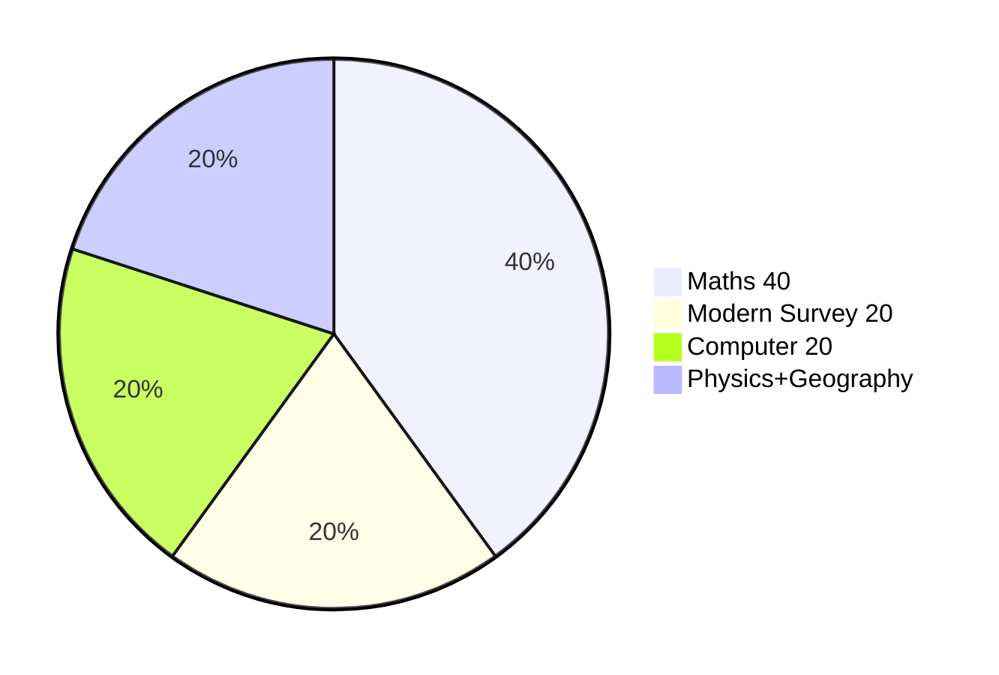

> [!focus] Exam Focus — 2 days left
> **Exam: 02.10.2026** (candidate-confirmed 2026-09-30). Today = 2026-09-30 → **Day 2 (today) + Day 1 (tomorrow)**.
> Paper 2 = **Mathematics 40% · Modern Surveying 20% · Computer Applications 20% · Physics 10% · Geography 10%** (see [[02_Syllabus_and_Pattern]] and [[02b_Paper2_Official_Syllabus]]). Paper 1 = General Knowledge. Traditional chain/compass/levelling notes (01–05) are **background only** — do not spend exam time on them.

# Land Surveyor — 2-Day Sprint Plan (30 Sep → 01 Oct, exam 02.10.2026)

> [!tip] Mock tests — Paper 2 simulations
> All three Paper 2 simulations are ready: [[06_Mock_Tests/mock1.html]], [[06_Mock_Tests/mock2.html]], [[06_Mock_Tests/mock3.html]] (100 Q each, 40/20/20/10/10 split, PYQ-style + expected tags, 120-min timer, auto-scored). Open the HTML files directly in a browser — no internet needed.

## Day 2 — Today (2026-09-30): Paper 2 core — Maths + Modern + Computer

Maths is 40% of Paper 2 — it gets the whole morning.

| Time | Task |
|---|---|
| 06:00–07:30 | [[LandSurveyor/ClaudeCode/03_Notes/Paper2/11_Maths_Arithmetic]] — squares/roots, HCF/LCM, AP/GP, nPr/nCr, statistics (work every formula) |
| 07:30–08:00 | Breakfast |
| 08:00–10:00 | [[LandSurveyor/ClaudeCode/03_Notes/Paper2/12_Maths_Algebra_and_Coordinate_Geometry]] — identities, linear/quadratic equations, factorisation, quadrants |
| 10:00–10:15 | Tea break |
| 10:15–12:15 | [[LandSurveyor/ClaudeCode/03_Notes/Paper2/13_Maths_Geometry_and_Mensuration]] — Pythagoras, similarity, circles/tangents, areas/volumes |
| 12:15–13:30 | Lunch |
| 13:30–14:30 | [[LandSurveyor/ClaudeCode/03_Notes/Paper2/14_Photogrammetry_Aerial_and_Drone_Survey]] — scale f/H, overlaps, SfM → DEM/DSM/ORI, GCPs |
| 14:30–15:30 | [[LandSurveyor/ClaudeCode/03_Notes/Paper2/15_Satellite_Imagery_Remote_Sensing_and_GIS]] — 4 resolutions, LIDAR/SAR, rectification, GIS model |
| 15:30–15:45 | Tea break |
| 15:45–16:45 | [[LandSurveyor/ClaudeCode/03_Notes/Paper2/16_GNSS_DGPS_RTK_and_CORS]] — trilateration, 4 satellites, DGPS, RTK, CORS/NTRIP, DOP, NavIC |
| 16:45–18:00 | [[LandSurveyor/ClaudeCode/03_Notes/Paper2/17_Computer_MSOffice_and_AutoCAD]] → [[18_Computer_GIS_Software]] (QGIS, WMS/WFS/WCS, PostGIS) |
| 18:00–19:00 | Dinner |
| 19:00–20:00 | [[LandSurveyor/ClaudeCode/03_Notes/Paper2/19_Computer_Software_Solutions_and_Land_Records_IT]] — SDLC, offline-first, APIs, SDC, JSON/XML/HTTPS |
| 20:00–21:00 | Quick-revision boxes from notes 11–19 (today's notes only) |
| 21:00–22:00 | Sleep prep — early sleep, exam in 2 days |

*Pie: Paper 2 weightage — today's study time follows it.*

## Day 1 — Tomorrow (2026-10-01): Physics + Geography + Paper-1 GK + all 3 mocks

| Time | Task |
|---|---|
| 06:00–07:30 | [[20_Physics]] — units, magnetism/electricity, EM spectrum, laser, motion, heat scales, TIR, SONAR/Doppler |
| 07:30–08:00 | Breakfast |
| 08:00–09:00 | [[LandSurveyor/ClaudeCode/03_Notes/Paper2/21_Geography_Earth_Lithosphere_Maps_India]] — rotation/revolution, latitudes, IST, layers, quakes, maps, India physical features |
| 09:00–11:00 | Paper-1 GK sweep: [[06_History]] → [[07_Geography]] → [[08_Polity]] → [[09_Economy_Science]] (quick-revision boxes + high-yield tables only) |
| 11:00–11:45 | [[04_Current_Affairs_GK/Current_Affairs_2026]] + [[04_Current_Affairs_GK/GK_High_Yield]] (verified facts only) |
| 11:45–12:30 | Lunch |
| 12:30–14:30 | [[06_Mock_Tests/mock1.html\|Mock Test 1]] (full 100 Q, timed) → review every wrong answer |
| 14:30–15:00 | Mistake log: note weak blocks, re-read those quick-revision boxes |
| 15:00–17:00 | [[06_Mock_Tests/mock2.html\|Mock Test 2]] (full 100 Q, timed) → review |
| 17:00–17:15 | Tea break |
| 17:15–19:15 | [[06_Mock_Tests/mock3.html\|Mock Test 3]] (full 100 Q, timed) → review |
| 19:15–20:00 | Dinner |
| 20:00–21:00 | Final review: mistake log + formula sheet (squares, AP/GP, nPr/nCr, SD/CV, f/H scale, RTK, WMS/WFS) |
| 21:00–22:00 | Early sleep — exam 02.10.2026 (Paper 1 morning, Paper 2 afternoon; carry admit card + shade the 5th circle for skips) |

## Checkpoint (tick as you finish)

- [ ] Day 2 morning: [[LandSurveyor/ClaudeCode/03_Notes/Paper2/11_Maths_Arithmetic]] + [[LandSurveyor/ClaudeCode/03_Notes/Paper2/12_Maths_Algebra_and_Coordinate_Geometry]]
- [ ] Day 2 midday: [[LandSurveyor/ClaudeCode/03_Notes/Paper2/13_Maths_Geometry_and_Mensuration]] + [[LandSurveyor/ClaudeCode/03_Notes/Paper2/14_Photogrammetry_Aerial_and_Drone_Survey]] + [[LandSurveyor/ClaudeCode/03_Notes/Paper2/15_Satellite_Imagery_Remote_Sensing_and_GIS]] + [[LandSurveyor/ClaudeCode/03_Notes/Paper2/16_GNSS_DGPS_RTK_and_CORS]]
- [ ] Day 2 evening: [[LandSurveyor/ClaudeCode/03_Notes/Paper2/17_Computer_MSOffice_and_AutoCAD]] + [[18_Computer_GIS_Software]] + [[LandSurveyor/ClaudeCode/03_Notes/Paper2/19_Computer_Software_Solutions_and_Land_Records_IT]]
- [ ] Day 1 morning: [[20_Physics]] + [[LandSurveyor/ClaudeCode/03_Notes/Paper2/21_Geography_Earth_Lithosphere_Maps_India]] + GK sweep ([[06_History]], [[07_Geography]], [[08_Polity]], [[09_Economy_Science]])
- [ ] Day 1 midday: [[04_Current_Affairs_GK/Current_Affairs_2026]] + [[04_Current_Affairs_GK/GK_High_Yield]]
- [ ] [[06_Mock_Tests/mock1.html\|Mock 1]]: attempted + reviewed (target ≥ 60/100; Paper 2 pass mark is 35)
- [ ] [[06_Mock_Tests/mock2.html\|Mock 2]]: attempted + reviewed (target ≥ 65/100)
- [ ] [[06_Mock_Tests/mock3.html\|Mock 3]]: attempted + reviewed (target ≥ 70/100)

## Quick-Start Checklist

1. Read [[02_Syllabus_and_Pattern]] first — know the 40/20/20/10/10 split
2. Read [[00_START_HERE]] for the full kit map
3. Old surveying notes 01–05 are background only — skip them under time pressure
4. `[[05_Resources/pyq_analysis]]` Q1–Q60 cover the OLD surveying assumption — use only for Paper-1 GK overlap, not Paper 2
