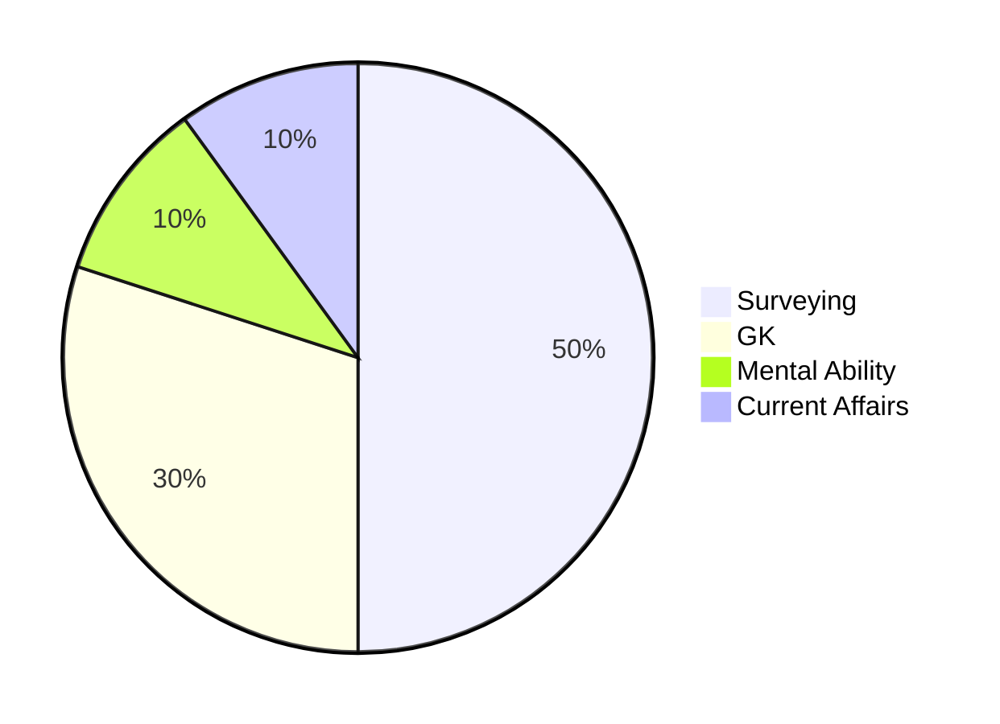

> [!focus] Exam Focus
> 3-day plan (today = 2026-09-29) covering Surveying (50% weight), GK (30%), Current Affairs (10%), Mental Ability (10%). Compressed 2-day track on Day 2.

# Land Surveyor — 3-Day Study Plan

## Days Remaining

**Exam date: 04.10.2026** (verified from official KEA notification via `07_Agent_Log/_pdf_pages/LS_p05.png`). Today = 2026-09-29 → **5 days remaining** → 3 full study days (Sep 30–Oct 2) + buffer.

| Countdown Day | Calendar Date | Focus Theme |
|---|---|---|
| Day 3 (today) | 2026-09-29 | Surveying Core |
| Day 2 | 2026-09-30 | GK + Current Affairs |
| Day 1 | 2026-10-01 | Practice + Mocks + Revision |

> If your exam is exactly 2 days away, switch to the **Compressed 2-Day Track** immediately.

> [!tip] Mock tests
> All three full mocks are available: [[06_Mock_Tests/mock1.html]], [[06_Mock_Tests/mock2.html]], [[06_Mock_Tests/mock3.html]] (100 questions each, 120-min timer, auto-scored). Open the HTML files directly in a browser — no internet needed.

## Daily Schedule (Full Track)

| Time | Day 1 — Surveying Core | Day 2 — GK + CA | Day 3 — Practice + Revision |
|---|---|---|---|
| 06:00–07:30 | [[03_Notes/01_Surveying_Basics]] + [[03_Notes/02_Chain_Compass_Survey]] | [[03_Notes/06_History]] | [[06_Mock_Tests/mock1.html\|Mock Test 1]] (100 Q) |
| 07:30–08:00 | Breakfast | Breakfast | Review mock 1 + mistakes |
| 08:00–10:00 | [[03_Notes/03_Levelling_Contouring]] | [[03_Notes/07_Geography]] | [[03_Notes/04_Theodolite_Total_Station]] quick review |
| 10:00–10:15 | Tea break | Tea break | Tea break |
| 10:15–12:15 | [[03_Notes/04_Theodolite_Total_Station]] | [[03_Notes/08_Polity]] | [[03_Notes/05_Karnataka_Land_Revenue]] revision |
| 12:15–13:30 | Lunch | Lunch | Lunch |
| 13:30–15:30 | [[05_Resources/pyq_analysis]] (Surveying Qs) | [[03_Notes/09_Economy_Science]] + [[04_Current_Affairs_GK/Current_Affairs_2026]] | [[06_Mock_Tests/mock2.html\|Mock Test 2]] (100 Q) |
| 15:30–15:45 | Tea break | Tea break | Review mock 2 + mistakes |
| 16:00–17:30 | [[03_Notes/10_Mental_Ability]] | [[04_Current_Affairs_GK/GK_High_Yield]] | [[03_Notes/10_Mental_Ability]] quick review |
| 18:00–19:00 | Dinner | Dinner | Dinner |
| 19:00–20:30 | Watch YouTube resources (#3, #8, #14) | Watch YouTube resources (#17, #18, #19) | [[06_Mock_Tests/mock3.html\|Mock Test 3]] (100 Q) + mark-for-review |
| 20:30–21:00 | Quick-revision boxes from all notes | Quick-revision boxes from all notes | Final review: mistake log + formula sheet |
| 21:00–22:00 | Sleep prep | Sleep prep | Sleep prep |

## Subject Priority (by weightage)

*Pie: Study time allocation per 02_Syllabus_and_Pattern.md weightage.*

## Compressed 2-Day Track

If you have only 2 days before exam:

| Time | Day 1 (Intensive) | Day 2 (Final) |
|---|---|---|
| 06:00–09:00 | [[03_Notes/01_Surveying_Basics]] → [[02_Chain_Compass_Survey]] → [[03_Levelling_Contouring]] → [[04_Theodolite_Total_Station]] | [[03_Notes/05_Karnataka_Land_Revenue]] |
| 09:00–09:15 | Break | Break |
| 09:15–11:30 | [[03_Notes/06_History]] → [[07_Geography]] → [[08_Polity]] → [[09_Economy_Science]] | [[06_Mock_Tests/mock1.html\|Mock Test 1]] (full test) |
| 11:30–12:30 | Lunch | Review + mistakes |
| 12:30–15:00 | [[04_Current_Affairs_GK/Current_Affairs_2026]] → [[GK_High_Yield]] → [[10_Mental_Ability]] | [[06_Mock_Tests/mock2.html\|Mock Test 2]] + [[06_Mock_Tests/mock3.html\|Mock Test 3]] (fast, weak areas only) |
| 15:00–16:00 | [[05_Resources/pyq_analysis]] (surveying section) | Quick-revision boxes + formula sheet |

## Revision Slots

- **After Mock 1**: Review wrong answers, categorize by subject, note weak topics in this file
- **After Mock 2**: Re-read quick-revision boxes from all 03_Notes files
- **After Mock 3** (Day 3 evening): Final scan of [[04_Current_Affairs_GK/Current_Affairs_2026]] + [[04_Current_Affairs_GK/GK_High_Yield]]

## Weekly Checkpoint

Mark each checkbox as you complete it. Move to next only if done.

- [ ] Day 1 morning: [[03_Notes/01_Surveying_Basics]] + [[03_Notes/02_Chain_Compass_Survey]]
- [ ] Day 1 afternoon: [[03_Notes/03_Levelling_Contouring]] + [[03_Notes/04_Theodolite_Total_Station]]
- [ ] Day 1 evening: [[03_Notes/10_Mental_Ability]] + YouTube videos #3, #8, #14
- [ ] Day 2 morning: [[03_Notes/06_History]] + [[03_Notes/07_Geography]]
- [ ] Day 2 afternoon: [[03_Notes/08_Polity]] + [[03_Notes/09_Economy_Science]]
- [ ] Day 2 evening: [[04_Current_Affairs_GK/Current_Affairs_2026]] + [[04_Current_Affairs_GK/GK_High_Yield]]
- [ ] Day 3: [[05_Resources/pyq_analysis]] + 3 mocks + review
- [ ] Mock 1: ≥70/100 score
- [ ] Mock 2: ≥75/100 score
- [ ] Mock 3: ≥80/100 score

## Quick-Start Checklist

1. Read [[02_Syllabus_and_Pattern]] first — know what to expect
2. Read [[00_START_HERE]] for the full kit map
3. Read one surveying note fully before YouTube videos
4. PYQ analysis at [[05_Resources/pyq_analysis]] is the closest thing to real questions (no verified PYQs found — see gap log)

