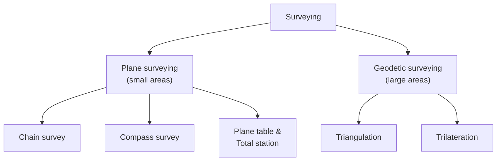

> [!focus] Exam Focus
> **Plane vs Geodetic surveying** (curvature consideration, extent limits), **Representative Fraction** calculations, and the **systematic vs accidental error** distinction are guaranteed 1–2 MCQs. Remember: earth's curvature matters beyond **192 km** (some texts: 250 km); curvature error ≈ **0.0785 K² m** and combined curvature+refraction ≈ **0.0673 K² m** (K in km). RF = map distance / ground distance, same units.

# Surveying — Basics (ಸರ್ವೆಯಿಂಗ್ ಮೂಲತತ್ವ)

## 1. What surveying is

Surveying is the art and science of determining the relative positions of points on, above or below the earth's surface by measuring **distances, directions (angles) and elevations**, and of representing them to scale on a plan or map (ನಕ್ಷೆ). Its two big divisions are **plan surveying** (position only, on a horizontal plane) and **levelling** (height/elevation). The reverse operation — setting out points on the ground from a plan — is **setting out (marking, ಗುರುತಿಸುವಿಕೆ)** and is what a land surveyor does daily when demarcating a survey number boundary.

## 2. Fundamental principles (ಮೂಲ ತತ್ವಗಳು)

Two principles govern every survey and appear as assertion-reason questions:

- **Work from whole to part (ಸಮಗ್ರದಿಂದ ಭಾಗಕ್ಕೆ)** — first establish a network of primary control points by triangulation, then fill in detail with secondary points. This **localises minor errors** and stops error accumulation. If reversed, a small error in one detail spreads to the whole figure.
- **Work from control to detail / from the higher accuracy to the lower** — every new point must be fixed by **at least two independent measurements** (two distances, or a distance and an angle, from known stations). One measurement alone never fixes a point uniquely.

A third practical rule: **always check before moving on** — closing error, re-measurement of a baseline, or a tie line.

## 3. Classification: plane vs geodetic

| Feature | Plane surveying (ಸಮತಲ ಸರ್ವೆ) | Geodetic surveying (ಭೂಗಣಿತೀಯ ಸರ್ವೆ) |
|---|---|---|
| Earth's shape | Level surface assumed; curvature neglected | Curvature considered; figured as ellipsoid |
| Plumb lines | Parallel at all stations | Converge towards earth's centre |
| Extent | < 192 km stretch (small areas) | Large areas, triangles > 180 km sides |
| Triangle sum | Plane geometry, angles sum to 180° | Spherical excess (solved by Legendre's theorem) |
| Accuracy / cost | Lower accuracy, cheap, quick | High accuracy, costly, slow |
| Typical use | Village map, layout, cadastral (RTC) work | State/national triangulation, control nets |

Karnataka cadastral survey (the Land Surveyor's core job) is **plane surveying** done with chain, plane table and now total station/GPS, tied to the **Great Trigonometrical Survey (GTS) control network** established across India.

The tree shows the working split: everything a village-level surveyor does (chain, compass, plane table, total station) sits under **plane surveying**, while state/national control work sits under **geodetic** methods.

## 4. Units of measurement

Linear: 1 m = 100 cm = 1000 mm; 1 km = 1000 m; **1 chain (Gunter) = 20.1168 m = 100 links** (1 link = 20.1168 cm); **1 engineer's chain = 30.48 m = 100 ft**; **1 metric chain = 20 m = 100 links** (the one used in Indian survey work — memorise this). Area: 1 hectare = 10,000 m²; **1 acre = 4046.86 m²**; **1 cent = 40.4686 m²**; **1 guntha = 121 sq yd (≈ 101.17 m²)**; **1 acre = 4 roods = 4840 sq yd**. Karnataka revenue units: **1 acre = 40 guntha = 100 cents (approx.)**; **1 hectare = 2.471 acre (10,000 m²)**. Angular: 1 right angle = 100 grades (centesimal) = 90° = 5400 minutes = 324000 seconds. Bearing: 1 circle = 360° = 400 gon.

## 5. Scales (ಅಳತೆಗೋಲು)

**Scale = distance on map : corresponding distance on ground = RF (R.F.)**. Three forms:

- **Representative Fraction (RF)** — unit-less ratio, e.g. 1:2500 means 1 unit on paper = 2500 on ground. Numerical scale (n.s.) = chain per inch style; **engineer's scale** is a plain scale in feet/tenths; **shrinkage** of a plan is corrected by RF = plotted distance / true distance (measured on ground) — i.e. shrunk RF = original RF × (measured shrunk length / true length).
- **Graphical scale** — drawn line scale (plain, diagonal, vernier). Survives photographic shrink/enlargement, unlike RF. A **diagonal scale** reads to three significant figures; a **vernier scale** uses main-scale/vernier coincidence to read fractions.
- **Vernier constant (least count)** = 1 MSD − 1 VSD; for a vernier with *n* divisions equal to (*n*−1) main-scale divisions, LC = MSD/ *n*. Direct vernier reads forward; **retrograde (backward) vernier** has its zero beyond the last main-scale graduation.

**Vernier theodolite example:** circle graduated to 20', nonius of 60 divisions on 59 → least count = 20′/60 = 20″.

## 6. Errors (ದೋಷಗಳು)

| Type | Nature | Cause | Handling |
|---|---|---|---|
| **Systematic (accumulative)** | Follows a definite law; same sign; accumulates | Instrument (non-standard tape), external (temperature, sag, slope), personal (bad ranging) | **Correct mathematically** — apply correction of opposite sign |
| **Accidental / random (ಯಾದೃಚ್ಛಿಕ)** | Remains after systematic removal; ± chance; governed by probability | Unpredictable | **Reduce by averaging** — most probable value = arithmetic mean of repeated observations |
| **Mistake (blunder)** | Large, from negligence | Misreading, wrong booking | Reject and re-observe |

Precision vs accuracy: **precision** = degree of consistent repetition (closeness of repeated values); **accuracy** = closeness to the true value. A survey can be precise but not accurate. Corresponding error: **true error = true value − measured value**; correction = − error. Relative error = error / measured value, usually expressed as 1 : x. Compensating error for a closed traverse is distributed by the **compass (Bowditch) rule** — correction ∝ length of side — or the **transit rule** (∝ latitude and departure).

## 7. Field book conventions (ಫೀಲ್ಡ್ ಬುಕ್)

- Chain/field book is **double-lined**; booking runs **top to bottom**, station numbers in the left (small) column, offsets in the right column.
- **Chain line = vertical arrow**; offsets drawn horizontal at their true chainage. **Ranging rods at 15–20 m** on straight ground, closer on curves.
- Offsets: **perpendicular (90°) offset preferred**; oblique only when unavoidable (cross staff / optical square for right angles).
- Record **all** details — landmarks, wells, trees, drains, boundary marks, and any obstacle — plus a **rough sketch** alongside the column, and the **line name, date, crew, instrument, weather, and magnetic declination**.
- Never erase; strike through a wrong entry and re-write so the original is legible (audit value in court cases). Sign each page.

> **Mnemonics**
> - **"W-P-C" for principles**: **W**hole to part, **P**lumb/point fixed twice (two measurements), **C**heck always.
> - **Chain lengths**: *Gunter 66 (ft) = 20.12 m; Engineer 100 (ft) = 30.48 m; Metric 20 m* → "**Sixty-six, hundred, twenty** — surveyor's money."
> - **Error trio**: "**S**ystematic **S**ign, **A**ccidental **A**verage, **M**istake **M**ust go" (SS-AA-MM).
> - **RF units cancel**: "**R**atio, **F**raction — no **F**eet."

## Likely Questions / PYQ

1. **A metric chain has a length of** (a) 20.1168 m (b) **20.000 m** (c) 30.48 m (d) 33 m — *Answer: b*.
2. **The principle of working from whole to part is adopted to** (a) save time (b) **prevent accumulation of error** (c) increase number of stations (d) reduce cost — *Answer: b*.
3. **Plane surveying is valid up to a distance of about** (a) 19.2 km (b) **192 km** (c) 1920 km (d) 100 km — *Answer: b*.
4. **The error due to earth's curvature in levelling over 1 km is approximately** (a) 0.0078 m (b) **0.0785 m** (c) 0.785 m (d) 0.0112 m — *Answer: b* (curvature = 0.0785 · K² m; combined curvature + refraction = 0.0673 · K² m, K in km).
5. **A plan drawn at RF 1:2000 has a line plotted as 4.9 cm but the true ground length is 100 m. Shrunken RF is** (a) **1:2041** (b) 1:1960 (c) 1:2000 (d) 1:4082 — *Answer: a* (100 m/0.049 m).
6. **Least count of a vernier with 50 divisions on 49 main-scale divisions of 1 mm each is** (a) 1 mm (b) **0.02 mm** (c) 0.05 mm (d) 0.5 mm — *Answer: b*.
7. **Which error is treated by taking the mean of repeated readings?** (a) Systematic (b) **Accidental** (c) Blunder (d) Cumulative — *Answer: b*.
8. **In a double-lined field book, offsets are entered in** (a) left column (b) **right column** (c) both (d) neither — *Answer: b*.

> [!tip] Quick Revision Box
> - **Whole to part + point fixed by two measurements + always check** = the three field rules.
> - **Plane < 192 km, curvature neglected; Geodetic = curvature considered.**
> - **Metric chain = 20 m (100 links of 20 cm); Gunter = 20.1168 m; Engineer = 30.48 m.**
> - **1 acre = 4046.86 m²; 1 ha = 10,000 m² = 2.471 acre; 1 cent = 40.47 m²; 1 acre = 40 guntha.**
> - **RF = map/ground (same units). Graphical scale survives shrinkage.**
> - **Systematic → correct; Accidental → average; Blunder → reject.**
> - **Bowditch ∝ length; Transit ∝ latitude & departure.**
> - Related: [[02_Chain_Compass_Survey]] | [[03_Levelling_Contouring]] | [[04_Theodolite_Total_Station]] | [[05_Karnataka_Land_Revenue]] | [[10_Mental_Ability]]
