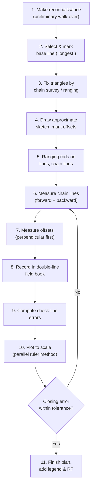

> [!focus] Exam Focus
> **WCB ↔ QB conversion** and the **local-attraction table ("needle deflected right = + attraction")** are asked every year. Memorise: **prismatic compass → 0° at SOUTH, anticlockwise, WCB; surveyor's compass → 0° at North/South both ends, clockwise reading of QB.** Ranging rules (major obstacles), and correction formulas for **slope, sag, temperature, pull** are numerical favourites.

# Chain & Compass Surveying (ಸರಪಳಿ ಮತ್ತು ಕಂಪಾಸ್ ಸರ್ವೆ)

## A. Chain Surveying (ಸರಪಳಿ ಸರ್ವೆ)

Chain surveying is the **simplest** method — only linear measurements, no angles — and is used for **small, fairly level, open areas** with simple outlines (village fields, plots). It fails where the ground is undulating, much obstructed, or large. The framework is a system of **triangles (the strongest figure)**: base line (the longest main line, along which maximum offsets are taken), subsidiary tie lines, and check lines (join apex to a point on the base to verify triangle shape — never used for plotting details).

### Instruments

| Instrument | Use / fact |
|---|---|
| Metric chain 20 m, 100 links × 20 cm | Measuring lengths; **brass tallies** at every 1 m (small) and 5 m (large) for easy counting |
| Tape — cloth (30 m), metallic, steel, **invar (36% Ni, low expansion)** | Invar for baselines; cloth stretches, steel rusts |
| **Ranging rod** 2 m or 3 m, painted 20 cm alternate black/white bands | Straight-line marking (ರೇಂಜಿಂಗ್) |
| **Offset rod** 3 m, with a hook/recess at top | Setting out **short offsets** and pushing the chain through hedges |
| **Pegs, arrows (10 per chain)**, plumb bob, field book | Arrows mark chain ends; pegs mark stations |
| **Cross staff** — open or French type | Right angles by **eye** — only for short offsets |
| **Optical square** | Right angles by **reflection** — accurate, works on long offsets |

### Ranging (ರೇಂಜಿಂಗ್)

- **Direct ranging** — both ends intervisible; the ranger moves until A, ranging rod and B are in one line.
- **Indirect ranging** — intermediate stations (obstacle/hill). Two surveyors at A and B alternately move in until A–ranger–ranger–B align (**reciprocal ranging**).
- **Ranging rules** — if the foot/hand of the ranging rod appears to the **left of the chain line, shift the rod to the RIGHT** (and vice-versa); if both ends visible but only approximate positions known, use **swinging the line**.

### Chaining on slopes & taping corrections

Break the slope into **compensating (undulating) and breaking lines**, measure slope distance *l* and either vertical angle *θ* or the level difference *h*, then reduce to horizontal.

| Correction | Formula (sign convention: + adds to tape length) |
|---|---|
| Slope | $C_{slope} = l - l\cos\theta \approx \frac{h^2}{2l}$ (always **subtract** from slope length) |
| Temperature | $C_t = \alpha L (T_m - T_s)$ ; steel $\alpha = 3.6\times10^{-6}/^\circ C$ |
| Pull / tension | $C_p = \frac{(P_m-P_s)L}{AE}$ (elongates → **+**) |
| Sag | $C_{sag} = -\frac{w^2L^3}{24P^2}$ (always **negative**) |
| Incorrect tape length | $C = \frac{(L'-L)}{L}\times$ measured length |
| Reduction to mean sea level | $C_{msl} = -\frac{h}{R}\times L$ (altitude correction, negative) |

Invar tape is used for baselines because its $\alpha$ (≈ 1×10⁻⁶/°C) is tiny, so temperature correction becomes negligible.

### Obstacles in chaining

| Obstacle | Usual remedy |
|---|---|
| **Chaining free, vision obstructed** (small hill/bush) | Equal perpendicular offsets on both sides; or auxiliary equilateral triangle |
| **Chaining obstructed, vision free** (a pond/building) | **Setout right-angle offsets AB & CD equal**, join B–D; or similar-triangle method |
| **Both chaining and vision obstructed** (river, wide lake) | **Similar-triangle / two-perpendicular method** — from A and B drop perpendiculars, place a range line E–F across and produce to intersect AB produced; **traverse method** |

> **Mnemonic — obstacle rule**: "**F**ree chain = **F**lip offsets; **N**o chain = **N**ormal (perpendicular) offsets; **N**either = **N**ew similar triangle." Or "**V-C**: Vision blocked → offsets; Chain blocked → perpendiculars; Both blocked → similar triangles."

**Mermaid — chain survey procedure**

The flow is **reconnaissance → base line → triangulation → ranging → chaining → offsetting → booking → checking → plotting**, and note the **feedback loop**: if the check line (or closing error) fails, the surveyor returns to measurement (step 6), not to the drawing board. This "measure, then check, then plot" order is the exam's favourite.

## B. Compass Surveying (ಕಂಪಾಸ್ ಸರ್ವೆ)

Compass surveying measures **magnetic bearings** of lines and distances by chain/tape; used for large areas and undulating country where chain alone fails. Types: **prismatic compass** (folding, 8–10 cm box, weighted needle + **luminous** read-arc, graduated **0–360° anticlockwise with 0°/360° at SOUTH**, WCB read directly, object-vane with slit + plain sight) and **surveyor's compass** (longer needle, unweighted, **0° at both N and S ends, quadrantal graduations read clockwise**, QB directly, vertical sight vane with horse-hair). Prismatic gives **whole circle bearings** and is used in plane-table work; surveyor's compass gives **quadrantal bearings** only.

### Bearings (ದಿಕ್-कोನ)

- **WCB (Whole Circle Bearing / Azimuth, ಸಂಪೂರ್ಣ ವೃತ್ತ ಕೋನ)**: 0°→360° measured **clockwise from north**.
- **QB (R.B., Quadrantal Bearing)**: 0°→90° from **N or S towards E or W**, e.g. N 45° E, S 30° W.

Conversion: WCB 0–90 → QB N θ E; 90–180 → QB S (180−θ) E; 180–270 → QB S (θ−180) W; 270–360 → QB N (360−θ) W. **Fore bearing (FB)** = bearing from A to B; **Back bearing (BB)** = FB ± 180° (add 180 if FB < 180, else subtract). In QB form, **numerical value same, letters interchanged** (N 30° E ↔ S 30° W).

**Magnetic declination (ಕಾಂತೀಯ ವಿಚಲನ)** — horizontal angle between true meridian and magnetic meridian; **eastern = +**, western = −; **TB = MB ± declination**. It varies diurnally, annually, secularly, and with position; **isogonic lines** join equal declination, **agonic line** joins zero declination. **Dip ( inclination )** — vertical angle of the needle, ~**66° at Bangalore region**, 90° at magnetic poles, 0° at magnetic equator; increases from equator to poles; a needle is balanced for dip.

**Local attraction (ಸ್ಥಾನೀಯ ಆಕರ್ಷಣೆ)** — steel structures, electric power lines, vehicles, iron ore, magnetic rocks pull the needle. **Test**: take FB and BB at both ends; if the difference ≠ 180°, one/both stations are affected. **Correction**: pick the **unaffected** station, apply its BB, and correct the other by the same angular difference. Suspect both → move to a third station.

> **Mnemonics**
> - **BB = FB ± 180** — "never trust a station where FB − BB ≠ 180°" (that is the local-attraction test).
> - Declination: "**E**ast is **P**lus, **W**est is **M**inus" (TB = MB + east declination).
> - Quadrant letters by WCB band: **NE, SE, SW, NW** → "**N**orth **E**ast, **S**outh **E**ast, **S**outh **W**est, **N**orth **W**est" — the first letter flips at 90°/270°, the second flips at 180°.
> - Bowditch vs Transit: "**B**owditch = **B**oth errors alike (∝ **B**oth length), **T**ransit = **T**oo precise an angle (∝ la**T**itude & de**P**arture)."

### Traverse & closing error (ಟ್ರാവರ್ಸ್)

A **closed traverse** (loop back to start) checks itself; a **connected traverse** joins two known control points (preferred, errors don't accumulate). Latitude = L cos θ, Departure = L sin θ (θ as WCB from north).

- **Arithmetic check**: Σ Latitude = 0 and Σ Departure = 0 (independent, and also gives **omission detection**: an unknown side can be computed).
- **Geometric ( graphical ) check** via plottable closing error *e*, plotted as the missing end-to-start line.
- **Bowditch (compass) rule**: $\Sigma$ corrections ∝ side length — $C_{lat} = -e_{lat}\cdot l/P$, $C_{dep} = -e_{dep}\cdot l/P$. Best when angular and linear errors are comparable.
- **Transit rule**: correction to latitude ∝ latitude of side, departure ∝ departure. Best when angular measurement is much more precise than chaining.
- **Hierarchical/Grinnell's method** — correction to a point ∝ square of its distance from the fixed end.

**Misclosure tolerance in Karnataka revenue survey practice ≈ 1 : 300 to 1 : 500** of perimeter; check with relative error *e/P*. Balancing gives corrected latitudes/departures; then compute **adjusted lengths & bearings** and the **area** (by double-departure / coordinate method: 2A = Σ (x_i y_{i+1} − x_{i+1} y_i), the shoelace formula, which is what a total-station traverse area uses).

## Likely Questions / PYQ

1. **BB of a line whose FB is N 40° W is** (a) N 40° W (b) **S 40° E** (c) S 40° W (d) N 50° E — *Answer: b* (same number, letters interchanged).
2. **FB = 120°; with local attraction at A the observed BB = 298° (should be 300°). The error is** (a) +2° at A (b) **−2° at A** (c) +2° at B (d) none — *Answer: b*.
3. **Which instrument measures right angles by reflection?** (a) Cross staff (b) **Optical square** (c) Offset rod (d) Range pole — *Answer: b*.
4. **Prismatic compass graduations run** (a) 0–360 clockwise, 0 at N (b) **0–360 anticlockwise, 0 at S** (c) 0–90 in four quadrants (d) 0–400 gon clockwise — *Answer: b*.
5. **Correction for sag in a taped line is always** (a) positive (b) **negative** (c) zero (d) sign depends on pull — *Answer: b*.
6. **A 30 m steel tape at 25 m pull was standardised at 15 m pull; C_p with A = 0.02 cm², E = 2×10⁶ kg/cm² is** (a) **+0.0075 m** (b) −0.0075 m (c) 0.075 m (d) 0.00075 m — *Answer: a* (10×30 / 2×10⁶).
7. **Bowditch correction is proportional to** (a) latitude only (b) **length of the side** (c) angle (d) square of distance — *Answer: b*.
8. **Dip is maximum at** (a) magnetic equator (b) **magnetic poles (90°)** (c) Bangalore (d) Greenwich — *Answer: b*.
9. **A river that blocks both chaining and vision is overcome by** (a) ranging rods (b) **similar-triangle / two-perpendicular method** (c) offsets (d) reciprocal ranging — *Answer: b*.

> [!tip] Quick Revision Box
> - **Chain survey = triangles only; base line longest; check line never for plotting.**
> - **Metric chain 20 m; invar = baselines; offset rod = 45°; optical square = true right angle.**
> - **Ranging rule: rod appears LEFT → move it RIGHT.**
> - **Slope/sag/MSL corrections are NEGATIVE; pull & +temp are positive.**
> - **BB = FB ± 180° (WCB) or same number, letters swapped (QB).**
> - **Prismatic: 0° at S, anticlockwise, WCB. Surveyor's: 0° at N & S, QB.**
> - **E declination +, W −. TB = MB ± decl.**
> - **Local attraction test: FB − BB ≠ 180°.**
> - **ΣLat = ΣDep = 0; Bowditch ∝ length, Transit ∝ latitude/departure.**
> - Related: [[01_Surveying_Basics]] | [[03_Levelling_Contouring]] | [[04_Theodolite_Total_Station]] | [[05_Karnataka_Land_Revenue]]
