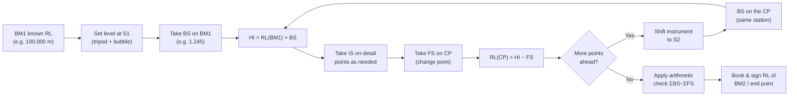

> [!focus] Exam Focus
> **Arithmetic check of the two booking methods** (ΣBS − ΣFS = ΣRise − ΣFall = Last RL − First RL) is asked almost every paper. Know **curvature & refraction correction = −0.0673 K² m (K in km; curvature −0.0112K², refraction +0.0112K²×1/7 ≈ +0.0112K²·0.157)**, and the **contour characteristic** "closely spaced = steep, widely spaced = gentle, closed loops = hill/pond". Reciprocal levelling and fly-signing are Karnataka field-work terms.

# Levelling & Contouring (ಸಮತಲೀಕರಣ ಮತ್ತು ಸಮೋನ್ನತ ರೇಖೆ)

## A. Levelling (ಸಮತಲೀಕರಣ)

Levelling determines the **relative vertical positions** of points by measuring vertical distances from a **horizontal line of sight** (level line). It answers "how high is this point above the datum?" — which is exactly what a surveyor needs for canal design, drainage, road gradients and bund heights.

### Definitions (ಪದಗಳ ಅರ್ಥ)

| Term | Meaning |
|---|---|
| **Datum (ಆಧಾರ ಮಟ್ಟ)** | Reference level; India uses **GS Datum / Great Spring Tides**; Karnataka: **Tidal datum of Chennai**; for canal work, MSL assumed |
| **Benchmark, BM (ಗುರುತು ಮಟ್ಟ)** | Fixed point of known RL; types: **GTS BM** (Survey of India, permanent), **Secondary/Arbitrary BM**, **Temporary BM**, **Datum BM** |
| **Reduced Level, RL** | Vertical height of a point above/below datum |
| **Back Sight, BS** | Reading taken **on the point of known RL** after shifting the instrument — the **first** reading at each setup |
| **Fore Sight, FS** | Reading **on the next point to be determined** — the **last** reading at each setup; **the only reading that changes the HI** |
| **Intermediate Sight, IS** | Any reading between BS and FS at a setup; **not used in the HI method's RL change** |
| **Height of Instrument, HI / Collimation level** | RL of the line of sight = RL of BS point + BS |
| **Change point, CP** | Point where FS and the next BS are both taken (shifting station) |
| **Stationery point** | Point where both BS and IS or FS and IS are taken |

### Types of levelling

- **Simple levelling** — one setup, two points.
- **Differential (compound) levelling** — many setups, long distance, RL of a far point.
- **Reciprocal levelling** — across a river/obstacle; instrument set close to A then close to B, reading difference gives true difference and **eliminates curvature, refraction and collimation error**. $d = \frac{(h_{a1}-h_{b1}) + (h_{a2}-h_{b2})}{2}$.
- **Fly levelling** — quick run between BMs to carry elevation (Karnataka revenue/canal "fly levels").
- **Profile (longitudinal section, L-sec) levelling** — readings along a centre line to draw the ground section for road/canal design.
- **Cross-sectioning levelling** — perpendicular to centre line at regular intervals (for earthwork volumes: **mid-section, average-end-area, prismoidal formulas**).
- **Trigonometric levelling** — from vertical angles and known horizontal distances; applies curvature/refraction correction.

### Instruments

| Instrument | Parts / note |
|---|---|
| **Levelling staff** | **Direct reading telescopic (3–5 m)**, folding, solid; **Beaman staff** (with clinometer bubbles for gradient); **Targa** staff for precise work |
| **Dumpy level** | Telescope rigidly fixed to supports; simple, durable, needs careful adjustment |
| **Tilting level** | Telescope tilts with a vertical circle/screw — easier to level; **most common** |
| **Automatic (auto) level** | **Compensator (prism, hanging)** keeps the line of sight horizontal automatically; range ±30′ |
| **Precise / digital level** | For first-order GTS nets, bar-coded staff |
| **Water level, hand level,Abney level, clinometer** | Gradient & rough work |

**Temporary adjustments of a dumpy level: (1) Set up & level the tripod, (2) Focus the eyepiece on the cross-hair, (3) Level by the foot-screw bubble, (4) Focus the object glass & remove parallax.** Permanent adjustments: **collimation (line of sight parallel to axis), bubble-axis (bubble tube parallel), axis of rotation truly vertical** — the **two-peg / collimation test** is the field check; a **reciprocal level test** detects a bent staff or a bad bubble.

### Booking methods

| | Rise & Fall method | Height of Instrument (HI) method |
|---|---|---|
| RL from | previous RL + rise or − fall | HI − staff reading |
| HI computed | not needed | every setup (HI = RL of BS point + BS) |
| Checks | **ΣBS − ΣFS = ΣRise − ΣFall = last RL − first RL** | **ΣBS − ΣFS = last RL − first RL** |
| Speed | Slower, but **locates the erroneous point** | Faster; used for **profile & sectioning** work |
| When BS on a point of unknown RL (flying, e.g. staff held upside down) | treat reading as **negative** | same sign rule |
| Staff inverted readings (under a bridge, tunnel roof) | mark **negative** in the column | RL = HI − (−reading) = HI + reading |

**Curvature & refraction:** combined correction to a staff reading at distance K km = **−0.0673 K² m** (curvature −0.0112 K², refraction +0.0112/7·K² ≈ +0.016 K² → net −0.0673 K² after the standard 1/7 refraction coefficient is applied: many texts quote **0.0112 K² (curvature)** and **0.0673 K² (combined)** — learn the second as the answer to "combined"). Earth radius R = 6370 km. Refraction is about **1/7th** of curvature and opposite in sign.

> **Mnemonic**
> - **"BS – IS – IS – FS"**: Back → **Shift** instrument → Fore. Only **BS and FS change the HI** ("**B**efore & **F**orward move the level; **I**ntermediates are **I**nert").
> - **Checks**: "**S**um **B**S minus **S**um **F**S = **R**ise minus **F**all = **L**ast minus **F**irst" → "**S-B-S-F, R-F, L-F**".
> - **Reciprocal levelling kills three errors**: "**C-R-C**" = **C**urvature, **R**efraction, **C**ollimation.
> - Combined correction: "**0.0673 K squared, take it away**" (subtract from RL / add to sight reading).

**Mermaid — differential levelling workflow**

The diagram shows the **cyclic core**: a BS always follows the FS on the *same* change point, so the instrument "leap-froggs" forward. The single **arithmetic check at the end** (ΣBS − ΣFS = last RL − first RL) verifies the whole run; if it fails, the surveyor re-observes the suspect setup rather than re-running everything — which is why BS/FS/IS classification must be booked correctly on site.

## B. Contouring (ಸಮೋನ್ನತ ರೇಖೆಗಳು)

A **contour** is a line on the map joining points of **equal elevation** above a datum; **contouring** is the art of locating and drawing them. Contours are drawn at a fixed **vertical interval (VI, contour interval)** — 0.5–2 m for plains, 2–10 m for hills; **horizontal interval (HI)** = horizontal distance between adjacent contours = VI / gradient.

### Characteristics (must-know for MCQs)

- **Closely spaced = steep slope; widely spaced = gentle; equally spaced = uniform slope.**
- **Concentric closed loops with higher values inside = hill/pond ridge; with lower inside = depression/pond.**
- **Contours V-pointing uphill = ridge (water-shed); V-pointing downhill = valley (stream)** — "contours point upstream".
- **Contours never meet or cross** — except a **vertical cliff/overhanging cave**, where they merge.
- **Contours do not branch or fuse**; a contour cannot pass through a **pointed spur** twice.
- Slopes crossing a contour uniformly means uniform slope.
- **Contours cross a road/railway** at right angles; **cross a bridge/causeway** following the alignment.

### Methods of contouring

1. **Square (grid) method** — lay out a grid (5–30 m squares) on flat ground, level every grid corner, then interpolate. Best for **small, flat, open areas**.
2. **Cross-section method** — take **radial cross-sections** at intervals along a centre line (roads, canals, rivers); contours from section levels. Cheaper, for **strip ground**.
3. **Direct method** — the staff point is **physically moved until the required RL is hit** (true contours, used for **important works, 1:500 or larger scale**). Accurate, slow.
4. **Indirect method** — spot levels taken, contours **interpolated** (arithmetical, graphical by tracing/dividers, or mechanical by **proportional compass / pantograph / planimeter**). Fast, standard for cadastral and topo sheets.
5. **Tachometric / total-station method** — radial lines, stadia distances, computed RRs — modern method for large hilly areas.

**Interpolation example:** between A (RL 98.40 m) and B (RL 99.90 m) 30 m apart, contour 99.00 lies at $30 × \frac{99.00-98.40}{99.90-98.40} = 12$ m from A.

**Uses of contour maps**: earthwork/soil-volume estimate, catchment-area and reservoir-capacity calculation, route & gradient selection (canals should follow a contour at the design gradient), dam/tunnel/site planning, drainage and water-shed delineation, military & town planning, **and identifying flood-prone revenue land**.

> **Mnemonic**
> - "**C**lose = **S**teep, **W**ide = **G**entle" → "**C**ontours **S**queeze on **S**teep ground."
> - "**V** points to the **V**alley mouth, and **V** points away from a spur." (Contours **V** upstream in valleys.)
> - **Closed loop: high inside = hill (H), low inside = depression (D).**

## Likely Questions / PYQ

1. **The arithmetic check ΣBS − ΣFS = last RL − first RL holds for** (a) Rise & fall only (b) HI method only (c) **Both methods** (d) Neither — *Answer: c* (Rise & fall additionally gives ΣRise − ΣFall).
2. **Combined curvature and refraction correction for a 4 km sight is** (a) 0.45 m (b) **−1.077 m** (c) +1.077 m (d) 0.18 m — *Answer: b* (0.0673×16).
3. **Reciprocal levelling eliminates** (a) curvature only (b) **curvature, refraction and collimation** (c) personal error (d) settlement — *Answer: b*.
4. **In the HI method, the height of instrument is changed only when** (a) an IS is read (b) **a BS/FS pair (a change point) is read** (c) the staff is tilted (d) never — *Answer: b*.
5. **A staff held upside down under a bridge gives a reading that is** (a) ignored (b) **treated as negative** (c) doubled (d) added to HI — *Answer: b*.
6. **Contours that form closed loops with lower values inside represent** (a) a hill (b) **a depression/pond** (c) a ridge (d) a saddle — *Answer: b*.
7. **Contour interval for a flat area with a small-scale map is normally** (a) large (b) **small** (c) zero (d) same as hills — *Answer: b*.
8. **Cross-section method of contouring is preferred for** (a) small level plots (b) **roads, canals and rivers** (c) reservoirs (d) buildings — *Answer: b*.
9. **Fly levelling is done to** (a) fix boundaries (b) **carry RL from a BM to a distant point quickly** (c) set out curves (d) measure angles — *Answer: b*.
10. **On a 1:2000 map, a 0.5 m VI with 20 mm contour spacing means the ground gradient is** (a) 1 in 20 (b) **1 in 40** (c) 1 in 100 (d) 1 in 80 — *Answer: b* (0.5/10).

> [!tip] Quick Revision Box
> - **HI = RL(BS point) + BS; RL = HI − staff reading.**
> - **Checks: ΣBS − ΣFS = ΣRise − ΣFall = last RL − first RL.**
> - **Curvature −0.0112K², refraction +1/7 of it, combined −0.0673K² m.**
> - **Reciprocal levelling → river crossings, kills C, R & collimation.**
> - **Dumpy vs tilting vs auto: auto uses a compensator prism.**
> - **Contours: close-steep, open-gentle, V-upstream=valley, loops-hill/depression, never cross.**
> - **VI↓ for flat land; HI = VI / gradient.**
> - **Interpolation: d = L( target − low )/( high − low ).**
> - Related: [[01_Surveying_Basics]] | [[02_Chain_Compass_Survey]] | [[04_Theodolite_Total_Station]] | [[05_Karnataka_Land_Revenue]]
