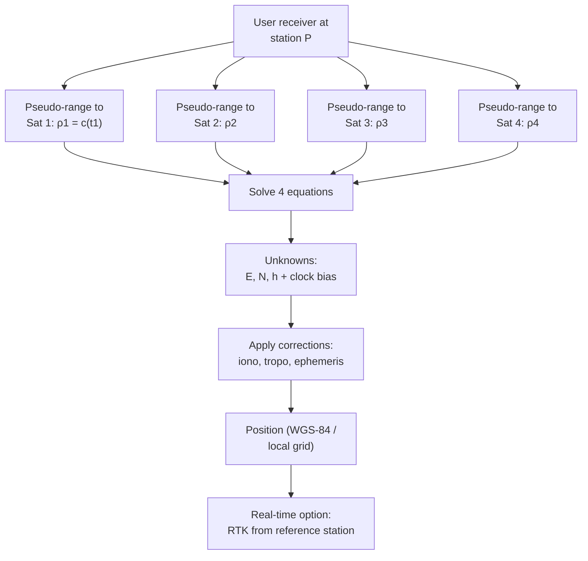

> [!focus] Exam Focus
> **Temporary adjustments order (centre → level → focus)**, **methods of horizontal angle measurement (repetition, reiteration, direction/Reinhardt)**, **transit vs conjugate-facing error elimination**, and **GPS three segments + four-satellite minimum** are the repeated items. Remember least counts: **vernier theodolite 20″, optical micrometer 1″/5″, total station 1″–5″, EDM ±(3 mm + 5 ppm)**.

# Theodolite, Total Station & GPS (ಥಿಯೊಡಲೈಟ್ / ಟೋಟಲ್ ಸ್ಟೇಷನ್ / ಜಿಪಿಎಸ್)

## A. Theodolite (ಥಿಯೊಡಲೈಟ್)

A theodolite measures **both horizontal and vertical angles with high precision** — the workhorse of traversing, triangulation, detail (radiation) survey and setting out. A **transit theodolite** allows the telescope to revolve completely in the vertical plane; a **non-transit** cannot. Modern variants: **digital/electronic theodolite** with **CODAC / absolute circular graduation encoder**.

### Principal parts

| Part | Function |
|---|---|
| **Telescope** (object glass + eyepiece + diaphragm with cross-hairs) | Sighting; **internal-focusing** type in modern instruments |
| **Vertical circle / horizontal circular plate** with **two verniers (A, B)** or micrometer | Reading angles; two verniers cancel **eccentricity** |
| **Alidade (upper plate)** with **two level tubes at right angles** | Rotates in azimuth; carries the vertical circle |
| **Trunnion (horizontal) axis / plate axis** | Telescope tilts about it |
| **Lower plate (clamping) with clamp & tangent screws** | Fixs the graduated horizontal circle |
| **Levelling head / tribrach with 3 foot screws** + **compass box** | Centring and levelling |
| **Plumb bob / optical plummet, tripod** | Centring over the station |
| **Reading microscope, index frame, Y-frames (A-frame)** | Reading graduation; packing |

**Ideal axes relation: plate axis vertical, trunnion axis perpendicular to plate axis, line of collimation perpendicular to trunnion axis.** Permanent adjustment tests: **collimation (two-peg / reversed-face), trunnion-axis (elevated-target / reciprocal level test), bubble-tube (shift-test / reversal), vertical-circle index (altitude and opposite-face reading)**.

### Temporary adjustments — "**Level, Centre, Focus**"

1. **Set up & centre** the instrument over the station (tripod legs, then plumb bob/optical plummet; shift tripod legs for coarse, foot screws for fine centring).
2. **Levelling** — align the level tube over two foot screws, turn them oppositely until the bubble is central, rotate 90°, level with the third. **Repeat at every face change.**
3. **Focusing** — eyepiece on cross-hairs, then object glass on the **staff/bench mark**, and **remove parallax** (cross-hairs and image move together when the eye shifts).

### Measuring horizontal angles

- **Reiteration** — the same angle is measured repeatedly on the **same zero** of the graduated circle and divided by the number of repetitions; quick, but **graduation errors are not averaged out**.
- **Repetition** — angles added consecutively with clamp/tangent manipulation of the **upper plate only** (the circle stays free).
- **Direction / Reimann (Reinhardt) method** — the instrument is set on **zero, then on the first target, and each successive target read as a direction**; the horizontal circle is **rotated between rounds** (with a different starting reading each round) to distribute graduation errors. Preferred when **many stations** surround one instrument station — exactly the cadastral "from one corner, many corners" situation.

Readings taken in **both faces (left face, RL / right face, FL)** and averaged to eliminate **collimation, trunnion-axis, and graduation-eccentricity errors**. Vertical angles use the **altitude method** (bubble levelled before each reading) or **cross-hair method**; index error = (face-left + face-right)/2 deviation from 90°/270°.

### Traversing & Gale's traverse table

A **traverse** is a chain of measured lines with bearings. Closed traverses are checked by **Σ interior angles = (2n − 4) 90°**. **Gale's table** is the standard computing sheet whose columns are:

**Station → Line → Forward bearing (observed) → Included angle (at station, from adjacent FB/BB) → Back bearing check → Latitude (ΔN) → Departure (ΔE) → Corrections (Bowditch/Transit) → Corrected lat & dep → Corrected length & bearing → Double area (2A) → Traverse area.**

Included angle from bearings: **∠ = FB of next line − BB of previous line** (add 360° if negative); a **deflection angle** = 180° − included angle, signed left/right — deflexion angles are used in **route traversing** because they are cumulative and easy to check. After balancing, coordinates are accumulated: $N_i = N_{i-1} + \text{lat}_i$, $E_i = E_{i-1} + \text{dep}_i$; area by the shoelace/double-departure formula.

## B. Total Station (ಟೋಟಲ್ ಸ್ಟೇಷನ್)

The **electronic theodolite + EDM + microprocessor + data collector** combined — it reads angles digitally and computes coordinates and distances on board.

**Basic principle:** it measures a **horizontal angle and a vertical angle** (digital circle encoders) and a **slope distance by EDM (Electronic Distance Measurement)**, then resolves the slope distance into **horizontal distance, ΔN, ΔE, ΔH** and displays the coordinates of the prism against a set station and orientation.

**EDM types:** (1) **microwave / radio (GW, CW)** — long range, geodetic baselines; (2) **infrared (GaAs laser diode)** — the standard total-station carrier, ~3–5 km with a single prism; (3) **visible laser / reflectorless (phase-shift + time-of-flight, "robotic"/"motorised")**. Distance is obtained from the **measured phase difference between transmitted and returned modulated waves**: $D = \frac{c\,t}{2}$ (pulse/time-of-flight) or from the phase lag, giving an **instrument constant, prism constant** and a fine/coarse distance resolution. Corrections: **atmospheric (ppm from T & P), sine/tangent for vertical angle, add/subtract constant (prism), and sea-level reduction**.

**Setting up: centre & level → define job, station coordinates, instrument height → backsight orientation (enter known coordinates of the backsight or its bearing) → measure to the prism (single or average of rounds).** Functions: **radiation (detail points), traversing, resection/Resection (free station), staking-out, setout of curves, REM (remote elevation measurement / inaccessible distance/height), area, road programme, coordinate geometry.** A **robotic total station** is tracked and operated by one person with a radio-linked reflector.

## C. GPS basics (ಜಿಪಿಎಸ್)

**GPS (Global Positioning System)** — the US **NAVSTAR** satellite navigation system: **24+ satellites in 6 orbital planes at ~20,200 km altitude, 12-hour sidereal period, inclined 55°**, so at least **4 are visible anywhere, anytime**.

| Segment | Content |
|---|---|
| **Space** | Satellite constellation; broadcasts **L1 (1575.42 MHz), L2, L5** carrying **C/A code (civil), P(Y) code, and the navigation message** |
| **Control** | Master control station + ground monitor network: orbit determination, clock correction, upload of **ephemeris & almanac** |
| **User** | Receiver + antenna — computes position & time |

**Positioning principle:** trilateration from **pseudo-ranges** (measured code phase × time of arrival). Each satellite gives one equation with four unknowns — **X, Y, Z and receiver clock bias** — hence the **minimum of 4 satellites**. **Code (C/A) positioning** gives ~3–10 m; **carrier-phase (phase-difference) GPS** with ambiguity resolution gives **mm to cm**; **DGPS / RTK** corrects residual errors from a reference station, giving **cm-level** in real time.

**Error sources:** satellite clock & ephemeris, **ionospheric & tropospheric delay**, **multipath**, receiver noise, and **geometry (DOP/HDOP/PDOP)**. Selective Availability was removed in 2000. Other systems: **GLONASS (Russia), Galileo (EU), NavIC/IRNSS (India, 7 satellites, regional)**, and **RTK**/**PPK** processing; **CORS networks** (Karnataka uses a few continuously operating reference stations). In survey practice GPS is used for **control nets, base lines, cadastral georeferencing of village maps to lat/long, and staking**.

Four satellites are needed because the receiver clock is not atomic: three fix a point in space only if the clock error is zero, so the **fourth measurement solves the clock bias (and hence removes the common range error)**. Corrections then refine the raw solution, and **RTK** adds a differential link to a reference station so that the surveyor gets centimetre accuracy on site.

> **Mnemonics**
> - Temporary adjustments: "**C**entre, **L**evel, **F**ocus" → **CLF — "Clear Level Field"** (same order as the answer to Q1).
> - Gale's columns left→right: "**S**tations, **L**ines, **B**earings, **L**atitudes, **D**epartures, **C**orrections, **R**esults, **A**rea" → "**S**urvey **L**earns **B**earings, **L**at **D**ep **C**orrected **R**eady **A**rea."
> - GPS segments: "**S**pace, **C**ontrol, **U**ser" → "**S**atellites **C**ontrol **U**sers" (top to bottom).
> - "**4 satellites, 4 unknowns: E, N, h + clock bias.**"

## Likely Questions / PYQ

1. **The correct order of temporary adjustments of a theodolite is** (a) focussing, levelling, centring (b) **centring, levelling, focussing** (c) levelling, centring, focussing (d) any order — *Answer: b*.
2. **Taking face-left and face-right readings eliminates** (a) misreading (b) **collimation and trunnion-axis errors** (c) settlement (d) local attraction — *Answer: b*.
3. **The direction (Reinhardt) method of angle measurement is preferred when** (a) two targets (b) **many targets radiate from one station** (c) vertical angles only (d) quick reconnaissance — *Answer: b*.
4. **Minimum number of GPS satellites for a 3-D position fix** (a) 3 (b) **4** (c) 5 (d) 24 — *Answer: b*.
5. **Which GPS segment uploads ephemeris and clock corrections?** (a) Space (b) **Control** (c) User (d) Link — *Answer: b*.
6. **EDM in a total station measures distance using** (a) stadia hairs (b) **phase difference of a modulated carrier** (c) barometric pressure (d) dip — *Answer: b*.
7. **A closed traverse of 5 sides should have Σ interior angles =** (a) 360° (b) **540°** (c) 720° (d) 900° — *Answer: b* ((2n − 4) × 90° = 540°).
8. **Gale's traverse table is used for** (a) contour interpolation (b) **latitudes, departures, corrections and area of a traverse** (c) staff reading (d) magnetic declination — *Answer: b*.
9. **Remote elevation measurement (REM) determines** (a) coordinates of the prism (b) **height/distance to an inaccessible point** (c) azimuth (d) declination — *Answer: b*.

> [!tip] Quick Revision Box
> - **Transit = telescope can plunge fully; non-transit cannot.**
> - **Two verniers A & B cancel eccentricity; both faces cancel collimation/trunnion errors.**
> - **Methods: reiteration (same angle repeatedly), repetition, direction/Reinhardt (many targets, graduation errors distributed).**
> - **Gale's table: bearings → included angles → lat & dep → corrections (Bowditch) → adjusted length/bearing → area.**
> - **Total station = digital angles + EDM + on-board coordinates.**
> - **GPS: Space / Control / User; 4 satellites = E, N, h + clock; RTK ≈ cm, code ≈ 3–10 m.**
> - **Indian regional system = NavIC/IRNSS; datums WGS-84 ↔ local grid.**
> - Related: [[01_Surveying_Basics]] | [[02_Chain_Compass_Survey]] | [[03_Levelling_Contouring]] | [[05_Karnataka_Land_Revenue]]
