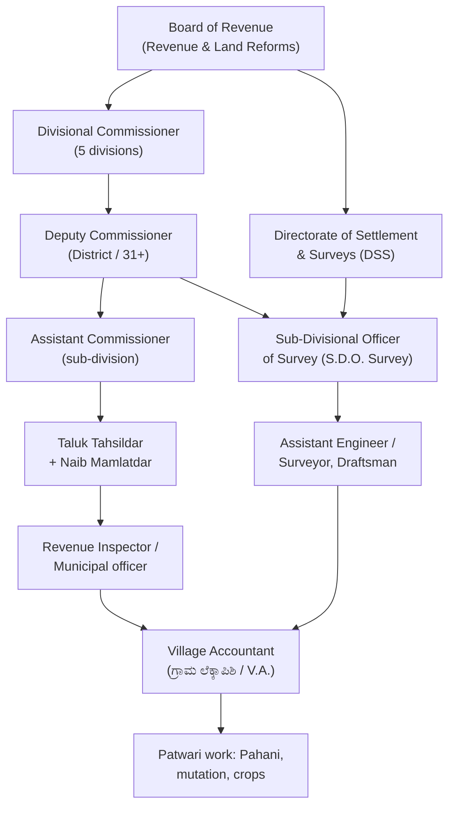

> [!focus] Exam Focus
> Definitions of **survey number, sub-division (phodi), hissa**, the identity **RTC = Pahani (Form VI)** and **Mutation Register (Form VII)**, and the **hierarchy Tahsildar → Deputy Commissioner → Divisional Commissioner → Board of Revenue** are the highest-frequency items. Also know: the Act came into force **30 March 1966 (Karnataka Land Revenue Act, 1964 — Act 7 of 1966)**, and **entries in the record of rights are presumed correct (Section 148)**, while a **mutation does not by itself confer title**.

# Karnataka Land Revenue Act, 1964 & Land Records (ಕರ್ನಾಟಕ ಭೂ ಶುಲ್ಕ ಕಾನೂನು)

## 1. Framework of the Act

The **Karnataka Land Revenue Act, 1964** is the parent statute for **survey, demarcation, settlement and maintenance of land records** in Karnataka (it consolidated the earlier Mysore Land Revenue Act). All land in the state is subject to **land revenue** payable to the State, and the Act authorises the government to conduct **periodic survey and settlement** and to keep the record of rights. It is supplemented by the **Karnataka Land Revenue Rules, 1966**, the **Karnataka Survey, Settlement and Reforms Act/operations under the Directorate of Settlement & Surveys (DSS)**, plus the **Karnataka Land Reforms Act, 1966** (ceiling, tenancy) and **Karnataka Registration of Documents / Tippani-Atlas** practices.

## 2. Key definitions (ಪ್ರಧಾನ ಪದಗಳು)

| Term | Meaning (surveyor's reading) |
|---|---|
| **Survey (ಸರ್ವೆ)** | Operations of measuring, demarcating and recording fields, boundaries, classification, wells, roads, drains and rivers |
| **Survey number (ಸರ್ವೆ ನಂ. / ಅಂಕ)** | The **uniquely numbered field/plot** fixed by survey; the fundamental unit of identification — "S.No. 123/2B" style |
| **Sub-division / Phodi (ಉಪವಿಭಾಗ / ಫೋಡಿ)** | The part into which a survey number is divided when ownership/classification differs; numbered 1, 2, 3… |
| **Hissa (ಹಿಸ್ಸೆ)** | A further **portion of a sub-division** held/identified separately; combined as "Hissa number" in the RTC |
| **Enquiry/Akarbandi register (Form II)** | Village register of **area, classification and assessment** of each survey number, reconciled with the Akarbandi map |
| **GOS (ಗೋಸ್)** | **Government Opattana / land out of survey** — roads, drains, common ground, wells retained by the State |
| **Classification of land** | **Niravi/Mengiyara (ನೀರಾವರಿ, wet)**, **Bata (ಬರಡು, dry)**, **Tota/Garden (ತೋಟ)**, plus forest, ghataika (ಕಡುಪು/ನಿಲ್) and GOS — classification fixes the **assessment rate** |

## 3. Land records (ಭೂ ದಾಖಲೆಗಳು)

- **RTC (Record of Rights, Tenancy and Crops) = Pahani (ಪಹಣಿ)** — the villager's/holder's **card of the field**: ownership, possession, liabilities, tenant details, soil, irrigation, crops of both seasons. Maintained as **Form VI**; the **Bhatha (ಭಾತಾ)** is the **duplicate/copy** of the RTC issued to the holder. Modern delivery is **e-Pahani / Kaveri 2.0** online.
- **Mutation Register = Form VII** — records **change of name** (sale, inheritance, gift, partition, court decree); entry in it is **not proof of title**, only of the change reported.
- **Tippani (ಟಿಪ್ಪಣಿ)** — the **field book / survey notebook** of measurements and boundary descriptions prepared at survey; source document for the sketch and area.
- **Atlas (ಅಟ್ಲಾಸ್)** — the **village maps** showing survey-number boundaries, at survey scale; **Cadastral map** used for identification of plots.
- Also: **Form IV (rokers / field inspection notes)**, **Causeway & Pass-book (state land granted for a causeway)**, **Khata / A-Khata–B-Khata and 1R extract (urban areas)**, **Site plan / sub-division plan / immemorial map**, and the **Rovers** entries of crops and liabilities.

## 4. Survey & settlement operations (ಸರ್ವೆ ಮತ್ತು ವಸಾಹತು)

Sequence: **Authorization → establishment of control/triangulation & grid points → field survey (boundary demarcating with pillars, GOS marking) → preparation of tippani and atlas → classification & assessment → settlement (fixing term and rates, publication, objections) → record-of-rights (RTC) preparation → distribution → periodic revision / subsequent updates (mutation, sub-division, consolidation)**. Karnataka's old **ryotwari** settlement (individual cultivator) with **1911-era and later revisionary settlements** in parts; **consolidation of holdings** under separate legislation; the **Digital India Land Records Modernisation Programme (DILRMP)** and **Swamlabhu** drive current re-survey/cadastral work.

## 5. Revenue officers hierarchy (ಅಧಿಕಾರಿ ವರ್ಗ)

Board of Revenue is the **apex revenue authority** (also appellate on certain settlement questions); the **Divisional Commissioner** supervises the divisions; the **Deputy Commissioner** is the chief revenue officer of the district with appellate/revisory powers under the Act; the **Tahsildar** is the **first-line revenue officer** of the taluk who **decides mutations, partitions, and boundary questions at village level**, assisted by the **Village Accountant** who maintains the field records. Survey-specific technical control flows from the **Director of Settlement & Surveys** through the **S.D.O. (Survey)** and field surveyors — which is the cadre the KEA Land Surveyor post joins.

> **Mnemonics**
> - Records set: "**R**egister of **R**ights = **RTC/Pahani**; **M**utation = **VII**; **T**ippani = **field book**; **A**tlas = **maps**" → "**R-M-T-A** = **R**ecord **M**akes **T**he **A**rea clear."
> - Hierarchy bottom-up: "**VA → T → AC → DC → DivComm → BoR**" → "**Village Accounts Taken At District Cost, Divisional Boss**."
> - **Phodi vs Hissa**: "**P**hodi = **P**art of survey number; **H**issa = **H**alf of a phodi" (i.e. phodi is the higher level).
> - **Section 148**: "148 = **presume correct** the record"; **mutation ≠ title** ("**M**utation for **M**aintenance, not **M**ark of ownership").

## Likely Questions / PYQ

1. **RTC (Pahani) is prescribed as** (a) Form I (b) **Form VI** (c) Form VII (d) Form VIII — *Answer: b*.
2. **The Mutation Register under Karnataka rules is** (a) Form VI (b) **Form VII** (c) Form X (d) Form II — *Answer: b*.
3. **"Phodi" in Karnataka land records means** (a) village map (b) **sub-division of a survey number** (c) crop entry (d) tenant — *Answer: b*.
4. **The tippani is** (a) the atlas (b) **the survey field book** (c) the patta (d) the tax receipt — *Answer: b*.
5. **Who decides a mutation application at taluk level?** (a) V.A. (b) **Tahsildar** (c) DSS Director (d) Mitha — *Answer: b*.
6. **Entries in the record of rights are** (a) conclusive proof of title (b) **presumed correct until set aside** (c) never presumed (d) valid only after registration — *Answer: b*.
7. **"Hissa" denotes** (a) a village (b) **a portion of a sub-division** (c) a water source (d) a revenue officer — *Answer: b*.
8. **Wet land in Kannada revenue terms is** (a) Bata (b) **Mengaar / niravi** (c) GOS (d) Nil — *Answer: b*.
9. **The apex revenue body in Karnataka is** (a) Lokayukta (b) **Board of Revenue** (c) DSS (d) ZP — *Answer: b*.

> [!tip] Quick Revision Box
> - **Act 7 of 1966 = Karnataka Land Revenue Act, 1964**; with Rules 1966 + Land Reforms Act 1966.
> - **Survey number → Sub-division (Phodi) → Hissa** — the address of every field.
> - **RTC = Pahani (Form VI); Bhatha = its copy to the holder; Mutation = Form VII; Tippani = field book; Atlas = village maps; Akarbandi = area/classification register.**
> - **Village Accountant → Tahsildar → AC → DC → Divisional Commissioner → Board of Revenue**, with **DSS / S.D.O.(Survey)** running survey work.
> - **Mutation ≠ title; Section 148 presumes records correct.**
> - Related: [[01_Surveying_Basics]] | [[02_Chain_Compass_Survey]] | [[03_Levelling_Contouring]] | [[06_History]] | [[08_Polity]]
