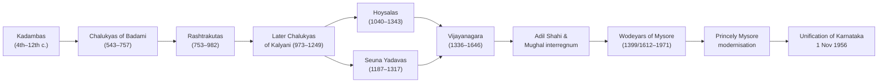

> [!focus] Exam Focus
> Karnataka dynasties (Chalukyas, Rashtrakutas, Hoysalas, Vijayanagara, Wodeyars) and Unification of Karnataka (1956) are the **most repeated GK blocks** in KEA exams. Expect 1–2 questions on Indus Valley sites, Mauryan/Gupta highlights, freedom movement milestones, and land-revenue systems (Ryotwari/Mahalwari/Zamindari) — directly linked to a surveyor's land-records work.

# History (ಚರಿತ್ರೆ)

## 1. Ancient India (ಪ್ರಾಚೀನ ಭಾರತ)

**Indus Valley Civilisation (c. 2600–1900 BCE)** — urban, planned civilisation. Key sites: Harappa (Punjab, first discovered), Mohenjo-daro (Sindh, "Mound of the Dead", Great Bath), Dholavira (Gujarat, three-part city + water harvesting), Kalibangan (Rajasthan, ploughed field — relevant to land records), Lothal (Gujarat, dockyard). No temples/palaces; worshipped Mother Goddess and Pashupati Shiva. Decline attributed to drying of rivers.

**Vedic Age (c. 1500–600 BCE)** — Rig Vedic period: pastoral, Sabha-Samiti assemblies, Saraswati as chief river. Later Vedic: iron, settled agriculture, expansion into Ganga plain, four-varna system rigidified. 12 Upanishads, 16 Mahajanapadas (Magadha strongest).

**Maurya Empire (322–185 BCE)** — Chandragupta Maurya (founder, helped by Chanakya/Kautilya's *Arthashastra*; Megasthenes' *Indica* describes Pataliputra administration with land measurement officers!), Bindusara, **Ashoka** (Kalinga war 261 BCE → Dhamma; Rock Edicts — Edict XIII mentions the Kalinga horror; Sanchi stupa). Administration divided kingdom into Janapadas with village-level revenue officers — a favourite question for surveyor exams.

**Gupta Empire (c. 320–550 CE)** — "Golden Age": Chandragupta I (started Gupta era), Samudragupta ("Indian Napoleon", Allahabad pillar prashasti by Harisena), Chandragupta II (Vakataka marriage; Navaratnas — Kalidasas). Aryabhata (zero, rotation of earth), Vashishtha Dharmasutra land-revenue rules: 1/6th produce as tax.

## 2. Medieval India (ಮಧ್ಯಕಾಲೀನ ಭಾರತ)

**Delhi Sultanate (1206–1526)** — five dynasties: **Slave/Ghulam (Qutubuddin Aibak — first; Iltutmish; Razia), Khilji (Alauddin — market control; land measured by *masahat* with 50% of produce taken as tax), Sayyid, Lodi (ended by Babur at Panipat I, 1526)**. *Iqta* = land assignment to officers (predecessor of *jagirdari* — conceptually close to survey-based settlement).

**Mughals (1526–1857 formally)** — Babur (Panipat I, 1526), Humayun, then the **Sher Shah Suri interregnum (1540–45): systematic land measurement by the *jarib* (rope), cash-rate revenue, *rupiya* — the direct ancestor of survey-based settlement; his *kos* ≈ 1.9 km** (important for a Land Surveyor exam), Akbar (Din-i-Ilahi; Mansabdari; **Todar Mal's *bandobast* — zonal rent rates**), Shah Jahan (Taj Mahal), Aurangzeb (d. 1707; empire fragmented after him).

**Vijayanagara (1336–1646)** — founded by **Harihara I and Bukka Raya I of Sangama dynasty** on Tungabhadra banks; capital Hampi (ಹಂಪಿ), UNESCO site. Krishnadevaraya (Tuluva dynasty) wrote *Amuktamalyada*; Battle of Talikota/Rakshasi-Tungabhadra (1565) broke the empire. Amaram/nayankara system = military land grants with survey obligations.

## 3. Modern India (ಆಧುನಿಕ ಭಾರತ)

**British rule** — Battle of Plassey 1757, Buxar 1764 (diwani rights). **Land revenue systems (core for surveyors)**: Permanent Settlement (1793, Cornwallis, Zamindari — Bengal/Bihar), **Ryotwari (Thomas Munro; direct settlement with ryots — applied in most of Karnataka/Madras)** and Mahalwari (North-Western Provinces/UP). Ryotwari required field-boundary survey → creation of *hissa*, *khasra* and *khata* records; modern Karnataka RTC ("Pahani", ಪಹಣಿ) descends from this. 1857 revolt; Indian National Congress founded 1885 (A.O. Hume).

**Freedom Movement** — moderate phase 1885–1905; extremist: Tilak ("Swaraj is my birthright"), partition of Bengal 1905, Surat split 1907. **Gandhian era**: Champaran 1917, Kheda 1918 (both land/revenue-based), Rowlatt Satyagraha & Jallianwala Bagh 1919, Non-cooperation 1920–22, Civil Disobedience 1930 (Dandi March 12 March — salt tax), Quit India 8 August 1942. Subhas Bose INA; Cabinet Mission 1946; Mountbatten Plan → **Independence 15 August 1947**. Karnataka link: **Alur Venkata Rao** (Kannada Mahasabha, leader of the unification movement — "Father of Karnataka Ekikarana"); Mysore princely state developed early land-titling and irrigation works.

## 4. Karnataka History (ಕರ್ನಾಟಕ ಇತಿಹಾಸ) — HIGH WEIGHT

**Mermaid: Karnataka dynastic timeline (flowchart, ≤15 nodes)**

The timeline shows the **Kannada-speaking political succession** — Kadambas of Banavasi (earliest native Kannada kings; Halmidi inscription c. 450 CE = earliest Old Kannada) → Badami Chalukyas → Rashtrakutas → Kalyani Chalukyas branching to Hoysalas/Yadavas → Vijayanagara → Wodeyars → unified Karnataka statehood day (Nada Habba, ನಾಡಹಬ್ಬ). For MCQs, memorise **capital → monument → founder** triples.

| Dynasty | Period | Capital | Key facts |
|---|---|---|---|
| Chalukyas of Badami (ಬಾದಾಮಿ ಚಾಲುಕ್ಯರು) | 543–757 | Vatapi (Badami) | Pulakeshin II defeated Harsha (634); Aihole- Pattadakal-Badami rock-cut temples; Pattadakal UNESCO (1987) |
| Rashtrakutas (ರಾಷ್ಟ್ರಕೂಟ) | 753–982 | Manyakheta (Malkhed) | Dantidurga founder; Krishna I → **Kailasa temple Ellora** (monolithic); Amoghavarsha I wrote *Kavirajamarga* (earliest Kannada poetics) |
| Hoysalas (ಹೊಯ್ಸಳ) | 1040–1343 | Dwarasamudra (Halebidu); Belur | Legend: King Sala killed a tiger (*hoyi*) at Belur; Vishnuvardhana raised the dynasty; **Chennakeshava temple Belur, Hoysaleshwara temple Halebidu** — star-shaped (*vimana*) platforms, soapstone (kataluru stone); last ruler Veera Ballala III died fighting the Delhi Sultanate's forces (1343) |
| Vijayanagara (ವಿಜಯನಗರ) | 1336–1646 | Hampi | Harihara-Bukka; Krishnadevaraya's Ashtadiggajas; **Vittala temple, Stone Chariot, Mahanavami Dibba**; Aliya Rama Raya defeated at Talikota 1565 |
| Wodeyars (ಒಡೆಯರ್) | Trad. 1399; ruled 1612–1761, 1799–1947 (merged into Indian Union 1950; privy purse abolished 1971) | Srirangapattinam (Hyder/Tipu), Mysuru | Yaduraya (trad. founder); **Hyder Ali & Tipu Sultan ruled 1761–1799** (Tipu died Srirangapattinam 4 May 1799 in the Fourth Anglo-Mysore War); 1799 restoration installed 5-year-old **Krishnaraja Wodeyar III (Mummadi)**; later **Diwan system** — **Sir M. Vishvesvaraya** engineered **KRS dam (1932)**; **15 Sept (his birthday) = Engineers Day**; village accounts (*karanam/shanbhog*) kept land records — precursor of today's Village Accountant. |

**Unification of Karnataka (ಏಕೀಕರಣ)** — **1 Nov 1956 = Kannada Rajyotsava (ನಾಡಹಬ್ಬ)**: Mysore state merged with Kannada-speaking areas of Bombay State (Belgaum, Dharwad, Bidar etc.), Madras State (South Kanara; Bellary joined earlier in 1953) and Hyderabad State (Raichur Doab). Kasaragod went to Kerala with South Kanara. the Belgaum boundary dispute with Maharashtra later went to the Supreme Court (long pending). **1 Nov 1973: state renamed "Karnataka"** under **Devaraj Urs**, who also did landmark **1974 Land Reforms Act — "Land to the Tiller"**, tenancy abolition and ceiling (~10 acres per family for irrigated land) — repeatedly asked. 30 districts long-standing (verify latest count in [[04_Current_Affairs_GK/Current_Affairs_2026]]).

> **Mnemonic — Karnataka dynasty order**: "**K**adambas **C**halukyas **R**ashtrakutas **H**oysalas **V**ijayanagara **W**odeyars" → **"King Charles Read Harry's Very Wet books."**
> **Talikota year**: 15**65** → "fifteen sixty-five, Vijayanagar's fire."

## Likely Questions / PYQ

1. **Which land-revenue system was applied in most of Karnataka under British rule?** (a) Zamindari (b) **Ryotwari** (c) Mahalwari (d) Iqtai — *Answer: b*.
2. **The Kailasa temple at Ellora was built by** (a) Chalukyas of Badami (b) **Rashtrakuta Krishna I** (c) Hoysalas (d) Western Chalukyas — *Answer: b*.
3. **Who defeated Harsha at the Narmada?** (a) Pulakeshin I (b) **Pulakeshin II** (c) Vikramaditya VI (d) Dantidurga — *Answer: b*.
4. **Unification of Karnataka was celebrated on** (a) 1 May 1956 (b) **1 Nov 1956** (c) 1 Nov 1973 (d) 17 Sep 1956 — *Answer: b (Rajyotsava)*.
5. **Sher Shah Suri is remembered in surveying history for** (a) Mansabdari (b) **systematic land measurement by *jarib* and the *kos* (~1.9 km)** (c) Iqta abolition (d) Taj Mahal — *Answer: b*.
6. **The Battle of Talikota (1565) was fought between Vijayanagara and** (a) Mughals alone (b) **Deccan Sultanates' confederacy** (c) Marathas (d) Bahmanis alone — *Answer: b*.
7. **The Chennakeshava temple at Belur was commissioned by which Hoysala king?** (a) Nripa Kama (b) **Vishnuvardhana** (c) Veera Ballala II (d) Vira Someshwara — *Answer: b*.
8. **Karnataka's 'Land to the Tiller' reforms are associated with** (a) KR Srinivas Iyengar (b) **Devaraj Urs** (c) Ramakrishna Hegde (d) S. Nijalingappa — *Answer: b*.

> [!tip] Quick Revision Box
> - **Ryotwari = Karnataka's base land-revenue system (Munro)** → today's Pahani/RTC.
> - **Badami Chalukyas: Pulakeshin II beat Harsha. Rashtrakutas: Kailasa temple + Kavirajamarga. Hoysalas: Belur/Halebidu. Vijayanagara: Hampi, 1336, Talikota 1565. Wodeyars: Mysuru, ended 1971 (privy purse abolished).**
> - **1 Nov 1956 = Karnataka Unification Day.**
> - Sher Shah's *jarib* & *kos* = surveyor heritage. Devaraj Urs = land reforms.
> - Related: [[07_Geography]] | [[08_Polity]] | [[09_Economy_Science]] | [[02_Syllabus_and_Pattern]]
