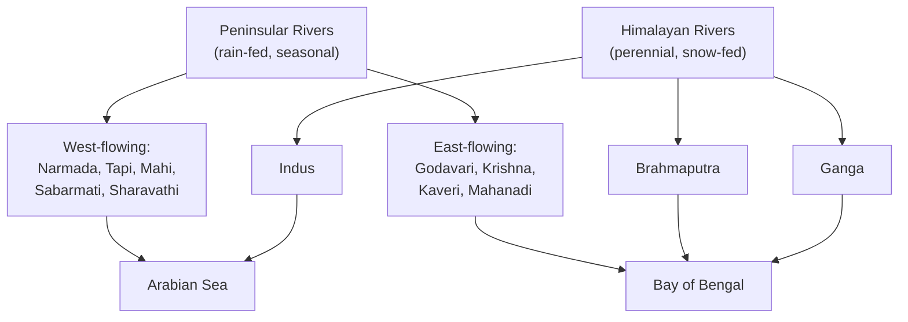

> [!focus] Exam Focus
> For a **Land Surveyor**, geography is the highest-yield GK subject: Karnataka's three physical divisions (ಕರಾವಳಿ–ಮಲೆನಾಡು–ಬಯಲುಸೀಮೆ), its **river basins (Krishna, Kaveri, Tungabhadra, Godavari)**, soils, rainfall zones and districts. Expect direct MCQs on Western Ghats peaks/passes, river origins and dams (KRS, Tungabhadra, Almatti), and the Kaveri dispute.

# Geography (ಭೂಗೋಳ)

## 1. Physical Geography of India (ಭಾರತದ ಭೌಗೋಳಿಕ)

India has **six physical divisions**:

- **Himalayas** — young fold mountains; three parallel zones outward: **Himadri (Great) → Himachal (Lesser) → Shiwalik (Outer)**; ~2,500 km; western syntax Nanga Parbat, eastern Namcha Barwa.
- **Northern Plains** — alluvial (Indus–Ganga–Brahmaputra); bands **Bhabar → Terai → Bhangar (old alluvium) → Khadar (new, fertile)**.
- **Peninsular Plateau** — old Gondwana block; **Deccan Traps** basalt (parent of black cotton soil); Central Highlands (Malwa, Bagar) + Deccan Plateau; Narmada–Tapi rift valleys (graben).
- **Indian Desert** — Thar, Rajasthan.
- **Coastal Plains** — Western (Konkan, **Karavali**, Malabar; narrow, estuaries) and Eastern (Northern & Southern Coromandel; wide, deltas; Chilika and Kolleru lakes).
- **Islands** — Andaman & Nicobar (Barren Island = India's only active volcano; Saddle Peak highest); Lakshadweep (coral atolls).

Key lines: **82°30′E standard meridian passes Mirzapur (UP); Tropic of Cancer crosses 8 states** — GJ, RJ, MP, CG, JH, WB, Tripura, Mizoram.

The chart shows the classification logic examiners love: **Himalayan rivers are perennial and silt-laden (deltas); peninsular rivers are rain-dependent; west-flowing rivers run through rift valleys over hard rock and form estuaries, while east-flowing rivers traverse gentle slopes and build deltas.**

## 2. Karnataka Geography (ಕರ್ನಾಟಕ ಭೂಗೋಳ) — VERY HIGH WEIGHT

Karnataka: **191,791 km² — 7th largest state**, lat. 11.5°–18°N, long. 74°–78.6°E. Three regions:

| Region | Kannada | ~Share | Features |
|---|---|---|---|
| Coastal plain | ಕರಾವಳಿ (Karavali) | ~5% | Between sea and Ghats; >3,000 mm rain; laterite soil; ports **Karwar, Mangaluru (New Mangaluru Port)**, coconut–areca–cashew |
| Ghat zone | ಮಲೆನಾಡು (Malnad) | ~15% | Slopes of Western Ghats; **Mullayanagiri 1,925 m (highest peak, Chikkamagaluru)**, Kudremukh 1,894 m; source of Kaveri (Talakaveri) |
| Plateau | ಬಯಲುಸೀಮೆ (Bayaluseeme) | ~63% | Deccan; rain-shadow, driest (Bidar/Raichur <700 mm); red + black soils; crops jowar, ragi, cotton, tur |

**Rivers — four basins.** Krishna basin drains the largest area of Karnataka (~60%):

- **Krishna** — origin Mahabaleshwar (MH); Karnataka tributaries: **Tungabhadra, Bhima, Ghataprabha, Malaprabha**. Dams: **Almatti (Bagalkot)**, **Narayanpur (Raichur)**.
- **Tungabhadra** — **Tunga + Bhadra, both rising in the Chikkamagaluru hills (Bhadra near Kudremukh), meet at Kudal Sangamam near Hampi (Vijayanagara district)**; **Tungabhadra Dam, near Hospet (completed 1953)**.
- **Kaveri** — origin **Talakaveri, Kodagu**; total length ~719 km; tributaries **Kabini, Hemavathi, Harangi**; **KRS Dam (1932, Sir M. Vishvesvaraya)**; **Shivanasamudra — Asia's first hydroelectric station (1902)**; dispute with TN (Tribunal award 2007; **Supreme Court 2018; Cauvery Water Management Authority 2019**).
- **Godavari** — minor share (Bidar); **Manjira** river, Nizam Sagar dam. Besides these basins, short **west-flowing rivers** drain the coast directly: **Sharavathi (Jog/Gerosoppa falls, Shivamogga), Kali, Gangavathi, Aghanashini, Netravathi**.

**Soils:** Black/regur (cotton; Kalaburagi–Ballari–Raichur belt), Red (plateau, ragi), Laterite (coast + Ghats; bauxite), Alluvial (valleys), Forest soils (Malnad).

**Climate:** SW monsoon June–Sept brings the bulk of rain; NE monsoon Oct–Nov helps the south interior. **Agumbe (Shivamogga) = "Cherrapunji of the South"** (record rainfall); Ballari/Raichur = hottest, driest zone.

**Districts:** 30 for long; **Vijayanagara district (HQ Hampi) carved from Ballari in 2021 made 31**; more reorganisation has been announced since — **confirm the exact current count in [[04_Current_Affairs_GK/Current_Affairs_2026]] before the exam**. Capital: Bengaluru.

> **Mnemonics**
> - Three regions sea→inland: **"Karavali–Malnad–Bayaluseeme" = "Coast–Hills–Plains" (K-M-B = "Karnataka's Map Basics").**
> - East-flowing delta rivers N→S: **"Mahana-Godha-Kri-Ka" = "My God Keeps Cake"** (Mahanadi, Godavari, Krishna, Kaveri).
> - Krishna's Karnataka tributaries: **"TB-GM" = Tungabhadra, Bhima, Ghataprabha, Malaprabha ("Too Bad, Get Money").**
> - Tropic of Cancer states: **"G-R-M-C, J-W-T-M" = "Great Rains Make Clouds, Just Wait Till May."**

## Likely Questions / PYQ

1. **The highest peak of Karnataka is** (a) Doddabetta (b) **Mullayanagiri** (c) Kudremukh (d) Nandi Hills — *Answer: b*.
2. **River Kaveri originates at** (a) Amarkantak (b) Mahabaleshwar (c) **Talakaveri, Kodagu** (d) Brahmagiri, Nashik — *Answer: c*.
3. **Shivanasamudra falls and Asia's first hydroelectric station are on** (a) Krishna (b) **Kaveri** (c) Sharavathi (d) Tungabhadra — *Answer: b*.
4. **Tungabhadra Dam is at** (a) Bagalkot (b) Raichur (c) **Hospet** (d) Chikkamagaluru — *Answer: c*.
5. **Which soil of Karnataka is ideal for cotton?** (a) Red (b) Laterite (c) **Black cotton soil (regur)** (d) Alluvial — *Answer: c*.
6. **Jog Falls (Gerosoppa) is on river** (a) Kaveri (b) Netravathi (c) **Sharavathi** (d) Kali — *Answer: c*.
7. **West-flowing rivers of India form** (a) Deltas (b) **Estuaries** (c) Oxbows (d) Alluvial fans — *Answer: b*.
8. **The standard meridian of India (82°30′E) passes through** (a) Jaipur (b) **Mirzapur (UP)** (c) Ranchi (d) Nagpur — *Answer: b*.

> [!tip] Quick Revision Box
> - **India = 6 physical divisions; 82°30′E = Mirzapur; Tropic of Cancer = 8 states ("Great Rains Make Clouds, Just Wait Till May").**
> - **Karnataka = Karavali (5%) – Malnad (15%) – Bayaluseeme (63%); Mullayanagiri 1,925 m.**
> - **Krishna basin ~60% of state; Almatti + Narayanpur + Tungabhadra (Hospet, 1953). Kaveri: Talakaveri → KRS (1932) → Shivanasamudra (1902).**
> - **Regur = cotton; laterite = coast; SW monsoon = bulk of rain; Agumbe rainiest; Bidar/Raichur driest.**
> - Related: [[06_History]] | [[08_Polity]] | [[09_Economy_Science]] | [[04_Current_Affairs_GK/Current_Affairs_2026]]
